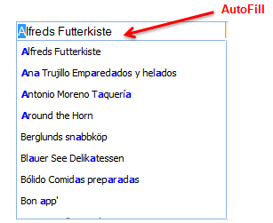

::: {style="DISPLAY: none"}
{#d2h_url_template}{#d2h_package_url style="WIDTH: 0px; DISPLAY: none; HEIGHT: 0px"}
:::

:::::::::: {.d2h_secondary_topic style="PADDING-BOTTOM: 10pt; MARGIN: 0pt; PADDING-LEFT: 0pt; PADDING-RIGHT: 0pt; PADDING-TOP: 0pt"}
#### AutoFill {#autofill style="tab-stops: 0pt"}

The AutocompleteTextBox control offers an AutoFill option. This feature can be used to automatically fill the item when text is entered. The first Item in the suggestion list will automatically display in an AutoComplete text box. The search text will be selected in the AutoComplete text box for identification.

Use Case Scenarios

This feature allows you to fill the first item in an AutoComplete text box.

This feature reduces the need to type the entire text.

Properties

+------------------------------------+------------------------------------------------------------------+----------------------------------------+----------------------------------------------+
| **Property**                       | **Description**                                                  | **Type**                               | **Data Type**                                |
+------------------------------------+------------------------------------------------------------------+----------------------------------------+----------------------------------------------+
| AutoFill[]{style="COLOR: #c00000"} | Gives the functionality to auto select the first suggested item. | Server-side []{style="COLOR: #c00000"} | Binary, true/false[]{style="COLOR: #c00000"} |
|                                    |                                                                  |                                        |                                              |
|                                    | By default the value is false.[]{style="COLOR: #c00000"}         |                                        |                                              |
+------------------------------------+------------------------------------------------------------------+----------------------------------------+----------------------------------------------+

[]{style="FONT-FAMILY: 'Calibri','sans-serif'; COLOR: black"} 

Sample Link

To view a sample:

1.   Open the Essential Tools sample browser from the dashboard. Refer to the Samples and Location chapter.

2.   Navigate to **Tools.MVC** \> **AutoComplete Textbox** \> **Customization**[]{style="COLOR: #c00000"}

 

Adding AutoFill to an Application

Using AutocompleteTextBoxBuilder

Add the AutoFill option to an AutoComplete text box by using AutocompleteTextBoxBuilder:

1.   Create a **view**.

2.   In the **view**, invoke the **AutocompleteTextBox** helper with the control ID.

3.   Set **AutoFill** to **true**.

::: {align="center"}
+------------------------------------------------------------------------------------------------------------------------------------------------------------------------------------------------------------------------------------------------------------------------------------------------------------------------------------------------------------------------------+
| **[\[ASPX\]]{style="FONT-FAMILY: 'Courier New'"}**                                                                                                                                                                                                                                                                                                                           |
|                                                                                                                                                                                                                                                                                                                                                                              |
| **[]{style="FONT-FAMILY: 'Courier New'"}**                                                                                                                                                                                                                                                                                                                                   |
|                                                                                                                                                                                                                                                                                                                                                                              |
| [\<%]{style="FONT-FAMILY: Consolas; BACKGROUND: yellow; FONT-SIZE: 9.5pt"}[=]{style="FONT-FAMILY: Consolas; COLOR: blue; FONT-SIZE: 9.5pt"}[Html.Syncfusion().AutocompleteTextBox([\"myAutocomplete\"]{style="COLOR: #a31515"}).RequestMapper([\"GetData\"]{style="COLOR: #a31515"}).AutoFill([true]{style="COLOR: blue"})]{style="FONT-FAMILY: Consolas; FONT-SIZE: 9.5pt"} |
|                                                                                                                                                                                                                                                                                                                                                                              |
| [%\>]{style="FONT-FAMILY: 'Courier New'; BACKGROUND: yellow"}[]{style="FONT-FAMILY: 'Courier New'"}                                                                                                                                                                                                                                                                          |
|                                                                                                                                                                                                                                                                                                                                                                              |
| []{style="FONT-FAMILY: 'Courier New'"}                                                                                                                                                                                                                                                                                                                                       |
+------------------------------------------------------------------------------------------------------------------------------------------------------------------------------------------------------------------------------------------------------------------------------------------------------------------------------------------------------------------------------+
:::

 

::: {align="center"}
+--------------------------------------------------------------------------------------------------------------------------------------------------------------------------------------------------------------------------------------------------------+
| **[\[Razor\]]{style="FONT-FAMILY: 'Courier New'"}**                                                                                                                                                                                                    |
|                                                                                                                                                                                                                                                        |
| [@]{style="FONT-FAMILY: 'Courier New'; BACKGROUND: yellow"}[Html.Syncfusion().AutocompleteTextBox([\"myAutocomplete\"]{style="COLOR: #a31515"}).RequestMapper([\"GetData\"]{style="COLOR: #a31515"})]{style="FONT-FAMILY: Consolas; FONT-SIZE: 9.5pt"} |
|                                                                                                                                                                                                                                                        |
| [.AutoFill([true]{style="COLOR: blue"})]{style="FONT-FAMILY: Consolas; FONT-SIZE: 9.5pt"}[           ]{style="FONT-FAMILY: 'Courier New'"}                                                                                                             |
+--------------------------------------------------------------------------------------------------------------------------------------------------------------------------------------------------------------------------------------------------------+
:::

 

::: {align="center"}
+-------------------------------------------------------------------------------------------------------------------------------------------------------------------------------------------+
| **[Controller]{style="FONT-FAMILY: 'Courier New'"}**                                                                                                                                      |
|                                                                                                                                                                                           |
| [        [public]{style="COLOR: blue"} [ActionResult]{style="COLOR: #2b91af"} Index()]{style="FONT-FAMILY: Consolas; FONT-SIZE: 9.5pt"}                                                   |
|                                                                                                                                                                                           |
| [        {]{style="FONT-FAMILY: Consolas; FONT-SIZE: 9.5pt"}                                                                                                                              |
|                                                                                                                                                                                           |
| [            [return]{style="COLOR: blue"} View();]{style="FONT-FAMILY: Consolas; FONT-SIZE: 9.5pt"}                                                                                      |
|                                                                                                                                                                                           |
| [        }]{style="FONT-FAMILY: Consolas; FONT-SIZE: 9.5pt"}                                                                                                                              |
|                                                                                                                                                                                           |
| [        \[[AcceptVerbs]{style="COLOR: #2b91af"}([HttpVerbs]{style="COLOR: #2b91af"}.Post)\]]{style="FONT-FAMILY: Consolas; FONT-SIZE: 9.5pt"}                                            |
|                                                                                                                                                                                           |
| [        [public]{style="COLOR: blue"} [ActionResult]{style="COLOR: #2b91af"} GetData([string]{style="COLOR: blue"} QueryString)]{style="FONT-FAMILY: Consolas; FONT-SIZE: 9.5pt"}        |
|                                                                                                                                                                                           |
| [        {]{style="FONT-FAMILY: Consolas; FONT-SIZE: 9.5pt"}                                                                                                                              |
|                                                                                                                                                                                           |
| [            [Northwind]{style="COLOR: #2b91af"} context = SqlCE;]{style="FONT-FAMILY: Consolas; FONT-SIZE: 9.5pt"}                                                                       |
|                                                                                                                                                                                           |
| [            [var]{style="COLOR: blue"} dataSource = [from]{style="COLOR: blue"} suggestion [in]{style="COLOR: blue"} context.Customers]{style="FONT-FAMILY: Consolas; FONT-SIZE: 9.5pt"} |
|                                                                                                                                                                                           |
| [                             [select]{style="COLOR: blue"} suggestion.CustomerID;]{style="FONT-FAMILY: Consolas; FONT-SIZE: 9.5pt"}                                                      |
|                                                                                                                                                                                           |
| []{style="FONT-FAMILY: Consolas; FONT-SIZE: 9.5pt"}                                                                                                                                       |
|                                                                                                                                                                                           |
| []{style="FONT-FAMILY: Consolas; FONT-SIZE: 9.5pt"}                                                                                                                                       |
|                                                                                                                                                                                           |
| [            [ActionResult]{style="COLOR: #2b91af"} jsonResult = dataSource.AutocompleteActionResult();]{style="FONT-FAMILY: Consolas; FONT-SIZE: 9.5pt"}                                 |
|                                                                                                                                                                                           |
| [            [return]{style="COLOR: blue"} jsonResult;]{style="FONT-FAMILY: Consolas; FONT-SIZE: 9.5pt"}                                                                                  |
|                                                                                                                                                                                           |
| [        }]{style="FONT-FAMILY: Consolas; FONT-SIZE: 9.5pt"}                                                                                                                              |
|                                                                                                                                                                                           |
| []{style="FONT-FAMILY: 'Courier New'"}                                                                                                                                                    |
+-------------------------------------------------------------------------------------------------------------------------------------------------------------------------------------------+
:::

 

 

4.   Build and run the application.

{border="0"}

Figure 63: AutoComplete---AutoFill

 

Using AutoCompleteModel

Add the AutoFill option in an AutoComplete text box by using AutocompleteTextBoxModel:

1.   In the **controller**, create an object for the **AutocompleteTextBoxModel** class.

2.   Set the **AutoFill** property as **True**.

3.   Pass the **AutocompleteTextBoxModel** class to the **ViewData**.

 

::: {align="center"}
+--------------------------------------------------------------------------------------------------------------------------------------------------------------------------------------------------------------+
| [      **\[Controller\]**]{style="FONT-FAMILY: 'Courier New'"}                                                                                                                                               |
|                                                                                                                                                                                                              |
| [        [public]{style="COLOR: blue"} [ActionResult]{style="COLOR: #2b91af"} Index()]{style="FONT-FAMILY: Consolas; FONT-SIZE: 9.5pt"}                                                                      |
|                                                                                                                                                                                                              |
| [        {]{style="FONT-FAMILY: Consolas; FONT-SIZE: 9.5pt"}                                                                                                                                                 |
|                                                                                                                                                                                                              |
| [            [AutocompleteTextBoxModel]{style="COLOR: #2b91af"} myModel = [new]{style="COLOR: blue"} [AutocompleteTextBoxModel]{style="COLOR: #2b91af"}();]{style="FONT-FAMILY: Consolas; FONT-SIZE: 9.5pt"} |
|                                                                                                                                                                                                              |
| [            myModel.AutoFill = [true]{style="COLOR: blue"}; ]{style="FONT-FAMILY: Consolas; FONT-SIZE: 9.5pt"}                                                                                              |
|                                                                                                                                                                                                              |
| [            myModel. RequestMapper = [\"GetData\"]{style="COLOR: #a31515"};]{style="FONT-FAMILY: Consolas; FONT-SIZE: 9.5pt"}                                                                               |
|                                                                                                                                                                                                              |
| [            ViewData\[[\"myAutocomplete\"]{style="COLOR: #a31515"}\] = myModel;]{style="FONT-FAMILY: Consolas; FONT-SIZE: 9.5pt"}                                                                           |
|                                                                                                                                                                                                              |
| [            [return]{style="COLOR: blue"} View();]{style="FONT-FAMILY: Consolas; FONT-SIZE: 9.5pt"}                                                                                                         |
|                                                                                                                                                                                                              |
| [        }]{style="FONT-FAMILY: Consolas; FONT-SIZE: 9.5pt"}                                                                                                                                                 |
|                                                                                                                                                                                                              |
| []{style="FONT-FAMILY: Consolas; FONT-SIZE: 9.5pt"}                                                                                                                                                          |
|                                                                                                                                                                                                              |
| [        \[[AcceptVerbs]{style="COLOR: #2b91af"}([HttpVerbs]{style="COLOR: #2b91af"}.Post)\]]{style="FONT-FAMILY: Consolas; FONT-SIZE: 9.5pt"}                                                               |
|                                                                                                                                                                                                              |
| [        [public]{style="COLOR: blue"} [ActionResult]{style="COLOR: #2b91af"} GetData([string]{style="COLOR: blue"} QueryString)]{style="FONT-FAMILY: Consolas; FONT-SIZE: 9.5pt"}                           |
|                                                                                                                                                                                                              |
| [        {]{style="FONT-FAMILY: Consolas; FONT-SIZE: 9.5pt"}                                                                                                                                                 |
|                                                                                                                                                                                                              |
| [            [Northwind]{style="COLOR: #2b91af"} context = SqlCE;]{style="FONT-FAMILY: Consolas; FONT-SIZE: 9.5pt"}                                                                                          |
|                                                                                                                                                                                                              |
| [            [var]{style="COLOR: blue"} dataSource = [from]{style="COLOR: blue"} suggestion [in]{style="COLOR: blue"} context.Customers]{style="FONT-FAMILY: Consolas; FONT-SIZE: 9.5pt"}                    |
|                                                                                                                                                                                                              |
| [                             [select]{style="COLOR: blue"} suggestion.CustomerID;]{style="FONT-FAMILY: Consolas; FONT-SIZE: 9.5pt"}                                                                         |
|                                                                                                                                                                                                              |
| []{style="FONT-FAMILY: Consolas; FONT-SIZE: 9.5pt"}                                                                                                                                                          |
|                                                                                                                                                                                                              |
| []{style="FONT-FAMILY: Consolas; FONT-SIZE: 9.5pt"}                                                                                                                                                          |
|                                                                                                                                                                                                              |
| [            [ActionResult]{style="COLOR: #2b91af"} jsonResult = dataSource.AutocompleteActionResult();]{style="FONT-FAMILY: Consolas; FONT-SIZE: 9.5pt"}                                                    |
|                                                                                                                                                                                                              |
| [            [return]{style="COLOR: blue"} jsonResult;]{style="FONT-FAMILY: Consolas; FONT-SIZE: 9.5pt"}                                                                                                     |
|                                                                                                                                                                                                              |
| [        }]{style="FONT-FAMILY: Consolas; FONT-SIZE: 9.5pt"}                                                                                                                                                 |
|                                                                                                                                                                                                              |
| []{style="FONT-FAMILY: Consolas; FONT-SIZE: 9.5pt"}                                                                                                                                                          |
|                                                                                                                                                                                                              |
| []{style="FONT-FAMILY: 'Courier New'"}                                                                                                                                                                       |
+--------------------------------------------------------------------------------------------------------------------------------------------------------------------------------------------------------------+
:::

**[]{style="FONT-FAMILY: 'Calibri','sans-serif'"}** 

4.   Create a **view**.

5.   In the **view**, invoke the **AutocompleteTextBox** helper with the control ID.

6.   From the **ViewData**, assign the **AutocompleteTextBoxModel** class to the **AutocompleteTextBox** helper.

::: {align="center"}
+--------------------------------------------------------------------------------------------------------------------------------------------------------------------------------------------------------------------------------------------------------------------------------------------------------------------------------------------------------------------------------------+
| **[\[ASPX\]]{style="FONT-FAMILY: 'Courier New'"}**                                                                                                                                                                                                                                                                                                                                   |
|                                                                                                                                                                                                                                                                                                                                                                                      |
| **[]{style="FONT-FAMILY: 'Courier New'"}**                                                                                                                                                                                                                                                                                                                                           |
|                                                                                                                                                                                                                                                                                                                                                                                      |
| [\<%]{style="FONT-FAMILY: Consolas; BACKGROUND: yellow; FONT-SIZE: 9.5pt"}[=]{style="FONT-FAMILY: Consolas; COLOR: blue; FONT-SIZE: 9.5pt"}[Html.Syncfusion().AutocompleteTextBox([\"myAutocomplete\"]{style="COLOR: #a31515"})]{style="FONT-FAMILY: Consolas; FONT-SIZE: 9.5pt"}[%\>]{style="FONT-FAMILY: 'Courier New'; BACKGROUND: yellow"}[]{style="FONT-FAMILY: 'Courier New'"} |
|                                                                                                                                                                                                                                                                                                                                                                                      |
| []{style="FONT-FAMILY: 'Courier New'"}                                                                                                                                                                                                                                                                                                                                               |
+--------------------------------------------------------------------------------------------------------------------------------------------------------------------------------------------------------------------------------------------------------------------------------------------------------------------------------------------------------------------------------------+
:::

 

::: {align="center"}
+-----------------------------------------------------------------------------------------------------------------------------------------------------------------------------------------------------------------------------------------+
| **[\[Razor\]]{style="FONT-FAMILY: 'Courier New'"}**                                                                                                                                                                                     |
|                                                                                                                                                                                                                                         |
| **[]{style="FONT-FAMILY: 'Courier New'"}**                                                                                                                                                                                              |
|                                                                                                                                                                                                                                         |
| [@]{style="FONT-FAMILY: 'Courier New'; BACKGROUND: yellow"}[Html.Syncfusion().AutocompleteTextBox([\"myAutocomplete\"]{style="COLOR: #a31515"})]{style="FONT-FAMILY: Consolas; FONT-SIZE: 9.5pt"}[]{style="FONT-FAMILY: 'Courier New'"} |
|                                                                                                                                                                                                                                         |
| []{style="FONT-FAMILY: 'Courier New'"}                                                                                                                                                                                                  |
+-----------------------------------------------------------------------------------------------------------------------------------------------------------------------------------------------------------------------------------------+
:::

 

::: {align="center"}
+---------------------------------------------------------------------------------------------------------------------------------------------------------------------------------------------------+
| **[Controller]{style="FONT-FAMILY: 'Courier New'"}**                                                                                                                                              |
|                                                                                                                                                                                                   |
| [        [public]{style="COLOR: blue"} [ActionResult]{style="COLOR: #2b91af"} Index([AutocompleteTextBoxModel]{style="COLOR: #2b91af"} myModel)]{style="FONT-FAMILY: Consolas; FONT-SIZE: 9.5pt"} |
|                                                                                                                                                                                                   |
| [        {]{style="FONT-FAMILY: Consolas; FONT-SIZE: 9.5pt"}                                                                                                                                      |
|                                                                                                                                                                                                   |
| []{style="FONT-FAMILY: Consolas; FONT-SIZE: 9.5pt"}                                                                                                                                               |
|                                                                                                                                                                                                   |
| [            myModel.RequestMapper = [\"GetData\"]{style="COLOR: #a31515"};]{style="FONT-FAMILY: Consolas; FONT-SIZE: 9.5pt"}                                                                     |
|                                                                                                                                                                                                   |
| [            ViewData\[[\"myAutocomplete\"]{style="COLOR: #a31515"}\] = myModel;]{style="FONT-FAMILY: Consolas; FONT-SIZE: 9.5pt"}                                                                |
|                                                                                                                                                                                                   |
| [            [return]{style="COLOR: blue"} View();]{style="FONT-FAMILY: Consolas; FONT-SIZE: 9.5pt"}                                                                                              |
|                                                                                                                                                                                                   |
| [        }]{style="FONT-FAMILY: Consolas; FONT-SIZE: 9.5pt"}                                                                                                                                      |
|                                                                                                                                                                                                   |
| [        \[[AcceptVerbs]{style="COLOR: #2b91af"}([HttpVerbs]{style="COLOR: #2b91af"}.Post)\]]{style="FONT-FAMILY: Consolas; FONT-SIZE: 9.5pt"}                                                    |
|                                                                                                                                                                                                   |
| [        [public]{style="COLOR: blue"} [ActionResult]{style="COLOR: #2b91af"} GetData([string]{style="COLOR: blue"} QueryString)]{style="FONT-FAMILY: Consolas; FONT-SIZE: 9.5pt"}                |
|                                                                                                                                                                                                   |
| [        {]{style="FONT-FAMILY: Consolas; FONT-SIZE: 9.5pt"}                                                                                                                                      |
|                                                                                                                                                                                                   |
| [            [Northwind]{style="COLOR: #2b91af"} context = SqlCE;]{style="FONT-FAMILY: Consolas; FONT-SIZE: 9.5pt"}                                                                               |
|                                                                                                                                                                                                   |
| [            [var]{style="COLOR: blue"} dataSource = [from]{style="COLOR: blue"} suggestion [in]{style="COLOR: blue"} context.Customers]{style="FONT-FAMILY: Consolas; FONT-SIZE: 9.5pt"}         |
|                                                                                                                                                                                                   |
| [                             [select]{style="COLOR: blue"} suggestion.CustomerID;]{style="FONT-FAMILY: Consolas; FONT-SIZE: 9.5pt"}                                                              |
|                                                                                                                                                                                                   |
| []{style="FONT-FAMILY: Consolas; FONT-SIZE: 9.5pt"}                                                                                                                                               |
|                                                                                                                                                                                                   |
| []{style="FONT-FAMILY: Consolas; FONT-SIZE: 9.5pt"}                                                                                                                                               |
|                                                                                                                                                                                                   |
| [            [ActionResult]{style="COLOR: #2b91af"} jsonResult = dataSource.AutocompleteActionResult();]{style="FONT-FAMILY: Consolas; FONT-SIZE: 9.5pt"}                                         |
|                                                                                                                                                                                                   |
| [            [return]{style="COLOR: blue"} jsonResult;]{style="FONT-FAMILY: Consolas; FONT-SIZE: 9.5pt"}                                                                                          |
|                                                                                                                                                                                                   |
| [        }]{style="FONT-FAMILY: Consolas; FONT-SIZE: 9.5pt"}                                                                                                                                      |
|                                                                                                                                                                                                   |
| []{style="FONT-FAMILY: 'Courier New'"}                                                                                                                                                            |
+---------------------------------------------------------------------------------------------------------------------------------------------------------------------------------------------------+
:::

 

[]{style="FONT-FAMILY: Consolas; BACKGROUND: yellow; FONT-SIZE: 9.5pt"} 

7.   Build and run the application.

{border="0"}  

Figure 64: AutoComplete---AutoFill

[]{#related-topics}
::::::::::
