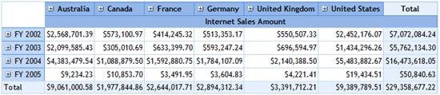
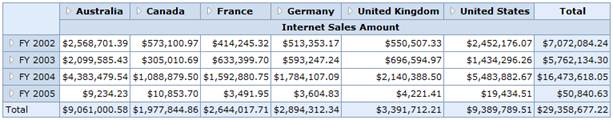
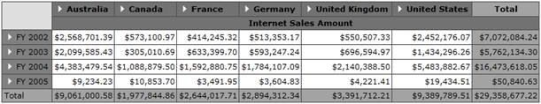
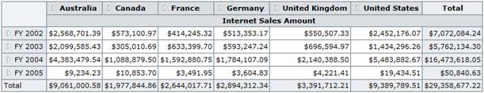

::: {style="DISPLAY: none"}
{#d2h_url_template}{#d2h_package_url style="WIDTH: 0px; DISPLAY: none; HEIGHT: 0px"}
:::

::::: {#nsbanner .d2h_main_nsbanner style="BORDER-BOTTOM: #999999 1px solid; POSITION: relative; PADDING-BOTTOM: 0px; BACKGROUND-COLOR: transparent; PADDING-LEFT: 0px; PADDING-RIGHT: 0px; DISPLAY: none; BORDER-TOP: #999999 1px solid; PADDING-TOP: 0px; LEFT: 0px"}
:::: {#TitleRow .d2h_main_titlerow style="PADDING-BOTTOM: 4px; BACKGROUND-COLOR: transparent; PADDING-LEFT: 22px; WIDTH: 100%; PADDING-RIGHT: 10px; DISPLAY: none; PADDING-TOP: 4px"}
::: {#ienav .d2h_main_ienav style="DISPLAY: none"}
{#D2HPrevious .D2HPreviousEnabled}  {#D2HNext .D2HNextEnabled}
:::
::::
:::::

::: {#nstext .d2h_main_nstext style="PADDING-BOTTOM: 10px; BACKGROUND-COLOR: transparent; PADDING-LEFT: 22px; PADDING-RIGHT: 10px; HEIGHT: 100%; OVERFLOW: auto; PADDING-TOP: 5px" hasuserbackground="true" valign="bottom"}
### AutoFormat {#autoformat style="tab-stops: 0pt"}

The OlapGrid control supports the following AutoFormat styles.

[·      ]{style="FONT-FAMILY: Symbol"}Default

[·      ]{style="FONT-FAMILY: Symbol"}Office2010Blue

[·      ]{style="FONT-FAMILY: Symbol"}Office2010Black

[·      ]{style="FONT-FAMILY: Symbol"}Office2010Silver

[·      ]{style="FONT-FAMILY: Symbol"}Office2007Blue

[·      ]{style="FONT-FAMILY: Symbol"}Office2007Olive

[·      ]{style="FONT-FAMILY: Symbol"}Office2007Black

[·      ]{style="FONT-FAMILY: Symbol"}Office2007Silver

[·      ]{style="FONT-FAMILY: Symbol"}Custom

 

AutoFormat styles can be set by using the following code.

 

+--------------------------------------------------------------------------------------------------------------------------------------------------------------------------------------------------------------------------------------------------------------------------------------------------------------------------------------------------------------------------+
| **[\[C#\]]{style="FONT-FAMILY: 'Courier New'"}**                                                                                                                                                                                                                                                                                                                         |
|                                                                                                                                                                                                                                                                                                                                                                          |
| [this]{style="FONT-FAMILY: 'Courier New'; COLOR: blue"}[.OlapGrid1.AutoFormat ]{style="FONT-FAMILY: 'Courier New'"}[= ]{style="FONT-FAMILY: 'Courier New'"}[Autoformat]{style="FONT-FAMILY: 'Courier New'; COLOR: #2b91af; FONT-SIZE: 9.5pt"}[.Office2010Blue;]{style="FONT-FAMILY: 'Courier New'; FONT-SIZE: 9.5pt"}[]{style="FONT-FAMILY: Consolas; FONT-SIZE: 9.5pt"} |
+--------------------------------------------------------------------------------------------------------------------------------------------------------------------------------------------------------------------------------------------------------------------------------------------------------------------------------------------------------------------------+

 

+-----------------------------------------------------------------------------------------------------------------------------------------------------------------------------------------------------------------------------------------------------------------------------------------------------------------------------------------------------------------------+
| **[\[VB\]]{style="FONT-FAMILY: 'Courier New'"}**                                                                                                                                                                                                                                                                                                                      |
|                                                                                                                                                                                                                                                                                                                                                                       |
| [Me]{style="FONT-FAMILY: 'Courier New'; COLOR: blue"}[.OlapGrid1.AutoFormat ]{style="FONT-FAMILY: 'Courier New'"}[= ]{style="FONT-FAMILY: 'Courier New'"}[Autoformat]{style="FONT-FAMILY: 'Courier New'; COLOR: #2b91af; FONT-SIZE: 9.5pt"}[.Office2010Blue]{style="FONT-FAMILY: 'Courier New'; FONT-SIZE: 9.5pt"}[]{style="FONT-FAMILY: Consolas; FONT-SIZE: 9.5pt"} |
+-----------------------------------------------------------------------------------------------------------------------------------------------------------------------------------------------------------------------------------------------------------------------------------------------------------------------------------------------------------------------+

 

{border="0"}

Figure 21: Default Skin

[]{style="FONT-STYLE: normal"} 

{border="0"}

Figure 22: Office2010Blue Skin

 

{border="0"}

Figure 23: Office2010Black Skin

[]{style="FONT-STYLE: normal"} 

{border="0"}

Figure 24: Office2010Silver Skin

 

[]{#related-topics}
:::
