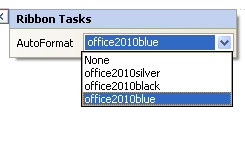
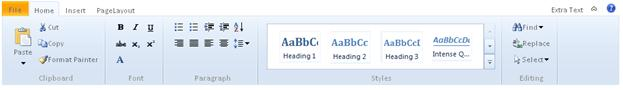
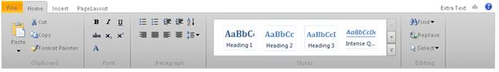
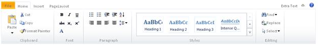

::: {style="DISPLAY: none"}
{#d2h_url_template}{#d2h_package_url style="WIDTH: 0px; DISPLAY: none; HEIGHT: 0px"}
:::

::: {.d2h_secondary_topic style="PADDING-BOTTOM: 10pt; MARGIN: 0pt; PADDING-LEFT: 0pt; PADDING-RIGHT: 0pt; PADDING-TOP: 0pt"}
##### AutoFormat Styles {#autoformat-styles style="TEXT-JUSTIFY: inter-ideograph; TEXT-ALIGN: justify; tab-stops: 0pt"}

The Ribbon control provides pre-defined set of styles that can be applied to your control just by the click of a button. You can set the desired look and feel for the control whose styles include popular ones too.

The Autoformat styles can be chosen by right-clicking the control and selecting the 'Show SmartTag\' option that opens the following AutoFormat Dropdown box. Choose the desired AutoFormat from the Dropdown list.

 

{border="0"}

Figure 322: AutoFormat Dropdown box

**** 

The built-in format skins added for Ribbon control are as follows:

 

[·      ]{style="FONT-FAMILY: Symbol"}Office2010Blue

{border="0"}

Figure 323: Office2010Blue

**** 

 

 

 

[·      ]{style="FONT-FAMILY: Symbol"}Office2010Black

 

{border="0"}

Figure 324: Office2010Black

 

 

 

 

[·      ]{style="FONT-FAMILY: Symbol"}Office2010Silver

 

{border="0"}

Figure 325: Office2010Silver

 

 

[]{#related-topics}
:::
