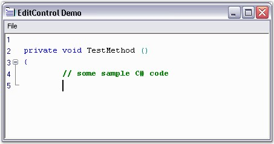
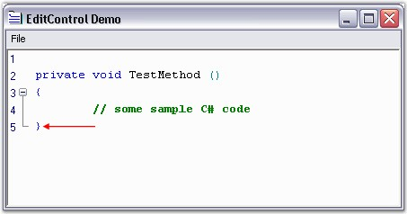

::: {style="DISPLAY: none"}
{#d2h_url_template}{#d2h_package_url style="WIDTH: 0px; DISPLAY: none; HEIGHT: 0px"}
:::

::::: {.d2h_secondary_topic style="PADDING-BOTTOM: 10pt; MARGIN: 0pt; PADDING-LEFT: 0pt; PADDING-RIGHT: 0pt; PADDING-TOP: 0pt"}
#### AutoFormatting {#autoformatting style="tab-stops: 0pt"}

 

The Edit Control offers autoformatting and smart indentation support for code as in Visual Studio. Currently, only C# has built-in support for this feature.

 

AutoFormatting can be enabled by using the below given method.

 

::: {align="center"}
  --------------------- ----------------------------------
  Edit Control Method   Description
  AutoFormatText        AutoFormats given range of text.
  --------------------- ----------------------------------
:::

 

For example, the closing brace gets automatically aligned with the opening brace. Consider some C# code as shown in the below screenshot.

 

{border="0"}

Figure 32: Code is entered into the Edit Control

 

Now, when the closing brace \'}\' is typed, it gets automatically aligned with the opening brace, as shown in the screenshot below.

 

{border="0"}

Figure 33: AutoFormatting support for code in Edit Control

[]{style="FONT-FAMILY: 'Trebuchet MS','sans-serif'; COLOR: #15428b; FONT-SIZE: 9pt"} 

::: {style="BORDER-BOTTOM: windowtext 1pt solid; BORDER-LEFT: medium none; PADDING-BOTTOM: 1pt; MARGIN-TOP: 9pt; PADDING-LEFT: 0pt; PADDING-RIGHT: 0pt; MARGIN-BOTTOM: 9pt; BORDER-TOP: windowtext 1pt solid; BORDER-RIGHT: medium none; PADDING-TOP: 1pt"}
{border="0"}Note: The [AutoIndentMode]{.UGHyperlink} property for the Edit Control should be set to Smart[ ]{style="COLOR: black"}for this purpose[.]{style="COLOR: black"}
:::

 

Essential Edit provides an extensible interface, **IAutoFormatter**, which can be implemented to provide any kind of formatter for any desired language. This can be used to take care of some of the special scenarios explained below.

 

[·      ]{style="FONT-FAMILY: Symbol"}XML or HTML text of the following format -[ ]{style="COLOR: black"}[\<]{style="FONT-FAMILY: 'Courier New'; COLOR: blue"}[abc]{style="FONT-FAMILY: 'Courier New'; COLOR: maroon"}[\>]{style="FONT-FAMILY: 'Courier New'; COLOR: blue"}[ [\<]{style="COLOR: blue"}[xyz]{style="COLOR: maroon"}[\>]{style="COLOR: blue"} \.... [\</]{style="COLOR: blue"}[xyz]{style="COLOR: maroon"}[\>]{style="COLOR: blue"} [\</]{style="COLOR: blue"}[abc]{style="COLOR: maroon"}[\>]{style="COLOR: blue"}]{style="FONT-FAMILY: 'Courier New'"}[ ]{style="COLOR: black"}should be autoformatted as follows.

[  ]{style="FONT-FAMILY: 'Trebuchet MS','sans-serif'; COLOR: #15428b; FONT-SIZE: 9pt"}

+---------------------------------------------------------------------------------------------------------------------------------------------------------------------+
| **[\[HTML or XML\]]{style="FONT-FAMILY: 'Courier New'; COLOR: black"}**                                                                                             |
|                                                                                                                                                                     |
| []{style="FONT-FAMILY: 'Courier New'; COLOR: black"}                                                                                                                |
|                                                                                                                                                                     |
| [\<]{style="FONT-FAMILY: 'Courier New'; COLOR: blue"}[abc]{style="FONT-FAMILY: 'Courier New'; COLOR: maroon"}[\>]{style="FONT-FAMILY: 'Courier New'; COLOR: blue"}  |
|                                                                                                                                                                     |
| [      [\<]{style="COLOR: blue"}[xyz]{style="COLOR: maroon"}[\>]{style="COLOR: blue"}]{style="FONT-FAMILY: 'Courier New'"}                                          |
|                                                                                                                                                                     |
| [        \...]{style="FONT-FAMILY: 'Courier New'"}                                                                                                                  |
|                                                                                                                                                                     |
| [      [\</]{style="COLOR: blue"}[xyz]{style="COLOR: maroon"}[\>]{style="COLOR: blue"}]{style="FONT-FAMILY: 'Courier New'"}                                         |
|                                                                                                                                                                     |
| [\</]{style="FONT-FAMILY: 'Courier New'; COLOR: blue"}[abc]{style="FONT-FAMILY: 'Courier New'; COLOR: maroon"}[\>]{style="FONT-FAMILY: 'Courier New'; COLOR: blue"} |
+---------------------------------------------------------------------------------------------------------------------------------------------------------------------+

[]{style="FONT-FAMILY: 'Trebuchet MS','sans-serif'; COLOR: #15428b; FONT-SIZE: 9pt"} 

[·      ]{style="FONT-FAMILY: Symbol"}Similarly, when the Edit Control is using C# configuration settings, any text enclosed within \'{\' and \'}\' should get automatically indented, just as in the VS.NET editor. Also, the closing brace should be automatically indented with its matching opening brace.

 

[·      ]{style="FONT-FAMILY: Symbol"}For languages like VB.NET, the End statement should get automatically indented on pressing the ENTER key, after entering the method header for the VB.NET samples.

[]{style="FONT-FAMILY: 'Trebuchet MS','sans-serif'; COLOR: #15428b; FONT-SIZE: 9pt"} 

+------------------------------------------------------------------------------------------------------------------------------------------------------------------------------------------------------------------------------------+
| **[\[VB.NET\]]{style="FONT-FAMILY: 'Courier New'; COLOR: black"}**                                                                                                                                                                 |
|                                                                                                                                                                                                                                    |
| []{style="FONT-FAMILY: 'Courier New'; COLOR: black"}                                                                                                                                                                               |
|                                                                                                                                                                                                                                    |
| [Private]{style="FONT-FAMILY: 'Courier New'; COLOR: blue"}[ [sub]{style="COLOR: blue"} TestMethod() [\'\-\-\--\> Method header ]{style="COLOR: green"}]{style="FONT-FAMILY: 'Courier New'"}                                        |
|                                                                                                                                                                                                                                    |
| []{style="FONT-FAMILY: 'Courier New'; COLOR: green"}                                                                                                                                                                               |
|                                                                                                                                                                                                                                    |
| [                         [\'\-\-\--\> Press Enter key]{style="COLOR: green"}]{style="FONT-FAMILY: 'Courier New'"}                                                                                                                 |
|                                                                                                                                                                                                                                    |
| []{style="FONT-FAMILY: 'Courier New'; COLOR: green"}                                                                                                                                                                               |
|                                                                                                                                                                                                                                    |
| [End]{style="FONT-FAMILY: 'Courier New'; COLOR: blue"}[ [sub]{style="COLOR: blue"} [\'\-\-\--\> End statement should be automatically aligned with the function header]{style="COLOR: green"}]{style="FONT-FAMILY: 'Courier New'"} |
+------------------------------------------------------------------------------------------------------------------------------------------------------------------------------------------------------------------------------------+

 

[]{#p49} 

[]{#related-topics}
:::::
