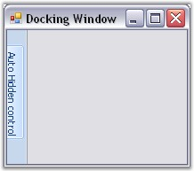
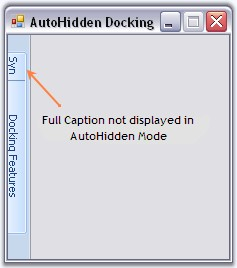
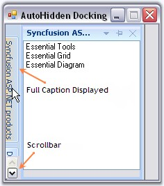

::: {style="DISPLAY: none"}
{#d2h_url_template}{#d2h_package_url style="WIDTH: 0px; DISPLAY: none; HEIGHT: 0px"}
:::

::::: {.d2h_secondary_topic style="PADDING-BOTTOM: 10pt; MARGIN: 0pt; PADDING-LEFT: 0pt; PADDING-RIGHT: 0pt; PADDING-TOP: 0pt"}
##### AutoHiding {#autohiding style="tab-stops: 0pt"}

[]{style="COLOR: #15428b"} 

Docking manager provides auto hide facility to the docked control. When the auto hide button (looks like a bell) is clicked, the docked controls will be hidden, and will be placed along the side of the container control on which it was placed. When mouse is moved over it, the auto hidden control will be displayed and the control will restore its appearance when the auto hidden button is clicked again.

 

The below image displays an autohidden docked control.

[]{style="COLOR: #15428b"} 

{border="0"}

[]{style="COLOR: #15428b"} 

Figure 52: AutoHidden Docked Control

**[]{style="COLOR: #15428b"}** 

The below properties controls the autohiding feature of the docked controls.

[]{style="COLOR: #15428b"} 

::: {align="center"}
+-----------------------------------+--------------------------------------------------------------------------------------------+
| DockingManager Property           | Description                                                                                |
+-----------------------------------+--------------------------------------------------------------------------------------------+
| AutoHideActiveControl             | Gets or sets a value indicating whether to slide back selected auto hidden control.        |
+-----------------------------------+--------------------------------------------------------------------------------------------+
| AutoHideInterval                  | Specifies the time interval for showing or hiding an autohidden control.                   |
+-----------------------------------+--------------------------------------------------------------------------------------------+
| AutoHideSelectionStyle            | Specifies the selection style for the autohidden windows. The styles are,                  |
|                                   |                                                                                            |
|                                   |                                                                                            |
|                                   |                                                                                            |
|                                   | *MouseHover* - Allows the user to select an autohidden tab by mouse hovering over the tab. |
|                                   |                                                                                            |
|                                   | *Click* - Allows the user to select the autohidden tab by clicking on the tab.             |
+-----------------------------------+--------------------------------------------------------------------------------------------+
:::

**[]{style="COLOR: #15428b"}** 

+-----------------------------------------------------------------------------------------------------------------------------------------------------------------------------------------------------+
| **[\[C#\]]{style="FONT-FAMILY: 'Courier New'; COLOR: black"}**                                                                                                                                      |
|                                                                                                                                                                                                     |
| []{style="FONT-FAMILY: 'Courier New'; COLOR: green"}                                                                                                                                                |
|                                                                                                                                                                                                     |
| [this]{style="FONT-FAMILY: 'Courier New'; COLOR: blue"}[.dockingManager1.AutoHideActiveControl = [true]{style="COLOR: blue"};]{style="FONT-FAMILY: 'Courier New'"}                                  |
|                                                                                                                                                                                                     |
| [this]{style="FONT-FAMILY: 'Courier New'; COLOR: blue"}[.dockingManager1.AutoHideInterval = 500;]{style="FONT-FAMILY: 'Courier New'"}                                                               |
|                                                                                                                                                                                                     |
| [this]{style="FONT-FAMILY: 'Courier New'; COLOR: blue"}[.dockingManager1.AutoHideSelectionStyle = Syncfusion.Windows.Forms.Tools.AutoHideSelectionStyle.Click;]{style="FONT-FAMILY: 'Courier New'"} |
+-----------------------------------------------------------------------------------------------------------------------------------------------------------------------------------------------------+

[]{style="COLOR: #15428b"} 

+--------------------------------------------------------------------------------------------------------------------------------------------------------------------------------------------------+
| **[\[VB.NET\]]{style="FONT-FAMILY: 'Courier New'; COLOR: black"}**                                                                                                                               |
|                                                                                                                                                                                                  |
| []{style="FONT-FAMILY: 'Courier New'; COLOR: green"}                                                                                                                                             |
|                                                                                                                                                                                                  |
| [Me]{style="FONT-FAMILY: 'Courier New'; COLOR: blue"}[.dockingManager1.AutoHideActiveControl = [True]{style="COLOR: blue"}]{style="FONT-FAMILY: 'Courier New'"}                                  |
|                                                                                                                                                                                                  |
| [Me]{style="FONT-FAMILY: 'Courier New'; COLOR: blue"}[.dockingManager1.AutoHideInterval = 500]{style="FONT-FAMILY: 'Courier New'"}                                                               |
|                                                                                                                                                                                                  |
| [Me]{style="FONT-FAMILY: 'Courier New'; COLOR: blue"}[.DockingManager1.AutoHideSelectionStyle = Syncfusion.Windows.Forms.Tools.AutoHideSelectionStyle.Click]{style="FONT-FAMILY: 'Courier New'"} |
+--------------------------------------------------------------------------------------------------------------------------------------------------------------------------------------------------+

[]{style="COLOR: #15428b"} 

Displaying Full Caption In AutoHide Mode

[]{style="COLOR: #15428b"} 

Create a docked window with two listbox. Dock the controls. Tab the controls and set the **FullCaptionInAutoHideMode** property. Setting this property to true, will display the full caption text in the auto hidden tabgroup\'s page. It displays full caption within the application if necessary with a scrollbar, so that end user can scroll and view the hidden tab\'s full caption.

[]{style="COLOR: #15428b"} 

+-------------------------------------------------------------------------------------------------------------------------------------------------------------------------+
| **[\[C#\]]{style="FONT-FAMILY: 'Courier New'; COLOR: black"}**                                                                                                          |
|                                                                                                                                                                         |
| []{style="FONT-FAMILY: 'Courier New'; COLOR: green"}                                                                                                                    |
|                                                                                                                                                                         |
| [this]{style="FONT-FAMILY: 'Courier New'; COLOR: blue"}[.dockingManager1.FullCaptionsInAutoHideMode = [true]{style="COLOR: blue"};]{style="FONT-FAMILY: 'Courier New'"} |
+-------------------------------------------------------------------------------------------------------------------------------------------------------------------------+

[]{style="COLOR: #15428b"} 

+----------------------------------------------------------------------------------------------------------------------------------------------------------------------+
| **[\[VB.NET\]]{style="FONT-FAMILY: 'Courier New'; COLOR: black"}**                                                                                                   |
|                                                                                                                                                                      |
| []{style="FONT-FAMILY: 'Courier New'; COLOR: green"}                                                                                                                 |
|                                                                                                                                                                      |
| [Me]{style="FONT-FAMILY: 'Courier New'; COLOR: blue"}[.dockingManager1.FullCaptionsInAutoHideMode = [True]{style="COLOR: blue"}]{style="FONT-FAMILY: 'Courier New'"} |
+----------------------------------------------------------------------------------------------------------------------------------------------------------------------+

[]{style="COLOR: #15428b"} 

{border="0"}

[]{style="COLOR: #15428b"} 

Figure 53: AutoHidden Tabs with truncated Caption Text

[]{style="COLOR: #15428b"} 

{border="0"}

**[]{style="COLOR: #15428b"}** 

Figure 54: AutoHidden Tabs with full Caption Display

**[]{style="COLOR: #15428b"}** 

Animation in Auto Hiding is discussed in Auto Hide Animation Speed topic and Dragging Autohidden tabs topic discusses how to drag the autohidden tabs.

[]{style="COLOR: #15428b"} 

See Also

[]{style="COLOR: #15428b"} 

[Context Menu]{.UGHyperlink}[, ]{.UGHyperlink}[Animation Events]{.UGHyperlink}[, ]{.UGHyperlink}[AutoHide TabContextMenu Event]{.UGHyperlink}[, ]{.UGHyperlink}[How to autohide a control when an application loads]{.UGHyperlink}[]{.UGHyperlink}

###### []{#_Auto_Hide_Animation}3.2.3.1.4.1 Auto Hide Animation Speed {#auto-hide-animation-speed style="tab-stops: 0pt"}

[]{#p51}[]{style="COLOR: #15428b"} 

DockingPanel allows you to change the speed at which your docking panes are displayed or auto hidden. You can easily change the delay of the auto hide windows as fast or as slow as you want, so that your window will hide / show at the perfect speed.

 

The speed of animation can be controlled by **AnimationSpeed** and **AnimationStep** Property.

 

AnimationSpeed property of the DockingManager indicates the speed of animation during auto hide or the timer interval in milli secs. AnimationStep indicates the step value for the animation. It is common to all the docked control. AnimationStep property can be implemented using the code below.

[]{style="COLOR: #15428b"} 

+-----------------------------------------------------------------------------------------------------------------------------------------------------------------------------------------------------------------------+
| **[\[C#\]]{style="FONT-FAMILY: 'Courier New'; COLOR: black"}**                                                                                                                                                        |
|                                                                                                                                                                                                                       |
| []{style="FONT-FAMILY: 'Courier New'; COLOR: green"}                                                                                                                                                                  |
|                                                                                                                                                                                                                       |
| [//arg.Bounds give the bounds of the autohidden control as a rectangle object. ]{style="FONT-FAMILY: 'Courier New'; COLOR: green"}                                                                                    |
|                                                                                                                                                                                                                       |
| [DockingManager]{style="FONT-FAMILY: 'Courier New'; COLOR: teal"}[.AnimationStep = 1000;  ]{style="FONT-FAMILY: 'Courier New'; COLOR: black"}[//(arg.Bounds.Width)]{style="FONT-FAMILY: 'Courier New'; COLOR: green"} |
+-----------------------------------------------------------------------------------------------------------------------------------------------------------------------------------------------------------------------+

[]{style="COLOR: #15428b"} 

+-----------------------------------------------------------------------------------------------------------------------------------------------------------------------------------------------------------------------+
| **[\[VB.NET\]]{style="FONT-FAMILY: 'Courier New'; COLOR: black"}**                                                                                                                                                    |
|                                                                                                                                                                                                                       |
| []{style="FONT-FAMILY: 'Courier New'; COLOR: green"}                                                                                                                                                                  |
|                                                                                                                                                                                                                       |
| [\'arg.Bounds give the bounds of the autohidden control as a rectangle object. ]{style="FONT-FAMILY: 'Courier New'; COLOR: green"}                                                                                    |
|                                                                                                                                                                                                                       |
| [DockingManager]{style="FONT-FAMILY: 'Courier New'; COLOR: teal"}[.AnimationStep = 1000;  ]{style="FONT-FAMILY: 'Courier New'; COLOR: black"}[\'(arg.Bounds.Width)]{style="FONT-FAMILY: 'Courier New'; COLOR: green"} |
+-----------------------------------------------------------------------------------------------------------------------------------------------------------------------------------------------------------------------+

[]{style="COLOR: #15428b"} 

::: {style="BORDER-BOTTOM: windowtext 1pt solid; BORDER-LEFT: medium none; PADDING-BOTTOM: 1pt; MARGIN-TOP: 9pt; PADDING-LEFT: 0pt; PADDING-RIGHT: 0pt; MARGIN-BOTTOM: 9pt; BORDER-TOP: windowtext 1pt solid; BORDER-RIGHT: medium none; PADDING-TOP: 1pt"}
{border="0"} Note: For a control to show animation in autohide mode, the animation step value should be more than the width of the particular hidden control.
:::

###### []{#p52}3.2.3.1.4.2 Context Menu for AutoHidden Tabs {#context-menu-for-autohidden-tabs style="tab-stops: 0pt"}

[]{style="COLOR: #15428b"} 

This is discussed in Context Menu topic.

###### []{#p53}[]{#_Dragging_Autohidden_tabs}3.2.3.1.4.3 Dragging Autohidden tabs {#dragging-autohidden-tabs style="tab-stops: 0pt"}

[]{style="COLOR: #15428b"} 

The docked controls that are autohidden, can be dragged with their tabs, and can be docked or set to floating by setting **EnableDragAutoHiddenTabs** property to true.

[]{style="COLOR: #15428b"} 

+-----------------------------------------------------------------------------------------------------------------------------------------------------------------------+
| **[\[C#\]]{style="FONT-FAMILY: 'Courier New'; COLOR: black"}**                                                                                                        |
|                                                                                                                                                                       |
| []{style="FONT-FAMILY: 'Courier New'; COLOR: green"}                                                                                                                  |
|                                                                                                                                                                       |
| [this]{style="FONT-FAMILY: 'Courier New'; COLOR: blue"}[.dockingManager1.EnableDragAutoHiddenTabs = [true]{style="COLOR: blue"};]{style="FONT-FAMILY: 'Courier New'"} |
+-----------------------------------------------------------------------------------------------------------------------------------------------------------------------+

[]{style="COLOR: #15428b"} 

+--------------------------------------------------------------------------------------------------------------------------------------------------------------------+
| **[\[VB.NET\]]{style="FONT-FAMILY: 'Courier New'; COLOR: black"}**                                                                                                 |
|                                                                                                                                                                    |
| []{style="FONT-FAMILY: 'Courier New'; COLOR: green"}                                                                                                               |
|                                                                                                                                                                    |
| [Me]{style="FONT-FAMILY: 'Courier New'; COLOR: blue"}[.dockingManager1.EnableDragAutoHiddenTabs = [True]{style="COLOR: blue"}]{style="FONT-FAMILY: 'Courier New'"} |
+--------------------------------------------------------------------------------------------------------------------------------------------------------------------+

[]{#related-topics}
:::::
