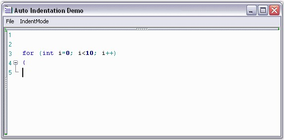
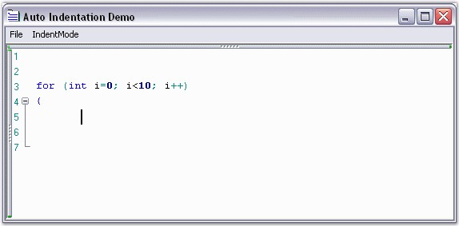
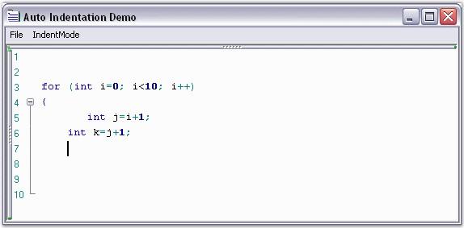

::: {style="DISPLAY: none"}
{#d2h_url_template}{#d2h_package_url style="WIDTH: 0px; DISPLAY: none; HEIGHT: 0px"}
:::

:::: {.d2h_secondary_topic style="PADDING-BOTTOM: 10pt; MARGIN: 0pt; PADDING-LEFT: 0pt; PADDING-RIGHT: 0pt; PADDING-TOP: 0pt"}
#### Auto Indentation {#auto-indentation style="tab-stops: 0pt"}

 

The Edit Control offers advanced text indentation support to suit the requirements of the user.

 

The properties given below can be used to customize the auto indentation settings of the Edit Control.

 

::: {align="center"}
+-----------------------------------+-------------------------------------------------------------------------------------------------------------------------+
| Edit Control Property             | Description                                                                                                             |
+-----------------------------------+-------------------------------------------------------------------------------------------------------------------------+
| AutoIndentMode                    | Specifies mode of auto indentation. The options provided are                                                            |
|                                   |                                                                                                                         |
|                                   |                                                                                                                         |
|                                   |                                                                                                                         |
|                                   | [·      ]{style="FONT-FAMILY: Symbol"}None                                                                              |
|                                   |                                                                                                                         |
|                                   | [·      ]{style="FONT-FAMILY: Symbol"}Block                                                                             |
|                                   |                                                                                                                         |
|                                   | [·      ]{style="FONT-FAMILY: Symbol"}Smart                                                                             |
+-----------------------------------+-------------------------------------------------------------------------------------------------------------------------+
| AutoIndentGuideline               | Gets / sets the value that specifies whether indent guideline should be shown automatically after cursor repositioning. |
+-----------------------------------+-------------------------------------------------------------------------------------------------------------------------+
:::

[]{style="FONT-FAMILY: 'Trebuchet MS','sans-serif'; COLOR: #15428b; FONT-SIZE: 9pt"} 

+-------------------------------------------------------------------------------------------------------------------------------------------------------------------------------------------------------------+
| **[\[C#\]]{style="FONT-FAMILY: 'Courier New'; COLOR: black"}**                                                                                                                                              |
|                                                                                                                                                                                                             |
| []{style="FONT-FAMILY: 'Courier New'; COLOR: black"}                                                                                                                                                        |
|                                                                                                                                                                                                             |
| [// Sets the AutoIntentMode.]{style="FONT-FAMILY: 'Courier New'; COLOR: green"}                                                                                                                             |
|                                                                                                                                                                                                             |
| [this]{style="FONT-FAMILY: 'Courier New'; COLOR: blue"}[.editControl1.AutoIndentMode = Syncfusion.Windows.Forms.Edit.Enums.[AutoIndentMode]{style="COLOR: teal"}.None;]{style="FONT-FAMILY: 'Courier New'"} |
+-------------------------------------------------------------------------------------------------------------------------------------------------------------------------------------------------------------+

[]{style="FONT-FAMILY: 'Trebuchet MS','sans-serif'; COLOR: #15428b; FONT-SIZE: 9pt"} 

+-----------------------------------------------------------------------------------------------------------------------------------------------------------------------------------+
| **[\[VB.NET\]]{style="FONT-FAMILY: 'Courier New'; COLOR: black"}**                                                                                                                |
|                                                                                                                                                                                   |
| []{style="FONT-FAMILY: 'Courier New'; COLOR: black"}                                                                                                                              |
|                                                                                                                                                                                   |
| [\' Sets the AutoIntentMode.]{style="FONT-FAMILY: 'Courier New'; COLOR: green"}                                                                                                   |
|                                                                                                                                                                                   |
| [Me]{style="FONT-FAMILY: 'Courier New'; COLOR: blue"}[.editControl1.AutoIndentMode = Syncfusion.Windows.Forms.Edit.Enums.AutoIndentMode.None]{style="FONT-FAMILY: 'Courier New'"} |
+-----------------------------------------------------------------------------------------------------------------------------------------------------------------------------------+

 

If ENTER key is pressed when the AutoIndentMode is set to None, the text is not indented.

 

{border="0"}

Figure 29: AutoIndentMode = \"None\"

 

When the AutoIndentMode is set to **Smart**, the next line gets indented by one TabSize from the first column of the previous line on pressing the ENTER key.

 

{border="0"}

Figure 30: AutoIndentMode = \"Smart\"[]{style="FONT-STYLE: normal"}

 

When the AutoIndentMode is set to **Block**, the next line begins at the same column as the previous line on pressing the ENTER key.

 

{border="0"}

Figure 31: AutoIndentMode = \"Block\"

 

The Auto Indentation characters can be specified by setting the **Indent** field to **True** in the lexem definition of the configuration file, as shown below.

 

+------------------------------------------------------------------------------------------------------------------------------------------------------------------------------------------------------------------------------------------------------------------------------------------------------------------------------------------------------------------------------------------------------------------------------------------------------------------------------------------------------------------------------------------------------------------------------------------------------------------------------------------------------------------------------------------------------------------------------------------------------------------------------------------------------------------------------------------------------------------------------------------------------------------------------------------------------------------------------------------------------------------------------------------------------------------------------------------------------------------------------------------------------------------------------------------------------------------------------------------------------------------------------------------------------------------------------------------------------------------------------------------------------------------------------------------------------------------+
| **[\[XML\]]{style="FONT-FAMILY: 'Courier New'; COLOR: black"}**                                                                                                                                                                                                                                                                                                                                                                                                                                                                                                                                                                                                                                                                                                                                                                                                                                                                                                                                                                                                                                                                                                                                                                                                                                                                                                                                                                                                  |
|                                                                                                                                                                                                                                                                                                                                                                                                                                                                                                                                                                                                                                                                                                                                                                                                                                                                                                                                                                                                                                                                                                                                                                                                                                                                                                                                                                                                                                                                  |
| []{style="FONT-FAMILY: 'Courier New'; COLOR: black"}                                                                                                                                                                                                                                                                                                                                                                                                                                                                                                                                                                                                                                                                                                                                                                                                                                                                                                                                                                                                                                                                                                                                                                                                                                                                                                                                                                                                             |
|                                                                                                                                                                                                                                                                                                                                                                                                                                                                                                                                                                                                                                                                                                                                                                                                                                                                                                                                                                                                                                                                                                                                                                                                                                                                                                                                                                                                                                                                  |
| [\<]{style="FONT-FAMILY: 'Courier New'; COLOR: blue"}[lexem]{style="FONT-FAMILY: 'Courier New'; COLOR: maroon"}[ ]{style="FONT-FAMILY: 'Courier New'; COLOR: fuchsia"}[BeginBlock]{style="FONT-FAMILY: 'Courier New'; COLOR: red"}[=\"{\"]{style="FONT-FAMILY: 'Courier New'; COLOR: blue"}[ ]{style="FONT-FAMILY: 'Courier New'; COLOR: fuchsia"}[EndBlock]{style="FONT-FAMILY: 'Courier New'; COLOR: red"}[=\"}\"]{style="FONT-FAMILY: 'Courier New'; COLOR: blue"}[ ]{style="FONT-FAMILY: 'Courier New'; COLOR: fuchsia"}[Type]{style="FONT-FAMILY: 'Courier New'; COLOR: red"}[=\"Operator\"]{style="FONT-FAMILY: 'Courier New'; COLOR: blue"}[ ]{style="FONT-FAMILY: 'Courier New'; COLOR: fuchsia"}[IsComplex]{style="FONT-FAMILY: 'Courier New'; COLOR: red"}[=\"true\"]{style="FONT-FAMILY: 'Courier New'; COLOR: blue"}[ ]{style="FONT-FAMILY: 'Courier New'; COLOR: fuchsia"}[IsCollapsable]{style="FONT-FAMILY: 'Courier New'; COLOR: red"}[=\"true\" ]{style="FONT-FAMILY: 'Courier New'; COLOR: blue"}[Indent]{style="FONT-FAMILY: 'Courier New'; COLOR: red"}[=\"true\"]{style="FONT-FAMILY: 'Courier New'; COLOR: blue"}[  CollapseName]{style="FONT-FAMILY: 'Courier New'; COLOR: red"}[=\"{\...}\"]{style="FONT-FAMILY: 'Courier New'; COLOR: blue"}[ ]{style="FONT-FAMILY: 'Courier New'; COLOR: fuchsia"}[IndentationGuideline]{style="FONT-FAMILY: 'Courier New'; COLOR: red"}[=\"true\"\>]{style="FONT-FAMILY: 'Courier New'; COLOR: blue"} |
+------------------------------------------------------------------------------------------------------------------------------------------------------------------------------------------------------------------------------------------------------------------------------------------------------------------------------------------------------------------------------------------------------------------------------------------------------------------------------------------------------------------------------------------------------------------------------------------------------------------------------------------------------------------------------------------------------------------------------------------------------------------------------------------------------------------------------------------------------------------------------------------------------------------------------------------------------------------------------------------------------------------------------------------------------------------------------------------------------------------------------------------------------------------------------------------------------------------------------------------------------------------------------------------------------------------------------------------------------------------------------------------------------------------------------------------------------------------+

 

A sample which demonstrates Auto Indentation is available in the below sample installation path.

 

***..\\My Documents\\Syncfusion\\EssentialStudio\\Version Number\\Windows\\Edit.Windows\\Samples\\2.0\\Text Formatting\\AutoIndentationDemo***

 

[]{#p48} 

[]{#related-topics}
::::
