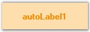

::: {style="DISPLAY: none"}
{#d2h_url_template}{#d2h_package_url style="WIDTH: 0px; DISPLAY: none; HEIGHT: 0px"}
:::

::: {.d2h_secondary_topic style="PADDING-BOTTOM: 10pt; MARGIN: 0pt; PADDING-LEFT: 0pt; PADDING-RIGHT: 0pt; PADDING-TOP: 0pt"}
#### AutoLabel {#autolabel style="tab-stops: 0pt"}

[]{style="COLOR: #15428b"} 

The AutoLabel control is a label-derived control that lets you pair a label with any other control. Once paired, the AutoLabel will be automatically repositioned as the labeled control\'s position changes.

[]{style="COLOR: #15428b"} 

{border="0"}

[]{style="COLOR: #15428b"} 

Figure 591: AutoLabel Control

[]{style="COLOR: #15428b"} 

The FlowLayout layout manager will always treat the AutoLabel-labeled control pair as a unit. You can use AutoLabels and FlowLayouts together to implement complex and powerful form layouts.

[]{style="COLOR: #15428b"} 

See Also

[]{style="COLOR: #15428b"} 

[Labeling a Control]{.UGHyperlink}[]{.UGHyperlink}

More:

[ ]{#related-topics}

[{border="0" align="absMiddle"}Features](ms-xhelp:///?Id=fbd3a6b0-c2f4-4509-ab0f-ddb3839e773f){style="TEXT-DECORATION: none"}

[{border="0" align="absMiddle"}Creating AutoLabel](ms-xhelp:///?Id=b200e53d-b9e2-4b45-9c4a-aa0b18efaaa9){style="TEXT-DECORATION: none"}

[{border="0" align="absMiddle"}Concepts and Features](ms-xhelp:///?Id=4e9ac8dc-43c3-43ca-ba4b-a9310d5b2a51){style="TEXT-DECORATION: none"}

[{border="0" align="absMiddle"}AutoLabel Event](ms-xhelp:///?Id=bba348b9-82dd-4c79-a7f5-38829fed817d){style="TEXT-DECORATION: none"}
:::
