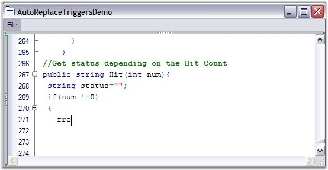
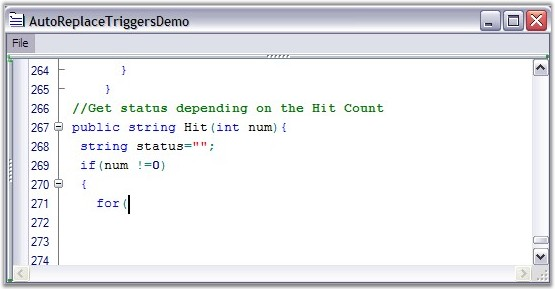

::: {style="DISPLAY: none"}
{#d2h_url_template}{#d2h_package_url style="WIDTH: 0px; DISPLAY: none; HEIGHT: 0px"}
:::

::::: {#nsbanner .d2h_main_nsbanner style="BORDER-BOTTOM: #999999 1px solid; POSITION: relative; PADDING-BOTTOM: 0px; BACKGROUND-COLOR: transparent; PADDING-LEFT: 0px; PADDING-RIGHT: 0px; DISPLAY: none; BORDER-TOP: #999999 1px solid; PADDING-TOP: 0px; LEFT: 0px"}
:::: {#TitleRow .d2h_main_titlerow style="PADDING-BOTTOM: 4px; BACKGROUND-COLOR: transparent; PADDING-LEFT: 22px; WIDTH: 100%; PADDING-RIGHT: 10px; DISPLAY: none; PADDING-TOP: 4px"}
::: {#ienav .d2h_main_ienav style="DISPLAY: none"}
{#D2HPrevious .D2HPreviousEnabled}  {#D2HNext .D2HNextEnabled}
:::
::::
:::::

:::: {#nstext .d2h_main_nstext style="PADDING-BOTTOM: 10px; BACKGROUND-COLOR: transparent; PADDING-LEFT: 22px; PADDING-RIGHT: 10px; HEIGHT: 100%; OVERFLOW: auto; PADDING-TOP: 5px" hasuserbackground="true" valign="bottom"}
::: {#d2h_breadcrumbs .d2h_breadcrumbs}
[Essential Studio User Guide Documentation](ms-xhelp:///?Id=12457748-09e3-4d74-a240-8e049cedf030){.d2h_breadcrumbsNormal}[ \> ]{.d2h_breadcrumbsLinkSeparator}[User Interface Edition](ms-xhelp:///?Id=c29296b7-531c-413b-a0ec-488ca1f7f669){.d2h_breadcrumbsNormal}[ \> ]{.d2h_breadcrumbsLinkSeparator}[Essential Windows](ms-xhelp:///?Id=e60759d8-47a4-4570-9d7a-16a68d63f2ea){.d2h_breadcrumbsNormal}[ \> ]{.d2h_breadcrumbsLinkSeparator}[Essential Edit]{.d2h_breadcrumbsContentsOnly}[ \> ]{.d2h_breadcrumbsLinkSeparator}[Concepts And Features](ms-xhelp:///?Id=7c39cee6-8434-4711-a18e-efaba8ac85c0){.d2h_breadcrumbsNormal}[ \> ]{.d2h_breadcrumbsLinkSeparator}[Code Completion](ms-xhelp:///?Id=3f18d395-b947-424d-9d18-25a8a36cc2e8){.d2h_breadcrumbsNormal}
:::

### AutoReplace Triggers {#autoreplace-triggers style="tab-stops: 0pt"}

 

The Edit Control comes with the AutoReplace Triggers feature which allows the control to automatically correct some of the known predefined typing errors. AutoReplace Triggers are fired when certain keys are pressed. These keys are defined within the language definition. When the AutoReplace Trigger key is pressed, the editor checks the word before the AutoReplace Trigger, to see if it is in the AutoReplace table. If it is present, then the word is automatically replaced with its replacement word.

 

The AutoReplace Trigger keys are defined within the language definitions. This means that different keys can be defined as triggers for different languages.

 

{border="0"}

Figure 12: \"for\" has been incorrectly typed as \"fro\"

[]{style="FONT-FAMILY: 'Trebuchet MS','sans-serif'; COLOR: #15428b; FONT-SIZE: 9pt"} 

{border="0"}

Figure 13: After typing \'(\' the incorrect token \"fro\" is replaced with the correct token \"for\"

 

AutoReplace Triggers can be enabled by using the **UseAutoreplaceTriggers** property as shown below.

 

+-------------------------------------------------------------------------------------------------------------------------------------------------------------------------------------------------------------------------------------------------------------------------------------------------------------------+
| **[\[C#\]]{style="FONT-FAMILY: 'Courier New'; COLOR: black"}**                                                                                                                                                                                                                                                    |
|                                                                                                                                                                                                                                                                                                                   |
| []{style="FONT-FAMILY: 'Courier New'; COLOR: black"}                                                                                                                                                                                                                                                              |
|                                                                                                                                                                                                                                                                                                                   |
| [// Enables AutoReplace Triggers.\                                                                                                                                                                                                                                                                                |
| ]{style="FONT-FAMILY: 'Courier New'; COLOR: green"}[this]{style="FONT-FAMILY: 'Courier New'; COLOR: blue"}[.editControl1.UseAutoreplaceTriggers = ]{style="FONT-FAMILY: 'Courier New'; COLOR: black"}[true]{style="FONT-FAMILY: 'Courier New'; COLOR: blue"}[;]{style="FONT-FAMILY: 'Courier New'; COLOR: black"} |
+-------------------------------------------------------------------------------------------------------------------------------------------------------------------------------------------------------------------------------------------------------------------------------------------------------------------+

[]{style="FONT-FAMILY: 'Trebuchet MS','sans-serif'; COLOR: #15428b; FONT-SIZE: 9pt"} 

+------------------------------------------------------------------------------------------------------------------------------------------------------------------------------------------------------------------------------------------------------------+
| **[\[VB.NET\]]{style="FONT-FAMILY: 'Courier New'; COLOR: black"}**                                                                                                                                                                                         |
|                                                                                                                                                                                                                                                            |
| []{style="FONT-FAMILY: 'Courier New'; COLOR: black"}                                                                                                                                                                                                       |
|                                                                                                                                                                                                                                                            |
| [\' Enables AutoReplace Triggers.\                                                                                                                                                                                                                         |
| ]{style="FONT-FAMILY: 'Courier New'; COLOR: green"}[Me]{style="FONT-FAMILY: 'Courier New'; COLOR: blue"}[.editControl1.UseAutoreplaceTriggers = ]{style="FONT-FAMILY: 'Courier New'; COLOR: black"}[True]{style="FONT-FAMILY: 'Courier New'; COLOR: blue"} |
+------------------------------------------------------------------------------------------------------------------------------------------------------------------------------------------------------------------------------------------------------------+

 

The keys used as AutoReplace Triggers are defined by using the **TriggersActivators** attribute of the language in the configuration file, as shown below.

 

  -----------------------------------------------------------------------------------------------------------------------------------------------------------
  [\<ConfigLanguage name =\"C#\" Known =\"Csharp\" StartComment =\"//\" TriggersActivators =\" ;.=()\"\>]{style="FONT-FAMILY: 'Courier New'; COLOR: black"}
  -----------------------------------------------------------------------------------------------------------------------------------------------------------

 

Triggers can be flagged as valid only within the specific lexical states. For example, you can set a trigger not to fire, if it is in a comment within a language, by using the **AllowTriggers** attribute, as shown below.

 

  --------------------------------------------------------------------------------------------------------------------------------------------------------------------------------------------------------------------------------------------
  [\<lexem BeginBlock=\"/\* EndBlock=\"\*/\" Type=\"Comment\" OnlyLocalSublexems=\"true\" IsComplex=\"true\" IsCollapsable=\"true\" CollapseName=\"/\*\...\*/\" AllowTriggers=\"false\"\>]{style="FONT-FAMILY: 'Courier New'; COLOR: black"}
  --------------------------------------------------------------------------------------------------------------------------------------------------------------------------------------------------------------------------------------------

 

The words to be replaced when the AutoReplace Triggers key is pressed can be defined by using the code given below.

 

+-----------------------------------------------------------------------------------------------------------------------------------------------------------------------------------------------------------------------------------------------------------------------------------------------------------------------------------------------------------------------------------------------------------------------------------------------------------------------------------------------------------------------------------------------------------------------------------------------------------------------------------------------------------------------------------------------------------+
| **[\[C#\]]{style="FONT-FAMILY: 'Courier New'; COLOR: black"}**                                                                                                                                                                                                                                                                                                                                                                                                                                                                                                                                                                                                                                            |
|                                                                                                                                                                                                                                                                                                                                                                                                                                                                                                                                                                                                                                                                                                           |
| []{style="FONT-FAMILY: 'Courier New'; COLOR: black"}                                                                                                                                                                                                                                                                                                                                                                                                                                                                                                                                                                                                                                                      |
|                                                                                                                                                                                                                                                                                                                                                                                                                                                                                                                                                                                                                                                                                                           |
| [this]{style="FONT-FAMILY: 'Courier New'; COLOR: blue"}[.editControl1.Language.AutoReplaceTriggers.AddRange(]{style="FONT-FAMILY: 'Courier New'; COLOR: black"}[new]{style="FONT-FAMILY: 'Courier New'; COLOR: blue"}[ AutoReplaceTrigger\[\]{]{style="FONT-FAMILY: 'Courier New'; COLOR: black"}[new]{style="FONT-FAMILY: 'Courier New'; COLOR: blue"}[ AutoReplaceTrigger(\"tis\",\"]{style="FONT-FAMILY: 'Courier New'; COLOR: black"}[this]{style="FONT-FAMILY: 'Courier New'; COLOR: blue"}[\"),]{style="FONT-FAMILY: 'Courier New'; COLOR: black"}[new]{style="FONT-FAMILY: 'Courier New'; COLOR: blue"}[ AutoReplaceTrigger(\"fro\",\"for\")});]{style="FONT-FAMILY: 'Courier New'; COLOR: black"} |
+-----------------------------------------------------------------------------------------------------------------------------------------------------------------------------------------------------------------------------------------------------------------------------------------------------------------------------------------------------------------------------------------------------------------------------------------------------------------------------------------------------------------------------------------------------------------------------------------------------------------------------------------------------------------------------------------------------------+

[]{style="FONT-FAMILY: 'Trebuchet MS','sans-serif'; COLOR: #15428b; FONT-SIZE: 9pt"} 

+------------------------------------------------------------------------------------------------------------------------------------------------------------------------------------------------------------------------------------------------------------------------------------------------------------------------------------------------------------------------------------------------------------------------------------------------------------------------------------------------------------------------------------------------------------------------------------------------------------------------------------------------------------------------------------------------------+
| **[\[VB.NET\]]{style="FONT-FAMILY: 'Courier New'; COLOR: black"}**                                                                                                                                                                                                                                                                                                                                                                                                                                                                                                                                                                                                                                   |
|                                                                                                                                                                                                                                                                                                                                                                                                                                                                                                                                                                                                                                                                                                      |
| []{style="FONT-FAMILY: 'Courier New'; COLOR: black"}                                                                                                                                                                                                                                                                                                                                                                                                                                                                                                                                                                                                                                                 |
|                                                                                                                                                                                                                                                                                                                                                                                                                                                                                                                                                                                                                                                                                                      |
| [Me]{style="FONT-FAMILY: 'Courier New'; COLOR: blue"}[.editControl1.Language.AutoReplaceTriggers.AddRange(]{style="FONT-FAMILY: 'Courier New'; COLOR: black"}[New]{style="FONT-FAMILY: 'Courier New'; COLOR: blue"}[ AutoReplaceTrigger(){]{style="FONT-FAMILY: 'Courier New'; COLOR: black"}[New]{style="FONT-FAMILY: 'Courier New'; COLOR: blue"}[ AutoReplaceTrigger(\"tis\",\"]{style="FONT-FAMILY: 'Courier New'; COLOR: black"}[this]{style="FONT-FAMILY: 'Courier New'; COLOR: blue"}[\"),]{style="FONT-FAMILY: 'Courier New'; COLOR: black"}[New]{style="FONT-FAMILY: 'Courier New'; COLOR: blue"}[ AutoReplaceTrigger(\"fro\",\"for\")})]{style="FONT-FAMILY: 'Courier New'; COLOR: black"} |
+------------------------------------------------------------------------------------------------------------------------------------------------------------------------------------------------------------------------------------------------------------------------------------------------------------------------------------------------------------------------------------------------------------------------------------------------------------------------------------------------------------------------------------------------------------------------------------------------------------------------------------------------------------------------------------------------------+

 

The words to be replaced can also be defined within the language definition in the configuration file, as shown below.

 

+-----------------------------------------------------------------------------------------------------------------+
| [\<AutoReplaceTriggers\>]{style="FONT-FAMILY: 'Courier New'; COLOR: black"}                                     |
|                                                                                                                 |
| [        \<AutoReplaceTrigger From =\"tis\" To =\"this\" /\>]{style="FONT-FAMILY: 'Courier New'; COLOR: black"} |
|                                                                                                                 |
| [       ]{style="FONT-FAMILY: 'Courier New'; COLOR: black"}                                                     |
|                                                                                                                 |
| [ \<AutoReplaceTrigger From =\"itn\" To =\"int\" /\>]{style="FONT-FAMILY: 'Courier New'; COLOR: black"}         |
|                                                                                                                 |
| [\</AutoReplaceTriggers\>]{style="FONT-FAMILY: 'Courier New'; COLOR: black"}                                    |
+-----------------------------------------------------------------------------------------------------------------+

 

See Also

 

[AutoComplete Support]{.UGHyperlink}[]{.UGHyperlink}

[]{#p31} 

[]{#related-topics}
::::
