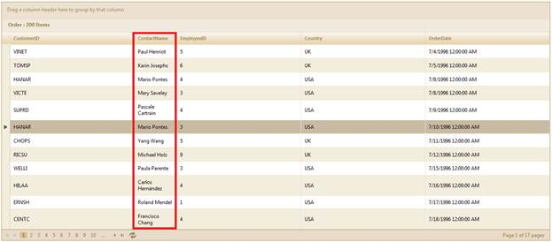
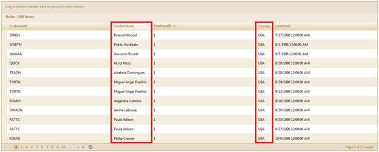

::: {style="DISPLAY: none"}
{#d2h_url_template}{#d2h_package_url style="WIDTH: 0px; DISPLAY: none; HEIGHT: 0px"}
:::

::::: {#nsbanner .d2h_main_nsbanner style="BORDER-BOTTOM: #999999 1px solid; POSITION: relative; PADDING-BOTTOM: 0px; BACKGROUND-COLOR: transparent; PADDING-LEFT: 0px; PADDING-RIGHT: 0px; DISPLAY: none; BORDER-TOP: #999999 1px solid; PADDING-TOP: 0px; LEFT: 0px"}
:::: {#TitleRow .d2h_main_titlerow style="PADDING-BOTTOM: 4px; BACKGROUND-COLOR: transparent; PADDING-LEFT: 22px; WIDTH: 100%; PADDING-RIGHT: 10px; DISPLAY: none; PADDING-TOP: 4px"}
::: {#ienav .d2h_main_ienav style="DISPLAY: none"}
{#D2HPrevious .D2HPreviousEnabled}  {#D2HNext .D2HNextEnabled}
:::
::::
:::::

:::::: {#nstext .d2h_main_nstext style="PADDING-BOTTOM: 10px; BACKGROUND-COLOR: transparent; PADDING-LEFT: 22px; PADDING-RIGHT: 10px; HEIGHT: 100%; OVERFLOW: auto; PADDING-TOP: 5px" hasuserbackground="true" valign="bottom"}
::: {#d2h_breadcrumbs .d2h_breadcrumbs}
[Essential Studio User Guide Documentation](ms-xhelp:///?Id=12457748-09e3-4d74-a240-8e049cedf030){.d2h_breadcrumbsNormal}[ \> ]{.d2h_breadcrumbsLinkSeparator}[User Interface Edition](ms-xhelp:///?Id=c29296b7-531c-413b-a0ec-488ca1f7f669){.d2h_breadcrumbsNormal}[ \> ]{.d2h_breadcrumbsLinkSeparator}[Essential ASP.NET MVC](ms-xhelp:///?Id=4b14e7d1-65c4-4f67-b1aa-2c37709905a5){.d2h_breadcrumbsNormal}[ \> ]{.d2h_breadcrumbsLinkSeparator}[Essential Grid]{.d2h_breadcrumbsContentsOnly}[ \> ]{.d2h_breadcrumbsLinkSeparator}[Getting Started](ms-xhelp:///?Id=c7ed3902-b25b-4170-be58-1d3d0b57748a){.d2h_breadcrumbsNormal}[ \> ]{.d2h_breadcrumbsLinkSeparator}[Feature Summary](ms-xhelp:///?Id=1923e679-441a-44e0-9bca-e0e50988a857){.d2h_breadcrumbsNormal}[ \> ]{.d2h_breadcrumbsLinkSeparator}[Concepts and Features](ms-xhelp:///?Id=4a1657fa-4756-42b9-9153-aebf5dcfc503){.d2h_breadcrumbsNormal}
:::

## Auto Wrap-Up of Column Cells {#auto-wrap-up-of-column-cells style="tab-stops: 0pt"}

This feature helps you view content more easily than conventional methods in a grid. This is because content that exceeds the space in a particular cell can be resized to fit in the cell and can be carried over to the next line.\
You can resize the content in cells using the following settings:

[·      ]{style="FONT-FAMILY: Symbol"}**ClipContent:** This property depends on the **AllowAutoWrap** property---it is only enabled when **AllowAutoWrap** is enabled. When you choose to clip content, you will not be able to resize the column width beyond the minimum limit (this is because the **AllowAutoWrap** property is enabled. However, if this property is disabled, **ClipContent** will also be disabled)

[·      ]{style="FONT-FAMILY: Symbol"}**ResizeToFit:** This property allows you to choose if you want the column width accommodate the content automatically.

 

Use Case Scenario

This helps the user to see the content in one cell without having to scroll sideways to view the entire content. This allows easy viewing since content is carried to the next line.

 

Appearance and Structure

The following figures illustrate the appearance and structure of the auto wrap feature and its settings:

 

{border="0"}

Figure 283: Grid with AutoWrap Enabled in the Highlighted Column

 

 

{border="0"}

Figure 284: Grid with ClipContent and ResizeToFit Enabled

::: {style="BORDER-BOTTOM: windowtext 1pt solid; BORDER-LEFT: medium none; PADDING-BOTTOM: 1pt; MARGIN-TOP: 9pt; PADDING-LEFT: 0pt; PADDING-RIGHT: 0pt; MARGIN-BOTTOM: 9pt; BORDER-TOP: windowtext 1pt solid; BORDER-RIGHT: medium none; PADDING-TOP: 1pt"}
{border="0"}Notes:
:::

::: {style="BORDER-BOTTOM: windowtext 1pt solid; BORDER-LEFT: medium none; PADDING-BOTTOM: 1pt; MARGIN: 9pt 0pt 9pt 18pt; PADDING-LEFT: 0pt; PADDING-RIGHT: 0pt; BORDER-TOP: windowtext 1pt solid; BORDER-RIGHT: medium none; PADDING-TOP: 1pt"}
***[·    ]{style="FONT-FAMILY: Symbol"}***ClipContent is only enabled when AutoWrap is enabled.

***[·    ]{style="FONT-FAMILY: Symbol"}***ResizeToFit doesn't depend on the AutoWrap property.
:::

 

Where do I find the installed samples?

Steps to launch installed samples:

To view the samples:

1.   Open the sample browser and select **ASP.NET MVC** from the left-hand panel.

2.   Click **Run samples** to launch the ASP.NET MVC sample browser.

3.   Select **Grid** from the product icons in the bottom-left of the screen.

4.   Select **Rows and Columns\>AutoWrap Column Cells** to launch the sample.

 

More:

[ ]{#related-topics}

[{border="0" align="absMiddle"}Properties](ms-xhelp:///?Id=5fb33ab4-2094-4967-b775-c9a8832dda73){style="TEXT-DECORATION: none"}

[{border="0" align="absMiddle"}Enabling Auto Wrap-Up in Grid MVC](ms-xhelp:///?Id=2b3f1927-9d10-4733-8c84-c29eae7ee178){style="TEXT-DECORATION: none"}
::::::
