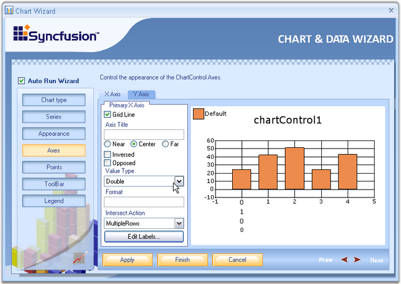
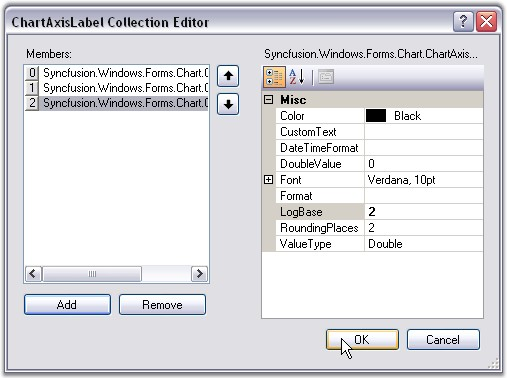

::: {style="DISPLAY: none"}
{#d2h_url_template}{#d2h_package_url style="WIDTH: 0px; DISPLAY: none; HEIGHT: 0px"}
:::

::::: {#nsbanner .d2h_main_nsbanner style="BORDER-BOTTOM: #999999 1px solid; POSITION: relative; PADDING-BOTTOM: 0px; BACKGROUND-COLOR: transparent; PADDING-LEFT: 0px; PADDING-RIGHT: 0px; DISPLAY: none; BORDER-TOP: #999999 1px solid; PADDING-TOP: 0px; LEFT: 0px"}
:::: {#TitleRow .d2h_main_titlerow style="PADDING-BOTTOM: 4px; BACKGROUND-COLOR: transparent; PADDING-LEFT: 22px; WIDTH: 100%; PADDING-RIGHT: 10px; DISPLAY: none; PADDING-TOP: 4px"}
::: {#ienav .d2h_main_ienav style="DISPLAY: none"}
{#D2HPrevious .D2HPreviousEnabled}  {#D2HNext .D2HNextEnabled}
:::
::::
:::::

:::: {#nstext .d2h_main_nstext style="PADDING-BOTTOM: 10px; BACKGROUND-COLOR: transparent; PADDING-LEFT: 22px; PADDING-RIGHT: 10px; HEIGHT: 100%; OVERFLOW: auto; PADDING-TOP: 5px" hasuserbackground="true" valign="bottom"}
::: {#d2h_breadcrumbs .d2h_breadcrumbs}
[Essential Studio User Guide Documentation](ms-xhelp:///?Id=12457748-09e3-4d74-a240-8e049cedf030){.d2h_breadcrumbsNormal}[ \> ]{.d2h_breadcrumbsLinkSeparator}[User Interface Edition](ms-xhelp:///?Id=c29296b7-531c-413b-a0ec-488ca1f7f669){.d2h_breadcrumbsNormal}[ \> ]{.d2h_breadcrumbsLinkSeparator}[Essential Windows](ms-xhelp:///?Id=e60759d8-47a4-4570-9d7a-16a68d63f2ea){.d2h_breadcrumbsNormal}[ \> ]{.d2h_breadcrumbsLinkSeparator}[Essential Chart]{.d2h_breadcrumbsContentsOnly}[ \> ]{.d2h_breadcrumbsLinkSeparator}[Concepts and Features](ms-xhelp:///?Id=71321e9c-336c-4c1c-a127-be9f135ad4bb){.d2h_breadcrumbsNormal}[ \> ]{.d2h_breadcrumbsLinkSeparator}[Chart Wizard](ms-xhelp:///?Id=75ed87e0-40c7-4e39-8fb1-d0da77b99911){.d2h_breadcrumbsNormal}
:::

### Axes {#axes style="tab-stops: 0pt"}

 

Various settings like grid line, axis title, value type, formats and other axes settings can be done using the wizard.

 

The below properties can be set separately for x-axis and y-axis.

 

[·      ]{style="FONT-FAMILY: Symbol"}**Grid Lines -** Lets you show/hide the grid lines for this axis.

 

[·      ]{style="FONT-FAMILY: Symbol"}**Axis Title -** The title text for the axis can be specified here.

 

[·      ]{style="FONT-FAMILY: Symbol"}**Inversed, Opposed** - Specifies whether the axes are inversed, opposed.

 

[·      ]{style="FONT-FAMILY: Symbol"}**Value Type -** If you know the type of data points you will be adding to this axis, specify it using the combo box. Possible value types are **double**, **datetime**, **custom** and **logarithmic**.

 

[·      ]{style="FONT-FAMILY: Symbol"}**Format** - Specifies the label format.

 

[·      ]{style="FONT-FAMILY: Symbol"}**Edit Labels -** The labels at the axes can be varied by entering the values in the**[ ]{style="COLOR: black"}Collection Editor** Dialog box, which popsup when the**[ ]{style="COLOR: black"}Edit[ ]{style="COLOR: black; FONT-SIZE: 12pt"}Labels** button is clicked.

 

{border="0"}

 

Figure 16: Axes button selected in Chart Wizard

 

[·      ]{style="FONT-FAMILY: Symbol"}**Collection Editor Dialog -** Click the **Add** button to add a label to the collection. Select the added label to view its properties on its right side. The color of the label, font, value type and so on can be changed using the properties window. If any label needs to be removed from the collection editor, select the label and click the **Remove** button. After adding all the values to the collection and making the necessary changes in the properties, click **OK**. In a similar way the labels can be edited for y-axis also.

 

{border="0"}

**** 

Figure 17: ChartAxisLabel Collection Editor**[]{style="FONT-STYLE: normal"}**

 

See Also

 

[Chart Axes]{.UGHyperlink}[]{.UGHyperlink}

 

[]{#p17} 

 

[]{#related-topics}
::::
