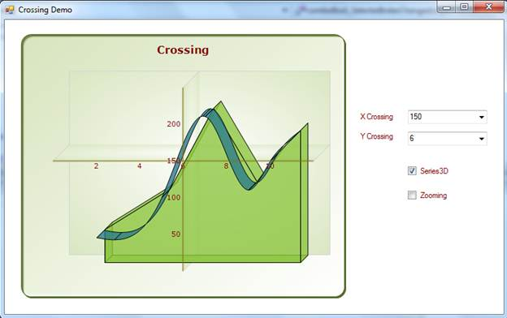

::: {style="DISPLAY: none"}
{#d2h_url_template}{#d2h_package_url style="WIDTH: 0px; DISPLAY: none; HEIGHT: 0px"}
:::

::::: {#nsbanner .d2h_main_nsbanner style="BORDER-BOTTOM: #999999 1px solid; POSITION: relative; PADDING-BOTTOM: 0px; BACKGROUND-COLOR: transparent; PADDING-LEFT: 0px; PADDING-RIGHT: 0px; DISPLAY: none; BORDER-TOP: #999999 1px solid; PADDING-TOP: 0px; LEFT: 0px"}
:::: {#TitleRow .d2h_main_titlerow style="PADDING-BOTTOM: 4px; BACKGROUND-COLOR: transparent; PADDING-LEFT: 22px; WIDTH: 100%; PADDING-RIGHT: 10px; DISPLAY: none; PADDING-TOP: 4px"}
::: {#ienav .d2h_main_ienav style="DISPLAY: none"}
{#D2HPrevious .D2HPreviousEnabled}  {#D2HNext .D2HNextEnabled}
:::
::::
:::::

::::: {#nstext .d2h_main_nstext style="PADDING-BOTTOM: 10px; BACKGROUND-COLOR: transparent; PADDING-LEFT: 22px; PADDING-RIGHT: 10px; HEIGHT: 100%; OVERFLOW: auto; PADDING-TOP: 5px" hasuserbackground="true" valign="bottom"}
::: {#d2h_breadcrumbs .d2h_breadcrumbs}
[Essential Studio User Guide Documentation](ms-xhelp:///?Id=12457748-09e3-4d74-a240-8e049cedf030){.d2h_breadcrumbsNormal}[ \> ]{.d2h_breadcrumbsLinkSeparator}[User Interface Edition](ms-xhelp:///?Id=c29296b7-531c-413b-a0ec-488ca1f7f669){.d2h_breadcrumbsNormal}[ \> ]{.d2h_breadcrumbsLinkSeparator}[Essential Windows](ms-xhelp:///?Id=e60759d8-47a4-4570-9d7a-16a68d63f2ea){.d2h_breadcrumbsNormal}[ \> ]{.d2h_breadcrumbsLinkSeparator}[Essential Chart]{.d2h_breadcrumbsContentsOnly}[ \> ]{.d2h_breadcrumbsLinkSeparator}[Concepts and Features](ms-xhelp:///?Id=71321e9c-336c-4c1c-a127-be9f135ad4bb){.d2h_breadcrumbsNormal}[ \> ]{.d2h_breadcrumbsLinkSeparator}[Chart Axes](ms-xhelp:///?Id=e0d0de4a-3c3c-41cd-9d94-6496172cab48){.d2h_breadcrumbsNormal}
:::

### Axis Crossing Support {#axis-crossing-support style="tab-stops: 0pt"}

           

Essential Chart for Windows allows the X and Y axis to intersect at a desired point. The X and Y axis will intersect at a point based on the value specified in the *X axis Crossing* property and the *Y axis Crossing* property respectively.

 

Use Case Scenarios

This feature will be useful to customize the location of primary axes from default location, when you want to add huge number of negative and positive points in the chart.

 

Properties

Table 2: Property Table

::: {align="center"}
  ---------- ------------------------------------------------------------------------------------------ ------------- ----------- -----------------
  Property   Description                                                                                Type          Data Type   Reference links
  Crossing   Specifies the point of intersect for X and Y axis based on the given data point value.     Server side   Double      NA
  ---------- ------------------------------------------------------------------------------------------ ------------- ----------- -----------------
:::

[]{style="FONT-FAMILY: 'Calibri','sans-serif'; COLOR: black"} 

Sample Link

To view a sample:

1.   Open the **Syncfusion Dashboard**.

2.   Click the Windows Forms drop-down list and select **Run Locally Installed Samples**.

3.   Navigate to **Chart samples** **[à]{style="FONT-FAMILY: Wingdings"}Chart Axes** **[à]{style="FONT-FAMILY: Wingdings"}Axis Crossing**.

 

Enable crossing X and Y axis

To enable crossing X and Y axis, specify the Y axis data point value, where you want the X axis to cross, in the X axis *Crossing* property.  Similarly specify the X axis data point value, where you want the Y axis to cross, in the Y axis *Crossing* property. The following code illustrates this:

 

 

+-----------------------------------------------------------------------------------------------------------------------------------------------------+
| [ ]{style="FONT-FAMILY: 'Times New Roman','serif'"}**[\[C#\]]{style="FONT-FAMILY: 'Courier New'"}**                                                 |
|                                                                                                                                                     |
| **[]{style="FONT-FAMILY: 'Courier New'"}**                                                                                                          |
|                                                                                                                                                     |
| [this]{style="FONT-FAMILY: 'Courier New'; COLOR: blue"}[.chartControl1.PrimaryXAxis.Crossing=150;]{style="FONT-FAMILY: 'Courier New'"}              |
|                                                                                                                                                     |
| []{style="FONT-FAMILY: 'Courier New'"}                                                                                                              |
|                                                                                                                                                     |
| [this]{style="FONT-FAMILY: 'Courier New'; COLOR: blue"}[.chartControl1.PrimaryYAxis.Crossing = 6;]{style="FONT-FAMILY: 'Courier New'"}              |
|                                                                                                                                                     |
| []{style="FONT-FAMILY: 'Courier New'"}                                                                                                              |
|                                                                                                                                                     |
| [this]{style="FONT-FAMILY: 'Courier New'; COLOR: blue"}[.chartControl1.Series3D = [true]{style="COLOR: blue"};]{style="FONT-FAMILY: 'Courier New'"} |
+-----------------------------------------------------------------------------------------------------------------------------------------------------+

 

+--------------------------------------------------------------------------------------------------------------------------------------------------+
| [ ]{style="FONT-FAMILY: 'Times New Roman','serif'"}**[\[VB\]]{style="FONT-FAMILY: 'Courier New'"}**                                              |
|                                                                                                                                                  |
| **[]{style="FONT-FAMILY: 'Courier New'"}**                                                                                                       |
|                                                                                                                                                  |
| [Me]{style="FONT-FAMILY: 'Courier New'; COLOR: blue"}[.chartControl1.PrimaryXAxis.Crossing = 150]{style="FONT-FAMILY: 'Courier New'"}            |
|                                                                                                                                                  |
| [Me]{style="FONT-FAMILY: 'Courier New'; COLOR: blue"}[.chartControl1.PrimaryYAxis.Crossing = 6]{style="FONT-FAMILY: 'Courier New'"}              |
|                                                                                                                                                  |
| [Me]{style="FONT-FAMILY: 'Courier New'; COLOR: blue"}[.chartControl1.Series3D = [True]{style="COLOR: blue"}]{style="FONT-FAMILY: 'Courier New'"} |
+--------------------------------------------------------------------------------------------------------------------------------------------------+

 

{border="0"}

Figure 277: Primary axes location customized

 

**[]{style="FONT-STYLE: normal"}** 

[]{#related-topics}
:::::
