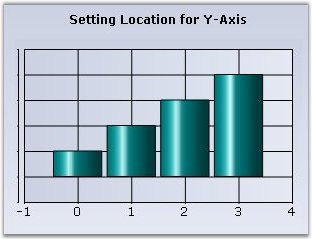
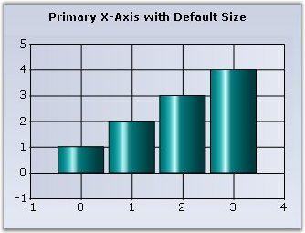

::: {style="DISPLAY: none"}
{#d2h_url_template}{#d2h_package_url style="WIDTH: 0px; DISPLAY: none; HEIGHT: 0px"}
:::

::::: {#nsbanner .d2h_main_nsbanner style="BORDER-BOTTOM: #999999 1px solid; POSITION: relative; PADDING-BOTTOM: 0px; BACKGROUND-COLOR: transparent; PADDING-LEFT: 0px; PADDING-RIGHT: 0px; DISPLAY: none; BORDER-TOP: #999999 1px solid; PADDING-TOP: 0px; LEFT: 0px"}
:::: {#TitleRow .d2h_main_titlerow style="PADDING-BOTTOM: 4px; BACKGROUND-COLOR: transparent; PADDING-LEFT: 22px; WIDTH: 100%; PADDING-RIGHT: 10px; DISPLAY: none; PADDING-TOP: 4px"}
::: {#ienav .d2h_main_ienav style="DISPLAY: none"}
{#D2HPrevious .D2HPreviousEnabled}  {#D2HNext .D2HNextEnabled}
:::
::::
:::::

::::: {#nstext .d2h_main_nstext style="PADDING-BOTTOM: 10px; BACKGROUND-COLOR: transparent; PADDING-LEFT: 22px; PADDING-RIGHT: 10px; HEIGHT: 100%; OVERFLOW: auto; PADDING-TOP: 5px" hasuserbackground="true" valign="bottom"}
::: {#d2h_breadcrumbs .d2h_breadcrumbs}
[Essential Studio User Guide Documentation](ms-xhelp:///?Id=12457748-09e3-4d74-a240-8e049cedf030){.d2h_breadcrumbsNormal}[ \> ]{.d2h_breadcrumbsLinkSeparator}[User Interface Edition](ms-xhelp:///?Id=c29296b7-531c-413b-a0ec-488ca1f7f669){.d2h_breadcrumbsNormal}[ \> ]{.d2h_breadcrumbsLinkSeparator}[Essential ASP.NET](ms-xhelp:///?Id=25c35330-c127-4dad-9a92-ed79dc7261a6){.d2h_breadcrumbsNormal}[ \> ]{.d2h_breadcrumbsLinkSeparator}[Essential Chart]{.d2h_breadcrumbsContentsOnly}[ \> ]{.d2h_breadcrumbsLinkSeparator}[Concepts and Features](ms-xhelp:///?Id=100687ce-82f2-4424-9d16-0949ea76cf15){.d2h_breadcrumbsNormal}[ \> ]{.d2h_breadcrumbsLinkSeparator}[Chart Axes](ms-xhelp:///?Id=7a90cdaa-49ed-4b7e-abc1-5a0281835094){.d2h_breadcrumbsNormal}
:::

### Axis Dimensions {#axis-dimensions style="tab-stops: 0pt"}

**[]{style="FONT-FAMILY: 'Trebuchet MS','sans-serif'; FONT-SIZE: 9pt"}** 

The axis\' starting point, length and the whole rectangle (comprising the axis and it\'s labels) can be customized using the following properties.

[]{style="FONT-FAMILY: 'Trebuchet MS','sans-serif'; FONT-SIZE: 9pt"} 

::: {align="center"}
+-----------------------------------+---------------------------------------------------------------------------------------------------------------------------------------------------------------------------------------------------------------------------------------------------------------------------------------------------------+
|                                   |                                                                                                                                                                                                                                                                                                         |
|                                   |                                                                                                                                                                                                                                                                                                         |
| ChartAxis Properties              | Description                                                                                                                                                                                                                                                                                             |
+-----------------------------------+---------------------------------------------------------------------------------------------------------------------------------------------------------------------------------------------------------------------------------------------------------------------------------------------------------+
| Location                          | Specifies the starting location of the axis. **LocationType** property should be equal to **Set** to set the Location property.                                                                                                                                                                         |
+-----------------------------------+---------------------------------------------------------------------------------------------------------------------------------------------------------------------------------------------------------------------------------------------------------------------------------------------------------+
| LocationType                      | **Set -** To be able to use the above Location property.                                                                                                                                                                                                                                                |
|                                   |                                                                                                                                                                                                                                                                                                         |
|                                   | **Auto** - Axis position will be automatically calculated to prevent overlap with the labels. (Default value)                                                                                                                                                                                           |
|                                   |                                                                                                                                                                                                                                                                                                         |
|                                   | **AntiLabelCut** - Axis thickness is calculated and the corresponding axis will be placed automatically, to prevent cutting of the labels by the sides of the control. Doing this preserves one co-ordinate of the axis location (X coordinate for horizontal axis and y coordinate for vertical axis). |
+-----------------------------------+---------------------------------------------------------------------------------------------------------------------------------------------------------------------------------------------------------------------------------------------------------------------------------------------------------+
| AutoSize                          | Specifies whether length of an axis is calculated automatically or specified via the Size property.                                                                                                                                                                                                     |
+-----------------------------------+---------------------------------------------------------------------------------------------------------------------------------------------------------------------------------------------------------------------------------------------------------------------------------------------------------+
| Size                              | Lets you specify the length of the axis. Uses the x value for x-axis and y-value for y-axis. Increasing or decreasing the default length will cause the intervals to expand or shrink correspondingly. The AutoSize should be set to **false** for this property to be used.                            |
+-----------------------------------+---------------------------------------------------------------------------------------------------------------------------------------------------------------------------------------------------------------------------------------------------------------------------------------------------------+
| Rect                              | Specifies the rectangle that includes the axis and it\'s labels. This provides great flexibility in letting you customize the position and size of the axes.                                                                                                                                            |
+-----------------------------------+---------------------------------------------------------------------------------------------------------------------------------------------------------------------------------------------------------------------------------------------------------------------------------------------------------+
:::

[]{style="FONT-FAMILY: 'Trebuchet MS','sans-serif'; FONT-SIZE: 9pt"} 

Illustrating Custom Axis Location

[]{style="FONT-FAMILY: 'Trebuchet MS','sans-serif'; FONT-SIZE: 9pt"} 

{border="0"}

**[]{style="FONT-FAMILY: 'Trebuchet MS','sans-serif'; FONT-SIZE: 9pt"}** 

Figure 248: Chart Axis with Location Properties Set

**[]{style="FONT-FAMILY: 'Trebuchet MS','sans-serif'; FONT-SIZE: 9pt"}** 

+-----------------------------------------------------------------------------------------------------------------------------------------------------------------------------------------------------------------------------+
| **[\[C#\]]{style="FONT-FAMILY: 'Courier New'; COLOR: black"}**                                                                                                                                                              |
|                                                                                                                                                                                                                             |
| []{style="FONT-FAMILY: 'Courier New'; COLOR: green"}                                                                                                                                                                        |
|                                                                                                                                                                                                                             |
| [this]{style="FONT-FAMILY: 'Courier New'; COLOR: blue"}[.ChartWebControl1.PrimaryYAxis.LocationType = Syncfusion.Windows.Forms.Chart.[ChartAxisLocationType]{style="COLOR: teal"}.Set;]{style="FONT-FAMILY: 'Courier New'"} |
|                                                                                                                                                                                                                             |
| [this]{style="FONT-FAMILY: 'Courier New'; COLOR: blue"}[.ChartWebControl1.PrimaryYAxis.Location = [new]{style="COLOR: blue"} [PointF]{style="COLOR: teal"}(15, 200);]{style="FONT-FAMILY: 'Courier New'"}                   |
+-----------------------------------------------------------------------------------------------------------------------------------------------------------------------------------------------------------------------------+

[]{style="FONT-FAMILY: 'Trebuchet MS','sans-serif'; FONT-SIZE: 9pt"} 

+---------------------------------------------------------------------------------------------------------------------------------------------------------------------------------------------------+
| **[\[VB\]]{style="FONT-FAMILY: 'Courier New'; COLOR: black"}**                                                                                                                                    |
|                                                                                                                                                                                                   |
| []{style="FONT-FAMILY: 'Courier New'; COLOR: green"}                                                                                                                                              |
|                                                                                                                                                                                                   |
| [Me]{style="FONT-FAMILY: 'Courier New'; COLOR: blue"}[.ChartWebControl1.PrimaryYAxis.LocationType = Syncfusion.Windows.Forms.Chart.ChartAxisLocationType.Set]{style="FONT-FAMILY: 'Courier New'"} |
|                                                                                                                                                                                                   |
| [Me]{style="FONT-FAMILY: 'Courier New'; COLOR: blue"}[.ChartWebControl1.PrimaryYAxis.Location = [New]{style="COLOR: blue"} PointF(15, 200)]{style="FONT-FAMILY: 'Courier New'"}                   |
+---------------------------------------------------------------------------------------------------------------------------------------------------------------------------------------------------+

[]{style="FONT-FAMILY: 'Trebuchet MS','sans-serif'; FONT-SIZE: 9pt"} 

**[]{style="FONT-FAMILY: 'Trebuchet MS','sans-serif'"}** 

**[]{style="FONT-FAMILY: 'Trebuchet MS','sans-serif'"}** 

Illustrating Custom Axis Size

**[]{style="FONT-FAMILY: 'Trebuchet MS','sans-serif'"}** 

{border="0"}

**[]{style="FONT-FAMILY: 'Trebuchet MS','sans-serif'; FONT-SIZE: 9pt"}** 

Figure 249: Chart rendered in AutoSize Mode

**[]{style="FONT-FAMILY: 'Trebuchet MS','sans-serif'; FONT-SIZE: 9pt"}** 

{border="0"}

**[]{style="FONT-FAMILY: 'Trebuchet MS','sans-serif'; FONT-SIZE: 9pt"}** 

Figure 250: Chart rendered with a custom size for the Primary X-Axis

**[]{style="FONT-FAMILY: 'Trebuchet MS','sans-serif'; FONT-SIZE: 9pt"}** 

+----------------------------------------------------------------------------------------------------------------------------------------------------------------------------------------------------+
| **[\[C#\]]{style="FONT-FAMILY: 'Courier New'; COLOR: black"}**                                                                                                                                     |
|                                                                                                                                                                                                    |
| []{style="FONT-FAMILY: 'Courier New'; COLOR: green"}                                                                                                                                               |
|                                                                                                                                                                                                    |
| [this]{style="FONT-FAMILY: 'Courier New'; COLOR: blue"}[.ChartWebControl1.PrimaryXAxis.AutoSize = [false]{style="COLOR: blue"};]{style="FONT-FAMILY: 'Courier New'"}                               |
|                                                                                                                                                                                                    |
| [this]{style="FONT-FAMILY: 'Courier New'; COLOR: blue"}[.ChartWebControl1.PrimaryXAxis.Size = [new]{style="COLOR: blue"} [Size]{style="COLOR: teal"}(50, 20);]{style="FONT-FAMILY: 'Courier New'"} |
+----------------------------------------------------------------------------------------------------------------------------------------------------------------------------------------------------+

[]{style="FONT-FAMILY: 'Trebuchet MS','sans-serif'; FONT-SIZE: 9pt"} 

+--------------------------------------------------------------------------------------------------------------------------------------------------------------------------+
| **[\[VB\]]{style="FONT-FAMILY: 'Courier New'; COLOR: black"}**                                                                                                           |
|                                                                                                                                                                          |
| []{style="FONT-FAMILY: 'Courier New'; COLOR: green"}                                                                                                                     |
|                                                                                                                                                                          |
| [Me]{style="FONT-FAMILY: 'Courier New'; COLOR: blue"}[.ChartWebControl1.PrimaryXAxis.AutoSize = [False]{style="COLOR: blue"}]{style="FONT-FAMILY: 'Courier New'"}        |
|                                                                                                                                                                          |
| [Me]{style="FONT-FAMILY: 'Courier New'; COLOR: blue"}[.ChartWebControl1.PrimaryXAxis.Size = [New]{style="COLOR: blue"} Size(50, 20)]{style="FONT-FAMILY: 'Courier New'"} |
+--------------------------------------------------------------------------------------------------------------------------------------------------------------------------+

[]{#p182} 

[]{#related-topics}
:::::
