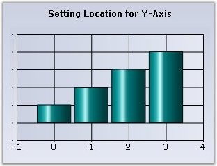
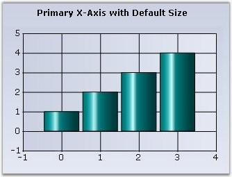
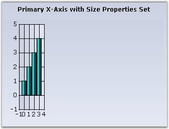

::: {style="DISPLAY: none"}
{#d2h_url_template}{#d2h_package_url style="WIDTH: 0px; DISPLAY: none; HEIGHT: 0px"}
:::

::::: {#nsbanner .d2h_main_nsbanner style="BORDER-BOTTOM: #999999 1px solid; POSITION: relative; PADDING-BOTTOM: 0px; BACKGROUND-COLOR: transparent; PADDING-LEFT: 0px; PADDING-RIGHT: 0px; DISPLAY: none; BORDER-TOP: #999999 1px solid; PADDING-TOP: 0px; LEFT: 0px"}
:::: {#TitleRow .d2h_main_titlerow style="PADDING-BOTTOM: 4px; BACKGROUND-COLOR: transparent; PADDING-LEFT: 22px; WIDTH: 100%; PADDING-RIGHT: 10px; DISPLAY: none; PADDING-TOP: 4px"}
::: {#ienav .d2h_main_ienav style="DISPLAY: none"}
{#D2HPrevious .D2HPreviousEnabled}  {#D2HNext .D2HNextEnabled}
:::
::::
:::::

::::: {#nstext .d2h_main_nstext style="PADDING-BOTTOM: 10px; BACKGROUND-COLOR: transparent; PADDING-LEFT: 22px; PADDING-RIGHT: 10px; HEIGHT: 100%; OVERFLOW: auto; PADDING-TOP: 5px" hasuserbackground="true" valign="bottom"}
::: {#d2h_breadcrumbs .d2h_breadcrumbs}
[Essential Studio User Guide Documentation](ms-xhelp:///?Id=12457748-09e3-4d74-a240-8e049cedf030){.d2h_breadcrumbsNormal}[ \> ]{.d2h_breadcrumbsLinkSeparator}[User Interface Edition](ms-xhelp:///?Id=c29296b7-531c-413b-a0ec-488ca1f7f669){.d2h_breadcrumbsNormal}[ \> ]{.d2h_breadcrumbsLinkSeparator}[Essential Windows](ms-xhelp:///?Id=e60759d8-47a4-4570-9d7a-16a68d63f2ea){.d2h_breadcrumbsNormal}[ \> ]{.d2h_breadcrumbsLinkSeparator}[Essential Chart]{.d2h_breadcrumbsContentsOnly}[ \> ]{.d2h_breadcrumbsLinkSeparator}[Concepts and Features](ms-xhelp:///?Id=71321e9c-336c-4c1c-a127-be9f135ad4bb){.d2h_breadcrumbsNormal}[ \> ]{.d2h_breadcrumbsLinkSeparator}[Chart Axes](ms-xhelp:///?Id=e0d0de4a-3c3c-41cd-9d94-6496172cab48){.d2h_breadcrumbsNormal}
:::

### Axis Dimensions {#axis-dimensions style="tab-stops: 0pt"}

 

The axis\' starting point, length and the whole rectangle (comprising the axis and it\'s labels) can be customized using the following properties.

 

::: {align="center"}
+-----------------------------------+-----------------------------------------------------------------------------------------------------------------------------------------------------------------------------------------------------------------------------------------------------------------------------------------------------------------------------------------------+
| ChartAxis Property                | Description                                                                                                                                                                                                                                                                                                                                   |
+-----------------------------------+-----------------------------------------------------------------------------------------------------------------------------------------------------------------------------------------------------------------------------------------------------------------------------------------------------------------------------------------------+
| Location                          | Specifies the starting location of the axis. **LocationType** property should be equal to **Set** to set the Location property.                                                                                                                                                                                                               |
+-----------------------------------+-----------------------------------------------------------------------------------------------------------------------------------------------------------------------------------------------------------------------------------------------------------------------------------------------------------------------------------------------+
| LocationType                      | [·      ]{style="FONT-FAMILY: Symbol"}**Set -** To be able to use the above Location property.                                                                                                                                                                                                                                                |
|                                   |                                                                                                                                                                                                                                                                                                                                               |
|                                   | [·      ]{style="FONT-FAMILY: Symbol"}**Auto** - Axis position will be automatically calculated to prevent overlap with the labels. (Default value)                                                                                                                                                                                           |
|                                   |                                                                                                                                                                                                                                                                                                                                               |
|                                   | [·      ]{style="FONT-FAMILY: Symbol"}**AntiLabelCut** - Axis thickness is calculated and the corresponding axis will be placed automatically, to prevent cutting of the labels by the sides of the control. Doing this preserves one co-ordinate of the axis location (X coordinate for horizontal axis and y coordinate for vertical axis). |
+-----------------------------------+-----------------------------------------------------------------------------------------------------------------------------------------------------------------------------------------------------------------------------------------------------------------------------------------------------------------------------------------------+
| AutoSize                          | Specifies whether length of an axis is calculated automatically or specified via the Size property.                                                                                                                                                                                                                                           |
+-----------------------------------+-----------------------------------------------------------------------------------------------------------------------------------------------------------------------------------------------------------------------------------------------------------------------------------------------------------------------------------------------+
| Size                              | Lets you specify the length of the axis. Uses the x value for x-axis and y-value for y-axis. Increasing or decreasing the default length will cause the intervals to expand or shrink correspondingly. The AutoSize should be set to **false** for this property to be used.                                                                  |
+-----------------------------------+-----------------------------------------------------------------------------------------------------------------------------------------------------------------------------------------------------------------------------------------------------------------------------------------------------------------------------------------------+
| Rect                              | Specifies the rectangle that includes the axis and it\'s labels. This provides great flexibility in letting you customize the position and size of the axes.                                                                                                                                                                                  |
+-----------------------------------+-----------------------------------------------------------------------------------------------------------------------------------------------------------------------------------------------------------------------------------------------------------------------------------------------------------------------------------------------+
:::

 

Illustrating Custom Axis Location

 

{border="0"}

 

Figure 254: Chart Axis with Location Properties Set

 

+--------------------------------------------------------------------------------------------------------------------------------------------------------------------------------------------------------------------------+
| **[\[C#\]]{style="FONT-FAMILY: 'Courier New'; COLOR: black"}**                                                                                                                                                           |
|                                                                                                                                                                                                                          |
| []{style="FONT-FAMILY: 'Courier New'; COLOR: green"}                                                                                                                                                                     |
|                                                                                                                                                                                                                          |
| [this]{style="FONT-FAMILY: 'Courier New'; COLOR: blue"}[.chartControl1.PrimaryYAxis.LocationType = Syncfusion.Windows.Forms.Chart.[ChartAxisLocationType]{style="COLOR: teal"}.Set;]{style="FONT-FAMILY: 'Courier New'"} |
|                                                                                                                                                                                                                          |
| [this]{style="FONT-FAMILY: 'Courier New'; COLOR: blue"}[.chartControl1.PrimaryYAxis.Location = [new]{style="COLOR: blue"} [PointF]{style="COLOR: teal"}(15, 200);]{style="FONT-FAMILY: 'Courier New'"}                   |
+--------------------------------------------------------------------------------------------------------------------------------------------------------------------------------------------------------------------------+

 

+------------------------------------------------------------------------------------------------------------------------------------------------------------------------------------------------+
| **[\[VB\]]{style="FONT-FAMILY: 'Courier New'; COLOR: black"}**                                                                                                                                 |
|                                                                                                                                                                                                |
| []{style="FONT-FAMILY: 'Courier New'; COLOR: green"}                                                                                                                                           |
|                                                                                                                                                                                                |
| [Me]{style="FONT-FAMILY: 'Courier New'; COLOR: blue"}[.ChartControl1.PrimaryYAxis.LocationType = Syncfusion.Windows.Forms.Chart.ChartAxisLocationType.Set]{style="FONT-FAMILY: 'Courier New'"} |
|                                                                                                                                                                                                |
| [Me]{style="FONT-FAMILY: 'Courier New'; COLOR: blue"}[.ChartControl1.PrimaryYAxis.Location = [New]{style="COLOR: blue"} PointF(15, 200)]{style="FONT-FAMILY: 'Courier New'"}                   |
+------------------------------------------------------------------------------------------------------------------------------------------------------------------------------------------------+

 

Illustrating Custom Axis Size

 

{border="0"}

 

Figure 255: Chart rendered in AutoSize Mode

 

{border="0"}

 

Figure 256: **[Chart rendered with a custom size for the Primary X-Axis]{style="FONT-STYLE: normal"}**

 

+-------------------------------------------------------------------------------------------------------------------------------------------------------------------------------------------------+
| **[\[C#\]]{style="FONT-FAMILY: 'Courier New'; COLOR: black"}**                                                                                                                                  |
|                                                                                                                                                                                                 |
| []{style="FONT-FAMILY: 'Courier New'; COLOR: green"}                                                                                                                                            |
|                                                                                                                                                                                                 |
| [this]{style="FONT-FAMILY: 'Courier New'; COLOR: blue"}[.chartControl1.PrimaryXAxis.AutoSize = [false]{style="COLOR: blue"};]{style="FONT-FAMILY: 'Courier New'"}                               |
|                                                                                                                                                                                                 |
| [this]{style="FONT-FAMILY: 'Courier New'; COLOR: blue"}[.chartControl1.PrimaryXAxis.Size = [new]{style="COLOR: blue"} [Size]{style="COLOR: teal"}(50, 20);]{style="FONT-FAMILY: 'Courier New'"} |
+-------------------------------------------------------------------------------------------------------------------------------------------------------------------------------------------------+

 

+-----------------------------------------------------------------------------------------------------------------------------------------------------------------------+
| **[\[VB\]]{style="FONT-FAMILY: 'Courier New'; COLOR: black"}**                                                                                                        |
|                                                                                                                                                                       |
| []{style="FONT-FAMILY: 'Courier New'; COLOR: green"}                                                                                                                  |
|                                                                                                                                                                       |
| [Me]{style="FONT-FAMILY: 'Courier New'; COLOR: blue"}[.ChartControl1.PrimaryXAxis.AutoSize = [False]{style="COLOR: blue"}]{style="FONT-FAMILY: 'Courier New'"}        |
|                                                                                                                                                                       |
| [Me]{style="FONT-FAMILY: 'Courier New'; COLOR: blue"}[.ChartControl1.PrimaryXAxis.Size = [New]{style="COLOR: blue"} Size(50, 20)]{style="FONT-FAMILY: 'Courier New'"} |
+-----------------------------------------------------------------------------------------------------------------------------------------------------------------------+

[]{#p180} 

[]{#related-topics}
:::::
