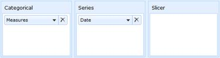
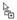
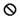
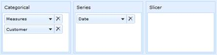
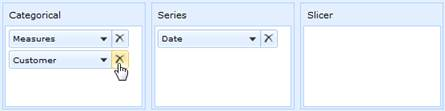
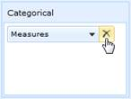
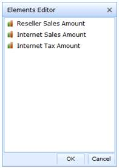
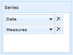
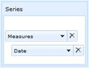

::: {style="DISPLAY: none"}
{#d2h_url_template}{#d2h_package_url style="WIDTH: 0px; DISPLAY: none; HEIGHT: 0px"}
:::

::::: {#nsbanner .d2h_main_nsbanner style="BORDER-BOTTOM: #999999 1px solid; POSITION: relative; PADDING-BOTTOM: 0px; BACKGROUND-COLOR: transparent; PADDING-LEFT: 0px; PADDING-RIGHT: 0px; DISPLAY: none; BORDER-TOP: #999999 1px solid; PADDING-TOP: 0px; LEFT: 0px"}
:::: {#TitleRow .d2h_main_titlerow style="PADDING-BOTTOM: 4px; BACKGROUND-COLOR: transparent; PADDING-LEFT: 22px; WIDTH: 100%; PADDING-RIGHT: 10px; DISPLAY: none; PADDING-TOP: 4px"}
::: {#ienav .d2h_main_ienav style="DISPLAY: none"}
{#D2HPrevious .D2HPreviousEnabled}  {#D2HNext .D2HNextEnabled}
:::
::::
:::::

::::: {#nstext .d2h_main_nstext style="PADDING-BOTTOM: 10px; BACKGROUND-COLOR: transparent; PADDING-LEFT: 22px; PADDING-RIGHT: 10px; HEIGHT: 100%; OVERFLOW: auto; PADDING-TOP: 5px" hasuserbackground="true" valign="bottom"}
::: {#d2h_breadcrumbs .d2h_breadcrumbs}
[Essential Studio User Guide Documentation](ms-xhelp:///?Id=12457748-09e3-4d74-a240-8e049cedf030){.d2h_breadcrumbsNormal}[ \> ]{.d2h_breadcrumbsLinkSeparator}[Business Intelligence Edition](ms-xhelp:///?Id=fdf33dd8-62b2-47b9-ad7b-fc50e590bca5){.d2h_breadcrumbsNormal}[ \> ]{.d2h_breadcrumbsLinkSeparator}[Essential BI ASP.NET](ms-xhelp:///?Id=99c6694e-59c3-4c59-abb5-ce9ce9a948bc){.d2h_breadcrumbsNormal}[ \> ]{.d2h_breadcrumbsLinkSeparator}[Essential BI Client]{.d2h_breadcrumbsContentsOnly}[ \> ]{.d2h_breadcrumbsLinkSeparator}[Getting Started](ms-xhelp:///?Id=d67227c0-bba2-4943-acc1-d5c64f70f90b){.d2h_breadcrumbsNormal}[ \> ]{.d2h_breadcrumbsLinkSeparator}[Appearance and Structure of the control](ms-xhelp:///?Id=5eefc693-d23d-481b-92b8-6a7d9ff5439b){.d2h_breadcrumbsNormal}
:::

### Axis Element Builder {#axis-element-builder style="tab-stops: 0pt"}

 

Definition

As the name depicts, this component allows building the element in the respective axis, in OLAP Client. We support three axis namely categorical, series and slicer. Based on the elements constructed, chart and grid will display the resultant data.

[]{#_Slice_and_dice} 

Slice and dice

When you are cutting the data with one member it's called **slicing**. When you cut your data with sets of members from two or more dimensions, it's called **dicing**. A systematic reduction in the body of data into smaller parts or views would yield more information.

 

For example,

***Slice:*** You can use a dimension for slicing when it isn't being displayed on the columns or rows. You can slice on any member from any level of the dimension. If you slice on the member January in the Month level of the Time dimension, you will only see data from January.

***Dice:*** You can put more than one dimension on the rows or on the columns. You will see one row for every combination of the members from each of the dimensions. If you put the children of Quarter 1 from the Time dimension and the members of the Product Family level of the Product dimension on the rows, you would have nine rows, as follows:

[·      ]{style="FONT-FAMILY: Symbol"}January Food

[·      ]{style="FONT-FAMILY: Symbol"}January Drink

[·      ]{style="FONT-FAMILY: Symbol"}January Non-Consumable

[·      ]{style="FONT-FAMILY: Symbol"}February Food

[·      ]{style="FONT-FAMILY: Symbol"}February Drink

[·      ]{style="FONT-FAMILY: Symbol"}February Non-Consumable

[·      ]{style="FONT-FAMILY: Symbol"}March Food

[·      ]{style="FONT-FAMILY: Symbol"}March Drink

[·      ]{style="FONT-FAMILY: Symbol"}March Non-Consumable

 

[]{#_Different_types_of}Different types of axis available in axis element builder

 

There are three different types of axis available in axis element builder namely:

 

[·      ]{style="FONT-FAMILY: Symbol"}Categorical

[·      ]{style="FONT-FAMILY: Symbol"}Series

[·      ]{style="FONT-FAMILY: Symbol"}Slicer

 

**Categorical:** The categorical axis defines one or more dimensions that are displayed along the chart\'s x-axis as labels and in the columns of grid. If more than one dimension is on the categorical axis, the Chart/Grid will stack each dimension. The order in which the dimensions are stacked on the Chart/Grid is based on the order that appears on the categorical axis.

**Series:** The series axis defines one or more dimensions that are displayed as a series. If more than one dimension is present on the series axis, each data point will be defined by an unique combination of the member of the dimensions.

**Slicer:** The slicer axis is used as a filter to narrow the focus of the multidimensional data displayed in the Chart/Grid. The slicer axis lets you analyze any member of a dimension in-depth. In order for the slicer to display the member\'s data, that member must not be present on both the categorical and series axes.

 

{border="0"}

 

Figure 17: Axis Element Builder

Slicer Axis and Slicing Elements

The slicer axis is used as a filter to narrow the focus of the multidimensional data displayed in the Chart/Grid. The slicer axis lets you analyze any member of a dimension in-depth. In order for the slicer to display the member\'s data, that member must not be present on both the categorical and series axes.

            The elements can be sliced by simply expanding the node and check/uncheck them. The resultant set would be automatically reflected in the chart and grid control.

 

Draggable and Droppable Elements in Axis Element Builder

[·      ]{style="FONT-FAMILY: Symbol"}Measure Element

[·      ]{style="FONT-FAMILY: Symbol"}Dimension Element

[·      ]{style="FONT-FAMILY: Symbol"}Hierarchy Element

[·      ]{style="FONT-FAMILY: Symbol"}Level Element and

[·      ]{style="FONT-FAMILY: Symbol"}Named Set Element, are allowed to drag and drop

 

Table 11: Draggable and droppable mode -- Symbolic representation

 

::: {align="center"}
+-------------------------------------------+-----------------------+---------------------------------------------------------------------------------------------------------------------------------------------------------------------------------------------------------------+
|                                           |                       | This symbol would state that the corresponding element is allowed to drag/drop. This happens when the element is placed properly inside the categorical, series or slicer panel in axis element builder.      |
|                                           |                       |                                                                                                                                                                                                               |
| {border="0"} |  Allowed              |                                                                                                                                                                                                               |
+-------------------------------------------+-----------------------+---------------------------------------------------------------------------------------------------------------------------------------------------------------------------------------------------------------+
|                                           |                       | The symbol would obviously state that the corresponding element is not allowed to drag/drop. This happens when the element is placed outside the categorical, series or slicer panel in axis element builder. |
|                                           |                       |                                                                                                                                                                                                               |
| {border="0"} | Not Allowed           |                                                                                                                                                                                                               |
+-------------------------------------------+-----------------------+---------------------------------------------------------------------------------------------------------------------------------------------------------------------------------------------------------------+
:::

The above mentioned symbols are used to identify whether drag/drop is possible or not.

 

Adding Elements to []{#OLE_LINK4}[an Axis Element Builder]{#OLE_LINK3}

The element from cube dimension browser can be dragged and dropped in the Axis Element Builder using drag-and-drop operation.

{border="0"}

 

Figure 18: Adding an element in Axis Element Builder

 

Removing Elements from an Axis Element Builder

In order to remove the element, click the close symbol available in the split button.

{border="0"}

 

Figure 19: Removing an element in Axis Element Builder

 

Adding measure elements to an Axis Element Builder

On drag-and-drop, the measure from the cube dimension browser to the axis element builder is added in the elements editor.

 

Removing measure collection from an Axis Element Builder

In order to remove the measure collection, click the close symbol available in the split button.

 

{border="0"}

 

Figure 20: Removing the measure collection in Axis Element Builder

 

Adding multiple measure in an Axis Element Builder

The multiple measures can be added by just dragging and dropping the respective measure into the corresponding axis. The multiple measures are stacked in elements editor one below the other as they are dropped.

{border="0"}

 

Figure 21: Stacking the multiple measures in elements editor

 

Re-arranging elements in an Axis Element Builder?

Re-arranging can be done by dragging an element one below the other.

{border="0"}

 

{border="0"}

 

Figure 22: Re-arranging an element in Axis Element Builder

[]{#related-topics}
:::::
