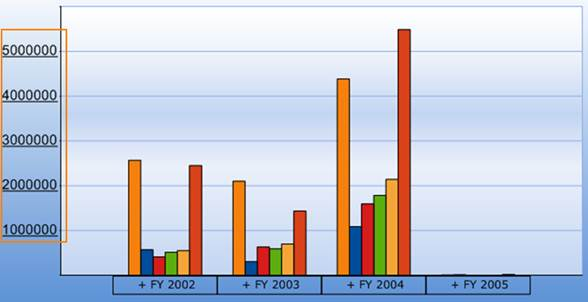

::: {style="DISPLAY: none"}
{#d2h_url_template}{#d2h_package_url style="WIDTH: 0px; DISPLAY: none; HEIGHT: 0px"}
:::

::: {.d2h_secondary_topic style="PADDING-BOTTOM: 10pt; MARGIN: 0pt; PADDING-LEFT: 0pt; PADDING-RIGHT: 0pt; PADDING-TOP: 0pt"}
#### Axis Label Customization {#axis-label-customization style="tab-stops: 0pt"}

 

The font family, font size and font style of the axis label can be set using the Font property along the respective axis. In case of column type chart, the axis label customization is carried along Y-axis whereas in case of bar type chart, the axis label customization is carried along X-axis.

 

+---------------------------------------------------------------------------------------------------------------------------------------------------------------------------------------------------------------------------------------------------------------------------------+
| **[\[C#\]]{style="FONT-FAMILY: 'Courier New'"}**                                                                                                                                                                                                                                |
|                                                                                                                                                                                                                                                                                 |
| []{style="FONT-FAMILY: 'Calibri','sans-serif'"}                                                                                                                                                                                                                                 |
|                                                                                                                                                                                                                                                                                 |
| [this]{style="FONT-FAMILY: 'Courier New'; COLOR: blue"}[.olapChart1.PrimaryYAxis.Font = [new]{style="COLOR: blue"} [Font]{style="COLOR: #2b91af"}([\"Arial\"]{style="COLOR: #a31515"}, 9f, [FontStyle]{style="COLOR: #2b91af"}.Underline);]{style="FONT-FAMILY: 'Courier New'"} |
+---------------------------------------------------------------------------------------------------------------------------------------------------------------------------------------------------------------------------------------------------------------------------------+

[]{style="FONT-FAMILY: 'Calibri','sans-serif'"} 

+----------------------------------------------------------------------------------------------------------------------------------------------------------------------------------------------------------------------------------------------------+
| **[\[VB\]]{style="FONT-FAMILY: 'Courier New'"}**                                                                                                                                                                                                   |
|                                                                                                                                                                                                                                                    |
| []{style="FONT-FAMILY: 'Calibri','sans-serif'"}                                                                                                                                                                                                    |
|                                                                                                                                                                                                                                                    |
| [Me]{style="FONT-FAMILY: 'Courier New'; COLOR: blue"}[.olapChart1.PrimaryYAxis.Font = [New]{style="COLOR: blue"} Font([\"Arial\"]{style="COLOR: #a31515"}, 9f, [FontStyle]{style="COLOR: #2b91af"}.Underline)]{style="FONT-FAMILY: 'Courier New'"} |
+----------------------------------------------------------------------------------------------------------------------------------------------------------------------------------------------------------------------------------------------------+

 

{border="0"}

 

Figure 10: Axis label customization

[]{#related-topics}
:::
