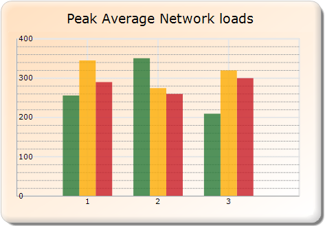

::: {style="DISPLAY: none"}
{#d2h_url_template}{#d2h_package_url style="WIDTH: 0px; DISPLAY: none; HEIGHT: 0px"}
:::

::::: {#nsbanner .d2h_main_nsbanner style="BORDER-BOTTOM: #999999 1px solid; POSITION: relative; PADDING-BOTTOM: 0px; BACKGROUND-COLOR: transparent; PADDING-LEFT: 0px; PADDING-RIGHT: 0px; DISPLAY: none; BORDER-TOP: #999999 1px solid; PADDING-TOP: 0px; LEFT: 0px"}
:::: {#TitleRow .d2h_main_titlerow style="PADDING-BOTTOM: 4px; BACKGROUND-COLOR: transparent; PADDING-LEFT: 22px; WIDTH: 100%; PADDING-RIGHT: 10px; DISPLAY: none; PADDING-TOP: 4px"}
::: {#ienav .d2h_main_ienav style="DISPLAY: none"}
{#D2HPrevious .D2HPreviousEnabled}  {#D2HNext .D2HNextEnabled}
:::
::::
:::::

::::: {#nstext .d2h_main_nstext style="PADDING-BOTTOM: 10px; BACKGROUND-COLOR: transparent; PADDING-LEFT: 22px; PADDING-RIGHT: 10px; HEIGHT: 100%; OVERFLOW: auto; PADDING-TOP: 5px" hasuserbackground="true" valign="bottom"}
::: {#d2h_breadcrumbs .d2h_breadcrumbs}
[Essential Studio User Guide Documentation](ms-xhelp:///?Id=12457748-09e3-4d74-a240-8e049cedf030){.d2h_breadcrumbsNormal}[ \> ]{.d2h_breadcrumbsLinkSeparator}[User Interface Edition](ms-xhelp:///?Id=c29296b7-531c-413b-a0ec-488ca1f7f669){.d2h_breadcrumbsNormal}[ \> ]{.d2h_breadcrumbsLinkSeparator}[Essential Windows](ms-xhelp:///?Id=e60759d8-47a4-4570-9d7a-16a68d63f2ea){.d2h_breadcrumbsNormal}[ \> ]{.d2h_breadcrumbsLinkSeparator}[Essential Chart]{.d2h_breadcrumbsContentsOnly}[ \> ]{.d2h_breadcrumbsLinkSeparator}[Concepts and Features](ms-xhelp:///?Id=71321e9c-336c-4c1c-a127-be9f135ad4bb){.d2h_breadcrumbsNormal}[ \> ]{.d2h_breadcrumbsLinkSeparator}[Chart Axes](ms-xhelp:///?Id=e0d0de4a-3c3c-41cd-9d94-6496172cab48){.d2h_breadcrumbsNormal}
:::

### Axis Label Placement {#axis-label-placement style="tab-stops: 0pt"}

This feature enables you to specify the position of the label for an axis. You can place the label either inside or outside the plotted chart area.

 

Use Case Scenarios

When you have lengthy label for **the** chart axis, it will occupy more space. So the plotted chart area will **get** reduced. You can avoid this using this feature.

[]{style="FONT-WEIGHT: normal"} 

Properties

Table 3: Property Table

::: {align="center"}
+--------------------+--------------------------------------------------------------------------------------+-------------+-------------+---------------------+
| Property           | Description                                                                          | Type        | Data Type   | **Reference links** |
+--------------------+--------------------------------------------------------------------------------------+-------------+-------------+---------------------+
| AxisLabelPlacement | Specifies the position of the label in a chart axes.                                 |     NA      |  NA         | NA                  |
|                    |                                                                                      |             |             |                     |
|                    | It can be placed inside or outside the plotted chart area using ChartPlacement enum. |             |             |                     |
+--------------------+--------------------------------------------------------------------------------------+-------------+-------------+---------------------+
:::

 

Sample Link

To view a sample:

1.   Open the **Syncfusion Dashboard**.

2.   Click the **User Interface \> Windows Forms**.

3.   Click **Run Samples**.

4.   Navigate to **Chart samples \> Chart Axes  \> ChartAxisCustomization**.

 

Positioning Axis Label

You can position the chart axis label using the *Axes.AxisLabelPlacement* property. You can specify whether it has to be placed inside or outside the plotted chart area using the *ChartPlacement* enum.

The following code illustrates how to place the chart axis label inside the plotted chart area:

 

+--------------------------------------------------------------------------------------------------------------------------------------------------------------------------------------------------------------------------------------+
| [ ]{style="FONT-FAMILY: 'Times New Roman','serif'; FONT-SIZE: 12pt"}**[\[C#\]]{style="FONT-FAMILY: 'Courier New'; FONT-SIZE: 9pt"}**                                                                                                 |
|                                                                                                                                                                                                                                      |
| [this]{style="FONT-FAMILY: 'Courier New'; COLOR: blue"}[.chartControl1.PrimaryXAxis.AxisLabelPlacement = [ChartPlacement]{style="COLOR: #2b91af"}.Inside;]{style="FONT-FAMILY: 'Courier New'"}[]{style="FONT-FAMILY: 'Courier New'"} |
+--------------------------------------------------------------------------------------------------------------------------------------------------------------------------------------------------------------------------------------+

 

+---------------------------------------------------------------------------------------------------------------------------------------------------------------------------------------------+
| [ ]{style="FONT-FAMILY: 'Times New Roman','serif'; FONT-SIZE: 12pt"}**[\[VB\]]{style="FONT-FAMILY: 'Courier New'; FONT-SIZE: 9pt"}**                                                        |
|                                                                                                                                                                                             |
| [Me]{style="FONT-FAMILY: 'Courier New'; COLOR: blue"}[.chartControl1.PrimaryXAxis.AxisLabelPlacement = [ChartPlacement]{style="COLOR: #2b91af"}.Inside]{style="FONT-FAMILY: 'Courier New'"} |
+---------------------------------------------------------------------------------------------------------------------------------------------------------------------------------------------+

 

{border="0"}

Figure 278: Chart Y- axis label placement Inside of axis

 

 

 

[]{style="COLOR: #c00000"} 

 

[]{#related-topics}
:::::
