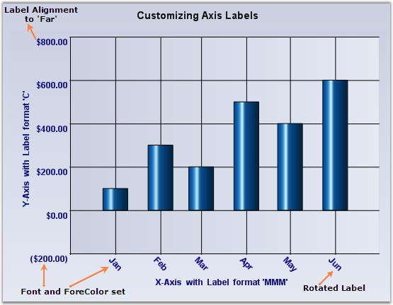

::: {style="DISPLAY: none"}
{#d2h_url_template}{#d2h_package_url style="WIDTH: 0px; DISPLAY: none; HEIGHT: 0px"}
:::

:::: {.d2h_secondary_topic style="PADDING-BOTTOM: 10pt; MARGIN: 0pt; PADDING-LEFT: 0pt; PADDING-RIGHT: 0pt; PADDING-TOP: 0pt"}
#### Axis Label Text Formatting, Appearance and Positioning {#axis-label-text-formatting-appearance-and-positioning style="tab-stops: 0pt"}

[]{style="FONT-FAMILY: 'Trebuchet MS','sans-serif'; FONT-SIZE: 9pt"} 

By default, the label texts are automatically determined based on the axis data points and the generated intervals. You can better the format, look and positioning of the labels using the properties listed below.

[]{style="FONT-FAMILY: 'Trebuchet MS','sans-serif'; FONT-SIZE: 9pt"} 

::: {align="center"}
+-----------------------------------+-----------------------------------------------------------------------------------------------------------------------------------------------------------------------------------------------------------------------------------------------------------------------------------------------------------------------------------------+
|                                   |                                                                                                                                                                                                                                                                                                                                         |
|                                   |                                                                                                                                                                                                                                                                                                                                         |
| ChartAxis Properties              | Description                                                                                                                                                                                                                                                                                                                             |
+-----------------------------------+-----------------------------------------------------------------------------------------------------------------------------------------------------------------------------------------------------------------------------------------------------------------------------------------------------------------------------------------+
| Format                            | If the data points are double values then use this property to specify the format in which to render the double value. The specified format will be used in the Double.ToString method to arrive at the formatted string. Search MSDN documentation for **Standard Numeric Format Strings** for more information on the format strings. |
+-----------------------------------+-----------------------------------------------------------------------------------------------------------------------------------------------------------------------------------------------------------------------------------------------------------------------------------------------------------------------------------------+
| DateTimeFormat                    | If the data points are **DateTime** values, then use this property to specify the format in which to render the date. The specified format will be used in the DateTime.ToString() method to arrive at the formatted string. Search MSDN documentation for **Date and Time Format Strings** for more information on the format strings. |
+-----------------------------------+-----------------------------------------------------------------------------------------------------------------------------------------------------------------------------------------------------------------------------------------------------------------------------------------------------------------------------------------+
| ForeColor                         | Affects the labels and other text colors that gets rendered in the axis.                                                                                                                                                                                                                                                                |
+-----------------------------------+-----------------------------------------------------------------------------------------------------------------------------------------------------------------------------------------------------------------------------------------------------------------------------------------------------------------------------------------+
| Font                              | Specifies the font to use for label and other texts that get rendered in the axis. By default it is set to Trebuchet, 9, regular.                                                                                                                                                                                                       |
+-----------------------------------+-----------------------------------------------------------------------------------------------------------------------------------------------------------------------------------------------------------------------------------------------------------------------------------------------------------------------------------------+
| ScaleLabels                       | Setting this to **true** will automatically resize the text if the chart size is expanded by the user.                                                                                                                                                                                                                                  |
+-----------------------------------+-----------------------------------------------------------------------------------------------------------------------------------------------------------------------------------------------------------------------------------------------------------------------------------------------------------------------------------------+
| LabelAlignment                    | Specifies if the label should be rendered Near, Far or Center within the available area. Default is **Center**.                                                                                                                                                                                                                         |
+-----------------------------------+-----------------------------------------------------------------------------------------------------------------------------------------------------------------------------------------------------------------------------------------------------------------------------------------------------------------------------------------+
| LabelRotate                       | Specifies whether or not labels should be rotated. Use the **LabelRotateAngle** to specify the angle.                                                                                                                                                                                                                                   |
+-----------------------------------+-----------------------------------------------------------------------------------------------------------------------------------------------------------------------------------------------------------------------------------------------------------------------------------------------------------------------------------------+
| LabelRotateAngle                  | If **LabelRotate** is **true**, this property specifies the angle of rotation.                                                                                                                                                                                                                                                          |
+-----------------------------------+-----------------------------------------------------------------------------------------------------------------------------------------------------------------------------------------------------------------------------------------------------------------------------------------------------------------------------------------+
:::

[         ]{style="FONT-FAMILY: 'Trebuchet MS','sans-serif'; FONT-SIZE: 9pt"}

{border="0"}

**[]{style="FONT-FAMILY: 'Trebuchet MS','sans-serif'; FONT-SIZE: 9pt"}** 

Figure 251: Axis Label Customization

[]{style="COLOR: red; FONT-SIZE: 8pt"} 

+---------------------------------------------------------------------------------------------------------------------------------------------------------------------------------------------------------------------------------------------------------------------------------------------------------+
| **[\[C#\]]{style="FONT-FAMILY: 'Courier New'; COLOR: black"}**                                                                                                                                                                                                                                          |
|                                                                                                                                                                                                                                                                                                         |
| []{style="FONT-FAMILY: 'Courier New'; COLOR: green"}                                                                                                                                                                                                                                                    |
|                                                                                                                                                                                                                                                                                                         |
| [//Settings datetime format to Xaxis]{style="FONT-FAMILY: 'Courier New'; COLOR: green"}                                                                                                                                                                                                                 |
|                                                                                                                                                                                                                                                                                                         |
| [this]{style="FONT-FAMILY: 'Courier New'; COLOR: blue"}[.ChartWebControl1.PrimaryXAxis.DateTimeFormat = [\"MMM\"]{style="COLOR: maroon"};]{style="FONT-FAMILY: 'Courier New'"}                                                                                                                          |
|                                                                                                                                                                                                                                                                                                         |
| []{style="FONT-FAMILY: 'Courier New'; COLOR: green"}                                                                                                                                                                                                                                                    |
|                                                                                                                                                                                                                                                                                                         |
| [//Settings format to Yaxis]{style="FONT-FAMILY: 'Courier New'; COLOR: green"}                                                                                                                                                                                                                          |
|                                                                                                                                                                                                                                                                                                         |
| [this]{style="FONT-FAMILY: 'Courier New'; COLOR: blue"}[.ChartWebControl1.PrimaryYAxis.ValueType = [ChartValueType]{style="COLOR: teal"}.Double;]{style="FONT-FAMILY: 'Courier New'"}                                                                                                                   |
|                                                                                                                                                                                                                                                                                                         |
| [this]{style="FONT-FAMILY: 'Courier New'; COLOR: blue"}[.ChartWebControl1.PrimaryYAxis.Format = [\"C\"]{style="COLOR: maroon"};]{style="FONT-FAMILY: 'Courier New'"}                                                                                                                                    |
|                                                                                                                                                                                                                                                                                                         |
| []{style="FONT-FAMILY: 'Courier New'; COLOR: green"}                                                                                                                                                                                                                                                    |
|                                                                                                                                                                                                                                                                                                         |
| [//setting ForeColor and Font to axes labels]{style="FONT-FAMILY: 'Courier New'; COLOR: green"}                                                                                                                                                                                                         |
|                                                                                                                                                                                                                                                                                                         |
| [this]{style="FONT-FAMILY: 'Courier New'; COLOR: blue"}[.ChartWebControl1.PrimaryXAxis.ForeColor = System.Drawing.[Color]{style="COLOR: teal"}.Navy;]{style="FONT-FAMILY: 'Courier New'"}                                                                                                               |
|                                                                                                                                                                                                                                                                                                         |
| [this]{style="FONT-FAMILY: 'Courier New'; COLOR: blue"}[.ChartWebControl1.PrimaryXAxis.Font = [new]{style="COLOR: blue"} System.Drawing.[Font]{style="COLOR: teal"}([\"Arial\"]{style="COLOR: maroon"}, 9F, System.Drawing.[FontStyle]{style="COLOR: teal"}.Bold);]{style="FONT-FAMILY: 'Courier New'"} |
|                                                                                                                                                                                                                                                                                                         |
| [this]{style="FONT-FAMILY: 'Courier New'; COLOR: blue"}[.ChartWebControl1.PrimaryYAxis.ForeColor = System.Drawing.[Color]{style="COLOR: teal"}.Navy;]{style="FONT-FAMILY: 'Courier New'"}                                                                                                               |
|                                                                                                                                                                                                                                                                                                         |
| [this]{style="FONT-FAMILY: 'Courier New'; COLOR: blue"}[.ChartWebControl1.PrimaryYAxis.Font = [new]{style="COLOR: blue"} System.Drawing.[Font]{style="COLOR: teal"}([\"Arial\"]{style="COLOR: maroon"}, 9F, System.Drawing.[FontStyle]{style="COLOR: teal"}.Bold);]{style="FONT-FAMILY: 'Courier New'"} |
|                                                                                                                                                                                                                                                                                                         |
| []{style="FONT-FAMILY: 'Courier New'"}                                                                                                                                                                                                                                                                  |
|                                                                                                                                                                                                                                                                                                         |
| [//Label property settings for X-Axis]{style="FONT-FAMILY: 'Courier New'; COLOR: green"}                                                                                                                                                                                                                |
|                                                                                                                                                                                                                                                                                                         |
| [this]{style="FONT-FAMILY: 'Courier New'; COLOR: blue"}[.ChartWebControl1.PrimaryXAxis.LabelAligment = System.Drawing.[StringAlignment]{style="COLOR: teal"}.Center;]{style="FONT-FAMILY: 'Courier New'"}                                                                                               |
|                                                                                                                                                                                                                                                                                                         |
| [this]{style="FONT-FAMILY: 'Courier New'; COLOR: blue"}[.ChartWebControl1.PrimaryXAxis.LabelRotate = [true]{style="COLOR: blue"};]{style="FONT-FAMILY: 'Courier New'"}                                                                                                                                  |
|                                                                                                                                                                                                                                                                                                         |
| [this]{style="FONT-FAMILY: 'Courier New'; COLOR: blue"}[.ChartWebControl1.PrimaryXAxis.LabelRotateAngle = 45;]{style="FONT-FAMILY: 'Courier New'"}                                                                                                                                                      |
|                                                                                                                                                                                                                                                                                                         |
| []{style="FONT-FAMILY: 'Courier New'"}                                                                                                                                                                                                                                                                  |
|                                                                                                                                                                                                                                                                                                         |
| [//Label property settings for Y-Axis]{style="FONT-FAMILY: 'Courier New'; COLOR: green"}                                                                                                                                                                                                                |
|                                                                                                                                                                                                                                                                                                         |
| [this]{style="FONT-FAMILY: 'Courier New'; COLOR: blue"}[.ChartWebControl1.PrimaryYAxis.LabelAligment = System.Drawing.[StringAlignment]{style="COLOR: teal"}.Far;]{style="FONT-FAMILY: 'Courier New'"}                                                                                                  |
+---------------------------------------------------------------------------------------------------------------------------------------------------------------------------------------------------------------------------------------------------------------------------------------------------------+

[]{style="FONT-FAMILY: 'Trebuchet MS','sans-serif'; FONT-SIZE: 9pt"} 

+------------------------------------------------------------------------------------------------------------------------------------------------------------------------------------------------------------------------------------------------------------------------------------------------------+
| **[\[VB\]]{style="FONT-FAMILY: 'Courier New'; COLOR: black"}**                                                                                                                                                                                                                                       |
|                                                                                                                                                                                                                                                                                                      |
| []{style="FONT-FAMILY: 'Courier New'; COLOR: green"}                                                                                                                                                                                                                                                 |
|                                                                                                                                                                                                                                                                                                      |
| [\'Settings datetime format to Xaxis]{style="FONT-FAMILY: 'Courier New'; COLOR: green"}                                                                                                                                                                                                              |
|                                                                                                                                                                                                                                                                                                      |
| [Me]{style="FONT-FAMILY: 'Courier New'; COLOR: blue"}[.ChartWebControl1.PrimaryXAxis.DateTimeFormat = [\"MMM\"]{style="COLOR: maroon"}]{style="FONT-FAMILY: 'Courier New'"}                                                                                                                          |
|                                                                                                                                                                                                                                                                                                      |
| []{style="FONT-FAMILY: 'Courier New'; COLOR: green"}                                                                                                                                                                                                                                                 |
|                                                                                                                                                                                                                                                                                                      |
| [Settings format to Yaxis]{style="FONT-FAMILY: 'Courier New'; COLOR: green"}                                                                                                                                                                                                                         |
|                                                                                                                                                                                                                                                                                                      |
| [Me]{style="FONT-FAMILY: 'Courier New'; COLOR: blue"}[.ChartWebControl1.PrimaryYAxis.ValueType = [ChartValueType]{style="COLOR: teal"}.Double]{style="FONT-FAMILY: 'Courier New'"}                                                                                                                   |
|                                                                                                                                                                                                                                                                                                      |
| [Me]{style="FONT-FAMILY: 'Courier New'; COLOR: blue"}[.ChartWebControl1.PrimaryYAxis.Format = [\"D\"]{style="COLOR: maroon"}]{style="FONT-FAMILY: 'Courier New'"}                                                                                                                                    |
|                                                                                                                                                                                                                                                                                                      |
| []{style="FONT-FAMILY: 'Courier New'; COLOR: green"}                                                                                                                                                                                                                                                 |
|                                                                                                                                                                                                                                                                                                      |
| [\'Setting ForeColor and Font to axes labels]{style="FONT-FAMILY: 'Courier New'; COLOR: green"}                                                                                                                                                                                                      |
|                                                                                                                                                                                                                                                                                                      |
| [Me]{style="FONT-FAMILY: 'Courier New'; COLOR: blue"}[.ChartWebControl1.PrimaryXAxis.ForeColor = System.Drawing.[Color]{style="COLOR: teal"}.Navy]{style="FONT-FAMILY: 'Courier New'"}                                                                                                               |
|                                                                                                                                                                                                                                                                                                      |
| [Me]{style="FONT-FAMILY: 'Courier New'; COLOR: blue"}[.ChartWebControl1.PrimaryXAxis.Font = [new]{style="COLOR: blue"} System.Drawing.[Font]{style="COLOR: teal"}([\"Arial\"]{style="COLOR: maroon"}, 9F, System.Drawing.[FontStyle]{style="COLOR: teal"}.Bold)]{style="FONT-FAMILY: 'Courier New'"} |
|                                                                                                                                                                                                                                                                                                      |
| [Me]{style="FONT-FAMILY: 'Courier New'; COLOR: blue"}[.ChartWebControl1.PrimaryYAxis.ForeColor = System.Drawing.[Color]{style="COLOR: teal"}.Navy]{style="FONT-FAMILY: 'Courier New'"}                                                                                                               |
|                                                                                                                                                                                                                                                                                                      |
| [Me]{style="FONT-FAMILY: 'Courier New'; COLOR: blue"}[.ChartWebControl1.PrimaryYAxis.Font = [new]{style="COLOR: blue"} System.Drawing.[Font]{style="COLOR: teal"}([\"Arial\"]{style="COLOR: maroon"}, 9F, System.Drawing.[FontStyle]{style="COLOR: teal"}.Bold)]{style="FONT-FAMILY: 'Courier New'"} |
|                                                                                                                                                                                                                                                                                                      |
| []{style="FONT-FAMILY: 'Courier New'"}                                                                                                                                                                                                                                                               |
|                                                                                                                                                                                                                                                                                                      |
| [\'Label property settings for X-Axis]{style="FONT-FAMILY: 'Courier New'; COLOR: green"}                                                                                                                                                                                                             |
|                                                                                                                                                                                                                                                                                                      |
| [Me]{style="FONT-FAMILY: 'Courier New'; COLOR: blue"}[.ChartWebControl1.PrimaryXAxis.LabelAligment = System.Drawing.[StringAlignment]{style="COLOR: teal"}.Center]{style="FONT-FAMILY: 'Courier New'"}                                                                                               |
|                                                                                                                                                                                                                                                                                                      |
| [Me]{style="FONT-FAMILY: 'Courier New'; COLOR: blue"}[.ChartWebControl1.PrimaryXAxis.LabelRotate = [true]{style="COLOR: blue"}]{style="FONT-FAMILY: 'Courier New'"}                                                                                                                                  |
|                                                                                                                                                                                                                                                                                                      |
| [Me]{style="FONT-FAMILY: 'Courier New'; COLOR: blue"}[.ChartWebControl1.PrimaryXAxis.LabelRotateAngle = 45]{style="FONT-FAMILY: 'Courier New'"}                                                                                                                                                      |
|                                                                                                                                                                                                                                                                                                      |
| []{style="FONT-FAMILY: 'Courier New'"}                                                                                                                                                                                                                                                               |
|                                                                                                                                                                                                                                                                                                      |
| [\'Label property settings for Y-Axis]{style="FONT-FAMILY: 'Courier New'; COLOR: green"}                                                                                                                                                                                                             |
|                                                                                                                                                                                                                                                                                                      |
| [Me]{style="FONT-FAMILY: 'Courier New'; COLOR: blue"}[.ChartWebControl1.PrimaryYAxis.LabelAligment = System.Drawing.[StringAlignment]{style="COLOR: teal"}.Far]{style="FONT-FAMILY: 'Courier New'"}                                                                                                  |
+------------------------------------------------------------------------------------------------------------------------------------------------------------------------------------------------------------------------------------------------------------------------------------------------------+

[]{#p184} 

[]{#related-topics}
::::
