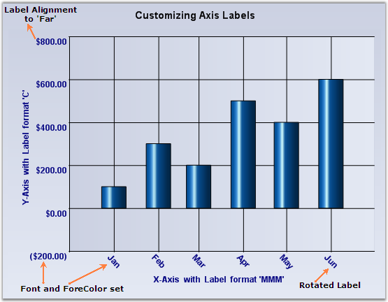

::: {style="DISPLAY: none"}
{#d2h_url_template}{#d2h_package_url style="WIDTH: 0px; DISPLAY: none; HEIGHT: 0px"}
:::

:::: {.d2h_secondary_topic style="PADDING-BOTTOM: 10pt; MARGIN: 0pt; PADDING-LEFT: 0pt; PADDING-RIGHT: 0pt; PADDING-TOP: 0pt"}
#### Axis Label Text Formatting, Appearance, and Positioning {#axis-label-text-formatting-appearance-and-positioning style="tab-stops: 0pt"}

By default, the label texts are automatically determined based on the axis data points and the generated intervals. You can make the format, look, and positioning of the labels better by using the properties listed below:

 

::: {align="center"}
  ChartAxis Property   Description
  -------------------- --------------------------------------------------------------------------------------------------------------------------------------------------------------------------------------------------------------------------------------------------------------------------------------------------------------------------------------------
  Format               If the data points are double values, then use this property to specify the format to use to render the double value. The specified format will be used in the Double.ToString method to arrive at the formatted string. Search the MSDN documentation for the Standard Numeric Format Strings for more information on the format strings.
  DateTimeFormat       If the data points are DateTime values, then use this property to specify the format to use to render the date. The specified format will be used in the DateTime.ToString() method to arrive at the formatted string. Search the MSDN documentation for the Date and Time Format Strings for more information on the format strings.
  ForeColor            Affects the labels and other text colors that get rendered in the axis.
  Font                 Specifies the font to use for labels and other text that get rendered in the axis. By default it is set to Trebuchet, 9, regular.
  ScaleLabels          Setting this to true will automatically resize the text if the chart size is expanded by the user.
  LabelAlignment       Specifies if the label should be rendered Near, Far, or Center within the available area. By default it is set to Center.
  LabelRotate          Specifies whether or not labels should be rotated. Use the LabelRotateAngle to specify the angle.
  LabelRotateAngle     Specifies the angle of rotation.
:::

[       ]{style="FONT-FAMILY: 'Times New Roman','serif'; FONT-SIZE: 12pt"}

{border="0"}

Figure 271: Axis label customization

[]{style="FONT-FAMILY: 'Times New Roman','serif'; FONT-SIZE: 12pt"} 

[]{#related-topics}
::::
