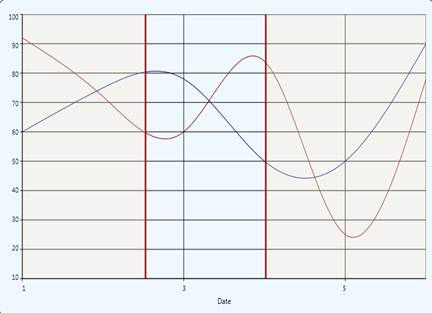

::: {style="DISPLAY: none"}
{#d2h_url_template}{#d2h_package_url style="WIDTH: 0px; DISPLAY: none; HEIGHT: 0px"}
:::

:::: {.d2h_secondary_topic style="PADDING-BOTTOM: 10pt; MARGIN: 0pt; PADDING-LEFT: 0pt; PADDING-RIGHT: 0pt; PADDING-TOP: 0pt"}
##### Axis Range Selection {#axis-range-selection style="tab-stops: 0pt"}

Essential Chart for WPF now supports axis range selection. This enables the user to select a particular range of a primary axis by using two cursors. 

 

Adding an Axis Range Selection

To add axis range selction, set the **EnableRangeSelection** to **True**. The following code illustrates this.

+--------------------------------------------------------------------------------------------------------------------------------------------------------------------------------------------------------------------------------------------------------------------------------------------------------------------------------------------------------------------------------------------------------------------------------------------------------------------------------------------------------------------------------------------------------------------------------------------------------------------------------------------------------------------------------------------------------------------------------------------------------------------------------------------------------------------------+
| **\[XAML\]**                                                                                                                                                                                                                                                                                                                                                                                                                                                                                                                                                                                                                                                                                                                                                                                                             |
|                                                                                                                                                                                                                                                                                                                                                                                                                                                                                                                                                                                                                                                                                                                                                                                                                          |
|                                                                                                                                                                                                                                                                                                                                                                                                                                                                                                                                                                                                                                                                                                                                                                                                                          |
|                                                                                                                                                                                                                                                                                                                                                                                                                                                                                                                                                                                                                                                                                                                                                                                                                          |
| [  ]{style="FONT-FAMILY: 'Courier New'; COLOR: #a31515"}[\<]{style="FONT-FAMILY: 'Courier New'; COLOR: blue"}[syncfusion]{style="FONT-FAMILY: 'Courier New'; COLOR: #a31515"}[:]{style="FONT-FAMILY: 'Courier New'; COLOR: blue"}[ChartArea]{style="FONT-FAMILY: 'Courier New'; COLOR: #a31515"}[ Name]{style="FONT-FAMILY: 'Courier New'; COLOR: red"}[=\"area\"]{style="FONT-FAMILY: 'Courier New'; COLOR: blue"}[ EnableRangeSelection]{style="FONT-FAMILY: 'Courier New'; COLOR: red"}[=\"True\"]{style="FONT-FAMILY: 'Courier New'; COLOR: blue"}[ LineStroke]{style="FONT-FAMILY: 'Courier New'; COLOR: red"}[=\"Maroon\"]{style="FONT-FAMILY: 'Courier New'; COLOR: blue"}[ SelectionStroke]{style="FONT-FAMILY: 'Courier New'; COLOR: red"}[=\"LightPink\" /\>]{style="FONT-FAMILY: 'Courier New'; COLOR: blue"} |
|                                                                                                                                                                                                                                                                                                                                                                                                                                                                                                                                                                                                                                                                                                                                                                                                                          |
|                                                                                                                                                                                                                                                                                                                                                                                                                                                                                                                                                                                                                                                                                                                                                                                                                          |
+--------------------------------------------------------------------------------------------------------------------------------------------------------------------------------------------------------------------------------------------------------------------------------------------------------------------------------------------------------------------------------------------------------------------------------------------------------------------------------------------------------------------------------------------------------------------------------------------------------------------------------------------------------------------------------------------------------------------------------------------------------------------------------------------------------------------------+

 

+------------------------------------------------------------------------------------------------------------------------------------+
| **\[C#\]** **[]{style="FONT-FAMILY: 'Times New Roman','serif'; FONT-SIZE: 12pt"}**                                                 |
|                                                                                                                                    |
|           [   chart1.Areas\[0\].EnableRangeSelection = [true]{style="COLOR: blue"};]{style="FONT-FAMILY: 'Courier New'"}           |
|                                                                                                                                    |
| [            [double]{style="COLOR: blue"} start = chart1.Areas\[0\].StartRange;]{style="FONT-FAMILY: 'Courier New'"}              |
|                                                                                                                                    |
| [            [double]{style="COLOR: blue"} end = chart1.Areas\[0\].EndRange;]{style="FONT-FAMILY: 'Courier New'"}                  |
|                                                                                                                                    |
| [            chart1.Areas\[0\].LineStroke = [Brushes]{style="COLOR: #2b91af"}.Maroon;]{style="FONT-FAMILY: 'Courier New'"}         |
|                                                                                                                                    |
| [            chart1.Areas\[0\].SelectionStroke = [Brushes]{style="COLOR: #2b91af"}.LightPink;]{style="FONT-FAMILY: 'Courier New'"} |
+------------------------------------------------------------------------------------------------------------------------------------+

 

When the code runs, the following output displays.

{border="0"}

Figure 193: Chart with Two Cursors to Select the Axis Range

 

Property Details

Table 137: Property Table

::: {align="center"}
+----------------------+----------------------------------+------------------+----------------------+--------------------------------------------------------+
| Name of Property     | Description                      | Type of Property | Value It Accepts     | Sub Properties                                         |
+----------------------+----------------------------------+------------------+----------------------+--------------------------------------------------------+
| EnableRangeSelection | Used to set the range selection. | Dependency       | Binary or True/False | [·      ]{style="FONT-FAMILY: Symbol"}StartValue       |
|                      |                                  |                  |                      |                                                        |
|                      |                                  |                  |                      | [·      ]{style="FONT-FAMILY: Symbol"}Type: double     |
|                      |                                  |                  |                      |                                                        |
|                      |                                  |                  |                      | [·      ]{style="FONT-FAMILY: Symbol"}EndValue         |
|                      |                                  |                  |                      |                                                        |
|                      |                                  |                  |                      | [·      ]{style="FONT-FAMILY: Symbol"}Type: double     |
|                      |                                  |                  |                      |                                                        |
|                      |                                  |                  |                      | [·      ]{style="FONT-FAMILY: Symbol"}LineStroke       |
|                      |                                  |                  |                      |                                                        |
|                      |                                  |                  |                      | [·      ]{style="FONT-FAMILY: Symbol"}Type: Brush      |
|                      |                                  |                  |                      |                                                        |
|                      |                                  |                  |                      | [·      ]{style="FONT-FAMILY: Symbol"}SelectionStroke  |
|                      |                                  |                  |                      |                                                        |
|                      |                                  |                  |                      | [·      ]{style="FONT-FAMILY: Symbol"}Type: Brush      |
+----------------------+----------------------------------+------------------+----------------------+--------------------------------------------------------+
:::

[]{style="FONT-FAMILY: 'Trebuchet MS','sans-serif'; COLOR: #15428b; FONT-SIZE: 9pt"} 

 

[]{#related-topics}
::::
