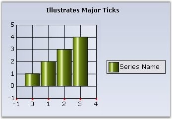
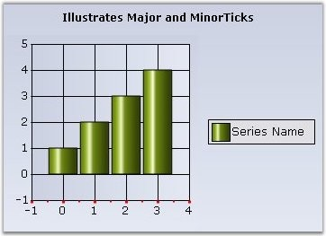

::: {style="DISPLAY: none"}
{#d2h_url_template}{#d2h_package_url style="WIDTH: 0px; DISPLAY: none; HEIGHT: 0px"}
:::

::::: {#nsbanner .d2h_main_nsbanner style="BORDER-BOTTOM: #999999 1px solid; POSITION: relative; PADDING-BOTTOM: 0px; BACKGROUND-COLOR: transparent; PADDING-LEFT: 0px; PADDING-RIGHT: 0px; DISPLAY: none; BORDER-TOP: #999999 1px solid; PADDING-TOP: 0px; LEFT: 0px"}
:::: {#TitleRow .d2h_main_titlerow style="PADDING-BOTTOM: 4px; BACKGROUND-COLOR: transparent; PADDING-LEFT: 22px; WIDTH: 100%; PADDING-RIGHT: 10px; DISPLAY: none; PADDING-TOP: 4px"}
::: {#ienav .d2h_main_ienav style="DISPLAY: none"}
{#D2HPrevious .D2HPreviousEnabled}  {#D2HNext .D2HNextEnabled}
:::
::::
:::::

:::::: {#nstext .d2h_main_nstext style="PADDING-BOTTOM: 10px; BACKGROUND-COLOR: transparent; PADDING-LEFT: 22px; PADDING-RIGHT: 10px; HEIGHT: 100%; OVERFLOW: auto; PADDING-TOP: 5px" hasuserbackground="true" valign="bottom"}
::: {#d2h_breadcrumbs .d2h_breadcrumbs}
[Essential Studio User Guide Documentation](ms-xhelp:///?Id=12457748-09e3-4d74-a240-8e049cedf030){.d2h_breadcrumbsNormal}[ \> ]{.d2h_breadcrumbsLinkSeparator}[User Interface Edition](ms-xhelp:///?Id=c29296b7-531c-413b-a0ec-488ca1f7f669){.d2h_breadcrumbsNormal}[ \> ]{.d2h_breadcrumbsLinkSeparator}[Essential Windows](ms-xhelp:///?Id=e60759d8-47a4-4570-9d7a-16a68d63f2ea){.d2h_breadcrumbsNormal}[ \> ]{.d2h_breadcrumbsLinkSeparator}[Essential Chart]{.d2h_breadcrumbsContentsOnly}[ \> ]{.d2h_breadcrumbsLinkSeparator}[Concepts and Features](ms-xhelp:///?Id=71321e9c-336c-4c1c-a127-be9f135ad4bb){.d2h_breadcrumbsNormal}[ \> ]{.d2h_breadcrumbsLinkSeparator}[Chart Axes](ms-xhelp:///?Id=e0d0de4a-3c3c-41cd-9d94-6496172cab48){.d2h_breadcrumbsNormal}
:::

### Axis Ticks {#axis-ticks style="tab-stops: 0pt"}

 

Major Ticks

 

Major Ticks are rendered automatically at the intersection of an axis with the interval grid lines. Here are some properties that will let you customize the look and feel, and behavior of the ticks.

 

::: {align="center"}
+-----------------------------------+------------------------------------------------------------------------------------------------------------------------------------------------------------------------------------------------------+
| ChartAxis Property                | Description                                                                                                                                                                                          |
+-----------------------------------+------------------------------------------------------------------------------------------------------------------------------------------------------------------------------------------------------+
| TickSize                          | Specifies the width and height of the tick rectangle. This is also a good way to hide the ticks. Default is **{1, 1}**.                                                                              |
+-----------------------------------+------------------------------------------------------------------------------------------------------------------------------------------------------------------------------------------------------+
| TickColor                         | Color of the tick mark. Default is **System.ControlText**.                                                                                                                                           |
+-----------------------------------+------------------------------------------------------------------------------------------------------------------------------------------------------------------------------------------------------+
| TickLabelGridPadding              | The padding between the tickmark in the axis and the label. Default is **5**.                                                                                                                        |
+-----------------------------------+------------------------------------------------------------------------------------------------------------------------------------------------------------------------------------------------------+
| TickDrawingOperationMode          | Defines the number of ticks to render while zooming.                                                                                                                                                 |
|                                   |                                                                                                                                                                                                      |
|                                   |                                                                                                                                                                                                      |
|                                   |                                                                                                                                                                                                      |
|                                   | [·      ]{style="FONT-FAMILY: Symbol"}**NumberOfIntervalsFixed** - When you zoom, the number of visible intervals will be constant. So, as you zoom in, the total number of intervals will increase. |
|                                   |                                                                                                                                                                                                      |
|                                   | ****                                                                                                                                                                                                 |
|                                   |                                                                                                                                                                                                      |
|                                   | [·      ]{style="FONT-FAMILY: Symbol"}**IntervalFixed** - The number of intervals will be constant. So, as you zoom in, fewer intervals will be visible at a time.                                   |
+-----------------------------------+------------------------------------------------------------------------------------------------------------------------------------------------------------------------------------------------------+
:::

 

{border="0"}

 

Figure 267: Primary X-Axis with Major ticks (3x3, DarkOrange)

 

+--------------------------------------------------------------------------------------------------------------------------------------------------------------------------------------------------+
| **[\[C#\]]{style="FONT-FAMILY: 'Courier New'; COLOR: black"}**                                                                                                                                   |
|                                                                                                                                                                                                  |
| []{style="FONT-FAMILY: 'Courier New'; COLOR: green"}                                                                                                                                             |
|                                                                                                                                                                                                  |
| [this]{style="FONT-FAMILY: 'Courier New'; COLOR: blue"}[.chartControl1.PrimaryXAxis.TickSize = [new]{style="COLOR: blue"} [Size]{style="COLOR: teal"}(3,3);]{style="FONT-FAMILY: 'Courier New'"} |
|                                                                                                                                                                                                  |
| [this]{style="FONT-FAMILY: 'Courier New'; COLOR: blue"}[.chartControl1.PrimaryXAxis.TickColor = [Color]{style="COLOR: teal"}.DarkOrange;]{style="FONT-FAMILY: 'Courier New'"}                    |
|                                                                                                                                                                                                  |
| [this]{style="FONT-FAMILY: 'Courier New'; COLOR: blue"}[.chartControl1.PrimaryXAxis.TickLabelGridPadding = 8F;]{style="FONT-FAMILY: 'Courier New'"}                                              |
+--------------------------------------------------------------------------------------------------------------------------------------------------------------------------------------------------+

 

+-----------------------------------------------------------------------------------------------------------------------------------------------------------------------------------------------+
| **[\[VB\]]{style="FONT-FAMILY: 'Courier New'; COLOR: black"}**                                                                                                                                |
|                                                                                                                                                                                               |
| []{style="FONT-FAMILY: 'Courier New'; COLOR: green"}                                                                                                                                          |
|                                                                                                                                                                                               |
| [Me]{style="FONT-FAMILY: 'Courier New'; COLOR: blue"}[.chartControl1.PrimaryXAxis.TickSize = [new]{style="COLOR: blue"} [Size]{style="COLOR: teal"}(3,3)]{style="FONT-FAMILY: 'Courier New'"} |
|                                                                                                                                                                                               |
| [Me]{style="FONT-FAMILY: 'Courier New'; COLOR: blue"}[.chartControl1.PrimaryXAxis.TickColor = [Color]{style="COLOR: teal"}.DarkOrange]{style="FONT-FAMILY: 'Courier New'"}                    |
|                                                                                                                                                                                               |
| [Me]{style="FONT-FAMILY: 'Courier New'; COLOR: blue"}[.chartControl1.PrimaryXAxis.TickLabelGridPadding = 8F]{style="FONT-FAMILY: 'Courier New'"}                                              |
+-----------------------------------------------------------------------------------------------------------------------------------------------------------------------------------------------+

 

**Minor Ticks**

 

Minor ticks are tick marks in between major ticks. These are not rendered by default. Use the properties below to enable and define the frequency of such minor tick marks.

 

::: {align="center"}
  ----------------------- -------------------------------------------------------------------------------------------------------------------
  ChartAxis Property      Description
  SmallTicksPerInterval   Specifies if and how many minor ticks, which are tick marks drawn on the axis between intervals, should be drawn.
  SmallTickSize           Specifies the size of the tick rectangle.
  ----------------------- -------------------------------------------------------------------------------------------------------------------
:::

 

{border="0"}

 

Figure 268: Primary X-Axis with Major and Minor Ticks

[]{style="COLOR: red; FONT-SIZE: 8pt"} 

+-----------------------------------------------------------------------------------------------------------------------------------------------------------------------------------------------------------------------+
| **[\[C#\]]{style="FONT-FAMILY: 'Courier New'; COLOR: black"}**                                                                                                                                                        |
|                                                                                                                                                                                                                       |
| []{style="FONT-FAMILY: 'Courier New'; COLOR: green"}                                                                                                                                                                  |
|                                                                                                                                                                                                                       |
| [this]{style="FONT-FAMILY: 'Courier New'; COLOR: blue"}[.chartControl1.PrimaryXAxis.SmallTickSize = [new]{style="COLOR: blue"} System.Drawing.[Size]{style="COLOR: teal"}(2, 2);]{style="FONT-FAMILY: 'Courier New'"} |
|                                                                                                                                                                                                                       |
| [this]{style="FONT-FAMILY: 'Courier New'; COLOR: blue"}[.chartControl1.PrimaryXAxis.SmallTicksPerInterval = 1;]{style="FONT-FAMILY: 'Courier New'"}                                                                   |
+-----------------------------------------------------------------------------------------------------------------------------------------------------------------------------------------------------------------------+

 

+----------------------------------------------------------------------------------------------------------------------------------------------------------------------------------------------------------------------+
| **[\[VB\]]{style="FONT-FAMILY: 'Courier New'; COLOR: black"}**                                                                                                                                                       |
|                                                                                                                                                                                                                      |
| []{style="FONT-FAMILY: 'Courier New'; COLOR: green"}                                                                                                                                                                 |
|                                                                                                                                                                                                                      |
| [this]{style="FONT-FAMILY: 'Courier New'; COLOR: blue"}[.chartControl1.PrimaryXAxis.SmallTickSize = [new]{style="COLOR: blue"} System.Drawing.[Size]{style="COLOR: teal"}(2, 2)]{style="FONT-FAMILY: 'Courier New'"} |
|                                                                                                                                                                                                                      |
| [this]{style="FONT-FAMILY: 'Courier New'; COLOR: blue"}[.chartControl1.PrimaryXAxis.SmallTicksPerInterval = 1]{style="FONT-FAMILY: 'Courier New'"}                                                                   |
+----------------------------------------------------------------------------------------------------------------------------------------------------------------------------------------------------------------------+

 

[]{#related-topics}
::::::
