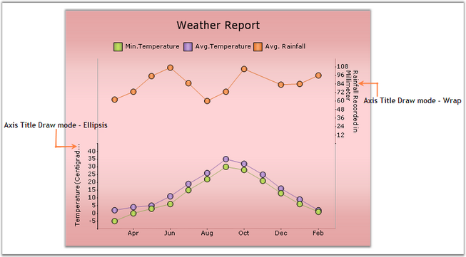

::: {style="DISPLAY: none"}
{#d2h_url_template}{#d2h_package_url style="WIDTH: 0px; DISPLAY: none; HEIGHT: 0px"}
:::

::::: {#nsbanner .d2h_main_nsbanner style="BORDER-BOTTOM: #999999 1px solid; POSITION: relative; PADDING-BOTTOM: 0px; BACKGROUND-COLOR: transparent; PADDING-LEFT: 0px; PADDING-RIGHT: 0px; DISPLAY: none; BORDER-TOP: #999999 1px solid; PADDING-TOP: 0px; LEFT: 0px"}
:::: {#TitleRow .d2h_main_titlerow style="PADDING-BOTTOM: 4px; BACKGROUND-COLOR: transparent; PADDING-LEFT: 22px; WIDTH: 100%; PADDING-RIGHT: 10px; DISPLAY: none; PADDING-TOP: 4px"}
::: {#ienav .d2h_main_ienav style="DISPLAY: none"}
{#D2HPrevious .D2HPreviousEnabled}  {#D2HNext .D2HNextEnabled}
:::
::::
:::::

:::::: {#nstext .d2h_main_nstext style="PADDING-BOTTOM: 10px; BACKGROUND-COLOR: transparent; PADDING-LEFT: 22px; PADDING-RIGHT: 10px; HEIGHT: 100%; OVERFLOW: auto; PADDING-TOP: 5px" hasuserbackground="true" valign="bottom"}
::: {#d2h_breadcrumbs .d2h_breadcrumbs}
[Essential Studio User Guide Documentation](ms-xhelp:///?Id=12457748-09e3-4d74-a240-8e049cedf030){.d2h_breadcrumbsNormal}[ \> ]{.d2h_breadcrumbsLinkSeparator}[User Interface Edition](ms-xhelp:///?Id=c29296b7-531c-413b-a0ec-488ca1f7f669){.d2h_breadcrumbsNormal}[ \> ]{.d2h_breadcrumbsLinkSeparator}[Essential ASP.NET](ms-xhelp:///?Id=25c35330-c127-4dad-9a92-ed79dc7261a6){.d2h_breadcrumbsNormal}[ \> ]{.d2h_breadcrumbsLinkSeparator}[Essential Chart]{.d2h_breadcrumbsContentsOnly}[ \> ]{.d2h_breadcrumbsLinkSeparator}[Concepts and Features](ms-xhelp:///?Id=100687ce-82f2-4424-9d16-0949ea76cf15){.d2h_breadcrumbsNormal}[ \> ]{.d2h_breadcrumbsLinkSeparator}[Chart Axes](ms-xhelp:///?Id=7a90cdaa-49ed-4b7e-abc1-5a0281835094){.d2h_breadcrumbsNormal}
:::

### Axis Title {#axis-title style="tab-stops: 0pt"}

[]{style="FONT-FAMILY: 'Trebuchet MS','sans-serif'; COLOR: red; FONT-SIZE: 9pt"} 

Essential Chart provides properties to set custom titles for the axes. Set the title text for an axis using **Title** property. Customize this text using **TitleColor** and **TitleFont** properties.

[]{style="FONT-FAMILY: 'Trebuchet MS','sans-serif'; FONT-SIZE: 9pt"} 

::: {align="center"}
  ----------------------- ------------------------------------------------
  Chart Axis Properties   Description
  TitleColor              Sets the color for the title text of the axis.
  TitleFont               Sets the font style for the title text.
  ----------------------- ------------------------------------------------
:::

[]{style="COLOR: red; FONT-SIZE: 8pt"} 

+-------------------------------------------------------------------------------------------------------------------------------------------------------------------------------------------------------------------+
| **[\[C#\]]{style="FONT-FAMILY: 'Courier New'; COLOR: black"}**                                                                                                                                                    |
|                                                                                                                                                                                                                   |
| []{style="FONT-FAMILY: 'Courier New'; COLOR: green"}                                                                                                                                                              |
|                                                                                                                                                                                                                   |
| [//Sets custom title for x- axis. ]{style="FONT-FAMILY: 'Courier New'; COLOR: green"}                                                                                                                             |
|                                                                                                                                                                                                                   |
| [this]{style="FONT-FAMILY: 'Courier New'; COLOR: blue"}[.ChartWebControl1.PrimaryXaxis.Title = [\"x-axis\"]{style="COLOR: #a31515"};]{style="FONT-FAMILY: 'Courier New'"}                                         |
|                                                                                                                                                                                                                   |
| [this]{style="FONT-FAMILY: 'Courier New'; COLOR: blue"}[.ChartWebControl1.PrimaryXaxis.TitleColor = Color.Red;]{style="FONT-FAMILY: 'Courier New'"}                                                               |
|                                                                                                                                                                                                                   |
| [this]{style="FONT-FAMILY: 'Courier New'; COLOR: blue"}[.ChartWebControl1.PrimaryXaxis.TitleFont = [new]{style="COLOR: blue"} Font([\"Arial\"]{style="COLOR: #a31515"}, 10);]{style="FONT-FAMILY: 'Courier New'"} |
|                                                                                                                                                                                                                   |
| [//Set custom title for y-axis in the similar method.]{style="FONT-FAMILY: 'Courier New'; COLOR: green"}                                                                                                          |
+-------------------------------------------------------------------------------------------------------------------------------------------------------------------------------------------------------------------+

[]{style="FONT-FAMILY: 'Trebuchet MS','sans-serif'; FONT-SIZE: 9pt"} 

+----------------------------------------------------------------------------------------------------------------------------------------------------------------------------------------------------------------+
| **[\[VB\]]{style="FONT-FAMILY: 'Courier New'; COLOR: black"}**                                                                                                                                                 |
|                                                                                                                                                                                                                |
| []{style="FONT-FAMILY: 'Courier New'; COLOR: green"}                                                                                                                                                           |
|                                                                                                                                                                                                                |
| [\'Sets custom title for x- axis. ]{style="FONT-FAMILY: 'Courier New'; COLOR: green"}                                                                                                                          |
|                                                                                                                                                                                                                |
| [Me]{style="FONT-FAMILY: 'Courier New'; COLOR: blue"}[.ChartWebControl1.PrimaryXaxis.Title = [\"x-axis\"]{style="COLOR: #a31515"}]{style="FONT-FAMILY: 'Courier New'"}                                         |
|                                                                                                                                                                                                                |
| [Me]{style="FONT-FAMILY: 'Courier New'; COLOR: blue"}[.ChartWebControl1.PrimaryXaxis.TitleColor = Color.Red]{style="FONT-FAMILY: 'Courier New'"}                                                               |
|                                                                                                                                                                                                                |
| [Me]{style="FONT-FAMILY: 'Courier New'; COLOR: blue"}[.ChartWebControl1.PrimaryXaxis.TitleFont = [New]{style="COLOR: blue"} Font([\"Arial\"]{style="COLOR: #a31515"}, 10)]{style="FONT-FAMILY: 'Courier New'"} |
|                                                                                                                                                                                                                |
| [\'Set custom title for y-axis in the similar method.]{style="FONT-FAMILY: 'Courier New'; COLOR: green"}                                                                                                       |
+----------------------------------------------------------------------------------------------------------------------------------------------------------------------------------------------------------------+

**[]{style="FONT-FAMILY: 'Trebuchet MS','sans-serif'; FONT-SIZE: 9pt"}** 

Drawing Mode of Title Text

[]{style="FONT-FAMILY: 'Trebuchet MS','sans-serif'; FONT-SIZE: 9pt"} 

You can now display partial axis title with an ellipsis at the end of text, whose text length exceeds the axis length. There is also an option to wrap the title text. The **Axes.TitleDrawMode** property is used to control this behavior.

[]{style="FONT-FAMILY: 'Trebuchet MS','sans-serif'; FONT-SIZE: 9pt"} 

::: {align="center"}
  --------------------- -------------------------------------------------------------------------------------------------------------
  Chart Axis Property   Description
  TitleDrawMode         Sets the drawing mode of the axis title. It can be Ellipse, Wrap or None. By default it is set to **None**.
  --------------------- -------------------------------------------------------------------------------------------------------------
:::

[]{style="FONT-FAMILY: 'Trebuchet MS','sans-serif'; FONT-SIZE: 9pt"} 

+----------------------------------------------------------------------------------------------------------------------------------------------------------------------------------------------+
| **[\[C#\]]{style="FONT-FAMILY: 'Courier New'; COLOR: black"}**                                                                                                                               |
|                                                                                                                                                                                              |
| []{style="FONT-FAMILY: 'Courier New'; COLOR: green"}                                                                                                                                         |
|                                                                                                                                                                                              |
| [//Setting drawing mode of y-axis title]{style="FONT-FAMILY: 'Courier New'; COLOR: green"}                                                                                                   |
|                                                                                                                                                                                              |
| [this]{style="FONT-FAMILY: 'Courier New'; COLOR: blue"}[.chartControl1.PrimaryXAxis.TitleDrawMode = [ChartTitleDrawMode]{style="COLOR: teal"}.Ellipsis;]{style="FONT-FAMILY: 'Courier New'"} |
|                                                                                                                                                                                              |
| [//Setting drawing mode of secondary y-axis title]{style="FONT-FAMILY: 'Courier New'; COLOR: green"}                                                                                         |
|                                                                                                                                                                                              |
| [this]{style="FONT-FAMILY: 'Courier New'; COLOR: blue"}[.secYAxis.TitleDrawMode = [ChartTitleDrawMode]{style="COLOR: teal"}.Wrap;]{style="FONT-FAMILY: 'Courier New'"}                       |
+----------------------------------------------------------------------------------------------------------------------------------------------------------------------------------------------+

[]{style="FONT-FAMILY: 'Trebuchet MS','sans-serif'; FONT-SIZE: 9pt"} 

+-------------------------------------------------------------------------------------------------------------------------------------------------------------------------------------------+
| **[\[VB\]]{style="FONT-FAMILY: 'Courier New'; COLOR: black"}**                                                                                                                            |
|                                                                                                                                                                                           |
| []{style="FONT-FAMILY: 'Courier New'; COLOR: green"}                                                                                                                                      |
|                                                                                                                                                                                           |
| [\'Setting drawing mode of y-axis title]{style="FONT-FAMILY: 'Courier New'; COLOR: green"}                                                                                                |
|                                                                                                                                                                                           |
| [Me]{style="FONT-FAMILY: 'Courier New'; COLOR: blue"}[.chartControl1.PrimaryXAxis.TitleDrawMode = [ChartTitleDrawMode]{style="COLOR: teal"}.Ellipsis]{style="FONT-FAMILY: 'Courier New'"} |
|                                                                                                                                                                                           |
| [\'Setting drawing mode of secondary y-axis title]{style="FONT-FAMILY: 'Courier New'; COLOR: green"}                                                                                      |
|                                                                                                                                                                                           |
| [Me]{style="FONT-FAMILY: 'Courier New'; COLOR: blue"}[.secYAxis.TitleDrawMode = [ChartTitleDrawMode]{style="COLOR: teal"}.Wrap]{style="FONT-FAMILY: 'Courier New'"}                       |
+-------------------------------------------------------------------------------------------------------------------------------------------------------------------------------------------+

[]{style="FONT-FAMILY: 'Trebuchet MS','sans-serif'; FONT-SIZE: 9pt"} 

{border="0"}

***[]{style="FONT-FAMILY: 'Trebuchet MS','sans-serif'; FONT-SIZE: 9pt"}*** 

Figure 258: Y-Axis TitleDrawMode=\'Ellipsis; SecYAxis TitleDrawMode =\'Wrap\'

[]{#p188} 

[]{#related-topics}
::::::
