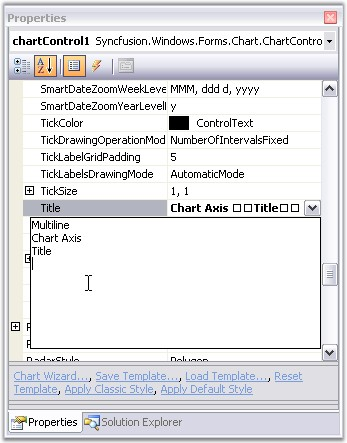
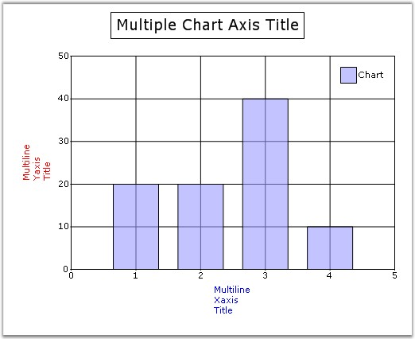

::: {style="DISPLAY: none"}
{#d2h_url_template}{#d2h_package_url style="WIDTH: 0px; DISPLAY: none; HEIGHT: 0px"}
:::

::::: {#nsbanner .d2h_main_nsbanner style="BORDER-BOTTOM: #999999 1px solid; POSITION: relative; PADDING-BOTTOM: 0px; BACKGROUND-COLOR: transparent; PADDING-LEFT: 0px; PADDING-RIGHT: 0px; DISPLAY: none; BORDER-TOP: #999999 1px solid; PADDING-TOP: 0px; LEFT: 0px"}
:::: {#TitleRow .d2h_main_titlerow style="PADDING-BOTTOM: 4px; BACKGROUND-COLOR: transparent; PADDING-LEFT: 22px; WIDTH: 100%; PADDING-RIGHT: 10px; DISPLAY: none; PADDING-TOP: 4px"}
::: {#ienav .d2h_main_ienav style="DISPLAY: none"}
{#D2HPrevious .D2HPreviousEnabled}  {#D2HNext .D2HNextEnabled}
:::
::::
:::::

:::::: {#nstext .d2h_main_nstext style="PADDING-BOTTOM: 10px; BACKGROUND-COLOR: transparent; PADDING-LEFT: 22px; PADDING-RIGHT: 10px; HEIGHT: 100%; OVERFLOW: auto; PADDING-TOP: 5px" hasuserbackground="true" valign="bottom"}
::: {#d2h_breadcrumbs .d2h_breadcrumbs}
[Essential Studio User Guide Documentation](ms-xhelp:///?Id=12457748-09e3-4d74-a240-8e049cedf030){.d2h_breadcrumbsNormal}[ \> ]{.d2h_breadcrumbsLinkSeparator}[User Interface Edition](ms-xhelp:///?Id=c29296b7-531c-413b-a0ec-488ca1f7f669){.d2h_breadcrumbsNormal}[ \> ]{.d2h_breadcrumbsLinkSeparator}[Essential Windows](ms-xhelp:///?Id=e60759d8-47a4-4570-9d7a-16a68d63f2ea){.d2h_breadcrumbsNormal}[ \> ]{.d2h_breadcrumbsLinkSeparator}[Essential Chart]{.d2h_breadcrumbsContentsOnly}[ \> ]{.d2h_breadcrumbsLinkSeparator}[Concepts and Features](ms-xhelp:///?Id=71321e9c-336c-4c1c-a127-be9f135ad4bb){.d2h_breadcrumbsNormal}[ \> ]{.d2h_breadcrumbsLinkSeparator}[Chart Axes](ms-xhelp:///?Id=e0d0de4a-3c3c-41cd-9d94-6496172cab48){.d2h_breadcrumbsNormal}
:::

### Axis Title {#axis-title style="tab-stops: 0pt"}

[]{style="COLOR: red"} 

Essential Chart provides properties to set custom titles for the axes. Set the title text for an axis using **Title** property. Customize this text using **TitleColor** and **TitleFont** properties.

 

::: {align="center"}
  --------------------- ------------------------------------------------
  Chart Axis Property   Description
  TitleColor            Sets the color for the title text of the axis.
  TitleFont             Sets the font style for the title text.
  --------------------- ------------------------------------------------
:::

[]{style="COLOR: red; FONT-SIZE: 8pt"} 

+----------------------------------------------------------------------------------------------------------------------------------------------------------------------------------------------------------------+
| **[\[C#\]]{style="FONT-FAMILY: 'Courier New'; COLOR: black"}**                                                                                                                                                 |
|                                                                                                                                                                                                                |
| []{style="FONT-FAMILY: 'Courier New'; COLOR: green"}                                                                                                                                                           |
|                                                                                                                                                                                                                |
| [//Sets custom title for x- axis. ]{style="FONT-FAMILY: 'Courier New'; COLOR: green"}                                                                                                                          |
|                                                                                                                                                                                                                |
| [this]{style="FONT-FAMILY: 'Courier New'; COLOR: blue"}[.chartControl1.PrimaryXaxis.Title = [\"x-axis\"]{style="COLOR: #a31515"};]{style="FONT-FAMILY: 'Courier New'"}                                         |
|                                                                                                                                                                                                                |
| [this]{style="FONT-FAMILY: 'Courier New'; COLOR: blue"}[.chartControl1.PrimaryXaxis.TitleColor = Color.Red;]{style="FONT-FAMILY: 'Courier New'"}                                                               |
|                                                                                                                                                                                                                |
| [this]{style="FONT-FAMILY: 'Courier New'; COLOR: blue"}[.chartControl1.PrimaryXaxis.TitleFont = [new]{style="COLOR: blue"} Font([\"Arial\"]{style="COLOR: #a31515"}, 10);]{style="FONT-FAMILY: 'Courier New'"} |
|                                                                                                                                                                                                                |
| [//Set custom title for y-axis in the similar method.]{style="FONT-FAMILY: 'Courier New'; COLOR: green"}                                                                                                       |
+----------------------------------------------------------------------------------------------------------------------------------------------------------------------------------------------------------------+

 

+-------------------------------------------------------------------------------------------------------------------------------------------------------------------------------------------------------------+
| **[\[VB\]]{style="FONT-FAMILY: 'Courier New'; COLOR: black"}**                                                                                                                                              |
|                                                                                                                                                                                                             |
| []{style="FONT-FAMILY: 'Courier New'; COLOR: green"}                                                                                                                                                        |
|                                                                                                                                                                                                             |
| [\'Sets custom title for x- axis. ]{style="FONT-FAMILY: 'Courier New'; COLOR: green"}                                                                                                                       |
|                                                                                                                                                                                                             |
| [Me]{style="FONT-FAMILY: 'Courier New'; COLOR: blue"}[.chartControl1.PrimaryXaxis.Title = [\"x-axis\"]{style="COLOR: #a31515"}]{style="FONT-FAMILY: 'Courier New'"}                                         |
|                                                                                                                                                                                                             |
| [Me]{style="FONT-FAMILY: 'Courier New'; COLOR: blue"}[.chartControl1.PrimaryXaxis.TitleColor = Color.Red]{style="FONT-FAMILY: 'Courier New'"}                                                               |
|                                                                                                                                                                                                             |
| [Me]{style="FONT-FAMILY: 'Courier New'; COLOR: blue"}[.chartControl1.PrimaryXaxis.TitleFont = [New]{style="COLOR: blue"} Font([\"Arial\"]{style="COLOR: #a31515"}, 10)]{style="FONT-FAMILY: 'Courier New'"} |
|                                                                                                                                                                                                             |
| [\'Set custom title for y-axis in the similar method.]{style="FONT-FAMILY: 'Courier New'; COLOR: green"}                                                                                                    |
+-------------------------------------------------------------------------------------------------------------------------------------------------------------------------------------------------------------+

 

**Multiline Chart Axes Title**

 

You can now wrap the axes titles and display them as multiline text. Set multiline title text in **Axis.Title** property through designer as follows. Press ENTER key to begin a new line. Press CTRL+ENTER to set the text entered.

 

{border="0"}

 

Figure 264: Setting Multiline Axis Title Through Properties Window

 

The below screenshot illustrates a chart with multiline axes titles.

 

{border="0"}

**** 

Figure 265: Chart with Multiline Axes Titles

 

Drawing Mode of Title Text

 

You can now display partial axis title with an ellipsis at the end of text, whose text length exceeds the axis length. There is also an option to wrap the title text, in addition to the multiline axes title feature, which is discussed above. The **Axes.TitleDrawMode** property is used to control this behavior.

 

::: {align="center"}
  --------------------- -------------------------------------------------------------------------------------------------------------
  Chart Axis Property   Description
  TitleDrawMode         Sets the drawing mode of the axis title. It can be Ellipse, Wrap or None. By default it is set to **None**.
  --------------------- -------------------------------------------------------------------------------------------------------------
:::

 

+----------------------------------------------------------------------------------------------------------------------------------------------------------------------------------------------+
| **[\[C#\]]{style="FONT-FAMILY: 'Courier New'; COLOR: black"}**                                                                                                                               |
|                                                                                                                                                                                              |
| []{style="FONT-FAMILY: 'Courier New'; COLOR: green"}                                                                                                                                         |
|                                                                                                                                                                                              |
| [//Setting drawing mode of y-axis title]{style="FONT-FAMILY: 'Courier New'; COLOR: green"}                                                                                                   |
|                                                                                                                                                                                              |
| [this]{style="FONT-FAMILY: 'Courier New'; COLOR: blue"}[.chartControl1.PrimaryXAxis.TitleDrawMode = [ChartTitleDrawMode]{style="COLOR: teal"}.Ellipsis;]{style="FONT-FAMILY: 'Courier New'"} |
|                                                                                                                                                                                              |
| [//Setting drawing mode of secondary y-axis title]{style="FONT-FAMILY: 'Courier New'; COLOR: green"}                                                                                         |
|                                                                                                                                                                                              |
| [this]{style="FONT-FAMILY: 'Courier New'; COLOR: blue"}[.secYAxis.TitleDrawMode = [ChartTitleDrawMode]{style="COLOR: teal"}.Wrap;]{style="FONT-FAMILY: 'Courier New'"}                       |
+----------------------------------------------------------------------------------------------------------------------------------------------------------------------------------------------+

 

+-------------------------------------------------------------------------------------------------------------------------------------------------------------------------------------------+
| **[\[VB\]]{style="FONT-FAMILY: 'Courier New'; COLOR: black"}**                                                                                                                            |
|                                                                                                                                                                                           |
| []{style="FONT-FAMILY: 'Courier New'; COLOR: green"}                                                                                                                                      |
|                                                                                                                                                                                           |
| [\'Setting drawing mode of y-axis title]{style="FONT-FAMILY: 'Courier New'; COLOR: green"}                                                                                                |
|                                                                                                                                                                                           |
| [Me]{style="FONT-FAMILY: 'Courier New'; COLOR: blue"}[.chartControl1.PrimaryXAxis.TitleDrawMode = [ChartTitleDrawMode]{style="COLOR: teal"}.Ellipsis]{style="FONT-FAMILY: 'Courier New'"} |
|                                                                                                                                                                                           |
| [\'Setting drawing mode of secondary y-axis title]{style="FONT-FAMILY: 'Courier New'; COLOR: green"}                                                                                      |
|                                                                                                                                                                                           |
| [Me]{style="FONT-FAMILY: 'Courier New'; COLOR: blue"}[.secYAxis.TitleDrawMode = [ChartTitleDrawMode]{style="COLOR: teal"}.Wrap]{style="FONT-FAMILY: 'Courier New'"}                       |
+-------------------------------------------------------------------------------------------------------------------------------------------------------------------------------------------+

 

{border="0"}

 

Figure 266: Y-Axis TitleDrawMode = \"Ellipsis\"; SecYAxis TitleDrawMode = \"Wrap\"

[]{#p186} 

[]{#related-topics}
::::::
