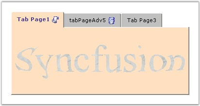
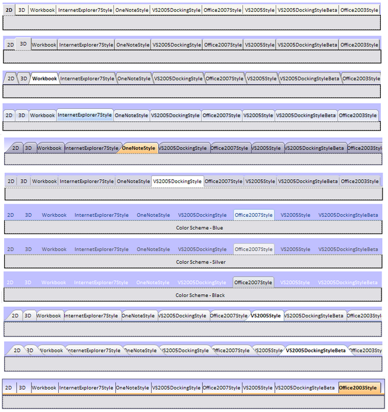

::: {style="DISPLAY: none"}
{#d2h_url_template}{#d2h_package_url style="WIDTH: 0px; DISPLAY: none; HEIGHT: 0px"}
:::

::::: {.d2h_secondary_topic style="PADDING-BOTTOM: 10pt; MARGIN: 0pt; PADDING-LEFT: 0pt; PADDING-RIGHT: 0pt; PADDING-TOP: 0pt"}
##### BackColor Settings {#backcolor-settings style="MARGIN-LEFT: 18pt; tab-stops: 18.0pt"}

[]{style="COLOR: #15428b"} 

BackColor Settings for the TabControl

[]{style="COLOR: #15428b"} 

The look and feel of the tabcontrols can be customized using the below **Tab** and **Panel** properties.

[]{style="COLOR: #15428b"} 

::: {align="center"}
  ------------------------ ------------------------------------------------------------------------
  TabControlAdv Property   Description
  ActiveTabColor           Specifies the backcolor for the selected tab.
  BackColor                Specifies the backcolor for all the tabpages.
  InactiveTabColor         Specifies the backcolor to be used for the inactive tabs.
  TabPanelBackColor        Specifies the color for the tabpanel over which the tabitems are laid.
  ------------------------ ------------------------------------------------------------------------
:::

[]{style="COLOR: #15428b"} 

BackColor Settings for the TabItems

[]{style="COLOR: #15428b"} 

The backcolor of the individual tabitems can be customized by setting the **TabBackColor** property of the corresponding tabpages.

[]{style="COLOR: #15428b"} 

::: {align="center"}
  ------------------------ ------------------------------------------
  TabControlAdv Property   Description
  TabBackColor             Specifies the backcolor for the tabitem.
  ------------------------ ------------------------------------------
:::

[           ]{style="COLOR: #15428b"}

+-------------------------------------------------------------------------------------------------------------------------------------------------------------------------------------+
| **[\[C#\]]{style="FONT-FAMILY: 'Courier New'; COLOR: black"}**                                                                                                                      |
|                                                                                                                                                                                     |
| **[]{style="FONT-FAMILY: 'Courier New'; COLOR: black"}**                                                                                                                            |
|                                                                                                                                                                                     |
| [this]{style="FONT-FAMILY: 'Courier New'; COLOR: blue"}[.tabControlAdv1.ActiveTabColor = System.Drawing.[Color]{style="COLOR: teal"}.Ivory;]{style="FONT-FAMILY: 'Courier New'"}    |
|                                                                                                                                                                                     |
| [this]{style="FONT-FAMILY: 'Courier New'; COLOR: blue"}[.tabControlAdv1.InactiveTabColor = System.Drawing.[Color]{style="COLOR: teal"}.Silver;]{style="FONT-FAMILY: 'Courier New'"} |
|                                                                                                                                                                                     |
| [this]{style="FONT-FAMILY: 'Courier New'; COLOR: blue"}[.tabControlAdv1.TabPanelBackColor = System.Drawing.[Color]{style="COLOR: teal"}.White;]{style="FONT-FAMILY: 'Courier New'"} |
|                                                                                                                                                                                     |
| [this]{style="FONT-FAMILY: 'Courier New'; COLOR: blue"}[.tabControlAdv1.BackColor = System.Drawing.[Color]{style="COLOR: teal"}.Yellow;]{style="FONT-FAMILY: 'Courier New'"}        |
|                                                                                                                                                                                     |
| [this]{style="FONT-FAMILY: 'Courier New'; COLOR: blue"}[.tabPageAdv1.TabBackColor = System.Drawing.[Color]{style="COLOR: teal"}.Pink;]{style="FONT-FAMILY: 'Courier New'"}          |
+-------------------------------------------------------------------------------------------------------------------------------------------------------------------------------------+

[]{style="COLOR: #15428b"} 

+------------------------------------------------------------------------------------------------------------------------------------------------------------------------------------------+
| **[\[VB.NET\]]{style="FONT-FAMILY: 'Courier New'; COLOR: black"}**                                                                                                                       |
|                                                                                                                                                                                          |
| **[]{style="FONT-FAMILY: 'Courier New'; COLOR: black"}**                                                                                                                                 |
|                                                                                                                                                                                          |
| [Private]{style="FONT-FAMILY: 'Courier New'; COLOR: blue"}[ [Me]{style="COLOR: blue"}.tabControlAdv1.ActiveTabColor = System.Drawing.Color.Ivory]{style="FONT-FAMILY: 'Courier New'"}    |
|                                                                                                                                                                                          |
| [Private]{style="FONT-FAMILY: 'Courier New'; COLOR: blue"}[ [Me]{style="COLOR: blue"}.tabControlAdv1.InactiveTabColor = System.Drawing.Color.Silver]{style="FONT-FAMILY: 'Courier New'"} |
|                                                                                                                                                                                          |
| [Private]{style="FONT-FAMILY: 'Courier New'; COLOR: blue"}[ [Me]{style="COLOR: blue"}.tabControlAdv1.TabPanelBackColor = System.Drawing.Color.White]{style="FONT-FAMILY: 'Courier New'"} |
|                                                                                                                                                                                          |
| [Private]{style="FONT-FAMILY: 'Courier New'; COLOR: blue"}[ [Me]{style="COLOR: blue"}.tabControlAdv1.BackColor = System.Drawing.Color.Yellow]{style="FONT-FAMILY: 'Courier New'"}        |
|                                                                                                                                                                                          |
| [Private]{style="FONT-FAMILY: 'Courier New'; COLOR: blue"}[ [Me]{style="COLOR: blue"}.tabPageAdv1.TabBackColor = System.Drawing.Color.Pink]{style="FONT-FAMILY: 'Courier New'"}          |
+------------------------------------------------------------------------------------------------------------------------------------------------------------------------------------------+

[]{style="COLOR: #15428b"} 

{border="0"}

[]{style="COLOR: #15428b"} 

Figure 1062: TabControl with various BackColor Settings

**[]{style="COLOR: #15428b"}** 

{border="0"}

**[]{style="COLOR: #15428b"}** 

Figure 1063: TabControl with TabPanelBackColor for Various TabStyles

 

 

 

 

[]{#related-topics}
:::::
