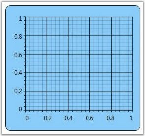
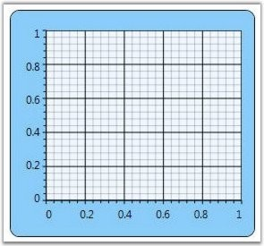
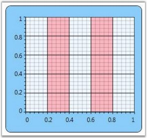

::: {style="DISPLAY: none"}
{#d2h_url_template}{#d2h_package_url style="WIDTH: 0px; DISPLAY: none; HEIGHT: 0px"}
:::

:::: {.d2h_secondary_topic style="PADDING-BOTTOM: 10pt; MARGIN: 0pt; PADDING-LEFT: 0pt; PADDING-RIGHT: 0pt; PADDING-TOP: 0pt"}
##### Background {#background style="tab-stops: 0pt"}

You can customize the background of the Chart Area to suit the application by specifying custom brushes for the **Background** property. The following code example illustrates this.

[]{style="FONT-FAMILY: 'Trebuchet MS','sans-serif'; COLOR: #15428b; FONT-SIZE: 9pt"} 

+--------------------------------------------------------------------------------------------------------------------------------------------------------------------------------------------------------------------------------------------------------------------------------------------------------------------------------------------------------------------------+
| **[\[XAML\]]{style="FONT-FAMILY: 'Courier New'"}**                                                                                                                                                                                                                                                                                                                       |
|                                                                                                                                                                                                                                                                                                                                                                          |
| []{style="FONT-FAMILY: 'Courier New'"}                                                                                                                                                                                                                                                                                                                                   |
|                                                                                                                                                                                                                                                                                                                                                                          |
| [\<]{style="FONT-FAMILY: 'Courier New'; COLOR: blue"}[sfchart]{style="FONT-FAMILY: 'Courier New'; COLOR: #a31515"}[:]{style="FONT-FAMILY: 'Courier New'; COLOR: blue"}[Chart]{style="FONT-FAMILY: 'Courier New'; COLOR: #a31515"}[\>]{style="FONT-FAMILY: 'Courier New'; COLOR: blue"}                                                                                   |
|                                                                                                                                                                                                                                                                                                                                                                          |
| [\<]{style="FONT-FAMILY: 'Courier New'; COLOR: blue"}[sfchart]{style="FONT-FAMILY: 'Courier New'; COLOR: #a31515"}[:]{style="FONT-FAMILY: 'Courier New'; COLOR: blue"}[ChartArea]{style="FONT-FAMILY: 'Courier New'; COLOR: #a31515"}[ Background]{style="FONT-FAMILY: 'Courier New'; COLOR: red"}[=\"LightSkyBlue\"\>]{style="FONT-FAMILY: 'Courier New'; COLOR: blue"} |
|                                                                                                                                                                                                                                                                                                                                                                          |
| [\<]{style="FONT-FAMILY: 'Courier New'; COLOR: blue"}[sfchart]{style="FONT-FAMILY: 'Courier New'; COLOR: #a31515"}[:]{style="FONT-FAMILY: 'Courier New'; COLOR: blue"}[ChartSeries]{style="FONT-FAMILY: 'Courier New'; COLOR: #a31515"}[/\>]{style="FONT-FAMILY: 'Courier New'; COLOR: blue"}                                                                            |
|                                                                                                                                                                                                                                                                                                                                                                          |
| [\</]{style="FONT-FAMILY: 'Courier New'; COLOR: blue"}[sfchart]{style="FONT-FAMILY: 'Courier New'; COLOR: #a31515"}[:]{style="FONT-FAMILY: 'Courier New'; COLOR: blue"}[ChartArea]{style="FONT-FAMILY: 'Courier New'; COLOR: #a31515"}[\>]{style="FONT-FAMILY: 'Courier New'; COLOR: blue"}                                                                              |
|                                                                                                                                                                                                                                                                                                                                                                          |
| [\</]{style="FONT-FAMILY: 'Courier New'; COLOR: blue"}[sfchart]{style="FONT-FAMILY: 'Courier New'; COLOR: #a31515"}[:]{style="FONT-FAMILY: 'Courier New'; COLOR: blue"}[Chart]{style="FONT-FAMILY: 'Courier New'; COLOR: #a31515"}[\>]{style="FONT-FAMILY: 'Courier New'; COLOR: blue"}                                                                                  |
+--------------------------------------------------------------------------------------------------------------------------------------------------------------------------------------------------------------------------------------------------------------------------------------------------------------------------------------------------------------------------+

[]{style="FONT-FAMILY: 'Trebuchet MS','sans-serif'; COLOR: #15428b; FONT-SIZE: 9pt"} 

+--------------------------------------------------------------------------------------------------------------------------------------------------------------------------------+
| **[\[C#\]]{style="FONT-FAMILY: 'Courier New'"}**                                                                                                                               |
|                                                                                                                                                                                |
| []{style="FONT-FAMILY: 'Courier New'"}                                                                                                                                         |
|                                                                                                                                                                                |
| [ChartArea]{style="FONT-FAMILY: 'Courier New'; COLOR: #2b91af"}[ area = [new]{style="COLOR: blue"} [ChartArea]{style="COLOR: #2b91af"}();]{style="FONT-FAMILY: 'Courier New'"} |
|                                                                                                                                                                                |
| [area.Background = [Brushes]{style="COLOR: #2b91af"}.LightSkyBlue;]{style="FONT-FAMILY: 'Courier New'"}                                                                        |
|                                                                                                                                                                                |
| [Chart1.Areas.Add(area);]{style="FONT-FAMILY: 'Courier New'"}                                                                                                                  |
+--------------------------------------------------------------------------------------------------------------------------------------------------------------------------------+

[]{style="FONT-FAMILY: 'Trebuchet MS','sans-serif'; COLOR: #15428b; FONT-SIZE: 9pt"} 

{border="0"}

Figure 67: Background = \"LightSkyBlue\"

[]{style="FONT-FAMILY: 'Trebuchet MS','sans-serif'; COLOR: #15428b; FONT-SIZE: 9pt"} 

Grid Background

The **GridBackground** property of the Chart Area is used to change the color of the inner area of the Chart Area object. The following code example illustrates how to set this property.

[]{style="FONT-FAMILY: 'Trebuchet MS','sans-serif'; COLOR: #15428b; FONT-SIZE: 9pt"} 

+------------------------------------------------------------------------------------------------------------------------------------------------------------------------------------------------------------------------------------------------------------------------------------------------------------------------------------------------------------------------------------------------------------------------------------------------------------------------------------------------------------+
| **[\[XAML\]]{style="FONT-FAMILY: 'Courier New'"}**                                                                                                                                                                                                                                                                                                                                                                                                                                                         |
|                                                                                                                                                                                                                                                                                                                                                                                                                                                                                                            |
| []{style="FONT-FAMILY: 'Courier New'"}                                                                                                                                                                                                                                                                                                                                                                                                                                                                     |
|                                                                                                                                                                                                                                                                                                                                                                                                                                                                                                            |
| [\<]{style="FONT-FAMILY: 'Courier New'; COLOR: blue"}[sfchart]{style="FONT-FAMILY: 'Courier New'; COLOR: #a31515"}[:]{style="FONT-FAMILY: 'Courier New'; COLOR: blue"}[Chart]{style="FONT-FAMILY: 'Courier New'; COLOR: #a31515"}[\>]{style="FONT-FAMILY: 'Courier New'; COLOR: blue"}                                                                                                                                                                                                                     |
|                                                                                                                                                                                                                                                                                                                                                                                                                                                                                                            |
| [\<]{style="FONT-FAMILY: 'Courier New'; COLOR: blue"}[sfchart]{style="FONT-FAMILY: 'Courier New'; COLOR: #a31515"}[:]{style="FONT-FAMILY: 'Courier New'; COLOR: blue"}[ChartArea]{style="FONT-FAMILY: 'Courier New'; COLOR: #a31515"}[ Background]{style="FONT-FAMILY: 'Courier New'; COLOR: red"}[=\"LightSkyBlue\"]{style="FONT-FAMILY: 'Courier New'; COLOR: blue"}[ GridBackground]{style="FONT-FAMILY: 'Courier New'; COLOR: red"}[=\"AliceBlue\"\>]{style="FONT-FAMILY: 'Courier New'; COLOR: blue"} |
|                                                                                                                                                                                                                                                                                                                                                                                                                                                                                                            |
| [\<]{style="FONT-FAMILY: 'Courier New'; COLOR: blue"}[sfchart]{style="FONT-FAMILY: 'Courier New'; COLOR: #a31515"}[:]{style="FONT-FAMILY: 'Courier New'; COLOR: blue"}[ChartSeries]{style="FONT-FAMILY: 'Courier New'; COLOR: #a31515"}[/\>]{style="FONT-FAMILY: 'Courier New'; COLOR: blue"}                                                                                                                                                                                                              |
|                                                                                                                                                                                                                                                                                                                                                                                                                                                                                                            |
| [\</]{style="FONT-FAMILY: 'Courier New'; COLOR: blue"}[sfchart]{style="FONT-FAMILY: 'Courier New'; COLOR: #a31515"}[:]{style="FONT-FAMILY: 'Courier New'; COLOR: blue"}[ChartArea]{style="FONT-FAMILY: 'Courier New'; COLOR: #a31515"}[\>]{style="FONT-FAMILY: 'Courier New'; COLOR: blue"}                                                                                                                                                                                                                |
|                                                                                                                                                                                                                                                                                                                                                                                                                                                                                                            |
| [\</]{style="FONT-FAMILY: 'Courier New'; COLOR: blue"}[sfchart]{style="FONT-FAMILY: 'Courier New'; COLOR: #a31515"}[:]{style="FONT-FAMILY: 'Courier New'; COLOR: blue"}[Chart]{style="FONT-FAMILY: 'Courier New'; COLOR: #a31515"}[\>]{style="FONT-FAMILY: 'Courier New'; COLOR: blue"}                                                                                                                                                                                                                    |
+------------------------------------------------------------------------------------------------------------------------------------------------------------------------------------------------------------------------------------------------------------------------------------------------------------------------------------------------------------------------------------------------------------------------------------------------------------------------------------------------------------+

[]{style="FONT-FAMILY: 'Trebuchet MS','sans-serif'; COLOR: #15428b; FONT-SIZE: 9pt"} 

+--------------------------------------------------------------------------------------------------------------------------------------------------------------------------------+
| **[\[C#\]]{style="FONT-FAMILY: 'Courier New'"}**                                                                                                                               |
|                                                                                                                                                                                |
| []{style="FONT-FAMILY: 'Courier New'"}                                                                                                                                         |
|                                                                                                                                                                                |
| [ChartArea]{style="FONT-FAMILY: 'Courier New'; COLOR: #2b91af"}[ area = [new]{style="COLOR: blue"} [ChartArea]{style="COLOR: #2b91af"}();]{style="FONT-FAMILY: 'Courier New'"} |
|                                                                                                                                                                                |
| [area.Background = [Brushes]{style="COLOR: #2b91af"}.LightSkyBlue;]{style="FONT-FAMILY: 'Courier New'"}                                                                        |
|                                                                                                                                                                                |
| [area.GridBackground = [Brushes]{style="COLOR: #2b91af"}.AliceBlue;]{style="FONT-FAMILY: 'Courier New'"}                                                                       |
|                                                                                                                                                                                |
| [Chart1.Areas.Add(area);]{style="FONT-FAMILY: 'Courier New'"}                                                                                                                  |
+--------------------------------------------------------------------------------------------------------------------------------------------------------------------------------+

[]{style="FONT-FAMILY: 'Trebuchet MS','sans-serif'; COLOR: #15428b; FONT-SIZE: 9pt"} 

{border="0"}

Figure 68: Background = \"LightSkyBlue\" and GridBackground = \"AliceBlue\"

[]{style="FONT-FAMILY: 'Trebuchet MS','sans-serif'; COLOR: #15428b; FONT-SIZE: 9pt"} 

Essential Chart alternatively provides options to apply two backgrounds to a single Chart Area. The following properties of the ChartArea class are used for this purpose.

[]{style="FONT-FAMILY: 'Trebuchet MS','sans-serif'; COLOR: #15428b; FONT-SIZE: 9pt"} 

Table 9: Property Table

::: {align="center"}
  -------------------------- ---------------------------------------------------------------------------------------------------------------------
  Property                   Description
  AlternatingBackground      specifies the alternating background
  AlternatingFillMode        enum property that specifies whether Even or Odd interval should be filled with the alternating background color
  AlternatingFillDirection   orientation property that specifies whether the alternating background should be applied horizontally or vertically
  -------------------------- ---------------------------------------------------------------------------------------------------------------------
:::

[]{style="FONT-FAMILY: 'Trebuchet MS','sans-serif'; COLOR: #15428b; FONT-SIZE: 9pt"} 

The following code example illustrates how to set the preceding properties.

[]{style="FONT-FAMILY: 'Trebuchet MS','sans-serif'; COLOR: #15428b; FONT-SIZE: 9pt"} 

+----------------------------------------------------------------------------------------------------------------------------------------------------------------------------------------------------------------------------------------------------------------------------------------------------------------------------------------------------------------------------------------------------------------------------------------------------------------------------------------------------------------------------------------------------------------------------------------------------------------------------------------------------------------------------------------------------------------------------------------------------------------------------------------------------------------------------------------------------------------------------------------------------------------------------------------+
| **[\[XAML\]]{style="FONT-FAMILY: 'Courier New'"}**                                                                                                                                                                                                                                                                                                                                                                                                                                                                                                                                                                                                                                                                                                                                                                                                                                                                                     |
|                                                                                                                                                                                                                                                                                                                                                                                                                                                                                                                                                                                                                                                                                                                                                                                                                                                                                                                                        |
| []{style="FONT-FAMILY: 'Courier New'"}                                                                                                                                                                                                                                                                                                                                                                                                                                                                                                                                                                                                                                                                                                                                                                                                                                                                                                 |
|                                                                                                                                                                                                                                                                                                                                                                                                                                                                                                                                                                                                                                                                                                                                                                                                                                                                                                                                        |
| [\<]{style="FONT-FAMILY: 'Courier New'; COLOR: blue"}[sfchart]{style="FONT-FAMILY: 'Courier New'; COLOR: #a31515"}[:]{style="FONT-FAMILY: 'Courier New'; COLOR: blue"}[Chart]{style="FONT-FAMILY: 'Courier New'; COLOR: #a31515"}[\>]{style="FONT-FAMILY: 'Courier New'; COLOR: blue"}                                                                                                                                                                                                                                                                                                                                                                                                                                                                                                                                                                                                                                                 |
|                                                                                                                                                                                                                                                                                                                                                                                                                                                                                                                                                                                                                                                                                                                                                                                                                                                                                                                                        |
| [\<]{style="FONT-FAMILY: 'Courier New'; COLOR: blue"}[sfchart]{style="FONT-FAMILY: 'Courier New'; COLOR: #a31515"}[:]{style="FONT-FAMILY: 'Courier New'; COLOR: blue"}[ChartArea]{style="FONT-FAMILY: 'Courier New'; COLOR: #a31515"}[ Background]{style="FONT-FAMILY: 'Courier New'; COLOR: red"}[=\"LightSkyBlue\"]{style="FONT-FAMILY: 'Courier New'; COLOR: blue"}[ GridBackground]{style="FONT-FAMILY: 'Courier New'; COLOR: red"}[=\"AliceBlue\"]{style="FONT-FAMILY: 'Courier New'; COLOR: blue"}[ AlternatingGridBackground]{style="FONT-FAMILY: 'Courier New'; COLOR: red"}[=\"LightPink\"]{style="FONT-FAMILY: 'Courier New'; COLOR: blue"}[ AlternatingFillMode]{style="FONT-FAMILY: 'Courier New'; COLOR: red"}[=\"Even\"]{style="FONT-FAMILY: 'Courier New'; COLOR: blue"}[ AlternatingFillDirection]{style="FONT-FAMILY: 'Courier New'; COLOR: red"}[=\"Horizontal\"\>]{style="FONT-FAMILY: 'Courier New'; COLOR: blue"} |
|                                                                                                                                                                                                                                                                                                                                                                                                                                                                                                                                                                                                                                                                                                                                                                                                                                                                                                                                        |
| [\<]{style="FONT-FAMILY: 'Courier New'; COLOR: blue"}[sfchart]{style="FONT-FAMILY: 'Courier New'; COLOR: #a31515"}[:]{style="FONT-FAMILY: 'Courier New'; COLOR: blue"}[ChartSeries]{style="FONT-FAMILY: 'Courier New'; COLOR: #a31515"}[/\>]{style="FONT-FAMILY: 'Courier New'; COLOR: blue"}                                                                                                                                                                                                                                                                                                                                                                                                                                                                                                                                                                                                                                          |
|                                                                                                                                                                                                                                                                                                                                                                                                                                                                                                                                                                                                                                                                                                                                                                                                                                                                                                                                        |
| [\</]{style="FONT-FAMILY: 'Courier New'; COLOR: blue"}[sfchart]{style="FONT-FAMILY: 'Courier New'; COLOR: #a31515"}[:]{style="FONT-FAMILY: 'Courier New'; COLOR: blue"}[ChartArea]{style="FONT-FAMILY: 'Courier New'; COLOR: #a31515"}[\>]{style="FONT-FAMILY: 'Courier New'; COLOR: blue"}                                                                                                                                                                                                                                                                                                                                                                                                                                                                                                                                                                                                                                            |
|                                                                                                                                                                                                                                                                                                                                                                                                                                                                                                                                                                                                                                                                                                                                                                                                                                                                                                                                        |
| [\</]{style="FONT-FAMILY: 'Courier New'; COLOR: blue"}[sfchart]{style="FONT-FAMILY: 'Courier New'; COLOR: #a31515"}[:]{style="FONT-FAMILY: 'Courier New'; COLOR: blue"}[Chart]{style="FONT-FAMILY: 'Courier New'; COLOR: #a31515"}[\>]{style="FONT-FAMILY: 'Courier New'; COLOR: blue"}                                                                                                                                                                                                                                                                                                                                                                                                                                                                                                                                                                                                                                                |
+----------------------------------------------------------------------------------------------------------------------------------------------------------------------------------------------------------------------------------------------------------------------------------------------------------------------------------------------------------------------------------------------------------------------------------------------------------------------------------------------------------------------------------------------------------------------------------------------------------------------------------------------------------------------------------------------------------------------------------------------------------------------------------------------------------------------------------------------------------------------------------------------------------------------------------------+

[]{style="FONT-FAMILY: 'Trebuchet MS','sans-serif'; COLOR: #15428b; FONT-SIZE: 9pt"} 

+--------------------------------------------------------------------------------------------------------------------------------------------------------------------------------+
| **[\[C#\]]{style="FONT-FAMILY: 'Courier New'"}**                                                                                                                               |
|                                                                                                                                                                                |
| []{style="FONT-FAMILY: 'Courier New'"}                                                                                                                                         |
|                                                                                                                                                                                |
| [ChartArea]{style="FONT-FAMILY: 'Courier New'; COLOR: #2b91af"}[ area = [new]{style="COLOR: blue"} [ChartArea]{style="COLOR: #2b91af"}();]{style="FONT-FAMILY: 'Courier New'"} |
|                                                                                                                                                                                |
| [area.Background = [Brushes]{style="COLOR: #2b91af"}.LightSkyBlue;]{style="FONT-FAMILY: 'Courier New'"}                                                                        |
|                                                                                                                                                                                |
| [area.GridBackground = [Brushes]{style="COLOR: #2b91af"}.AliceBlue;]{style="FONT-FAMILY: 'Courier New'"}                                                                       |
|                                                                                                                                                                                |
| [area.AlternatingGridBackground = [Brushes]{style="COLOR: #2b91af"}.LightPink;]{style="FONT-FAMILY: 'Courier New'"}                                                            |
|                                                                                                                                                                                |
| [area.AlternatingFillMode = [AlternatingFillMode]{style="COLOR: #2b91af"}.Even;]{style="FONT-FAMILY: 'Courier New'"}                                                           |
|                                                                                                                                                                                |
| [area.AlternatingFillDirection = [Orientation]{style="COLOR: #2b91af"}.Horizontal;]{style="FONT-FAMILY: 'Courier New'"}                                                        |
|                                                                                                                                                                                |
| [Chart1.Areas.Add(area);]{style="FONT-FAMILY: 'Courier New'"}                                                                                                                  |
+--------------------------------------------------------------------------------------------------------------------------------------------------------------------------------+

[]{style="FONT-FAMILY: 'Trebuchet MS','sans-serif'; COLOR: #15428b; FONT-SIZE: 9pt"} 

{border="0"}

Figure 69: AlternatingGridBackground = \"LightPink\"

[]{style="FONT-FAMILY: 'Trebuchet MS','sans-serif'; COLOR: #15428b; FONT-SIZE: 9pt"} 

See Also

[[Adding Chart Area]{.UGHyperlink}](ms-xhelp:///?Id=7a4bd133-0828-48b7-b08e-2b8eedbc775a)[]{.UGHyperlink}

[]{#related-topics}
::::
