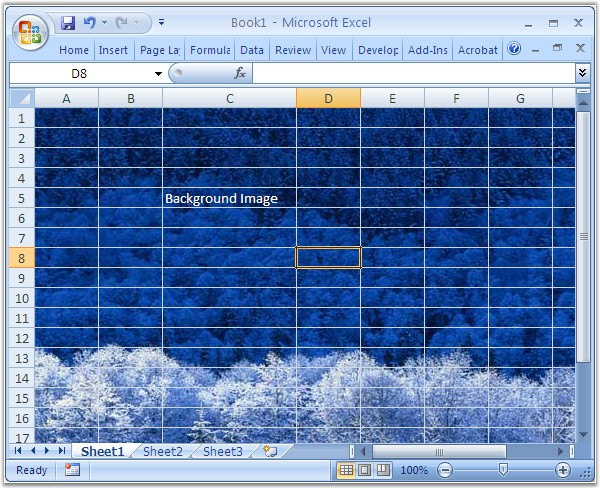

::: {style="DISPLAY: none"}
{#d2h_url_template}{#d2h_package_url style="WIDTH: 0px; DISPLAY: none; HEIGHT: 0px"}
:::

:::: {.d2h_secondary_topic style="PADDING-BOTTOM: 10pt; MARGIN: 0pt; PADDING-LEFT: 0pt; PADDING-RIGHT: 0pt; PADDING-TOP: 0pt"}
#### Background {#background style="tab-stops: 0pt"}

**[]{style="FONT-FAMILY: 'Segoe UI','sans-serif'; COLOR: black"}** 

MS Excel enables to set the background for the worksheet with an image, which covers the entire worksheet. Depending upon the image size and type, the background graphic may either be stretched across your worksheet or tiled.

[]{style="FONT-FAMILY: 'Trebuchet MS','sans-serif'; COLOR: #15428b; FONT-SIZE: 9pt"} 

::: {style="BORDER-BOTTOM: windowtext 1pt solid; BORDER-LEFT: medium none; PADDING-BOTTOM: 1pt; MARGIN-TOP: 9pt; PADDING-LEFT: 0pt; PADDING-RIGHT: 0pt; MARGIN-BOTTOM: 9pt; BORDER-TOP: windowtext 1pt solid; BORDER-RIGHT: medium none; PADDING-TOP: 1pt"}
{border="0"}Note: The sheet backgrounds may tremendously increase the file size of the workbooks.
:::

[]{style="FONT-FAMILY: 'Trebuchet MS','sans-serif'; COLOR: #15428b; FONT-SIZE: 9pt"} 

Background images which are set this way, cannot be printed. To set a Watermark that can be printed, you can make use of Headers and Footers. This can be viewed only through the **Print Preview** option, and it is not visible in the Normal view.

[]{style="FONT-FAMILY: 'Trebuchet MS','sans-serif'; COLOR: #15428b; FONT-SIZE: 9pt"} 

XlsIO provides support for inserting background images through the **BackgroundImage** property of IPageSetup.

 

Following code example illustrates how to insert a background image.

[]{style="FONT-FAMILY: 'Trebuchet MS','sans-serif'; COLOR: #15428b; FONT-SIZE: 9pt"} 

+----------------------------------------------------------------------------------------------+
| **[\[C#\]]{style="FONT-FAMILY: 'Courier New'"}**                                             |
|                                                                                              |
| []{style="FONT-FAMILY: 'Courier New'"}                                                       |
|                                                                                              |
| [// Setting the Paper Type.]{style="FONT-FAMILY: 'Courier New'; COLOR: green"}               |
|                                                                                              |
| [sheet.PageSetup.BackgroundImage = image;]{style="FONT-FAMILY: 'Courier New'; COLOR: black"} |
+----------------------------------------------------------------------------------------------+

[]{style="FONT-FAMILY: 'Trebuchet MS','sans-serif'; COLOR: #15428b; FONT-SIZE: 9pt"} 

+---------------------------------------------------------------------------------------------+
| **[\[VB.NET\]]{style="FONT-FAMILY: 'Courier New'"}**                                        |
|                                                                                             |
| []{style="FONT-FAMILY: 'Courier New'"}                                                      |
|                                                                                             |
| [\' Setting the Paper Type.]{style="FONT-FAMILY: 'Courier New'; COLOR: green"}              |
|                                                                                             |
| [sheet.PageSetup.BackgroundImage = image]{style="FONT-FAMILY: 'Courier New'; COLOR: black"} |
+---------------------------------------------------------------------------------------------+

[]{style="FONT-FAMILY: 'Trebuchet MS','sans-serif'; COLOR: #15428b; FONT-SIZE: 9pt"} 

{border="0"}

Figure 114: Setting Background Image Using XlsIO[]{style="FONT-FAMILY: 'Trebuchet MS','sans-serif'; COLOR: #15428b"}

[]{style="FONT-FAMILY: 'Trebuchet MS','sans-serif'; COLOR: #15428b; FONT-SIZE: 9pt"} 

 

[]{#related-topics}
::::
