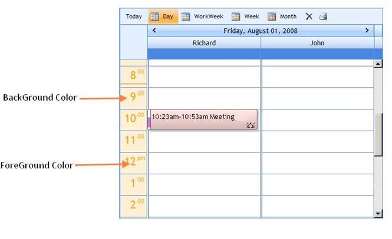
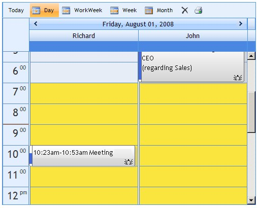

::: {style="DISPLAY: none"}
{#d2h_url_template}{#d2h_package_url style="WIDTH: 0px; DISPLAY: none; HEIGHT: 0px"}
:::

::::: {.d2h_secondary_topic style="PADDING-BOTTOM: 10pt; MARGIN: 0pt; PADDING-LEFT: 0pt; PADDING-RIGHT: 0pt; PADDING-TOP: 0pt"}
#### Background and Foreground Settings {#background-and-foreground-settings style="tab-stops: 0pt"}

[]{style="FONT-FAMILY: 'Trebuchet MS','sans-serif'; COLOR: #15428b; FONT-SIZE: 9pt"} 

Back Color and Fore Color for Appointment Rows

[]{style="FONT-FAMILY: 'Trebuchet MS','sans-serif'; COLOR: #15428b; FONT-SIZE: 9pt"} 

You can set the back color and fore color for the appointment rows by using the below given properties.

[]{style="FONT-FAMILY: 'Trebuchet MS','sans-serif'; COLOR: #15428b; FONT-SIZE: 9pt"} 

::: {align="center"}
+-----------------------------------+------------------------------------------------+
|                                   |                                                |
|                                   |                                                |
| Appointment Property              | Description                                    |
+-----------------------------------+------------------------------------------------+
| AppointmentRowColor               | Specifies the back color of appointments rows. |
+-----------------------------------+------------------------------------------------+
| AppointmentRowTextColor           | Specifies the text color of appointments rows. |
+-----------------------------------+------------------------------------------------+
:::

[]{style="FONT-FAMILY: 'Trebuchet MS','sans-serif'; COLOR: #15428b; FONT-SIZE: 9pt"} 

+-----------------------------------------------------------------------------------------------------------------------------------------------------------------------------------------------------------------------------------------------------------------------------------------------------------------------------------------------------------------------------------------------------------------------------------------------------------------------------------------------------------------------------------------------------------------------------+
| **[\[ASPX\]]{style="FONT-FAMILY: 'Courier New'"}**                                                                                                                                                                                                                                                                                                                                                                                                                                                                                                                          |
|                                                                                                                                                                                                                                                                                                                                                                                                                                                                                                                                                                             |
| []{style="FONT-FAMILY: 'Courier New'"}                                                                                                                                                                                                                                                                                                                                                                                                                                                                                                                                      |
|                                                                                                                                                                                                                                                                                                                                                                                                                                                                                                                                                                             |
| [\<]{style="FONT-FAMILY: 'Courier New'; COLOR: blue"}[Syncfusion]{style="FONT-FAMILY: 'Courier New'; COLOR: #a31515"}[:]{style="FONT-FAMILY: 'Courier New'; COLOR: blue"}[schedule]{style="FONT-FAMILY: 'Courier New'; COLOR: #a31515"}[ [id]{style="COLOR: red"}[=\"Schedule1\"]{style="COLOR: blue"} [runat]{style="COLOR: red"}[=\"server\"]{style="COLOR: blue"} [AppointmentRowColor]{style="COLOR: red"}[=\"PapayaWhip\"]{style="COLOR: blue"} [AppointmentRowTextColor]{style="COLOR: red"}[=\"Orange\"\>]{style="COLOR: blue"}]{style="FONT-FAMILY: 'Courier New'"} |
|                                                                                                                                                                                                                                                                                                                                                                                                                                                                                                                                                                             |
| [\</]{style="FONT-FAMILY: 'Courier New'; COLOR: blue"}[Syncfusion]{style="FONT-FAMILY: 'Courier New'; COLOR: #a31515"}[:]{style="FONT-FAMILY: 'Courier New'; COLOR: blue"}[schedule]{style="FONT-FAMILY: 'Courier New'; COLOR: #a31515"}[\>]{style="FONT-FAMILY: 'Courier New'; COLOR: blue"}                                                                                                                                                                                                                                                                               |
+-----------------------------------------------------------------------------------------------------------------------------------------------------------------------------------------------------------------------------------------------------------------------------------------------------------------------------------------------------------------------------------------------------------------------------------------------------------------------------------------------------------------------------------------------------------------------------+

[]{style="FONT-FAMILY: 'Trebuchet MS','sans-serif'; COLOR: #15428b; FONT-SIZE: 9pt"} 

+----------------------------------------------------------------------------------------------------------------------------------+
| **[\[C#\]]{style="FONT-FAMILY: 'Courier New'"}**                                                                                 |
|                                                                                                                                  |
| []{style="FONT-FAMILY: 'Courier New'"}                                                                                           |
|                                                                                                                                  |
| [Schedule1.AppointmentRowColor = System.Drawing.[Color]{style="COLOR: #2b91af"}.PapayaWhip;]{style="FONT-FAMILY: 'Courier New'"} |
|                                                                                                                                  |
| [Schedule1.AppointmentRowTextColor = System.Drawing.[Color]{style="COLOR: #2b91af"}.Orange;]{style="FONT-FAMILY: 'Courier New'"} |
+----------------------------------------------------------------------------------------------------------------------------------+

[]{style="FONT-FAMILY: 'Trebuchet MS','sans-serif'; COLOR: #15428b; FONT-SIZE: 9pt"} 

+------------------------------------------------------------------------------------------------------------------------------------------------------------------+
| **[\[VB\]]{style="FONT-FAMILY: 'Courier New'"}**                                                                                                                 |
|                                                                                                                                                                  |
| []{style="FONT-FAMILY: 'Courier New'"}                                                                                                                           |
|                                                                                                                                                                  |
| [Private]{style="FONT-FAMILY: 'Courier New'; COLOR: blue"}[ Schedule1.AppointmentRowColor = System.Drawing.Color.PapayaWhip]{style="FONT-FAMILY: 'Courier New'"} |
|                                                                                                                                                                  |
| [Private]{style="FONT-FAMILY: 'Courier New'; COLOR: blue"}[ Schedule1.AppointmentRowTextColor = System.Drawing.Color.Orange]{style="FONT-FAMILY: 'Courier New'"} |
+------------------------------------------------------------------------------------------------------------------------------------------------------------------+

[]{style="FONT-FAMILY: 'Trebuchet MS','sans-serif'; COLOR: #15428b; FONT-SIZE: 9pt"} 

{border="0"}[]{style="FONT-SIZE: 12pt"}

Figure 61[]{style="FONT-SIZE: 12pt"}

[]{style="FONT-FAMILY: 'Trebuchet MS','sans-serif'; COLOR: #15428b; FONT-SIZE: 9pt"} 

Back Color for Work and Non-Work Hour Cells

[         ]{style="FONT-FAMILY: 'Trebuchet MS','sans-serif'; COLOR: #15428b; FONT-SIZE: 9pt"}

You can make use of the **SchedulerCellColor** property to set the back color for the appointment rows section. This back color applies to all the appointment rows from the DayStartHour to the DayEndHour.

Also, you can use the **WorkCellColor** property to apply the back color only to the rows that fall in between the StartWorkHour and EndWorkHour.

[]{style="FONT-FAMILY: 'Trebuchet MS','sans-serif'; COLOR: #15428b; FONT-SIZE: 9pt"} 

::: {align="center"}
+-----------------------------------+---------------------------------------------------+
|                                   |                                                   |
|                                   |                                                   |
| Schedule Property                 | Description                                       |
+-----------------------------------+---------------------------------------------------+
| SchedulerCellColor                | Specifies the back color for non-work hour cells. |
+-----------------------------------+---------------------------------------------------+
| WorkCellColor                     | Specifies the back color of work hour cells.      |
+-----------------------------------+---------------------------------------------------+
:::

[]{style="FONT-FAMILY: 'Trebuchet MS','sans-serif'; COLOR: #15428b; FONT-SIZE: 9pt"} 

+---------------------------------------------------------------------------------------------------------------------------------------------------------------------------------------------------------------------------------------------------------------------------------------------------------------------------------------------------------------------------------------------------------------------------------------------------------------------------------------------------------------------------------------------------------------+
| **[\[ASPX\]]{style="FONT-FAMILY: 'Courier New'"}**                                                                                                                                                                                                                                                                                                                                                                                                                                                                                                            |
|                                                                                                                                                                                                                                                                                                                                                                                                                                                                                                                                                               |
| []{style="FONT-FAMILY: 'Courier New'"}                                                                                                                                                                                                                                                                                                                                                                                                                                                                                                                        |
|                                                                                                                                                                                                                                                                                                                                                                                                                                                                                                                                                               |
| [\<]{style="FONT-FAMILY: 'Courier New'; COLOR: blue"}[Syncfusion]{style="FONT-FAMILY: 'Courier New'; COLOR: #a31515"}[:]{style="FONT-FAMILY: 'Courier New'; COLOR: blue"}[schedule]{style="FONT-FAMILY: 'Courier New'; COLOR: #a31515"}[ [id]{style="COLOR: red"}[=\"Schedule1\"]{style="COLOR: blue"} [runat]{style="COLOR: red"}[=\"server\"]{style="COLOR: blue"} [SchedulerCellColor]{style="COLOR: red"}[=\"#83D63\"]{style="COLOR: blue"} [WorkCellColor]{style="COLOR: red"}[=\"#FF33CC\"\>]{style="COLOR: blue"}]{style="FONT-FAMILY: 'Courier New'"} |
|                                                                                                                                                                                                                                                                                                                                                                                                                                                                                                                                                               |
| [\</]{style="FONT-FAMILY: 'Courier New'; COLOR: blue"}[Syncfusion]{style="FONT-FAMILY: 'Courier New'; COLOR: #a31515"}[:]{style="FONT-FAMILY: 'Courier New'; COLOR: blue"}[schedule]{style="FONT-FAMILY: 'Courier New'; COLOR: #a31515"}[\>]{style="FONT-FAMILY: 'Courier New'; COLOR: blue"}                                                                                                                                                                                                                                                                 |
+---------------------------------------------------------------------------------------------------------------------------------------------------------------------------------------------------------------------------------------------------------------------------------------------------------------------------------------------------------------------------------------------------------------------------------------------------------------------------------------------------------------------------------------------------------------+

[]{style="FONT-FAMILY: 'Trebuchet MS','sans-serif'; COLOR: #15428b; FONT-SIZE: 9pt"} 

+-----------------------------------------------------------------------------------------------------+
| **[\[C#\]]{style="FONT-FAMILY: 'Courier New'"}**                                                    |
|                                                                                                     |
| []{style="FONT-FAMILY: 'Courier New'"}                                                              |
|                                                                                                     |
| [Scheduler1.WorkCellColor = Color.FromArgb(250, 229, 62);]{style="FONT-FAMILY: 'Courier New'"}      |
|                                                                                                     |
| [Scheduler1.SchedulerCellColor = Color.FromArgb(201, 207, 49);]{style="FONT-FAMILY: 'Courier New'"} |
+-----------------------------------------------------------------------------------------------------+

[]{style="FONT-FAMILY: 'Trebuchet MS','sans-serif'; COLOR: #15428b; FONT-SIZE: 9pt"} 

+---------------------------------------------------------------------------------------------------------------------------------------------------------------+
| **[\[VB\]]{style="FONT-FAMILY: 'Courier New'"}**                                                                                                              |
|                                                                                                                                                               |
| []{style="FONT-FAMILY: 'Courier New'"}                                                                                                                        |
|                                                                                                                                                               |
| [Private]{style="FONT-FAMILY: 'Courier New'; COLOR: blue"}[ Scheduler1.WorkCellColor = Color.FromArgb(250, 229, 62)]{style="FONT-FAMILY: 'Courier New'"}      |
|                                                                                                                                                               |
| [Private]{style="FONT-FAMILY: 'Courier New'; COLOR: blue"}[ Scheduler1.SchedulerCellColor = Color.FromArgb(201, 207, 49)]{style="FONT-FAMILY: 'Courier New'"} |
+---------------------------------------------------------------------------------------------------------------------------------------------------------------+

[]{style="FONT-FAMILY: 'Trebuchet MS','sans-serif'; COLOR: #15428b; FONT-SIZE: 9pt"} 

{border="0"}[]{style="FONT-SIZE: 12pt"}

**[]{style="FONT-FAMILY: 'Trebuchet MS','sans-serif'; COLOR: #15428b; FONT-SIZE: 9pt"}** 

Figure 62: SchedulerCellColor applied to the Cells of the Schedule Control

[]{#p46}[]{style="FONT-SIZE: 3pt"} 

[]{#related-topics}
:::::
