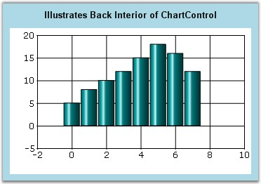
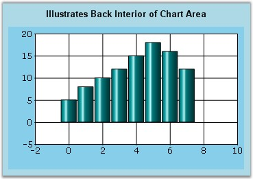
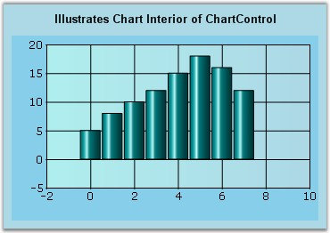

::: {style="DISPLAY: none"}
{#d2h_url_template}{#d2h_package_url style="WIDTH: 0px; DISPLAY: none; HEIGHT: 0px"}
:::

::::: {#nsbanner .d2h_main_nsbanner style="BORDER-BOTTOM: #999999 1px solid; POSITION: relative; PADDING-BOTTOM: 0px; BACKGROUND-COLOR: transparent; PADDING-LEFT: 0px; PADDING-RIGHT: 0px; DISPLAY: none; BORDER-TOP: #999999 1px solid; PADDING-TOP: 0px; LEFT: 0px"}
:::: {#TitleRow .d2h_main_titlerow style="PADDING-BOTTOM: 4px; BACKGROUND-COLOR: transparent; PADDING-LEFT: 22px; WIDTH: 100%; PADDING-RIGHT: 10px; DISPLAY: none; PADDING-TOP: 4px"}
::: {#ienav .d2h_main_ienav style="DISPLAY: none"}
{#D2HPrevious .D2HPreviousEnabled}  {#D2HNext .D2HNextEnabled}
:::
::::
:::::

:::: {#nstext .d2h_main_nstext style="PADDING-BOTTOM: 10px; BACKGROUND-COLOR: transparent; PADDING-LEFT: 22px; PADDING-RIGHT: 10px; HEIGHT: 100%; OVERFLOW: auto; PADDING-TOP: 5px" hasuserbackground="true" valign="bottom"}
::: {#d2h_breadcrumbs .d2h_breadcrumbs}
[Essential Studio User Guide Documentation](ms-xhelp:///?Id=12457748-09e3-4d74-a240-8e049cedf030){.d2h_breadcrumbsNormal}[ \> ]{.d2h_breadcrumbsLinkSeparator}[User Interface Edition](ms-xhelp:///?Id=c29296b7-531c-413b-a0ec-488ca1f7f669){.d2h_breadcrumbsNormal}[ \> ]{.d2h_breadcrumbsLinkSeparator}[Essential ASP.NET](ms-xhelp:///?Id=25c35330-c127-4dad-9a92-ed79dc7261a6){.d2h_breadcrumbsNormal}[ \> ]{.d2h_breadcrumbsLinkSeparator}[Essential Chart]{.d2h_breadcrumbsContentsOnly}[ \> ]{.d2h_breadcrumbsLinkSeparator}[Concepts and Features](ms-xhelp:///?Id=100687ce-82f2-4424-9d16-0949ea76cf15){.d2h_breadcrumbsNormal}[ \> ]{.d2h_breadcrumbsLinkSeparator}[Chart Appearance](ms-xhelp:///?Id=ffd49f03-f677-452a-81e4-aa2f18f1b9a0){.d2h_breadcrumbsNormal}
:::

### Background Colors {#background-colors style="tab-stops: 0pt"}

**[]{style="FONT-FAMILY: 'Trebuchet MS','sans-serif'"}** 

Essential Chart lets you customize the background colors of different portions of the chart.

[]{style="FONT-FAMILY: 'Trebuchet MS','sans-serif'; FONT-SIZE: 9pt"} 

Outside the Chart Area

**[]{style="FONT-FAMILY: 'Trebuchet MS','sans-serif'"}** 

Use the **BackInterior** property of the chart to customize the background of the chart that is outside the chart area. This is usually where the legend and the chart title get rendered. By default it is set to **White** color.

**[]{style="COLOR: red; FONT-SIZE: 8pt"}** 

+----------------------------------------------------------------------------------------------------------------------------------------------------------------------------------------------------------------------------------------------------------------------+
| **[\[C#\]]{style="FONT-FAMILY: 'Courier New'; COLOR: black"}**                                                                                                                                                                                                       |
|                                                                                                                                                                                                                                                                      |
| **[]{style="FONT-FAMILY: 'Courier New'; COLOR: black"}**                                                                                                                                                                                                             |
|                                                                                                                                                                                                                                                                      |
| [this]{style="FONT-FAMILY: 'Courier New'; COLOR: blue"}[.ChartWebControl1.BackInterior = [new]{style="COLOR: blue"} Syncfusion.Drawing.[BrushInfo]{style="COLOR: teal"}(System.Drawing.[Color]{style="COLOR: teal"}.LightBlue);]{style="FONT-FAMILY: 'Courier New'"} |
+----------------------------------------------------------------------------------------------------------------------------------------------------------------------------------------------------------------------------------------------------------------------+

[]{style="FONT-FAMILY: 'Trebuchet MS','sans-serif'; FONT-SIZE: 9pt"} 

+-------------------------------------------------------------------------------------------------------------------------------------------------------------------------------------------------------------------------------------------------------------------+
| **[\[VB.NET\]]{style="FONT-FAMILY: 'Courier New'; COLOR: black"}**                                                                                                                                                                                                |
|                                                                                                                                                                                                                                                                   |
| **[]{style="FONT-FAMILY: 'Courier New'; COLOR: black"}**                                                                                                                                                                                                          |
|                                                                                                                                                                                                                                                                   |
| [Me]{style="FONT-FAMILY: 'Courier New'; COLOR: blue"}[.ChartWebControl1.BackInterior = [New]{style="COLOR: blue"} Syncfusion.Drawing.[BrushInfo]{style="COLOR: teal"}(System.Drawing.[Color]{style="COLOR: teal"}.LightBlue)]{style="FONT-FAMILY: 'Courier New'"} |
+-------------------------------------------------------------------------------------------------------------------------------------------------------------------------------------------------------------------------------------------------------------------+

**[]{style="COLOR: red; FONT-SIZE: 8pt"}** 

{border="0"}

**[]{style="FONT-FAMILY: 'Trebuchet MS','sans-serif'; FONT-SIZE: 9pt"}** 

Figure 295: BackInterior = \"LightBlue\"

**[]{style="FONT-FAMILY: 'Trebuchet MS','sans-serif'"}** 

Inside the Plot Area

**[]{style="FONT-FAMILY: 'Trebuchet MS','sans-serif'"}** 

Use the **ChartArea.BackInterior** to customize the background of the rectangular region where the points are plotted.

[]{style="COLOR: red; FONT-SIZE: 8pt"} 

+------------------------------------------------------------------------------------------------------------------------------------------------------------------------------------------------------------------------------------------------------------------------------+
| **[\[C#\]]{style="FONT-FAMILY: 'Courier New'; COLOR: black"}**                                                                                                                                                                                                               |
|                                                                                                                                                                                                                                                                              |
| **[]{style="FONT-FAMILY: 'Courier New'; COLOR: black"}**                                                                                                                                                                                                                     |
|                                                                                                                                                                                                                                                                              |
| [this]{style="FONT-FAMILY: 'Courier New'; COLOR: blue"}[.ChartWebControl1.ChartArea.BackInterior = [new]{style="COLOR: blue"} Syncfusion.Drawing.[BrushInfo]{style="COLOR: teal"}(System.Drawing.[Color]{style="COLOR: teal"}.SkyBlue);]{style="FONT-FAMILY: 'Courier New'"} |
+------------------------------------------------------------------------------------------------------------------------------------------------------------------------------------------------------------------------------------------------------------------------------+

[]{style="FONT-FAMILY: 'Trebuchet MS','sans-serif'; FONT-SIZE: 9pt"} 

+---------------------------------------------------------------------------------------------------------------------------------------------------------------------------------------------------------------------------------------------------------------------------+
| **[\[VB.NET\]]{style="FONT-FAMILY: 'Courier New'; COLOR: black"}**                                                                                                                                                                                                        |
|                                                                                                                                                                                                                                                                           |
| **[]{style="FONT-FAMILY: 'Courier New'; COLOR: black"}**                                                                                                                                                                                                                  |
|                                                                                                                                                                                                                                                                           |
| [Me]{style="FONT-FAMILY: 'Courier New'; COLOR: blue"}[.ChartWebControl1.ChartArea.BackInterior = [New]{style="COLOR: blue"} Syncfusion.Drawing.[BrushInfo]{style="COLOR: teal"}(System.Drawing.[Color]{style="COLOR: teal"}.SkyBlue)]{style="FONT-FAMILY: 'Courier New'"} |
+---------------------------------------------------------------------------------------------------------------------------------------------------------------------------------------------------------------------------------------------------------------------------+

[]{style="COLOR: red; FONT-SIZE: 8pt"} 

{border="0"}

***[]{style="FONT-FAMILY: 'Trebuchet MS','sans-serif'; FONT-SIZE: 9pt"}*** 

Figure 296: ChartArea.BackInterior = \"SkyBlue\"

[]{style="FONT-FAMILY: 'Trebuchet MS','sans-serif'; FONT-SIZE: 9pt"} 

Inside the Chart Area

**[]{style="FONT-FAMILY: 'Trebuchet MS','sans-serif'"}** 

Use the **ChartInterior** property of the chart to customize the background of the chart area. By default it is set to **White** color.

[]{style="FONT-FAMILY: 'Trebuchet MS','sans-serif'; FONT-SIZE: 9pt"} 

+------------------------------------------------------------------------------------------------------------------------------------------------------------------------------------------------------------------------------------------------------------------------------------------------------------------------------------------------------------------------------------------------------+
| **[\[C#\]]{style="FONT-FAMILY: 'Courier New'; COLOR: black"}**                                                                                                                                                                                                                                                                                                                                       |
|                                                                                                                                                                                                                                                                                                                                                                                                      |
| **[]{style="FONT-FAMILY: 'Courier New'; COLOR: black"}**                                                                                                                                                                                                                                                                                                                                             |
|                                                                                                                                                                                                                                                                                                                                                                                                      |
| [this]{style="FONT-FAMILY: 'Courier New'; COLOR: blue"}[.ChartWebControl1.ChartInterior = [new]{style="COLOR: blue"} Syncfusion.Drawing.[BrushInfo]{style="COLOR: teal"}(Syncfusion.Drawing.[GradientStyle]{style="COLOR: teal"}.Horizontal, System.Drawing.[Color]{style="COLOR: teal"}.PaleTurquoise, System.Drawing.[Color]{style="COLOR: teal"}.LightBlue);]{style="FONT-FAMILY: 'Courier New'"} |
+------------------------------------------------------------------------------------------------------------------------------------------------------------------------------------------------------------------------------------------------------------------------------------------------------------------------------------------------------------------------------------------------------+

[]{style="FONT-FAMILY: 'Trebuchet MS','sans-serif'; FONT-SIZE: 9pt"} 

+-----------------------------------------------------------------------------------------------------------------------------------------------------------------------------------------------------------------------------------------------------------------------------------------------------------------------------------------------------------------------------------------------------+
| **[\[VB.NET\]]{style="FONT-FAMILY: 'Courier New'; COLOR: black"}**                                                                                                                                                                                                                                                                                                                                  |
|                                                                                                                                                                                                                                                                                                                                                                                                     |
| **[]{style="FONT-FAMILY: 'Courier New'; COLOR: black"}**                                                                                                                                                                                                                                                                                                                                            |
|                                                                                                                                                                                                                                                                                                                                                                                                     |
| [this]{style="FONT-FAMILY: 'Courier New'; COLOR: blue"}[.ChartWebControl1.ChartInterior = [New]{style="COLOR: blue"} Syncfusion.Drawing.[BrushInfo]{style="COLOR: teal"}(Syncfusion.Drawing.[GradientStyle]{style="COLOR: teal"}.Horizontal, System.Drawing.[Color]{style="COLOR: teal"}.PaleTurquoise, System.Drawing.[Color]{style="COLOR: teal"}.LightBlue)]{style="FONT-FAMILY: 'Courier New'"} |
+-----------------------------------------------------------------------------------------------------------------------------------------------------------------------------------------------------------------------------------------------------------------------------------------------------------------------------------------------------------------------------------------------------+

[]{style="COLOR: red; FONT-SIZE: 8pt"} 

{border="0"}

***[]{style="FONT-FAMILY: 'Trebuchet MS','sans-serif'; FONT-SIZE: 9pt"}*** 

Figure 297: ChartInterior = \"LightBlue\"

[]{#p206} 

[]{#related-topics}
::::
