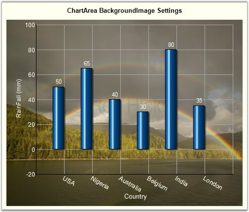
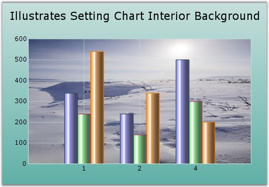

::: {style="DISPLAY: none"}
{#d2h_url_template}{#d2h_package_url style="WIDTH: 0px; DISPLAY: none; HEIGHT: 0px"}
:::

::::: {#nsbanner .d2h_main_nsbanner style="BORDER-BOTTOM: #999999 1px solid; POSITION: relative; PADDING-BOTTOM: 0px; BACKGROUND-COLOR: transparent; PADDING-LEFT: 0px; PADDING-RIGHT: 0px; DISPLAY: none; BORDER-TOP: #999999 1px solid; PADDING-TOP: 0px; LEFT: 0px"}
:::: {#TitleRow .d2h_main_titlerow style="PADDING-BOTTOM: 4px; BACKGROUND-COLOR: transparent; PADDING-LEFT: 22px; WIDTH: 100%; PADDING-RIGHT: 10px; DISPLAY: none; PADDING-TOP: 4px"}
::: {#ienav .d2h_main_ienav style="DISPLAY: none"}
{#D2HPrevious .D2HPreviousEnabled}  {#D2HNext .D2HNextEnabled}
:::
::::
:::::

:::::: {#nstext .d2h_main_nstext style="PADDING-BOTTOM: 10px; BACKGROUND-COLOR: transparent; PADDING-LEFT: 22px; PADDING-RIGHT: 10px; HEIGHT: 100%; OVERFLOW: auto; PADDING-TOP: 5px" hasuserbackground="true" valign="bottom"}
::: {#d2h_breadcrumbs .d2h_breadcrumbs}
[Essential Studio User Guide Documentation](ms-xhelp:///?Id=12457748-09e3-4d74-a240-8e049cedf030){.d2h_breadcrumbsNormal}[ \> ]{.d2h_breadcrumbsLinkSeparator}[User Interface Edition](ms-xhelp:///?Id=c29296b7-531c-413b-a0ec-488ca1f7f669){.d2h_breadcrumbsNormal}[ \> ]{.d2h_breadcrumbsLinkSeparator}[Essential Windows](ms-xhelp:///?Id=e60759d8-47a4-4570-9d7a-16a68d63f2ea){.d2h_breadcrumbsNormal}[ \> ]{.d2h_breadcrumbsLinkSeparator}[Essential Chart]{.d2h_breadcrumbsContentsOnly}[ \> ]{.d2h_breadcrumbsLinkSeparator}[Concepts and Features](ms-xhelp:///?Id=71321e9c-336c-4c1c-a127-be9f135ad4bb){.d2h_breadcrumbsNormal}[ \> ]{.d2h_breadcrumbsLinkSeparator}[Chart Appearance](ms-xhelp:///?Id=eb9d5ffd-71db-4613-9396-75dd4913dca1){.d2h_breadcrumbsNormal}
:::

### Background Image {#background-image style="tab-stops: 0pt"}

 

Chart Settings

 

In Windows Forms, use the **BackgroundImage** property to specify a custom image as the background of the chart. The image layout can also be specified using the property below.

 

::: {align="center"}
+-----------------------------------+------------------------------------------------------------------------------------+
| Chart control Property            | Description                                                                        |
+-----------------------------------+------------------------------------------------------------------------------------+
| BackgroundImage                   | Indicates the background image used for the control.                               |
+-----------------------------------+------------------------------------------------------------------------------------+
| BackgroundImageLayout             | Indicates the background image layout used for the component. Possible values are: |
|                                   |                                                                                    |
|                                   | Tile **(default setting)**                                                         |
|                                   |                                                                                    |
|                                   | Center                                                                             |
|                                   |                                                                                    |
|                                   | Stretch                                                                            |
|                                   |                                                                                    |
|                                   | Zoom                                                                               |
+-----------------------------------+------------------------------------------------------------------------------------+
:::

 

+-----------------------------------------------------------------------------------------------------------------------------------------------------------------------------------------------------------------------------------------------------------------+
| **[\[C#\]]{style="FONT-FAMILY: 'Courier New'; COLOR: black"}**                                                                                                                                                                                                  |
|                                                                                                                                                                                                                                                                 |
| **[]{style="FONT-FAMILY: 'Courier New'; COLOR: black"}**                                                                                                                                                                                                        |
|                                                                                                                                                                                                                                                                 |
| [this]{style="FONT-FAMILY: 'Courier New'; COLOR: blue"}[.chartControl1.BackgroundImage = ((System.Drawing.[Image]{style="COLOR: teal"})(resources.GetObject([\"chartControl1.BackgroundImage\"]{style="COLOR: maroon"})));]{style="FONT-FAMILY: 'Courier New'"} |
|                                                                                                                                                                                                                                                                 |
| [this]{style="FONT-FAMILY: 'Courier New'; COLOR: blue"}[.chartControl1.BackgroundImageLayout = System.Windows.Forms.[ImageLayout]{style="COLOR: teal"}.Stretch;]{style="FONT-FAMILY: 'Courier New'"}                                                            |
+-----------------------------------------------------------------------------------------------------------------------------------------------------------------------------------------------------------------------------------------------------------------+

 

+-------------------------------------------------------------------------------------------------------------------------------------------------------------------------------------------------------------------------------------------------------------------+
| **[\[VB.NET\]]{style="FONT-FAMILY: 'Courier New'; COLOR: black"}**                                                                                                                                                                                                |
|                                                                                                                                                                                                                                                                   |
| **[]{style="FONT-FAMILY: 'Courier New'; COLOR: black"}**                                                                                                                                                                                                          |
|                                                                                                                                                                                                                                                                   |
| [Me]{style="FONT-FAMILY: 'Courier New'; COLOR: blue"}[.ChartControl1.BackgroundImage = [CType]{style="COLOR: blue"}((Resources.GetObject([\"chartControl1.BackgroundImage\"]{style="COLOR: maroon"})), System.Drawing.Image)]{style="FONT-FAMILY: 'Courier New'"} |
|                                                                                                                                                                                                                                                                   |
| [Me]{style="FONT-FAMILY: 'Courier New'; COLOR: blue"}[.ChartControl1.BackgroundImageLayout = System.Windows.Forms.ImageLayout.Stretch]{style="FONT-FAMILY: 'Courier New'"}                                                                                        |
+-------------------------------------------------------------------------------------------------------------------------------------------------------------------------------------------------------------------------------------------------------------------+

 

{border="0"}

 

Figure 316: Background Image set for the Chart

 

ChartArea Background Image

 

The chart area can also be rendered with a custom background image and this can be set using the **ChartAreaBackImage** property.

 

::: {align="center"}
  ------------------------ ---------------------------------------------------------------------
  Chart control Property   Description
  ChartAreaBackImage       Specifies the image to be used as the background in the chart area.
  ------------------------ ---------------------------------------------------------------------
:::

 

+-------------------------------------------------------------------------------------------------------------------------------------------------+
| **[\[C#\]]{style="FONT-FAMILY: 'Courier New'; COLOR: black"}**                                                                                  |
|                                                                                                                                                 |
| **[]{style="FONT-FAMILY: 'Courier New'; COLOR: black"}**                                                                                        |
|                                                                                                                                                 |
| [this]{style="FONT-FAMILY: 'Courier New'; COLOR: blue"}[.chartControl1.ChartAreaBackImage = myCustomImage;]{style="FONT-FAMILY: 'Courier New'"} |
+-------------------------------------------------------------------------------------------------------------------------------------------------+

 

+----------------------------------------------------------------------------------------------------------------------------------------------+
| **[\[VB.NET\]]{style="FONT-FAMILY: 'Courier New'; COLOR: black"}**                                                                           |
|                                                                                                                                              |
| **[]{style="FONT-FAMILY: 'Courier New'; COLOR: black"}**                                                                                     |
|                                                                                                                                              |
| [Me]{style="FONT-FAMILY: 'Courier New'; COLOR: blue"}[.ChartControl1.ChartAreaBackImage = myCustomImage]{style="FONT-FAMILY: 'Courier New'"} |
+----------------------------------------------------------------------------------------------------------------------------------------------+

 

{border="0"}

 

Figure 317: Background Image set for the Chart Area

 

Chart Interior Background Image

 

Chart Interior can be rendered with a custom background image using the **ChartInteriorBackImage** property.

 

+-----------------------------------------------------------------------------------------------------------------------------------------------------+
| **[\[C#\]]{style="FONT-FAMILY: 'Courier New'; COLOR: black"}**                                                                                      |
|                                                                                                                                                     |
| **[]{style="FONT-FAMILY: 'Courier New'; COLOR: black"}**                                                                                            |
|                                                                                                                                                     |
| [this]{style="FONT-FAMILY: 'Courier New'; COLOR: blue"}[.chartControl1.ChartInteriorBackImage = myCustomImage;]{style="FONT-FAMILY: 'Courier New'"} |
+-----------------------------------------------------------------------------------------------------------------------------------------------------+

 

+--------------------------------------------------------------------------------------------------------------------------------------------------+
| **[\[VB.NET\]]{style="FONT-FAMILY: 'Courier New'; COLOR: black"}**                                                                               |
|                                                                                                                                                  |
| **[]{style="FONT-FAMILY: 'Courier New'; COLOR: black"}**                                                                                         |
|                                                                                                                                                  |
| [Me]{style="FONT-FAMILY: 'Courier New'; COLOR: blue"}[.ChartControl1.ChartInteriorBackImage = myCustomImage]{style="FONT-FAMILY: 'Courier New'"} |
+--------------------------------------------------------------------------------------------------------------------------------------------------+

[]{style="COLOR: red; FONT-SIZE: 8pt"} 

{border="0"}

**** 

Figure 318: Background Image set for the Chart Interior

 

[]{#p207} 

 

[]{#related-topics}
::::::
