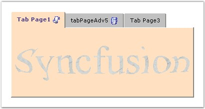
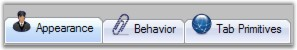

::: {style="DISPLAY: none"}
{#d2h_url_template}{#d2h_package_url style="WIDTH: 0px; DISPLAY: none; HEIGHT: 0px"}
:::

::::::: {.d2h_secondary_topic style="PADDING-BOTTOM: 10pt; MARGIN: 0pt; PADDING-LEFT: 0pt; PADDING-RIGHT: 0pt; PADDING-TOP: 0pt"}
##### BackgroundImage Settings {#backgroundimage-settings style="MARGIN-LEFT: 18pt; tab-stops: 18.0pt"}

[]{style="COLOR: #15428b"} 

Essential Tabs provide a set of options to customize the TabControlAdv with images.

 

The TabControlAdv can have,

[]{style="COLOR: #15428b"} 

[·      ]{style="FONT-FAMILY: Symbol"}Images inside the TabItems.

[·      ]{style="FONT-FAMILY: Symbol"}Images outside the TabBounds.

[·      ]{style="FONT-FAMILY: Symbol"}Image as Background for the TabPage.

[]{style="COLOR: #15428b"} 

Images in TabItems

 

To set images to the TabItems, add an ImageListControl and populate it with the required images. Then set the ImageIndex property of the TabPage to one of the indices, to display the corresponding image to the left of the text by default.

[]{style="COLOR: #15428b"} 

{border="0"}

[]{style="COLOR: #15428b"} 

Figure 1060: TabControl with Background Image Set for the TabPage and Image Set for the TabItem

[]{style="COLOR: #15428b"} 

**ImageAlignmentR** of the TabControlAdv allows you to set the tab\'s text and image. By default the image appears to the left and the text appears to the right. This setting can be changed using one of the below given options.

[]{style="COLOR: #15428b"} 

::: {align="center"}
+-----------------------------------+---------------------------------------------------------------------------------+
| TabControlAdv Property            | Description                                                                     |
+-----------------------------------+---------------------------------------------------------------------------------+
| ImageAlignmentR                   | Specifies the alignment of the image relative to the text. The options include, |
|                                   |                                                                                 |
|                                   |                                                                                 |
|                                   |                                                                                 |
|                                   | [·      ]{style="FONT-FAMILY: Symbol"}LeftOfText,                               |
|                                   |                                                                                 |
|                                   | [·      ]{style="FONT-FAMILY: Symbol"}RightOfText,                              |
|                                   |                                                                                 |
|                                   | [·      ]{style="FONT-FAMILY: Symbol"}AboveText,                                |
|                                   |                                                                                 |
|                                   | [·      ]{style="FONT-FAMILY: Symbol"}BelowText and                             |
|                                   |                                                                                 |
|                                   | [·      ]{style="FONT-FAMILY: Symbol"}Overlap.                                  |
+-----------------------------------+---------------------------------------------------------------------------------+
| ImageIndex                        | Gets / sets the image for the tabitem.                                          |
+-----------------------------------+---------------------------------------------------------------------------------+
:::

[]{style="COLOR: #15428b"} 

Code snippets showing the Image Settings

[]{style="COLOR: #15428b"} 

+--------------------------------------------------------------------------------------------------------------------------------------------------------------------------------------------------------------------------+
| **[\[C#\]]{style="FONT-FAMILY: 'Courier New'; COLOR: black"}**                                                                                                                                                           |
|                                                                                                                                                                                                                          |
| **[]{style="FONT-FAMILY: 'Courier New'; COLOR: black"}**                                                                                                                                                                 |
|                                                                                                                                                                                                                          |
| [this]{style="FONT-FAMILY: 'Courier New'; COLOR: blue"}[.tabControlAdv1.ImageAlignmentR = Syncfusion.Windows.Forms.Tools.[RelativeImageAlignment]{style="COLOR: teal"}.RightOfText;]{style="FONT-FAMILY: 'Courier New'"} |
|                                                                                                                                                                                                                          |
| [this]{style="FONT-FAMILY: 'Courier New'; COLOR: blue"}[.tabPageAdv1.ImageIndex = 0;]{style="FONT-FAMILY: 'Courier New'"}                                                                                                |
+--------------------------------------------------------------------------------------------------------------------------------------------------------------------------------------------------------------------------+

[]{style="COLOR: #15428b"} 

+-----------------------------------------------------------------------------------------------------------------------------------------------------------------------------------------------------------------------+
| **[\[VB\]]{style="FONT-FAMILY: 'Courier New'; COLOR: black"}**                                                                                                                                                        |
|                                                                                                                                                                                                                       |
| **[]{style="FONT-FAMILY: 'Courier New'; COLOR: black"}**                                                                                                                                                              |
|                                                                                                                                                                                                                       |
| [Me]{style="FONT-FAMILY: 'Courier New'; COLOR: blue"}[.tabControlAdv1.ImageAlignmentR = Syncfusion.Windows.Forms.Tools.[RelativeImageAlignment]{style="COLOR: teal"}.RightOfText]{style="FONT-FAMILY: 'Courier New'"} |
|                                                                                                                                                                                                                       |
| [Me]{style="FONT-FAMILY: 'Courier New'; COLOR: blue"}[.tabPageAdv1.ImageIndex = 0]{style="FONT-FAMILY: 'Courier New'"}                                                                                                |
+-----------------------------------------------------------------------------------------------------------------------------------------------------------------------------------------------------------------------+

[]{style="COLOR: #15428b"} 

Images outside the TabBounds

**[]{style="COLOR: #15428b"}** 

TabControlAdv can have images set outside the TabBounds.

[]{style="COLOR: #15428b"} 

[{border="0"}]{style="COLOR: #15428b"}[]{style="COLOR: #15428b"}

***[]{style="COLOR: #15428b"}*** 

Figure 1061: TabControlAdv with Images set outside the Tab Bounds

**[]{style="COLOR: #15428b"}** 

To move the image outside the TabBounds, set the below given properties.

[]{style="COLOR: #15428b"} 

::: {align="center"}
  ------------------------ -------------------------------------------------------------------
  TabControlAdv Property   Description
  ImageOffset              Adjusts Y-axis position of the image.
  AdjustTopGap             Adjusts the gap between the tabcontroladv\'s top and tabs.
  LevelTextAndImage        Indicates whether the text and image should be in the same level.
  ItemSize                 Sets the size of the tabs.
  ------------------------ -------------------------------------------------------------------
:::

[]{style="COLOR: #1f497d; FONT-SIZE: 8pt"} 

Background Image for TabPages

**[]{style="COLOR: #15428b"}** 

The below properties sets the background image for the pages.

[]{style="COLOR: #15428b"} 

::: {align="center"}
+-----------------------------------+------------------------------------------------------------------------------+
| TabPageAdv Property               | Description                                                                  |
+-----------------------------------+------------------------------------------------------------------------------+
| BackgroundImage                   | Specifies the background image for the tabpage.                              |
+-----------------------------------+------------------------------------------------------------------------------+
| BackgroundImageLayout             | Specifies the layout for the background image when set. The options include: |
|                                   |                                                                              |
|                                   |                                                                              |
|                                   |                                                                              |
|                                   | [·      ]{style="FONT-FAMILY: Symbol"}None,                                  |
|                                   |                                                                              |
|                                   | [·      ]{style="FONT-FAMILY: Symbol"}Tile,                                  |
|                                   |                                                                              |
|                                   | [·      ]{style="FONT-FAMILY: Symbol"}Center,                                |
|                                   |                                                                              |
|                                   | [·      ]{style="FONT-FAMILY: Symbol"}Stretch and                            |
|                                   |                                                                              |
|                                   | [·      ]{style="FONT-FAMILY: Symbol"}Zoom.                                  |
+-----------------------------------+------------------------------------------------------------------------------+
:::

[]{style="COLOR: #15428b"} 

+--------------------------------------------------------------------------------------------------------------------------------------------------------------------------------------------------+
| **[\[C#\]]{style="FONT-FAMILY: 'Courier New'; COLOR: black"}**                                                                                                                                   |
|                                                                                                                                                                                                  |
| **[]{style="FONT-FAMILY: 'Courier New'; COLOR: black"}**                                                                                                                                         |
|                                                                                                                                                                                                  |
| [this]{style="FONT-FAMILY: 'Courier New'; COLOR: blue"}[.tabPageAdv1.BackgroundImage = imageList1.Images\[0\];]{style="FONT-FAMILY: 'Courier New'"}                                              |
|                                                                                                                                                                                                  |
| [this]{style="FONT-FAMILY: 'Courier New'; COLOR: blue"}[.tabPageAdv1.BackgroundImageLayout = System.Windows.Forms.[ImageLayout]{style="COLOR: teal"}.Right;]{style="FONT-FAMILY: 'Courier New'"} |
+--------------------------------------------------------------------------------------------------------------------------------------------------------------------------------------------------+

[]{style="COLOR: #15428b"} 

+-------------------------------------------------------------------------------------------------------------------------------------------------------------------------------------------------------+
| **[\[VB\]]{style="FONT-FAMILY: 'Courier New'; COLOR: black"}**                                                                                                                                        |
|                                                                                                                                                                                                       |
| **[]{style="FONT-FAMILY: 'Courier New'; COLOR: black"}**                                                                                                                                              |
|                                                                                                                                                                                                       |
| [Private]{style="FONT-FAMILY: 'Courier New'; COLOR: blue"}[ [Me]{style="COLOR: blue"}.tabPageAdv1.BackgroundImage = imageList1.Images(0)]{style="FONT-FAMILY: 'Courier New'"}                         |
|                                                                                                                                                                                                       |
| [Private]{style="FONT-FAMILY: 'Courier New'; COLOR: blue"}[ [Me]{style="COLOR: blue"}.tabPageAdv1.BackgroundImageLayout = System.Windows.Forms.ImageLayout.Right]{style="FONT-FAMILY: 'Courier New'"} |
+-------------------------------------------------------------------------------------------------------------------------------------------------------------------------------------------------------+

[]{style="COLOR: #15428b"} 

DisableInactivePageImage

**[]{style="COLOR: #15428b"}** 

The DisableInactivePageImage property specifies the value which determines whether the image should be disabled when the TabPage is not selected. The default value is set to True.

[]{style="COLOR: #15428b"} 

::: {align="center"}
  -------------------------- ---------------------------------------------------------------------------------------------------------------
  TabControlAdv Property     Description
  DisableInactivePageImage   Gets / sets the value which determines whether the image should be disabled when the TabPage is not selected.
  -------------------------- ---------------------------------------------------------------------------------------------------------------
:::

[      ]{style="COLOR: #15428b"}

+--------------------------------------------------------------------------------------------------------------------------------------------------------------+
| **[\[C#\]]{style="FONT-FAMILY: 'Courier New'; COLOR: black"}**                                                                                               |
|                                                                                                                                                              |
| **[]{style="FONT-FAMILY: 'Courier New'; COLOR: black"}**                                                                                                     |
|                                                                                                                                                              |
| [this]{style="FONT-FAMILY: 'Courier New'; COLOR: blue"}[.tabPageAdv1.DisableInactivePageImage = imageList1.Images\[0\];]{style="FONT-FAMILY: 'Courier New'"} |
+--------------------------------------------------------------------------------------------------------------------------------------------------------------+

[]{style="COLOR: #15428b"} 

+----------------------------------------------------------------------------------------------------------------------------------------------------------------------------------------+
| **[\[VB\]]{style="FONT-FAMILY: 'Courier New'; COLOR: black"}**                                                                                                                         |
|                                                                                                                                                                                        |
| **[]{style="FONT-FAMILY: 'Courier New'; COLOR: black"}**                                                                                                                               |
|                                                                                                                                                                                        |
| [Private]{style="FONT-FAMILY: 'Courier New'; COLOR: blue"}[ [Me]{style="COLOR: blue"}.tabPageAdv1.DisableInactivePageImage = imageList1.Images(0)]{style="FONT-FAMILY: 'Courier New'"} |
+----------------------------------------------------------------------------------------------------------------------------------------------------------------------------------------+

 

 

 

 

[]{#related-topics}
:::::::
