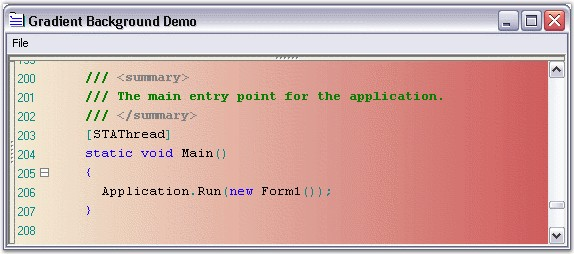
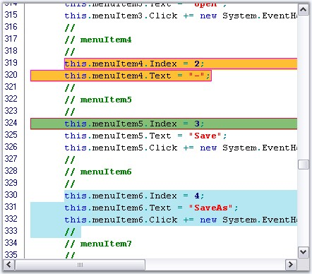

::: {style="DISPLAY: none"}
{#d2h_url_template}{#d2h_package_url style="WIDTH: 0px; DISPLAY: none; HEIGHT: 0px"}
:::

::::: {#nsbanner .d2h_main_nsbanner style="BORDER-BOTTOM: #999999 1px solid; POSITION: relative; PADDING-BOTTOM: 0px; BACKGROUND-COLOR: transparent; PADDING-LEFT: 0px; PADDING-RIGHT: 0px; DISPLAY: none; BORDER-TOP: #999999 1px solid; PADDING-TOP: 0px; LEFT: 0px"}
:::: {#TitleRow .d2h_main_titlerow style="PADDING-BOTTOM: 4px; BACKGROUND-COLOR: transparent; PADDING-LEFT: 22px; WIDTH: 100%; PADDING-RIGHT: 10px; DISPLAY: none; PADDING-TOP: 4px"}
::: {#ienav .d2h_main_ienav style="DISPLAY: none"}
{#D2HPrevious .D2HPreviousEnabled}  {#D2HNext .D2HNextEnabled}
:::
::::
:::::

::::::: {#nstext .d2h_main_nstext style="PADDING-BOTTOM: 10px; BACKGROUND-COLOR: transparent; PADDING-LEFT: 22px; PADDING-RIGHT: 10px; HEIGHT: 100%; OVERFLOW: auto; PADDING-TOP: 5px" hasuserbackground="true" valign="bottom"}
::: {#d2h_breadcrumbs .d2h_breadcrumbs}
[Essential Studio User Guide Documentation](ms-xhelp:///?Id=12457748-09e3-4d74-a240-8e049cedf030){.d2h_breadcrumbsNormal}[ \> ]{.d2h_breadcrumbsLinkSeparator}[User Interface Edition](ms-xhelp:///?Id=c29296b7-531c-413b-a0ec-488ca1f7f669){.d2h_breadcrumbsNormal}[ \> ]{.d2h_breadcrumbsLinkSeparator}[Essential Windows](ms-xhelp:///?Id=e60759d8-47a4-4570-9d7a-16a68d63f2ea){.d2h_breadcrumbsNormal}[ \> ]{.d2h_breadcrumbsLinkSeparator}[Essential Edit]{.d2h_breadcrumbsContentsOnly}[ \> ]{.d2h_breadcrumbsLinkSeparator}[Concepts And Features](ms-xhelp:///?Id=7c39cee6-8434-4711-a18e-efaba8ac85c0){.d2h_breadcrumbsNormal}[ \> ]{.d2h_breadcrumbsLinkSeparator}[Appearance](ms-xhelp:///?Id=8629fda6-ad48-4d6d-a648-9baa247658cb){.d2h_breadcrumbsNormal}
:::

### Background Settings {#background-settings style="tab-stops: 0pt"}

[]{style="FONT-FAMILY: 'Trebuchet MS','sans-serif'; COLOR: #15428b; FONT-SIZE: 9pt"} 

Edit Control can be displayed with a gradient background by setting the **BackgroundColor** property to the desired BrushInfo object. The following table lists some properties of the EditControl and their corresponding descriptions.

 

::: {align="center"}
+-----------------------------------+-----------------------------------------------------------------------------------------------------------------------------------------+
| Edit Control Property             | Description                                                                                                                             |
+-----------------------------------+-----------------------------------------------------------------------------------------------------------------------------------------+
| BackgroundColor                   | Specifies background fill style and color.                                                                                              |
+-----------------------------------+-----------------------------------------------------------------------------------------------------------------------------------------+
| Style                             | Specifies the brush style. The options provided are as follows:                                                                         |
|                                   |                                                                                                                                         |
|                                   | *[]{style="COLOR: black; FONT-SIZE: 8pt"}*                                                                                              |
|                                   |                                                                                                                                         |
|                                   | *Solid*                                                                                                                                 |
|                                   |                                                                                                                                         |
|                                   | *Pattern*                                                                                                                               |
|                                   |                                                                                                                                         |
|                                   | *Gradient*                                                                                                                              |
+-----------------------------------+-----------------------------------------------------------------------------------------------------------------------------------------+
| BackColor                         | Specifies the backcolor of the control.                                                                                                 |
+-----------------------------------+-----------------------------------------------------------------------------------------------------------------------------------------+
| ForeColor                         | Specifies the forecolor of the control.                                                                                                 |
+-----------------------------------+-----------------------------------------------------------------------------------------------------------------------------------------+
| PatternStyle                      | Specifies the pattern style. The options provided are as folows:                                                                        |
|                                   |                                                                                                                                         |
|                                   |                                                                                                                                         |
|                                   |                                                                                                                                         |
|                                   | [·      ]{style="FONT-FAMILY: Symbol"}Horizontal                                                                                        |
|                                   |                                                                                                                                         |
|                                   | [·      ]{style="FONT-FAMILY: Symbol"}Vertical                                                                                          |
|                                   |                                                                                                                                         |
|                                   | [·      ]{style="FONT-FAMILY: Symbol"}ForwardDiagonal                                                                                   |
|                                   |                                                                                                                                         |
|                                   | [·      ]{style="FONT-FAMILY: Symbol"}BackwardDiagonal                                                                                  |
|                                   |                                                                                                                                         |
|                                   | [·      ]{style="FONT-FAMILY: Symbol"}Cross                                                                                             |
|                                   |                                                                                                                                         |
|                                   | [·      ]{style="FONT-FAMILY: Symbol"}DiagonalCross                                                                                     |
|                                   |                                                                                                                                         |
|                                   | [·      ]{style="FONT-FAMILY: Symbol"}Percent05                                                                                         |
|                                   |                                                                                                                                         |
|                                   | [·      ]{style="FONT-FAMILY: Symbol"}Percent10                                                                                         |
|                                   |                                                                                                                                         |
|                                   | [·      ]{style="FONT-FAMILY: Symbol"}Percent20                                                                                         |
|                                   |                                                                                                                                         |
|                                   | [·      ]{style="FONT-FAMILY: Symbol"}Percent25                                                                                         |
|                                   |                                                                                                                                         |
|                                   | [·      ]{style="FONT-FAMILY: Symbol"}Percent30                                                                                         |
|                                   |                                                                                                                                         |
|                                   | [·      ]{style="FONT-FAMILY: Symbol"}Percent40                                                                                         |
|                                   |                                                                                                                                         |
|                                   | [·      ]{style="FONT-FAMILY: Symbol"}Percent50                                                                                         |
|                                   |                                                                                                                                         |
|                                   | [·      ]{style="FONT-FAMILY: Symbol"}Percent60                                                                                         |
|                                   |                                                                                                                                         |
|                                   | [·      ]{style="FONT-FAMILY: Symbol"}Percent70                                                                                         |
|                                   |                                                                                                                                         |
|                                   | [·      ]{style="FONT-FAMILY: Symbol"}Percent75                                                                                         |
|                                   |                                                                                                                                         |
|                                   | [·      ]{style="FONT-FAMILY: Symbol"}Percent80                                                                                         |
|                                   |                                                                                                                                         |
|                                   | [·      ]{style="FONT-FAMILY: Symbol"}Percent90                                                                                         |
|                                   |                                                                                                                                         |
|                                   | [·      ]{style="FONT-FAMILY: Symbol"}LightDownwardDiagonal                                                                             |
|                                   |                                                                                                                                         |
|                                   | [·      ]{style="FONT-FAMILY: Symbol"}LightUpwardDiagonal                                                                               |
|                                   |                                                                                                                                         |
|                                   | [·      ]{style="FONT-FAMILY: Symbol"}DarkDownwardDiagonal                                                                              |
|                                   |                                                                                                                                         |
|                                   | [·      ]{style="FONT-FAMILY: Symbol"}DarkUpwardDiagonal                                                                                |
|                                   |                                                                                                                                         |
|                                   | [·      ]{style="FONT-FAMILY: Symbol"}WideDownwardDiagonal                                                                              |
|                                   |                                                                                                                                         |
|                                   | [·      ]{style="FONT-FAMILY: Symbol"}WideUpwardDiagonal                                                                                |
|                                   |                                                                                                                                         |
|                                   | [·      ]{style="FONT-FAMILY: Symbol"}LightVertical                                                                                     |
|                                   |                                                                                                                                         |
|                                   | [·      ]{style="FONT-FAMILY: Symbol"}LightHorizontal                                                                                   |
|                                   |                                                                                                                                         |
|                                   | [·      ]{style="FONT-FAMILY: Symbol"}NarrowVertical                                                                                    |
|                                   |                                                                                                                                         |
|                                   | [·      ]{style="FONT-FAMILY: Symbol"}NarrowHorizontal                                                                                  |
|                                   |                                                                                                                                         |
|                                   | [·      ]{style="FONT-FAMILY: Symbol"}DarkVertical                                                                                      |
|                                   |                                                                                                                                         |
|                                   | [·      ]{style="FONT-FAMILY: Symbol"}DarkHorizontal                                                                                    |
|                                   |                                                                                                                                         |
|                                   | [·      ]{style="FONT-FAMILY: Symbol"}DashedDownwardDiagonal                                                                            |
|                                   |                                                                                                                                         |
|                                   | [·      ]{style="FONT-FAMILY: Symbol"}DashedUpwardDiagonal                                                                              |
|                                   |                                                                                                                                         |
|                                   | [·      ]{style="FONT-FAMILY: Symbol"}DashedHorizontal                                                                                  |
|                                   |                                                                                                                                         |
|                                   | [·      ]{style="FONT-FAMILY: Symbol"}DashedVertical                                                                                    |
|                                   |                                                                                                                                         |
|                                   | [·      ]{style="FONT-FAMILY: Symbol"}SmallConfetti                                                                                     |
|                                   |                                                                                                                                         |
|                                   | [·      ]{style="FONT-FAMILY: Symbol"}LargeConfetti                                                                                     |
|                                   |                                                                                                                                         |
|                                   | [·      ]{style="FONT-FAMILY: Symbol"}ZigZag                                                                                            |
|                                   |                                                                                                                                         |
|                                   | [·      ]{style="FONT-FAMILY: Symbol"}Wave                                                                                              |
|                                   |                                                                                                                                         |
|                                   | [·      ]{style="FONT-FAMILY: Symbol"}DiagonalBrick                                                                                     |
|                                   |                                                                                                                                         |
|                                   | [·      ]{style="FONT-FAMILY: Symbol"}HorizontalBrick                                                                                   |
|                                   |                                                                                                                                         |
|                                   | [·      ]{style="FONT-FAMILY: Symbol"}Weave                                                                                             |
|                                   |                                                                                                                                         |
|                                   | [·      ]{style="FONT-FAMILY: Symbol"}Plaid                                                                                             |
|                                   |                                                                                                                                         |
|                                   | [·      ]{style="FONT-FAMILY: Symbol"}Divot                                                                                             |
|                                   |                                                                                                                                         |
|                                   | [·      ]{style="FONT-FAMILY: Symbol"}DottedGrid                                                                                        |
|                                   |                                                                                                                                         |
|                                   | [·      ]{style="FONT-FAMILY: Symbol"}DottedDiamond                                                                                     |
|                                   |                                                                                                                                         |
|                                   | [·      ]{style="FONT-FAMILY: Symbol"}Shingle                                                                                           |
|                                   |                                                                                                                                         |
|                                   | [·      ]{style="FONT-FAMILY: Symbol"}Trellis                                                                                           |
|                                   |                                                                                                                                         |
|                                   | [·      ]{style="FONT-FAMILY: Symbol"}Sphere                                                                                            |
|                                   |                                                                                                                                         |
|                                   | [·      ]{style="FONT-FAMILY: Symbol"}SmallGrid                                                                                         |
|                                   |                                                                                                                                         |
|                                   | [·      ]{style="FONT-FAMILY: Symbol"}SmallCheckerBoard                                                                                 |
|                                   |                                                                                                                                         |
|                                   | [·      ]{style="FONT-FAMILY: Symbol"}LargeCheckerBoard                                                                                 |
|                                   |                                                                                                                                         |
|                                   | [·      ]{style="FONT-FAMILY: Symbol"}OutlinedDiamond                                                                                   |
|                                   |                                                                                                                                         |
|                                   | [·      ]{style="FONT-FAMILY: Symbol"}SolidDiamond                                                                                      |
|                                   |                                                                                                                                         |
|                                   | [·      ]{style="FONT-FAMILY: Symbol"}None                                                                                              |
+-----------------------------------+-----------------------------------------------------------------------------------------------------------------------------------------+
| GradientColors                    | Specifies the gradient colors. The options provided are as follows:                                                                     |
|                                   |                                                                                                                                         |
|                                   | *[]{style="COLOR: black"}*                                                                                                              |
|                                   |                                                                                                                                         |
|                                   | [·      ]{style="FONT-FAMILY: Symbol"}ForwardDiagonal                                                                                   |
|                                   |                                                                                                                                         |
|                                   | [·      ]{style="FONT-FAMILY: Symbol"}BackwardDiagonal                                                                                  |
|                                   |                                                                                                                                         |
|                                   | [·      ]{style="FONT-FAMILY: Symbol"}Horizontal                                                                                        |
|                                   |                                                                                                                                         |
|                                   | [·      ]{style="FONT-FAMILY: Symbol"}Vertical                                                                                          |
|                                   |                                                                                                                                         |
|                                   | [·      ]{style="FONT-FAMILY: Symbol"}PathRectangle                                                                                     |
|                                   |                                                                                                                                         |
|                                   | [·      ]{style="FONT-FAMILY: Symbol"}PathEllipse                                                                                       |
|                                   |                                                                                                                                         |
|                                   | *[]{style="COLOR: black"}*                                                                                                              |
|                                   |                                                                                                                                         |
|                                   | The first entry in this list will be the same as the backcolor property, and the last entry will be the same as the forecolor property. |
+-----------------------------------+-----------------------------------------------------------------------------------------------------------------------------------------+
:::

[]{style="FONT-SIZE: 8pt"} 

+--------------------------------------------------------------------------------------------------------------------------------------------------------------------------------------------------------------------------------------------------------------------------------------------------------------------------------------------------------------------------------------------------------------------------------------------------------------------------------------------------------------------------------------------------+
| **[\[C#\]]{style="FONT-FAMILY: 'Courier New'; COLOR: black"}**                                                                                                                                                                                                                                                                                                                                                                                                                                                                                   |
|                                                                                                                                                                                                                                                                                                                                                                                                                                                                                                                                                  |
| []{style="FONT-FAMILY: 'Courier New'; COLOR: black"}                                                                                                                                                                                                                                                                                                                                                                                                                                                                                             |
|                                                                                                                                                                                                                                                                                                                                                                                                                                                                                                                                                  |
| [this]{style="FONT-FAMILY: 'Courier New'; COLOR: blue"}[.editControl1.BackgroundColor = [new]{style="COLOR: blue"} Syncfusion.Drawing.[BrushInfo]{style="COLOR: teal"}(Syncfusion.Drawing.[GradientStyle]{style="COLOR: teal"}.ForwardDiagonal, [new]{style="COLOR: blue"} System.Drawing.[Color]{style="COLOR: teal"}\[\] {System.Drawing.[Color]{style="COLOR: teal"}.LavenderBlush, System.Drawing.[Color]{style="COLOR: teal"}.AliceBlue, System.Drawing.[Color]{style="COLOR: teal"}.BlanchedAlmond});]{style="FONT-FAMILY: 'Courier New'"} |
+--------------------------------------------------------------------------------------------------------------------------------------------------------------------------------------------------------------------------------------------------------------------------------------------------------------------------------------------------------------------------------------------------------------------------------------------------------------------------------------------------------------------------------------------------+

[]{style="FONT-FAMILY: 'Trebuchet MS','sans-serif'; COLOR: #15428b; FONT-SIZE: 9pt"} 

+---------------------------------------------------------------------------------------------------------------------------------------------------------------------------------------------------------------------------------------------------------------------------------------------------------------------------------------------------------------------------------------------------+
| **[\[VB.NET\]]{style="FONT-FAMILY: 'Courier New'; COLOR: black"}**                                                                                                                                                                                                                                                                                                                                |
|                                                                                                                                                                                                                                                                                                                                                                                                   |
| []{style="FONT-FAMILY: 'Courier New'; COLOR: black"}                                                                                                                                                                                                                                                                                                                                              |
|                                                                                                                                                                                                                                                                                                                                                                                                   |
| [Me]{style="FONT-FAMILY: 'Courier New'; COLOR: blue"}[.editControl1.BackgroundColor = [New]{style="COLOR: blue"} Syncfusion.Drawing.BrushInfo(Syncfusion.Drawing.GradientStyle.ForwardDiagonal, [New]{style="COLOR: blue"} System.Drawing.Color() {System.Drawing.Color.LavenderBlush, System.Drawing.Color.AliceBlue, System.Drawing.Color.BlanchedAlmond})]{style="FONT-FAMILY: 'Courier New'"} |
+---------------------------------------------------------------------------------------------------------------------------------------------------------------------------------------------------------------------------------------------------------------------------------------------------------------------------------------------------------------------------------------------------+

[]{style="FONT-FAMILY: 'Trebuchet MS','sans-serif'; COLOR: #15428b; FONT-SIZE: 9pt"} 

[{border="0"}]{style="FONT-FAMILY: 'Trebuchet MS','sans-serif'; COLOR: #15428b; FONT-SIZE: 9pt"}[]{style="FONT-FAMILY: 'Trebuchet MS','sans-serif'; COLOR: #15428b; FONT-SIZE: 9pt"}

***[]{style="FONT-FAMILY: 'Trebuchet MS','sans-serif'; COLOR: #15428b; FONT-SIZE: 9pt"}*** 

Figure 68: Edit Control with Gradient Background

**[]{style="FONT-FAMILY: 'Trebuchet MS','sans-serif'; COLOR: #15428b; FONT-SIZE: 9pt"}** 

A sample which demonstrates the Gradient Background feature is available in the below sample installation path.

 

..\\My Documents\\Syncfusion\\EssentialStudio\\***Version Number***\\Windows\\Edit.Windows\\Samples\\2.0\\Appearance\\ GradientBackgroundDemo

 

**Setting BackgroundColor for Specified Range of Text**

 

The **SetBackgroundColor** method is used to set the background color for a specified range of text.

 

+------------------------------------------------------------------------------------------------------------------------------------------------------------------------------------------------------------------------------------------------------------------------------------------------------+
| **[\[C#\]]{style="FONT-FAMILY: 'Courier New'; COLOR: black"}**                                                                                                                                                                                                                                       |
|                                                                                                                                                                                                                                                                                                      |
| []{style="FONT-FAMILY: 'Courier New'; COLOR: black"}                                                                                                                                                                                                                                                 |
|                                                                                                                                                                                                                                                                                                      |
| [this]{style="FONT-FAMILY: 'Courier New'; COLOR: blue"}[.editControl1.SetBackgroundColor([new]{style="COLOR: blue"} [Point]{style="COLOR: teal"}(1, 1), [new]{style="COLOR: blue"} [Point]{style="COLOR: teal"}(9, 9), [Color]{style="COLOR: teal"}.AliceBlue);]{style="FONT-FAMILY: 'Courier New'"} |
+------------------------------------------------------------------------------------------------------------------------------------------------------------------------------------------------------------------------------------------------------------------------------------------------------+

[]{style="FONT-FAMILY: 'Trebuchet MS','sans-serif'; COLOR: #15428b; FONT-SIZE: 9pt"} 

+------------------------------------------------------------------------------------------------------------------------------------------------------------------------------------------------------------------------------+
| **[\[VB.NET\]]{style="FONT-FAMILY: 'Courier New'; COLOR: black"}**                                                                                                                                                           |
|                                                                                                                                                                                                                              |
| []{style="FONT-FAMILY: 'Courier New'; COLOR: black"}                                                                                                                                                                         |
|                                                                                                                                                                                                                              |
| [Me]{style="FONT-FAMILY: 'Courier New'; COLOR: blue"}[.editControl1.SetBackgroundColor([New]{style="COLOR: blue"} Point(1, 1), [New]{style="COLOR: blue"} Point(9, 9), Color.AliceBlue)]{style="FONT-FAMILY: 'Courier New'"} |
+------------------------------------------------------------------------------------------------------------------------------------------------------------------------------------------------------------------------------+

[]{style="FONT-FAMILY: 'Trebuchet MS','sans-serif'; COLOR: #15428b; FONT-SIZE: 9pt"} 

Setting Background Color for Individual Lines or Selected Blocks of Text

 

Edit Control allows setting custom background color for individual lines as well as for selected block of text.

 

You can set any desired background to a particular line or block of selection, as explained below.

 

[·      ]{style="FONT-FAMILY: Symbol"}Register a backcolor format with the Edit Control by using its **RegisterBackColorFormat** method, with appropriate values for BackgroundColor, ForegroundColor and HatchStyle parameters.

 

[·      ]{style="FONT-FAMILY: Symbol"}Set the background color to the entire line or just the selected text by using the **SetLineBackColor** and **SetSelectionBackColor** methods respectively.

[]{style="FONT-FAMILY: 'Trebuchet MS','sans-serif'; COLOR: #15428b; FONT-SIZE: 9pt"} 

+-----------------------------------------------------------------------------------------------------------------------------------------------------------------------------------------------------------------------------------------------------------------------------------------------------------------+
| **[\[C#\]]{style="FONT-FAMILY: 'Courier New'; COLOR: black"}**                                                                                                                                                                                                                                                  |
|                                                                                                                                                                                                                                                                                                                 |
| []{style="FONT-FAMILY: 'Courier New'; COLOR: black"}                                                                                                                                                                                                                                                            |
|                                                                                                                                                                                                                                                                                                                 |
| [// Register a backcolor format with EditControl.]{style="FONT-FAMILY: 'Courier New'; COLOR: green"}                                                                                                                                                                                                            |
|                                                                                                                                                                                                                                                                                                                 |
| [this]{style="FONT-FAMILY: 'Courier New'; COLOR: blue"}[.editControl1.RegisterBackColorFormat([Color]{style="COLOR: teal"}.Aquamarine, [Color]{style="COLOR: teal"}.Beige, System.Drawing.Drawing2D.[HatchStyle]{style="COLOR: teal"}.Cross, [true]{style="COLOR: blue"});]{style="FONT-FAMILY: 'Courier New'"} |
|                                                                                                                                                                                                                                                                                                                 |
| []{style="FONT-FAMILY: 'Courier New'"}                                                                                                                                                                                                                                                                          |
|                                                                                                                                                                                                                                                                                                                 |
| [// Set the background for the entire line of text.]{style="FONT-FAMILY: 'Courier New'; COLOR: green"}                                                                                                                                                                                                          |
|                                                                                                                                                                                                                                                                                                                 |
| [this]{style="FONT-FAMILY: 'Courier New'; COLOR: blue"}[.editControl1.SetLineBackColor(editControl1.CurrentLine, [true]{style="COLOR: blue"}, format);]{style="FONT-FAMILY: 'Courier New'"}                                                                                                                     |
|                                                                                                                                                                                                                                                                                                                 |
| []{style="FONT-FAMILY: 'Courier New'"}                                                                                                                                                                                                                                                                          |
|                                                                                                                                                                                                                                                                                                                 |
| [// Set the background for the selected block of text.        ]{style="FONT-FAMILY: 'Courier New'; COLOR: green"}                                                                                                                                                                                               |
|                                                                                                                                                                                                                                                                                                                 |
| [this]{style="FONT-FAMILY: 'Courier New'; COLOR: blue"}[.editControl1.SetSelectionBackColor(format);]{style="FONT-FAMILY: 'Courier New'"}                                                                                                                                                                       |
+-----------------------------------------------------------------------------------------------------------------------------------------------------------------------------------------------------------------------------------------------------------------------------------------------------------------+

[]{style="FONT-FAMILY: 'Trebuchet MS','sans-serif'; COLOR: #15428b; FONT-SIZE: 9pt"} 

+-----------------------------------------------------------------------------------------------------------------------------------------------------------------------------------------------------------------------------------------+
| **[\[VB.NET\]]{style="FONT-FAMILY: 'Courier New'; COLOR: black"}**                                                                                                                                                                      |
|                                                                                                                                                                                                                                         |
| []{style="FONT-FAMILY: 'Courier New'; COLOR: black"}                                                                                                                                                                                    |
|                                                                                                                                                                                                                                         |
| [\' Register a backcolor format with EditControl.]{style="FONT-FAMILY: 'Courier New'; COLOR: green"}                                                                                                                                    |
|                                                                                                                                                                                                                                         |
| [Me]{style="FONT-FAMILY: 'Courier New'; COLOR: blue"}[.editControl1.RegisterBackColorFormat(Color.Aquamarine, Color.Beige, System.Drawing.Drawing2D.HatchStyle.Cross, [True]{style="COLOR: blue"})]{style="FONT-FAMILY: 'Courier New'"} |
|                                                                                                                                                                                                                                         |
| []{style="FONT-FAMILY: 'Courier New'"}                                                                                                                                                                                                  |
|                                                                                                                                                                                                                                         |
| [\' Set the background for the entire line of text. ]{style="FONT-FAMILY: 'Courier New'; COLOR: green"}                                                                                                                                 |
|                                                                                                                                                                                                                                         |
| [Me]{style="FONT-FAMILY: 'Courier New'; COLOR: blue"}[.editControl1.SetLineBackColor(editControl1.CurrentLine, [true]{style="COLOR: blue"}, format)]{style="FONT-FAMILY: 'Courier New'"}                                                |
|                                                                                                                                                                                                                                         |
| []{style="FONT-FAMILY: 'Courier New'"}                                                                                                                                                                                                  |
|                                                                                                                                                                                                                                         |
| [\' Set the background for the selected block of text.        ]{style="FONT-FAMILY: 'Courier New'; COLOR: green"}                                                                                                                       |
|                                                                                                                                                                                                                                         |
| [Me]{style="FONT-FAMILY: 'Courier New'; COLOR: blue"}[.editControl1.SetSelectionBackColor(format)]{style="FONT-FAMILY: 'Courier New'"}                                                                                                  |
+-----------------------------------------------------------------------------------------------------------------------------------------------------------------------------------------------------------------------------------------+

[]{style="FONT-FAMILY: 'Trebuchet MS','sans-serif'; COLOR: #15428b; FONT-SIZE: 9pt"} 

{border="0"}

Figure 69: Background Color and Border set for Text

::: {style="BORDER-BOTTOM: windowtext 1pt solid; BORDER-LEFT: medium none; PADDING-BOTTOM: 1pt; MARGIN-TOP: 9pt; PADDING-LEFT: 0pt; PADDING-RIGHT: 0pt; MARGIN-BOTTOM: 9pt; BORDER-TOP: windowtext 1pt solid; BORDER-RIGHT: medium none; PADDING-TOP: 1pt"}
 

{border="0"}Note:[ ]{style="COLOR: black; FONT-SIZE: 8pt"}Refer the [Text Border]{.UGHyperlink} topic to know how to set the border for the text.
:::

[]{style="FONT-FAMILY: 'Trebuchet MS','sans-serif'; COLOR: #15428b; FONT-SIZE: 9pt"} 

Removing Background Color for Individual Lines or Selected Blocks of Text

 

The following methods can be used to set the background color for individual lines or selected blocks of text.

 

::: {align="center"}
  -------------------------- -----------------------------------------------------
  Edit Control Method        Description
  RemoveLineBackColor        Removes line back color.
  RemoveSelectionBackColor   Removes background coloring from the selected text.
  -------------------------- -----------------------------------------------------
:::

[]{style="FONT-FAMILY: 'Trebuchet MS','sans-serif'; COLOR: #15428b; FONT-SIZE: 9pt"} 

+----------------------------------------------------------------------------------------------------------------------------------------+
| **[\[C#\]]{style="FONT-FAMILY: 'Courier New'; COLOR: black"}**                                                                         |
|                                                                                                                                        |
| []{style="FONT-FAMILY: 'Courier New'; COLOR: black"}                                                                                   |
|                                                                                                                                        |
| [// Removes line back color.]{style="FONT-FAMILY: 'Courier New'; COLOR: green"}                                                        |
|                                                                                                                                        |
| [this]{style="FONT-FAMILY: 'Courier New'; COLOR: blue"}[.editControl1.RemoveLineBackColor(4);]{style="FONT-FAMILY: 'Courier New'"}     |
|                                                                                                                                        |
| []{style="FONT-FAMILY: 'Courier New'"}                                                                                                 |
|                                                                                                                                        |
| [// Removes background coloring from the selected text.]{style="FONT-FAMILY: 'Courier New'; COLOR: green"}                             |
|                                                                                                                                        |
| [this]{style="FONT-FAMILY: 'Courier New'; COLOR: blue"}[.editControl1.RemoveSelectionBackColor();]{style="FONT-FAMILY: 'Courier New'"} |
+----------------------------------------------------------------------------------------------------------------------------------------+

[]{style="FONT-FAMILY: 'Trebuchet MS','sans-serif'; COLOR: #15428b; FONT-SIZE: 9pt"} 

+-------------------------------------------------------------------------------------------------------------------------------------+
| **[\[VB.NET\]]{style="FONT-FAMILY: 'Courier New'; COLOR: black"}**                                                                  |
|                                                                                                                                     |
| []{style="FONT-FAMILY: 'Courier New'; COLOR: black"}                                                                                |
|                                                                                                                                     |
| [\' Removes line back color.]{style="FONT-FAMILY: 'Courier New'; COLOR: green"}                                                     |
|                                                                                                                                     |
| [Me]{style="FONT-FAMILY: 'Courier New'; COLOR: blue"}[.editControl1.RemoveLineBackColor(4)]{style="FONT-FAMILY: 'Courier New'"}     |
|                                                                                                                                     |
| []{style="FONT-FAMILY: 'Courier New'"}                                                                                              |
|                                                                                                                                     |
| [\' Removes background coloring from the selected text.]{style="FONT-FAMILY: 'Courier New'; COLOR: green"}                          |
|                                                                                                                                     |
| [Me]{style="FONT-FAMILY: 'Courier New'; COLOR: blue"}[.editControl1.RemoveSelectionBackColor()]{style="FONT-FAMILY: 'Courier New'"} |
+-------------------------------------------------------------------------------------------------------------------------------------+

 

A sample which demonstrates Text Highlighting is available in the following sample location.

 

***..\\My Documents\\Syncfusion\\EssentialStudio\\Version Number\\Windows\\Edit.Windows\\Samples\\2.0\\Advanced Editor Functions\\TextHighlightingDemo***

 

**See Also**

 

[Line Numbers and Current Line Highlighting]{.UGHyperlink}[]{.UGHyperlink}

 

[]{#p102} 

[]{#related-topics}
:::::::
