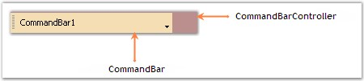

::: {style="DISPLAY: none"}
{#d2h_url_template}{#d2h_package_url style="WIDTH: 0px; DISPLAY: none; HEIGHT: 0px"}
:::

:::::: {.d2h_secondary_topic style="PADDING-BOTTOM: 10pt; MARGIN: 0pt; PADDING-LEFT: 0pt; PADDING-RIGHT: 0pt; PADDING-TOP: 0pt"}
##### Background Settings {#background-settings style="tab-stops: 0pt"}

[]{style="COLOR: #15428b"} 

The background settings of the CommandBar control are discussed below.

[]{style="COLOR: #15428b"} 

BackColor

**[]{style="COLOR: #15428b"}** 

CommandBarController

[]{style="COLOR: #4a5c8c; FONT-SIZE: 8pt"} 

The back color of the CommandBarController can be set using the property given below.

[]{style="COLOR: #4a5c8c; FONT-SIZE: 8pt"} 

::: {align="center"}
  ------------------------------- ----------------------------------------------------------------------
  CommandBarController Property   Description
  BackColor                       The background color used to draw the host form\'s dockable regions.
  ------------------------------- ----------------------------------------------------------------------
:::

[]{style="COLOR: #15428b"} 

+----------------------------------------------------------------------------------------------------------------------------------------------------------------------------------------+
| **[\[C#\]]{style="FONT-FAMILY: 'Courier New'; COLOR: black"}**                                                                                                                         |
|                                                                                                                                                                                        |
| []{style="FONT-FAMILY: 'Courier New'; COLOR: black"}                                                                                                                                   |
|                                                                                                                                                                                        |
| [this]{style="FONT-FAMILY: 'Courier New'; COLOR: blue"}[.commandBarController1.BackColor = System.Drawing.[Color]{style="COLOR: teal"}.RosyBrown;]{style="FONT-FAMILY: 'Courier New'"} |
+----------------------------------------------------------------------------------------------------------------------------------------------------------------------------------------+

[]{style="COLOR: #15428b"} 

+--------------------------------------------------------------------------------------------------------------------------------------------------------------+
| **[\[VB.NET\]]{style="FONT-FAMILY: 'Courier New'; COLOR: black"}**                                                                                           |
|                                                                                                                                                              |
| []{style="FONT-FAMILY: 'Courier New'; COLOR: black"}                                                                                                         |
|                                                                                                                                                              |
| [Me]{style="FONT-FAMILY: 'Courier New'; COLOR: blue"}[.CommandBarController1.BackColor = System.Drawing.Color.RosyBrown]{style="FONT-FAMILY: 'Courier New'"} |
+--------------------------------------------------------------------------------------------------------------------------------------------------------------+

[]{style="COLOR: #4a5c8c; FONT-SIZE: 8pt"} 

CommandBar

[]{style="COLOR: #4a5c8c; FONT-SIZE: 8pt"} 

The back color of the CommandBar can be set using the property given below.

[]{style="COLOR: #15428b"} 

::: {align="center"}
  --------------------- --------------------------------------------------
  CommandBar Property   Description
  BackColor             The background color used to draw the component.
  --------------------- --------------------------------------------------
:::

[]{style="COLOR: #15428b"} 

+--------------------------------------------------------------------------------------------------------------------------------------------------------------------------+
| **[\[C#\]]{style="FONT-FAMILY: 'Courier New'; COLOR: black"}**                                                                                                           |
|                                                                                                                                                                          |
| []{style="FONT-FAMILY: 'Courier New'; COLOR: black"}                                                                                                                     |
|                                                                                                                                                                          |
| [this]{style="FONT-FAMILY: 'Courier New'; COLOR: blue"}[.commandBar1.BackColor = System.Drawing.[Color]{style="COLOR: teal"}.Wheat;]{style="FONT-FAMILY: 'Courier New'"} |
+--------------------------------------------------------------------------------------------------------------------------------------------------------------------------+

[]{style="COLOR: #15428b"} 

+------------------------------------------------------------------------------------------------------------------------------------------------+
| **[\[VB.NET\]]{style="FONT-FAMILY: 'Courier New'; COLOR: black"}**                                                                             |
|                                                                                                                                                |
| []{style="FONT-FAMILY: 'Courier New'; COLOR: black"}                                                                                           |
|                                                                                                                                                |
| [Me]{style="FONT-FAMILY: 'Courier New'; COLOR: blue"}[.commandBar1.BackColor = System.Drawing.Color.Wheat]{style="FONT-FAMILY: 'Courier New'"} |
+------------------------------------------------------------------------------------------------------------------------------------------------+

[]{style="COLOR: #15428b"} 

{border="0"}

[]{style="COLOR: #15428b"} 

Figure 27: BackColor of CommandBarController and CommandBar Set

[]{style="COLOR: #15428b"} 

::: {style="BORDER-BOTTOM: windowtext 1pt solid; BORDER-LEFT: medium none; PADDING-BOTTOM: 1pt; MARGIN-TOP: 9pt; PADDING-LEFT: 0pt; PADDING-RIGHT: 0pt; MARGIN-BOTTOM: 9pt; BORDER-TOP: windowtext 1pt solid; BORDER-RIGHT: medium none; PADDING-TOP: 1pt"}
{border="0"} Note: The ResetBackColor() method of the CommandBarController can be used to reset it\'s BackColor property to the default value. Similarly, the ResetBackColor() method of the CommandBar can be used to reset it\'s BackColor property to the default value.
:::

[]{#related-topics}
::::::
