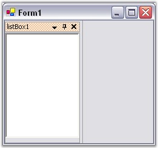
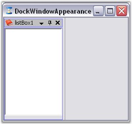
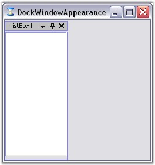
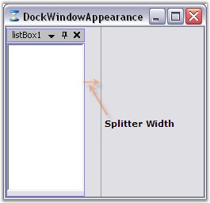
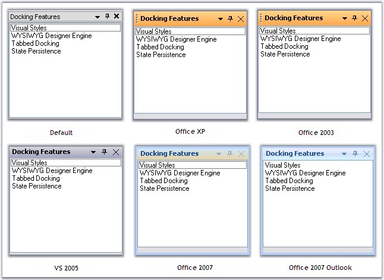
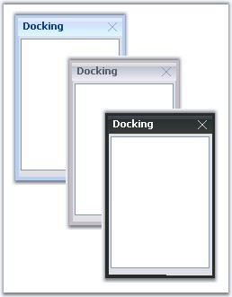
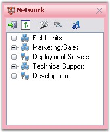
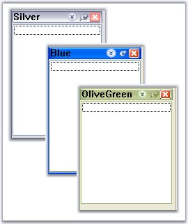

::: {style="DISPLAY: none"}
{#d2h_url_template}{#d2h_package_url style="WIDTH: 0px; DISPLAY: none; HEIGHT: 0px"}
:::

:::::::::: {.d2h_secondary_topic style="PADDING-BOTTOM: 10pt; MARGIN: 0pt; PADDING-LEFT: 0pt; PADDING-RIGHT: 0pt; PADDING-TOP: 0pt"}
##### Background Settings {#background-settings style="tab-stops: 0pt"}

[]{#p69}[]{style="COLOR: #15428b"} 

This section will discuss the background settings for the caption area of the docked controls.

[]{style="COLOR: #15428b"} 

###### []{#_Active_and_Inactive_1}3.2.3.5.2.1 Active and Inactive caption {#active-and-inactive-caption style="tab-stops: 0pt"}

[]{style="COLOR: #15428b"} 

Active Caption Settings

[]{style="COLOR: #15428b"} 

Caption background appearance for the active docked control can be controlled through **ActiveCaptionBackground** property.

[]{style="COLOR: #15428b"} 

::: {align="center"}
  ------------------------- --------------------------------------------------------------
  DockingManager Property   Description
  ActiveCaptionBackground   Sets background for the caption area using BrushInfo object.
  ------------------------- --------------------------------------------------------------
:::

[]{style="COLOR: #15428b"} 

::: {style="BORDER-BOTTOM: windowtext 1pt solid; BORDER-LEFT: medium none; PADDING-BOTTOM: 1pt; MARGIN-TOP: 9pt; PADDING-LEFT: 0pt; PADDING-RIGHT: 0pt; MARGIN-BOTTOM: 9pt; BORDER-TOP: windowtext 1pt solid; BORDER-RIGHT: medium none; PADDING-TOP: 1pt"}
{border="0"} Note: This setting will effect only with DockingManager.VisualStyle property set as Default.
:::

[]{style="COLOR: #15428b"} 

+-----------------------------------------------------------------------------------------------------------------------------------------------------------------------------------------------------------------------------------------------------------------------------------------------------------------------------------------------------------------------------------------------+
| **[\[C#\]]{style="FONT-FAMILY: 'Courier New'; COLOR: black"}**                                                                                                                                                                                                                                                                                                                                |
|                                                                                                                                                                                                                                                                                                                                                                                               |
| **[]{style="FONT-FAMILY: 'Courier New'; COLOR: black"}**                                                                                                                                                                                                                                                                                                                                      |
|                                                                                                                                                                                                                                                                                                                                                                                               |
| [this]{style="FONT-FAMILY: 'Courier New'; COLOR: blue"}[.dockingManager1.ActiveCaptionBackground = [new]{style="COLOR: blue"} Syncfusion.Drawing.BrushInfo(Syncfusion.Drawing.PatternStyle.Percent20, System.Drawing.SystemColors.InactiveCaptionText, System.Drawing.Color.FromArgb(((System.Byte)(255)), ((System.Byte)(224)), ((System.Byte)(192))));]{style="FONT-FAMILY: 'Courier New'"} |
+-----------------------------------------------------------------------------------------------------------------------------------------------------------------------------------------------------------------------------------------------------------------------------------------------------------------------------------------------------------------------------------------------+

[]{style="COLOR: #15428b"} 

+--------------------------------------------------------------------------------------------------------------------------------------------------------------------------------------------------------------------------------------------------------------------------------------------------------------------------------------------------------------------------------------------------------------------------------------------------------------------------------------------------------------------------+
| **[\[VB.NET\]]{style="FONT-FAMILY: 'Courier New'; COLOR: black"}**                                                                                                                                                                                                                                                                                                                                                                                                                                                       |
|                                                                                                                                                                                                                                                                                                                                                                                                                                                                                                                          |
| **[]{style="FONT-FAMILY: 'Courier New'; COLOR: black"}**                                                                                                                                                                                                                                                                                                                                                                                                                                                                 |
|                                                                                                                                                                                                                                                                                                                                                                                                                                                                                                                          |
| [Me]{style="FONT-FAMILY: 'Courier New'; COLOR: blue"}[.DockingManager1.ActiveCaptionBackground = [New]{style="COLOR: blue"} Syncfusion.Drawing.BrushInfo(Syncfusion.Drawing.PatternStyle.Percent20, System.Drawing.SystemColors.InactiveCaptionText, System.Drawing.Color.FromArgb([CType]{style="COLOR: blue"}(255, [Byte]{style="COLOR: blue"}), [CType]{style="COLOR: blue"}(224, [Byte]{style="COLOR: blue"}), [CType]{style="COLOR: blue"}(192, [Byte]{style="COLOR: blue"})))]{style="FONT-FAMILY: 'Courier New'"} |
+--------------------------------------------------------------------------------------------------------------------------------------------------------------------------------------------------------------------------------------------------------------------------------------------------------------------------------------------------------------------------------------------------------------------------------------------------------------------------------------------------------------------------+

**[]{style="COLOR: #15428b"}** 

{border="0"}

[]{style="COLOR: #15428b"} 

Figure 77: Caption Background = \"PatternStyle\"

**[]{style="COLOR: #15428b"}** 

InactiveCaption settings

**[]{style="COLOR: #15428b"}** 

By setting the **InactiveCaptionBackground** properties, the caption appearance of the inactive control in the docked controls can be customized.

**[]{style="COLOR: #15428b"}** 

::: {align="center"}
  --------------------------- --------------------------------------------------------------------------------
  DockingManager Property     Description
  InactiveCaptionBackground   Sets caption background of the inactive docked control using BrushInfo object.
  --------------------------- --------------------------------------------------------------------------------
:::

[]{style="COLOR: #15428b"} 

::: {style="BORDER-BOTTOM: windowtext 1pt solid; BORDER-LEFT: medium none; PADDING-BOTTOM: 1pt; MARGIN-TOP: 9pt; PADDING-LEFT: 0pt; PADDING-RIGHT: 0pt; MARGIN-BOTTOM: 9pt; BORDER-TOP: windowtext 1pt solid; BORDER-RIGHT: medium none; PADDING-TOP: 1pt"}
{border="0"} Note: This setting will effect only with DockingManager.VisualStyle property set as Default.
:::

**[]{style="COLOR: #15428b"}** 

+------------------------------------------------------------------------------------------------------------------------------------------------------------------------------------------------------------------------------------------------------------------------------------------------------------------+
| **[\[C#\]]{style="FONT-FAMILY: 'Courier New'; COLOR: black"}**                                                                                                                                                                                                                                                   |
|                                                                                                                                                                                                                                                                                                                  |
| **[]{style="FONT-FAMILY: 'Courier New'; COLOR: black"}**                                                                                                                                                                                                                                                         |
|                                                                                                                                                                                                                                                                                                                  |
| [this]{style="FONT-FAMILY: 'Courier New'; COLOR: blue"}[.dockingManager1.InActiveCaptionBackground = [new]{style="COLOR: blue"} Syncfusion.Drawing.BrushInfo(Syncfusion.Drawing.GradientStyle.Horizontal, System.Drawing.Color.Ivory, System.Drawing.SystemColors.Control);]{style="FONT-FAMILY: 'Courier New'"} |
+------------------------------------------------------------------------------------------------------------------------------------------------------------------------------------------------------------------------------------------------------------------------------------------------------------------+

[]{style="COLOR: #15428b"} 

+---------------------------------------------------------------------------------------------------------------------------------------------------------------------------------------------------------------------------------------------------------------------------------------------------------------+
| **[\[VB.NET\]]{style="FONT-FAMILY: 'Courier New'; COLOR: black"}**                                                                                                                                                                                                                                            |
|                                                                                                                                                                                                                                                                                                               |
| **[]{style="FONT-FAMILY: 'Courier New'; COLOR: black"}**                                                                                                                                                                                                                                                      |
|                                                                                                                                                                                                                                                                                                               |
| [Me]{style="FONT-FAMILY: 'Courier New'; COLOR: blue"}[.DockingManager1.InActiveCaptionBackground = [New]{style="COLOR: blue"} Syncfusion.Drawing.BrushInfo(Syncfusion.Drawing.GradientStyle.Horizontal, System.Drawing.Color.Ivory, System.Drawing.SystemColors.Control)]{style="FONT-FAMILY: 'Courier New'"} |
+---------------------------------------------------------------------------------------------------------------------------------------------------------------------------------------------------------------------------------------------------------------------------------------------------------------+

[]{style="COLOR: #15428b"} 

See Also

[]{style="COLOR: black"}

[Visual Styles]{.MsoHyperlink}[]{style="COLOR: black"}

###### []{#p70}[]{#_Border_for_the}3.2.3.5.2.2 Border for the Docked Control {#border-for-the-docked-control style="tab-stops: 0pt"}

**[]{style="COLOR: #15428b"}** 

Border color of the docked controls can be specified in the **BorderColor** property.

 

Note that you will have to enable **PaintBorders** property to effect this setting.

[]{style="COLOR: #15428b"} 

::: {align="center"}
  ------------------------- ------------------------------------------------------------
  DockingManager Property   Description
  BorderColor               Used to set the border color for the docked control.
  Paint Borders             Determines whether to paint the docked control\'s borders.
  ------------------------- ------------------------------------------------------------
:::

[]{style="COLOR: #15428b"} 

+-----------------------------------------------------------------------------------------------------------------------------------------------------------------------------------+
| **[\[C#\]]{style="FONT-FAMILY: 'Courier New'; COLOR: black"}**                                                                                                                    |
|                                                                                                                                                                                   |
| **[]{style="FONT-FAMILY: 'Courier New'; COLOR: black"}**                                                                                                                          |
|                                                                                                                                                                                   |
| [//Setting Border color]{style="FONT-FAMILY: 'Courier New'; COLOR: green"}                                                                                                        |
|                                                                                                                                                                                   |
| [this]{style="FONT-FAMILY: 'Courier New'; COLOR: blue"}[.dockingManager1.BorderColor = System.Drawing.Color.Blue;]{style="FONT-FAMILY: 'Courier New'"}                            |
|                                                                                                                                                                                   |
| [this]{style="FONT-FAMILY: 'Courier New'; COLOR: blue"}[.DockingManager1.PaintBorders = [true]{style="COLOR: blue"}[;]{style="COLOR: black"}]{style="FONT-FAMILY: 'Courier New'"} |
+-----------------------------------------------------------------------------------------------------------------------------------------------------------------------------------+

[]{style="COLOR: #15428b"} 

+--------------------------------------------------------------------------------------------------------------------------------------------------------+
| **[\[VB.NET\]]{style="FONT-FAMILY: 'Courier New'; COLOR: black"}**                                                                                     |
|                                                                                                                                                        |
| []{style="FONT-FAMILY: 'Courier New'; COLOR: black"}                                                                                                   |
|                                                                                                                                                        |
| [\'Setting border color]{style="FONT-FAMILY: 'Courier New'; COLOR: green"}                                                                             |
|                                                                                                                                                        |
| [Me]{style="FONT-FAMILY: 'Courier New'; COLOR: blue"}[.DockingManager1.BorderColor = System.Drawing.Color.Blue]{style="FONT-FAMILY: 'Courier New'"}    |
|                                                                                                                                                        |
| [Me]{style="FONT-FAMILY: 'Courier New'; COLOR: blue"}[.DockingManager1.PaintBorders = [True]{style="COLOR: blue"}]{style="FONT-FAMILY: 'Courier New'"} |
+--------------------------------------------------------------------------------------------------------------------------------------------------------+

[]{style="COLOR: #15428b"} 

{border="0"}

[]{style="COLOR: #15428b"} 

Figure 78: Docked Window with BorderColor Set

**[]{style="COLOR: #15428b"}** 

HostFormClientBorder

**[]{style="COLOR: #15428b"}** 

::: {align="center"}
  ------------------------- -----------------------------------------------------------------------------------------------------
  DockingManager Property   Description
  HostFormClientBorder      Gets or sets a value indicating whether a border is drawn around the host form\'s client rectangle.
  ------------------------- -----------------------------------------------------------------------------------------------------
:::

**[]{style="COLOR: #15428b"}** 

+--------------------------------------------------------------------------------------------------------------------------------------------------------------------+
| **[\[C#\]]{style="FONT-FAMILY: 'Courier New'; COLOR: black"}**                                                                                                     |
|                                                                                                                                                                    |
| **[]{style="FONT-FAMILY: 'Courier New'; COLOR: black"}**                                                                                                           |
|                                                                                                                                                                    |
| [this]{style="FONT-FAMILY: 'Courier New'; COLOR: blue"}[.DockingManager1.HostFormClientBorder = [false]{style="COLOR: blue"};]{style="FONT-FAMILY: 'Courier New'"} |
+--------------------------------------------------------------------------------------------------------------------------------------------------------------------+

[]{style="COLOR: #15428b"} 

+-----------------------------------------------------------------------------------------------------------------------------------------------------------------+
| **[\[VB.NET\]]{style="FONT-FAMILY: 'Courier New'; COLOR: black"}**                                                                                              |
|                                                                                                                                                                 |
| **[]{style="FONT-FAMILY: 'Courier New'; COLOR: black"}**                                                                                                        |
|                                                                                                                                                                 |
| [Me]{style="FONT-FAMILY: 'Courier New'; COLOR: blue"}[.DockingManager1.HostFormClientBorder = [False]{style="COLOR: blue"}]{style="FONT-FAMILY: 'Courier New'"} |
+-----------------------------------------------------------------------------------------------------------------------------------------------------------------+

**[]{style="COLOR: #15428b"}** 

{border="0"}

**[]{style="COLOR: #15428b"}** 

Figure 79: Docking Window without Border

###### []{#p71}[]{#_Splitter_Width}3.2.3.5.2.3 Splitter Width {#splitter-width style="tab-stops: 0pt"}

**[]{style="COLOR: #15428b"}** 

The width of the splitter between the docking windows can be set by using the **SplitterWidth** property.

[]{style="COLOR: #15428b"} 

::: {align="center"}
  ------------------------- --------------------------------------------------------------------------------------
  DockingManager Property   Description
  SplitterWidth             Gets or sets the value indicating the width of splitters between the docking window.
  ------------------------- --------------------------------------------------------------------------------------
:::

[]{style="COLOR: #15428b"} 

+-----------------------------------------------------------------------------------------------------------------------------------+
| **[\[C#\]]{style="FONT-FAMILY: 'Courier New'; COLOR: black"}**                                                                    |
|                                                                                                                                   |
| **[]{style="FONT-FAMILY: 'Courier New'; COLOR: black"}**                                                                          |
|                                                                                                                                   |
| [this]{style="FONT-FAMILY: 'Courier New'; COLOR: blue"}[.dockingManager1.SplitterWidth = 20;]{style="FONT-FAMILY: 'Courier New'"} |
+-----------------------------------------------------------------------------------------------------------------------------------+

[]{style="COLOR: #15428b"} 

+--------------------------------------------------------------------------------------------------------------------------------+
| **[\[VB.NET\]]{style="FONT-FAMILY: 'Courier New'; COLOR: black"}**                                                             |
|                                                                                                                                |
| **[]{style="FONT-FAMILY: 'Courier New'; COLOR: black"}**                                                                       |
|                                                                                                                                |
| [Me]{style="FONT-FAMILY: 'Courier New'; COLOR: blue"}[.dockingManager1.SplitterWidth = 20]{style="FONT-FAMILY: 'Courier New'"} |
+--------------------------------------------------------------------------------------------------------------------------------+

[]{style="COLOR: #15428b"} 

{border="0"}

[]{style="COLOR: #15428b"} 

Figure 80: SplitterWidth = \"20\"

 

###### []{#p72}[]{#_Visual_Styles}3.2.3.5.2.4 Visual Styles {#visual-styles style="tab-stops: 0pt"}

[]{style="COLOR: #15428b"} 

Docking manager supports various styles that adds appealing visual styles to your application. Below are the visual styles implemented in docking.

[]{style="COLOR: #15428b"} 

[·      ]{style="FONT-FAMILY: Symbol"}Default (VS 2003)

[·      ]{style="FONT-FAMILY: Symbol"}OfficeXP

[·      ]{style="FONT-FAMILY: Symbol"}Office 2003

[·      ]{style="FONT-FAMILY: Symbol"}VS 2005

[·      ]{style="FONT-FAMILY: Symbol"}Office 2007 (Blue, Silver, Black)

[·      ]{style="FONT-FAMILY: Symbol"}Office 2007 outlook

[]{style="COLOR: #15428b"} 

Visual styles for the windows can be customized by using the below code snippet.

[]{style="COLOR: #15428b"} 

+-----------------------------------------------------------------------------------------------------------------------------------------------------------------------------------------------------------------------------+
| **[\[C#\]]{style="FONT-FAMILY: 'Courier New'; COLOR: black"}**                                                                                                                                                              |
|                                                                                                                                                                                                                             |
| []{style="FONT-FAMILY: 'Courier New'"}                                                                                                                                                                                      |
|                                                                                                                                                                                                                             |
| [//Set the visual Style of the docked controls]{style="FONT-FAMILY: 'Courier New'; COLOR: green"}                                                                                                                           |
|                                                                                                                                                                                                                             |
| [this]{style="FONT-FAMILY: 'Courier New'; COLOR: blue"}[.dockingManager.VisualStyle = Syncfusion.Windows.Forms.[VisualStyle]{style="COLOR: black"}.[Office2003]{style="COLOR: black"};]{style="FONT-FAMILY: 'Courier New'"} |
+-----------------------------------------------------------------------------------------------------------------------------------------------------------------------------------------------------------------------------+

[]{style="COLOR: #15428b"} 

+--------------------------------------------------------------------------------------------------------------------------------------------------------------------------------------------------+
| **[\[VB.NET\]]{style="FONT-FAMILY: 'Courier New'; COLOR: black"}**                                                                                                                               |
|                                                                                                                                                                                                  |
| []{style="COLOR: #15428b"}                                                                                                                                                                       |
|                                                                                                                                                                                                  |
| [\' Set the visual Style of the docked controls]{style="FONT-FAMILY: 'Courier New'; COLOR: green"}                                                                                               |
|                                                                                                                                                                                                  |
| [Me]{style="FONT-FAMILY: 'Courier New'; COLOR: blue"}[.dockingManager.VisualStyle = Syncfusion.Windows.Forms.VisualStyle.[Office2003]{style="COLOR: black"}]{style="FONT-FAMILY: 'Courier New'"} |
+--------------------------------------------------------------------------------------------------------------------------------------------------------------------------------------------------+

[]{style="COLOR: #15428b"} 

{border="0"}

[]{style="COLOR: #15428b"} 

Figure 81: Visual Styles for Docking

**[]{style="COLOR: #15428b"}** 

Office2007 Color Schemes

[]{style="COLOR: #15428b"} 

DockingManager supports all the three color schemes in Office2007 visual style. This can be controlled using **Office2007Theme** property.

[]{style="COLOR: #15428b"} 

+---------------------------------------------------------------------------------------------------------------------------------------------------------------------------------------------------------+
| **[\[C#\]]{style="FONT-FAMILY: 'Courier New'; COLOR: black"}**                                                                                                                                          |
|                                                                                                                                                                                                         |
| **[]{style="FONT-FAMILY: 'Courier New'; COLOR: black"}**                                                                                                                                                |
|                                                                                                                                                                                                         |
| [this]{style="FONT-FAMILY: 'Courier New'; COLOR: blue"}[.dockingManager1.Office2007Theme = Syncfusion.Windows.Forms.[Office2007Theme]{style="COLOR: teal"}.Silver;]{style="FONT-FAMILY: 'Courier New'"} |
+---------------------------------------------------------------------------------------------------------------------------------------------------------------------------------------------------------+

[]{style="COLOR: #15428b"} 

+------------------------------------------------------------------------------------------------------------------------------------------------------------------------------------------------------+
| **[\[VB.NET\]]{style="FONT-FAMILY: 'Courier New'; COLOR: black"}**                                                                                                                                   |
|                                                                                                                                                                                                      |
| **[]{style="FONT-FAMILY: 'Courier New'; COLOR: black"}**                                                                                                                                             |
|                                                                                                                                                                                                      |
| [Me]{style="FONT-FAMILY: 'Courier New'; COLOR: blue"}[.dockingManager1.Office2007Theme = Syncfusion.Windows.Forms.[Office2007Theme]{style="COLOR: teal"}.Silver]{style="FONT-FAMILY: 'Courier New'"} |
+------------------------------------------------------------------------------------------------------------------------------------------------------------------------------------------------------+

**[]{style="COLOR: #15428b"}** 

{border="0"}

**[]{style="COLOR: #15428b"}** 

Figure 82: Blue, Silver and Black Themes in Office2007 Visual Styles

Custom Color Schemes

**[]{style="COLOR: #15428b"}** 

Custom colors can also be applied DockingManager for Office2007 style, using the below code snippet.

**[]{style="COLOR: #15428b"}** 

+----------------------------------------------------------------------------------------------------------------------------------------------------------------------------------------------+
| **[\[C#\]]{style="FONT-FAMILY: 'Courier New'; COLOR: black"}**                                                                                                                               |
|                                                                                                                                                                                              |
| **[]{style="FONT-FAMILY: 'Courier New'; COLOR: black"}**                                                                                                                                     |
|                                                                                                                                                                                              |
| [dockingManager1.Office2007Theme = [Office2007Theme]{style="COLOR: teal"}.Managed;]{style="FONT-FAMILY: 'Courier New'"}                                                                      |
|                                                                                                                                                                                              |
| [Office2007Colors]{style="FONT-FAMILY: 'Courier New'; COLOR: teal"}[.ApplyManagedColors([this]{style="COLOR: blue"}, [Color]{style="COLOR: teal"}.Red);]{style="FONT-FAMILY: 'Courier New'"} |
+----------------------------------------------------------------------------------------------------------------------------------------------------------------------------------------------+

[]{style="COLOR: #15428b"} 

+---------------------------------------------------------------------------------------------------------------------------------------------------------------------------------------------+
| **[\[VB.NET\]]{style="FONT-FAMILY: 'Courier New'; COLOR: black"}**                                                                                                                          |
|                                                                                                                                                                                             |
| **[]{style="FONT-FAMILY: 'Courier New'; COLOR: black"}**                                                                                                                                    |
|                                                                                                                                                                                             |
| [dockingManager1.Office2007Theme = [Office2007Theme]{style="COLOR: black"}.Managed;]{style="FONT-FAMILY: 'Courier New'"}                                                                    |
|                                                                                                                                                                                             |
| [Office2007Colors]{style="FONT-FAMILY: 'Courier New'; COLOR: black"}[.ApplyManagedColors([Me]{style="COLOR: blue"}, [Color]{style="COLOR: teal"}.Red);]{style="FONT-FAMILY: 'Courier New'"} |
+---------------------------------------------------------------------------------------------------------------------------------------------------------------------------------------------+

**[]{style="COLOR: #15428b"}** 

{border="0"}

**[]{style="COLOR: #15428b"}** 

Figure 83: CustomColor= \"Red\"

**[]{style="COLOR: #15428b"}** 

Windows Color Schemes

**[]{style="COLOR: #15428b"}** 

Windows color schemes like Blue, Silver and OliveGreen can be applied to the controls when Default or Office2003 styles are selected. XP themes can be enabled for the docked controls using **ThemesEnabled** property.

[]{style="COLOR: #15428b"} 

+------------------------------------------------------------------------------------------------------------------------------------------------------------+
| **[\[C#\]]{style="FONT-FAMILY: 'Courier New'; COLOR: black"}**                                                                                             |
|                                                                                                                                                            |
| **[]{style="FONT-FAMILY: 'Courier New'; COLOR: black"}**                                                                                                   |
|                                                                                                                                                            |
| [this]{style="FONT-FAMILY: 'Courier New'; COLOR: blue"}[.dockingManager1.ThemesEnabled = [true]{style="COLOR: blue"};]{style="FONT-FAMILY: 'Courier New'"} |
+------------------------------------------------------------------------------------------------------------------------------------------------------------+

[]{style="COLOR: #15428b"} 

+---------------------------------------------------------------------------------------------------------------------------------------------------------+
| **[\[VB.NET\]]{style="FONT-FAMILY: 'Courier New'; COLOR: black"}**                                                                                      |
|                                                                                                                                                         |
| **[]{style="FONT-FAMILY: 'Courier New'; COLOR: black"}**                                                                                                |
|                                                                                                                                                         |
| [Me]{style="FONT-FAMILY: 'Courier New'; COLOR: blue"}[.dockingManager1.ThemesEnabled = [True]{style="COLOR: blue"}]{style="FONT-FAMILY: 'Courier New'"} |
+---------------------------------------------------------------------------------------------------------------------------------------------------------+

[]{style="COLOR: #15428b"} 

{border="0"}

**[]{style="COLOR: #15428b"}** 

Figure 84: VisualStyle= \"Default\"; ThemesEnabled control with Silver, Blue and OliveGreen Window Color Schemes

[]{style="COLOR: #15428b"} 

See Also

**[]{style="COLOR: #15428b"}** 

[Foreground settings for ]{style="COLOR: #15428b"}Active and Inactive caption[, Background settings for ]{style="COLOR: #15428b"}[Active and Inactive caption]()[]{style="COLOR: black"}

 

[]{#related-topics}
::::::::::
