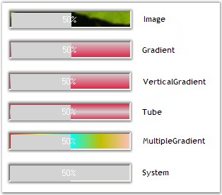
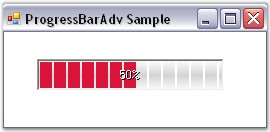
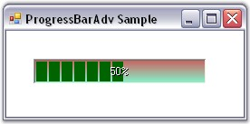
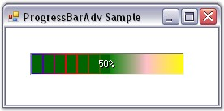
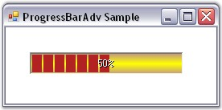

::: {style="DISPLAY: none"}
{#d2h_url_template}{#d2h_package_url style="WIDTH: 0px; DISPLAY: none; HEIGHT: 0px"}
:::

::::::::: {.d2h_secondary_topic style="PADDING-BOTTOM: 10pt; MARGIN: 0pt; PADDING-LEFT: 0pt; PADDING-RIGHT: 0pt; PADDING-TOP: 0pt"}
##### Background Settings {#background-settings style="MARGIN-LEFT: 18pt; tab-stops: 18.0pt"}

[]{style="COLOR: #15428b"} 

The ProgressBarAdv control consists of various properties to customize the background. These properties and their description are given below.\
\

###### 3.7.1.3.2.1 Background Style {#background-style style="tab-stops: 0pt"}

 

The style of the background can be set using the properties given below.

[]{style="COLOR: #15428b"} 

::: {align="center"}
+-----------------------------------+--------------------------------------------------------------------------------------------------------------------------------+
| ProgressBarAdv Property           | Description                                                                                                                    |
+-----------------------------------+--------------------------------------------------------------------------------------------------------------------------------+
| BackgroundStyle                   | Determines the style of the background. It includes the options given below.                                                   |
|                                   |                                                                                                                                |
|                                   |                                                                                                                                |
|                                   |                                                                                                                                |
|                                   | [·      ]{style="FONT-FAMILY: Symbol"}*Image,*                                                                                 |
|                                   |                                                                                                                                |
|                                   | [·      ]{style="FONT-FAMILY: Symbol"}*Gradient,*                                                                              |
|                                   |                                                                                                                                |
|                                   | [·      ]{style="FONT-FAMILY: Symbol"}*VerticalGradient,*                                                                      |
|                                   |                                                                                                                                |
|                                   | [·      ]{style="FONT-FAMILY: Symbol"}*Tube,*                                                                                  |
|                                   |                                                                                                                                |
|                                   | [·      ]{style="FONT-FAMILY: Symbol"}*MultipleGradient,*                                                                      |
|                                   |                                                                                                                                |
|                                   | [·      ]{style="FONT-FAMILY: Symbol"}*System and*                                                                             |
|                                   |                                                                                                                                |
|                                   | [·      ]{style="FONT-FAMILY: Symbol"}*None.*                                                                                  |
+-----------------------------------+--------------------------------------------------------------------------------------------------------------------------------+
| BackgroundFallbackStyle           | Determines the style of the background when BackgroundStyle is set to \'System\', provided the system does not support themes. |
+-----------------------------------+--------------------------------------------------------------------------------------------------------------------------------+
:::

[]{style="COLOR: #15428b"} 

+---------------------------------------------------------------------------------------------------------------------------------------------------------------------------------------------------------------------------------------------+
| **[\[C#\]]{style="FONT-FAMILY: 'Courier New'; COLOR: black"}**                                                                                                                                                                              |
|                                                                                                                                                                                                                                             |
| []{style="FONT-FAMILY: 'Courier New'; COLOR: black"}                                                                                                                                                                                        |
|                                                                                                                                                                                                                                             |
| [this]{style="FONT-FAMILY: 'Courier New'; COLOR: blue"}[.progressBarAdv1.BackgroundStyle = Syncfusion.Windows.Forms.Tools.[ProgressBarBackgroundStyles]{style="COLOR: teal"}.Gradient;]{style="FONT-FAMILY: 'Courier New'"}                 |
|                                                                                                                                                                                                                                             |
| [this]{style="FONT-FAMILY: 'Courier New'; COLOR: blue"}[.progressBarAdv1.BackgroundFallbackStyle = Syncfusion.Windows.Forms.Tools.[ProgressBarBackgroundStyles]{style="COLOR: teal"}.MultipleGradient;]{style="FONT-FAMILY: 'Courier New'"} |
+---------------------------------------------------------------------------------------------------------------------------------------------------------------------------------------------------------------------------------------------+

[]{style="COLOR: #15428b"} 

+-------------------------------------------------------------------------------------------------------------------------------------------------------------------------------------------------------------------+
| **[\[VB.NET\]]{style="FONT-FAMILY: 'Courier New'; COLOR: black"}**                                                                                                                                                |
|                                                                                                                                                                                                                   |
| []{style="FONT-FAMILY: 'Courier New'; COLOR: black"}                                                                                                                                                              |
|                                                                                                                                                                                                                   |
| [Me]{style="FONT-FAMILY: 'Courier New'; COLOR: blue"}[.progressBarAdv1.BackgroundStyle = Syncfusion.Windows.Forms.Tools.ProgressBarBackgroundStyles.Gradient]{style="FONT-FAMILY: 'Courier New'"}                 |
|                                                                                                                                                                                                                   |
| [Me]{style="FONT-FAMILY: 'Courier New'; COLOR: blue"}[.progressBarAdv1.BackgroundFallbackStyle = Syncfusion.Windows.Forms.Tools.ProgressBarBackgroundStyles.MultipleGradient]{style="FONT-FAMILY: 'Courier New'"} |
+-------------------------------------------------------------------------------------------------------------------------------------------------------------------------------------------------------------------+

[]{style="COLOR: #15428b"} 

{border="0"}

[]{style="COLOR: #15428b"} 

Figure 958: Background Styles

[]{style="COLOR: #15428b"} 

::: {style="BORDER-BOTTOM: windowtext 1pt solid; BORDER-LEFT: medium none; PADDING-BOTTOM: 1pt; MARGIN: 9pt 0pt 9pt 18pt; PADDING-LEFT: 0pt; PADDING-RIGHT: 0pt; BORDER-TOP: windowtext 1pt solid; BORDER-RIGHT: medium none; PADDING-TOP: 1pt"}
{border="0"} Note: To display the above styles in different colors the [[[BackGradientStartColor]{style="COLOR: windowtext; FONT-SIZE: 9pt; TEXT-DECORATION: none; text-underline: none"}]{.UGHyperlink}](../../../../../../../../Documents%20and%20Settings/sylviap/Desktop/Tools%20-%20Part%202.docx#_Background_Color_Settings) and [[[BackGradientEndColor]{style="COLOR: windowtext; FONT-SIZE: 9pt; TEXT-DECORATION: none; text-underline: none"}]{.UGHyperlink}](../../../../../../../../Documents%20and%20Settings/sylviap/Desktop/Tools%20-%20Part%202.docx#_Background_Color_Settings) properties can be used.
:::

[]{style="COLOR: #15428b"} 

###### 3.7.1.3.2.2 Background Segments {#background-segments style="tab-stops: 0pt"}

[]{style="COLOR: #15428b"} 

The background of the ProgressBarAdv can be displayed with a segmented appearance using the property given below.

[]{style="COLOR: #15428b"} 

::: {align="center"}
+-----------------------------------+-------------------------------------------------------+
| ProgressBarAdv Property           | Description                                           |
+-----------------------------------+-------------------------------------------------------+
| BackSegments                      | Determines if the background is segmented.            |
|                                   |                                                       |
|                                   |                                                       |
|                                   |                                                       |
|                                   | The BackgroundStyle property must be set to \'Tube\'. |
+-----------------------------------+-------------------------------------------------------+
:::

[]{style="COLOR: #15428b"} 

+-----------------------------------------------------------------------------------------------------------------------------------------------------------+
| **[\[C#\]]{style="FONT-FAMILY: 'Courier New'; COLOR: black"}**                                                                                            |
|                                                                                                                                                           |
| []{style="FONT-FAMILY: 'Courier New'; COLOR: black"}                                                                                                      |
|                                                                                                                                                           |
| [this]{style="FONT-FAMILY: 'Courier New'; COLOR: blue"}[.progressBarAdv1.BackSegments = [true]{style="COLOR: blue"};]{style="FONT-FAMILY: 'Courier New'"} |
+-----------------------------------------------------------------------------------------------------------------------------------------------------------+

[]{style="COLOR: #15428b"} 

+--------------------------------------------------------------------------------------------------------------------------------------------------------+
| **[\[VB.NET\]]{style="FONT-FAMILY: 'Courier New'; COLOR: black"}**                                                                                     |
|                                                                                                                                                        |
| []{style="FONT-FAMILY: 'Courier New'; COLOR: black"}                                                                                                   |
|                                                                                                                                                        |
| [Me]{style="FONT-FAMILY: 'Courier New'; COLOR: blue"}[.progressBarAdv1.BackSegments = [True]{style="COLOR: blue"}]{style="FONT-FAMILY: 'Courier New'"} |
+--------------------------------------------------------------------------------------------------------------------------------------------------------+

[]{style="COLOR: #15428b"} 

[{border="0"}]{style="COLOR: #15428b"}[]{style="COLOR: #15428b"}

**[]{style="COLOR: #15428b"}** 

Figure 959: ProgressBarAdv with BackSegments property set to True

 

 

 

[]{#p709} 

###### []{#_Background_Color_Settings}3.7.1.3.2.3      Background Color Settings {#background-color-settings style="MARGIN-LEFT: 18pt; tab-stops: 18.0pt"}

[]{style="COLOR: #15428b"} 

This section illustrates the color settings that can be applied to the background of the ProgressBarAdv.

[]{style="COLOR: #15428b"} 

Gradient Color

[]{style="COLOR: #15428b"} 

The color of the background gradient can be changed using the properties given below.

[]{style="COLOR: #15428b"} 

::: {align="center"}
+-----------------------------------+-------------------------------------------------------------------------------------+
| ProgressBarAdv Property           | Description                                                                         |
+-----------------------------------+-------------------------------------------------------------------------------------+
| BackGradientStartColor            | Specifies the start color of the background gradient.                               |
|                                   |                                                                                     |
|                                   |                                                                                     |
|                                   |                                                                                     |
|                                   | The BackgroundStyle property should be set to \'Gradient\' or \'VerticalGradient\'. |
+-----------------------------------+-------------------------------------------------------------------------------------+
| BackGradientEndColor              | Specifies the end color of the background gradient.                                 |
|                                   |                                                                                     |
|                                   |                                                                                     |
|                                   |                                                                                     |
|                                   | The BackgroundStyle property should be set to \'Gradient\' or \'VerticalGradient\'. |
+-----------------------------------+-------------------------------------------------------------------------------------+
:::

[]{style="COLOR: #15428b"} 

+-----------------------------------------------------------------------------------------------------------------------------------------------------------------------------------------------+
| **[\[C#\]]{style="FONT-FAMILY: 'Courier New'; COLOR: black"}**                                                                                                                                |
|                                                                                                                                                                                               |
| []{style="FONT-FAMILY: 'Courier New'; COLOR: black"}                                                                                                                                          |
|                                                                                                                                                                                               |
| [this]{style="FONT-FAMILY: 'Courier New'; COLOR: blue"}[.progressBarAdv1.BackGradientEndColor = System.Drawing.[Color]{style="COLOR: teal"}.Aquamarine;]{style="FONT-FAMILY: 'Courier New'"}  |
|                                                                                                                                                                                               |
| [this]{style="FONT-FAMILY: 'Courier New'; COLOR: blue"}[.progressBarAdv1.BackGradientStartColor = System.Drawing.[Color]{style="COLOR: teal"}.IndianRed;]{style="FONT-FAMILY: 'Courier New'"} |
+-----------------------------------------------------------------------------------------------------------------------------------------------------------------------------------------------+

[]{style="COLOR: #15428b"} 

+---------------------------------------------------------------------------------------------------------------------------------------------------------------------+
| **[\[VB.NET\]]{style="FONT-FAMILY: 'Courier New'; COLOR: black"}**                                                                                                  |
|                                                                                                                                                                     |
| **[]{style="FONT-FAMILY: 'Courier New'; COLOR: black"}**                                                                                                            |
|                                                                                                                                                                     |
| [Me]{style="FONT-FAMILY: 'Courier New'; COLOR: blue"}[.progressBarAdv1.BackGradientEndColor = System.Drawing.Color.Aquamarine]{style="FONT-FAMILY: 'Courier New'"}  |
|                                                                                                                                                                     |
| [Me]{style="FONT-FAMILY: 'Courier New'; COLOR: blue"}[.progressBarAdv1.BackGradientStartColor = System.Drawing.Color.IndianRed]{style="FONT-FAMILY: 'Courier New'"} |
+---------------------------------------------------------------------------------------------------------------------------------------------------------------------+

**[]{style="COLOR: #15428b"}** 

{border="0"}

[]{style="COLOR: #15428b"} 

Figure 960: Background Gradient Color Set

 

The background gradient can be displayed with multiple colors using the property given below.

[]{style="COLOR: #15428b"} 

::: {align="center"}
+-----------------------------------+-------------------------------------------------------------------------------------+
| ProgressBarAdv Property           | Description                                                                         |
+-----------------------------------+-------------------------------------------------------------------------------------+
| BackMultipleColors                | Specifies the array of colors used to draw the multiple gradient of the background. |
|                                   |                                                                                     |
|                                   |                                                                                     |
|                                   |                                                                                     |
|                                   | The BackgroundStyle property should be set to \'MultipleGradient\'.                 |
+-----------------------------------+-------------------------------------------------------------------------------------+
:::

[]{style="COLOR: #15428b"} 

+-----------------------------------------------------------------------------------------------------------------------------------------------------------------------------------------------------------------------------------------------------------------------------------------------------------------------------------------------------------------------------------------------------------------------------------------------------------------------------+
| **[\[C#\]]{style="FONT-FAMILY: 'Courier New'; COLOR: black"}**                                                                                                                                                                                                                                                                                                                                                                                                              |
|                                                                                                                                                                                                                                                                                                                                                                                                                                                                             |
| []{style="FONT-FAMILY: 'Courier New'; COLOR: black"}                                                                                                                                                                                                                                                                                                                                                                                                                        |
|                                                                                                                                                                                                                                                                                                                                                                                                                                                                             |
| [this]{style="FONT-FAMILY: 'Courier New'; COLOR: blue"}[.progressBarAdv1.BackMultipleColors = [new]{style="COLOR: blue"} System.Drawing.[Color]{style="COLOR: teal"}\[\] {System.Drawing.[Color]{style="COLOR: teal"}.Blue, System.Drawing.[Color]{style="COLOR: teal"}.Red, System.Drawing.[Color]{style="COLOR: teal"}.Green, System.Drawing.[Color]{style="COLOR: teal"}.Pink, System.Drawing.[Color]{style="COLOR: teal"}.Yellow};]{style="FONT-FAMILY: 'Courier New'"} |
+-----------------------------------------------------------------------------------------------------------------------------------------------------------------------------------------------------------------------------------------------------------------------------------------------------------------------------------------------------------------------------------------------------------------------------------------------------------------------------+

[]{style="COLOR: #15428b"} 

+--------------------------------------------------------------------------------------------------------------------------------------------------------------------------------------------------------------------------------------------------------------------------------------------------------------------------------+
| **[\[VB.NET\]]{style="FONT-FAMILY: 'Courier New'; COLOR: black"}**                                                                                                                                                                                                                                                             |
|                                                                                                                                                                                                                                                                                                                                |
| []{style="FONT-FAMILY: 'Courier New'; COLOR: black"}                                                                                                                                                                                                                                                                           |
|                                                                                                                                                                                                                                                                                                                                |
| [Me]{style="FONT-FAMILY: 'Courier New'; COLOR: blue"}[.progressBarAdv1.BackMultipleColors = [New]{style="COLOR: blue"} System.Drawing.Color\[\] {System.Drawing.Color.Blue, System.Drawing.Color.Red, System.Drawing.Color.Green, System.Drawing.Color.Pink, System.Drawing.Color.Yellow}]{style="FONT-FAMILY: 'Courier New'"} |
+--------------------------------------------------------------------------------------------------------------------------------------------------------------------------------------------------------------------------------------------------------------------------------------------------------------------------------+

[]{style="COLOR: #15428b"} 

{border="0"}

[]{style="COLOR: #15428b"} 

Figure 961: Background Gradient displayed with Multiple Colors

[]{style="COLOR: #15428b"} 

Tube Color

[]{style="COLOR: #15428b"} 

Colors can be set for the background tube of the ProgressBarAdv.

[]{style="COLOR: #15428b"} 

::: {align="center"}
+-----------------------------------+---------------------------------------------------------+
| ProgressBarAdv Property           | Description                                             |
+-----------------------------------+---------------------------------------------------------+
| BackTubeStartColor                | Specifies the start color of the background tube.       |
|                                   |                                                         |
|                                   |                                                         |
|                                   |                                                         |
|                                   | The BackgroundStyle property should be set to \'Tube\'. |
+-----------------------------------+---------------------------------------------------------+
| BackTubeEndColor                  | Specifies the end color of the background tube.         |
|                                   |                                                         |
|                                   |                                                         |
|                                   |                                                         |
|                                   | The BackgroundStyle property should be set to \'Tube\'. |
+-----------------------------------+---------------------------------------------------------+
:::

[]{style="COLOR: #15428b"} 

+-----------------------------------------------------------------------------------------------------------------------------------------------------------------------------------------+
| **[\[C#\]]{style="FONT-FAMILY: 'Courier New'; COLOR: black"}**                                                                                                                          |
|                                                                                                                                                                                         |
| []{style="FONT-FAMILY: 'Courier New'; COLOR: black"}                                                                                                                                    |
|                                                                                                                                                                                         |
| [this]{style="FONT-FAMILY: 'Courier New'; COLOR: blue"}[.progressBarAdv1.BackTubeEndColor = System.Drawing.[Color]{style="COLOR: teal"}.RosyBrown;]{style="FONT-FAMILY: 'Courier New'"} |
|                                                                                                                                                                                         |
| [this]{style="FONT-FAMILY: 'Courier New'; COLOR: blue"}[.progressBarAdv1.BackTubeStartColor = System.Drawing.[Color]{style="COLOR: teal"}.Yellow;]{style="FONT-FAMILY: 'Courier New'"}  |
+-----------------------------------------------------------------------------------------------------------------------------------------------------------------------------------------+

[]{style="COLOR: #15428b"} 

+---------------------------------------------------------------------------------------------------------------------------------------------------------------+
| **[\[VB.NET\]]{style="FONT-FAMILY: 'Courier New'; COLOR: black"}**                                                                                            |
|                                                                                                                                                               |
| []{style="FONT-FAMILY: 'Courier New'; COLOR: black"}                                                                                                          |
|                                                                                                                                                               |
| [Me]{style="FONT-FAMILY: 'Courier New'; COLOR: blue"}[.progressBarAdv1.BackTubeEndColor = System.Drawing.Color.RosyBrown]{style="FONT-FAMILY: 'Courier New'"} |
|                                                                                                                                                               |
| [Me]{style="FONT-FAMILY: 'Courier New'; COLOR: blue"}[.progressBarAdv1.BackTubeStartColor = System.Drawing.Color.Yellow]{style="FONT-FAMILY: 'Courier New'"}  |
+---------------------------------------------------------------------------------------------------------------------------------------------------------------+

[]{style="COLOR: #15428b"} 

[{border="0"}]{style="COLOR: #15428b"}[]{style="COLOR: #15428b"}

[]{style="COLOR: #15428b"} 

Figure 962: Background Tube Color Set

[]{style="COLOR: #15428b"} 

See Also

[]{style="COLOR: #4a5c8c"} 

[[Foreground Settings]{.UGHyperlink}](../../../../../../../../Documents%20and%20Settings/sylviap/Desktop/Tools%20-%20Part%202.docx#_Foreground_Settings)[]{.UGHyperlink}

 

 

 

[]{#p710} 

[]{#related-topics}
:::::::::
