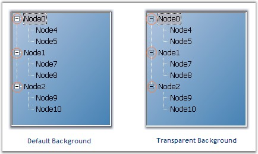
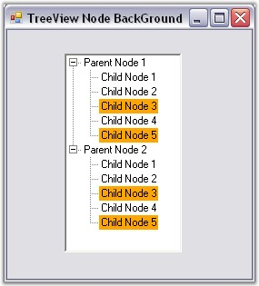
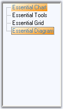

::: {style="DISPLAY: none"}
{#d2h_url_template}{#d2h_package_url style="WIDTH: 0px; DISPLAY: none; HEIGHT: 0px"}
:::

::::::::::::: {.d2h_secondary_topic style="PADDING-BOTTOM: 10pt; MARGIN: 0pt; PADDING-LEFT: 0pt; PADDING-RIGHT: 0pt; PADDING-TOP: 0pt"}
##### Background Settings {#background-settings style="MARGIN-LEFT: 18pt; tab-stops: 18.0pt"}

**[]{style="COLOR: #15428b"}** 

TreeView control lets you customize its background with colors and image.

 

**Background Colors**

[]{style="COLOR: #15428b"} 

The below properties sets the background color for the treeview and also the node text.

[]{style="COLOR: #15428b"} 

::: {align="center"}
  ------------------------ -------------------------------------------------------------------------------------------------------------------------------------------
  TreeViewAdv Properties   Description
  BackgroundColor          Indicates the background color of the control. It provides options to set style, backcolor, forecolor, gradientcolor and gradient styles.
  BackColor                Indicates the background color of the text and the graphics of the control.
  ------------------------ -------------------------------------------------------------------------------------------------------------------------------------------
:::

[]{style="COLOR: #15428b"} 

::: {style="BORDER-BOTTOM: windowtext 1pt solid; BORDER-LEFT: medium none; PADDING-BOTTOM: 1pt; MARGIN: 9pt 0pt 9pt 18pt; PADDING-LEFT: 0pt; PADDING-RIGHT: 0pt; BORDER-TOP: windowtext 1pt solid; BORDER-RIGHT: medium none; PADDING-TOP: 1pt"}
{border="0"} Note: The Background property is available for individual nodes also.
:::

[]{style="COLOR: #15428b"} 

Background Image

[]{style="COLOR: #15428b"} 

Use the **BackgroundImage** property to specify a custom image as the background of the chart. The image layout can also be specified using the properties below.

[]{style="COLOR: #15428b"} 

::: {align="center"}
  ------------------------ ------------------------------------------------------------------
  TreeViewAdv Properties   Description
  BackgroundImage          Indicates the background image that can be used for the control.
  BackgroundImageLayout    Indicates the layout for the background image in the control.
  ------------------------ ------------------------------------------------------------------
:::

***[]{style="COLOR: #15428b"}*** 

More Customization for PlusMinus Controls

 

The controls in the TreeViewAdv like PlusMinus control will have a transparent background, if the TransparentControls property is set to true.[]{#p979}

[]{style="COLOR: #15428b"} 

::: {align="center"}
  ------------------------ --------------------------------------------------------------
  TreeViewAdv Properties   Description
  TransparentControls      Indicates if the control will have a transparent background.
  ------------------------ --------------------------------------------------------------
:::

[]{#p980}[]{style="COLOR: #15428b"} 

+-----------------------------------------------------------------------------------------------------------------------------------------------------------------------------------------------------+
| **[ \[C#\]]{style="FONT-FAMILY: 'Courier New'; COLOR: black"}**                                                                                                                                     |
|                                                                                                                                                                                                     |
| []{style="COLOR: #15428b"}                                                                                                                                                                          |
|                                                                                                                                                                                                     |
| [this]{style="FONT-FAMILY: 'Courier New'; COLOR: blue"}[.treeViewAdv1.TransparentControls = [true]{style="COLOR: blue"};]{style="FONT-FAMILY: 'Courier New'"}[]{style="FONT-FAMILY: 'Courier New'"} |
+-----------------------------------------------------------------------------------------------------------------------------------------------------------------------------------------------------+

[]{style="COLOR: #15428b"} 

+---------------------------------------------------------------------------------------------------------------------------------------------------------------------------------------------------------------+
| **[\[VB.NET\]]{style="FONT-FAMILY: 'Courier New'; COLOR: black"}**                                                                                                                                            |
|                                                                                                                                                                                                               |
| []{style="COLOR: #15428b"}                                                                                                                                                                                    |
|                                                                                                                                                                                                               |
| [Me]{style="FONT-FAMILY: 'Courier New'; COLOR: blue"}[.treeViewAdv1.TransparentControls = [True]{style="COLOR: blue"}]{style="FONT-FAMILY: 'Courier New'"}[]{style="FONT-FAMILY: 'Courier New'; COLOR: blue"} |
+---------------------------------------------------------------------------------------------------------------------------------------------------------------------------------------------------------------+

[]{style="COLOR: #15428b"} 

{border="0"}

[]{style="COLOR: #15428b"} 

Figure 1145: TransparentControls property Illustrated

[]{style="COLOR: #15428b"} 

Themed TreeView Control

**[]{style="COLOR: #15428b"}** 

Themes can be enabled for the control by enabling **ThemesEnabled** property. This can also be enabled for individual nodes also by using the **TreeNodeAdv.ThemesEnabled** property.

[]{style="COLOR: #15428b"} 

::: {align="center"}
  ------------------------ -------------------------------------------
  TreeViewAdv Properties   Description
  ThemesEnabled            Indicates if the control is drawn themed.
  ------------------------ -------------------------------------------
:::

[]{style="COLOR: #15428b"} 

::: {align="center"}
  ------------------------ -----------------------------------------------
  TreeNodeAdv Properties   Description
  ThemesEnabled            Indicates if the node control will be themed.
  ------------------------ -----------------------------------------------
:::

 

 

 

 

###### 3.11.3.5.1.1    Drawing Node Background {#drawing-node-background style="MARGIN-LEFT: 18pt; tab-stops: 18.0pt"}

[]{style="COLOR: #15428b"} 

To draw the node\'s background, users need to turn on **OwnerDrawnNodesBackground** property, in the TreeViewAdv and then listen to the tree\'s **NodeBackgroundPaint** event which will be called for each node. This can be implemented by using the following code snippet.

[]{style="COLOR: #15428b"} 

::: {align="center"}
  --------------------------- -----------------------------------------------------------------------------------------------
  TreeViewAdv Properties      Description
  OwnerDrawnNodesBackground   Indicates if the NodeBackgroundPaint event will be fired before drawing a node\'s background.
  --------------------------- -----------------------------------------------------------------------------------------------
:::

[]{style="COLOR: #15428b"} 

::: {align="center"}
  --------------------- --------------------------------------------------------------------------------------------------------
  TreeViewAdv event     Description
  NodeBackgroundPaint   This event when fired, paints the background of the node, when OwnerDrawNodes property is set to true.
  --------------------- --------------------------------------------------------------------------------------------------------
:::

[]{style="COLOR: #15428b"} 

+-------------------------------------------------------------------------------------------------------------------------------------------------------------------------------------------------------------------------------------------------------------------+
| **[\[C#\]]{style="FONT-FAMILY: 'Courier New'; COLOR: black"}**                                                                                                                                                                                                    |
|                                                                                                                                                                                                                                                                   |
| []{style="COLOR: #15428b"}                                                                                                                                                                                                                                        |
|                                                                                                                                                                                                                                                                   |
| [this]{style="FONT-FAMILY: 'Courier New'; COLOR: blue"}[.treeViewAdv1.OwnerDrawNodesBackground = [true]{style="COLOR: blue"};]{style="FONT-FAMILY: 'Courier New'"}                                                                                                |
|                                                                                                                                                                                                                                                                   |
| [// Background Paint Event]{style="FONT-FAMILY: 'Courier New'; COLOR: green"}                                                                                                                                                                                     |
|                                                                                                                                                                                                                                                                   |
| [private]{style="FONT-FAMILY: 'Courier New'; COLOR: blue"}[ [void]{style="COLOR: blue"} treeViewAdv1_NodeBackgroundPaint([object]{style="COLOR: blue"} sender, [TreeNodeAdvPaintBackgroundEventArgs]{style="COLOR: teal"} e)]{style="FONT-FAMILY: 'Courier New'"} |
|                                                                                                                                                                                                                                                                   |
| [{]{style="FONT-FAMILY: 'Courier New'"}                                                                                                                                                                                                                           |
|                                                                                                                                                                                                                                                                   |
| [    if]{style="FONT-FAMILY: 'Courier New'; COLOR: blue"}[ (e.Node.Index == 2 \| e.Node.Index == 4)]{style="FONT-FAMILY: 'Courier New'"}                                                                                                                          |
|                                                                                                                                                                                                                                                                   |
| [    {]{style="FONT-FAMILY: 'Courier New'"}                                                                                                                                                                                                                       |
|                                                                                                                                                                                                                                                                   |
| [        Syncfusion.Drawing.[BrushInfo]{style="COLOR: teal"} br = [new]{style="COLOR: blue"} Syncfusion.Drawing.[BrushInfo]{style="COLOR: teal"}([Color]{style="COLOR: teal"}.Orange);]{style="FONT-FAMILY: 'Courier New'"}                                       |
|                                                                                                                                                                                                                                                                   |
| [        e.BrushInfo = br;]{style="FONT-FAMILY: 'Courier New'"}                                                                                                                                                                                                   |
|                                                                                                                                                                                                                                                                   |
| [    }]{style="FONT-FAMILY: 'Courier New'"}                                                                                                                                                                                                                       |
|                                                                                                                                                                                                                                                                   |
| [}]{style="FONT-FAMILY: 'Courier New'"}[]{style="FONT-FAMILY: 'Courier New'"}                                                                                                                                                                                     |
+-------------------------------------------------------------------------------------------------------------------------------------------------------------------------------------------------------------------------------------------------------------------+

[]{style="COLOR: #15428b"} 

+---------------------------------------------------------------------------------------------------------------------------------------------------------------------------------------------------------------------------------------------------------------------------------------------------------------------------------------------------------+
| **[\[VB.NET\]]{style="FONT-FAMILY: 'Courier New'; COLOR: black"}**                                                                                                                                                                                                                                                                                      |
|                                                                                                                                                                                                                                                                                                                                                         |
| []{style="COLOR: #15428b"}                                                                                                                                                                                                                                                                                                                              |
|                                                                                                                                                                                                                                                                                                                                                         |
| [Me]{style="FONT-FAMILY: 'Courier New'; COLOR: blue"}[.treeViewAdv1.OwnerDrawNodesBackground = [True]{style="COLOR: blue"}]{style="FONT-FAMILY: 'Courier New'"}                                                                                                                                                                                         |
|                                                                                                                                                                                                                                                                                                                                                         |
| [\' Background Pain Event]{style="FONT-FAMILY: 'Courier New'; COLOR: green"}                                                                                                                                                                                                                                                                            |
|                                                                                                                                                                                                                                                                                                                                                         |
| [Private]{style="FONT-FAMILY: 'Courier New'; COLOR: blue"}[ [Sub]{style="COLOR: blue"} treeViewAdv1_NodeBackgroundPaint([ByVal]{style="COLOR: blue"} sender [As]{style="COLOR: blue"} [Object]{style="COLOR: blue"}, [ByVal]{style="COLOR: blue"} e [As]{style="COLOR: blue"} TreeNodeAdvPaintBackgroundEventArgs)]{style="FONT-FAMILY: 'Courier New'"} |
|                                                                                                                                                                                                                                                                                                                                                         |
| [    If]{style="FONT-FAMILY: 'Courier New'; COLOR: blue"}[ e.Node.Index = 2 [Or]{style="COLOR: blue"} e.Node.Index = 4 [Then]{style="COLOR: blue"}]{style="FONT-FAMILY: 'Courier New'"}                                                                                                                                                                 |
|                                                                                                                                                                                                                                                                                                                                                         |
| [    [Dim]{style="COLOR: blue"} br [As]{style="COLOR: blue"} Syncfusion.Drawing.BrushInfo = [New]{style="COLOR: blue"} Syncfusion.Drawing.BrushInfo(Color.Orange)]{style="FONT-FAMILY: 'Courier New'"}                                                                                                                                                  |
|                                                                                                                                                                                                                                                                                                                                                         |
| [    e.BrushInfo = br]{style="FONT-FAMILY: 'Courier New'"}                                                                                                                                                                                                                                                                                              |
|                                                                                                                                                                                                                                                                                                                                                         |
| [    End]{style="FONT-FAMILY: 'Courier New'; COLOR: blue"}[ [If]{style="COLOR: blue"}]{style="FONT-FAMILY: 'Courier New'"}                                                                                                                                                                                                                              |
|                                                                                                                                                                                                                                                                                                                                                         |
| [End]{style="FONT-FAMILY: 'Courier New'; COLOR: blue"}[ [Sub]{style="COLOR: blue"}]{style="FONT-FAMILY: 'Courier New'"}[]{style="FONT-FAMILY: 'Courier New'; COLOR: blue"}                                                                                                                                                                              |
+---------------------------------------------------------------------------------------------------------------------------------------------------------------------------------------------------------------------------------------------------------------------------------------------------------------------------------------------------------+

[]{style="COLOR: #15428b"} 

{border="0"}

**[]{style="COLOR: #15428b"}** 

Figure 1146: \"Orange\" color background for Node Index 2 and 4

[]{style="COLOR: #15428b"} 

Painting the active and inactive nodes

[]{style="COLOR: #15428b"} 

Background for the selected node can be set using **SelectedNodeBackground** property. The selection rectangle gets grayed out when the TreeViewAdv loses focus. If the user still wishes to maintain the node\'s active colors, then the **InactiveSelectedNodeBackground** and **InactiveSelectedNodeForeColor** properties can be set.

[]{style="COLOR: #15428b"} 

::: {style="BORDER-BOTTOM: windowtext 1pt solid; BORDER-LEFT: medium none; PADDING-BOTTOM: 1pt; MARGIN: 9pt 0pt 9pt 18pt; PADDING-LEFT: 0pt; PADDING-RIGHT: 0pt; BORDER-TOP: windowtext 1pt solid; BORDER-RIGHT: medium none; PADDING-TOP: 1pt"}
[{border="0"}]{style="COLOR: #15428b"}[ Note: ]{style="COLOR: #15428b"}[[HideSelectio]{.UGHyperlink}[n]{style="COLOR: windowtext; TEXT-DECORATION: none; text-underline: none"}](../../../../../../../../Documents%20and%20Settings/sylviap/Desktop/Tools%20-%20Part%202.docx#_Node_Selection)[ property should be set to false to effect this setting.]{style="COLOR: #15428b"}
:::

[]{style="COLOR: #15428b"} 

::: {align="center"}
  -------------------------------- ---------------------------------------------------------------------------------
  TreeViewAdv Properties           Description
  SelectedNodeBackground           Paints the background of the selected node.
  InactiveSelectedNodeBackground   Indicates the background of the selected node when the control is not focussed.
  InactiveSelectedNodeForeColor    Indicates the text color of the selected node when not focussed.
  -------------------------------- ---------------------------------------------------------------------------------
:::

[]{style="COLOR: #15428b"} 

+-----------------------------------------------------------------------------------------------------------------------------------------------------------------------------------------------------------------------------------------------------------------------------------------------------------------------------------------------------------------------------------------------------------------+
| **[\[C#\]]{style="FONT-FAMILY: 'Courier New'; COLOR: black"}**                                                                                                                                                                                                                                                                                                                                                  |
|                                                                                                                                                                                                                                                                                                                                                                                                                 |
| []{style="COLOR: #15428b"}                                                                                                                                                                                                                                                                                                                                                                                      |
|                                                                                                                                                                                                                                                                                                                                                                                                                 |
| [this]{style="FONT-FAMILY: 'Courier New'; COLOR: blue"}[.treeViewAdv1.InactiveSelectedNodeBackground = [new]{style="COLOR: blue"} Syncfusion.Drawing.[BrushInfo]{style="COLOR: teal"}(Syncfusion.Drawing.[GradientStyle]{style="COLOR: teal"}.ForwardDiagonal, System.Drawing.[Color]{style="COLOR: teal"}.Ivory, System.Drawing.[Color]{style="COLOR: teal"}.DarkOrange);]{style="FONT-FAMILY: 'Courier New'"} |
|                                                                                                                                                                                                                                                                                                                                                                                                                 |
| [this]{style="FONT-FAMILY: 'Courier New'; COLOR: blue"}[.treeViewAdv1.]{style="FONT-FAMILY: 'Courier New'"}[InactiveSelectedNodeForeColor = System.Drawing.[Color]{style="COLOR: teal"}.SteelBlue;]{style="FONT-FAMILY: 'Courier New'"}                                                                                                                                                                         |
+-----------------------------------------------------------------------------------------------------------------------------------------------------------------------------------------------------------------------------------------------------------------------------------------------------------------------------------------------------------------------------------------------------------------+

[]{#p981}[]{style="COLOR: #15428b"} 

+------------------------------------------------------------------------------------------------------------------------------------------------------------------------------------------------------------------------------------------------------------------------------------------------------------------------------------------+
| **[\[VB.NET\]]{style="FONT-FAMILY: 'Courier New'; COLOR: black"}**                                                                                                                                                                                                                                                                       |
|                                                                                                                                                                                                                                                                                                                                          |
| []{style="COLOR: #15428b"}                                                                                                                                                                                                                                                                                                               |
|                                                                                                                                                                                                                                                                                                                                          |
| [Me]{style="FONT-FAMILY: 'Courier New'; COLOR: blue"}[.treeViewAdv1.InactiveSelectedNodeBackground = [New]{style="COLOR: blue"} Syncfusion.Drawing[.BrushInfo(Syncfusion.Drawing.GradientStyle.ForwardDiagonal, System.Drawing.Color.Ivory, System.Drawing.Color.DarkOrange)]{style="COLOR: black"}]{style="FONT-FAMILY: 'Courier New'"} |
|                                                                                                                                                                                                                                                                                                                                          |
| [Me]{style="FONT-FAMILY: 'Courier New'; COLOR: blue"}[.treeViewAdv1.InactiveSelectedNodeForeColor = System.[Drawing.Color.SteelBlue]{style="COLOR: black"}]{style="FONT-FAMILY: 'Courier New'"}[]{style="FONT-FAMILY: 'Courier New'; COLOR: black"}                                                                                      |
+------------------------------------------------------------------------------------------------------------------------------------------------------------------------------------------------------------------------------------------------------------------------------------------------------------------------------------------+

[]{style="COLOR: #15428b"} 

{border="0"}

[]{style="COLOR: #15428b"} 

Figure 1147: Inactive Nodes painted with OrangeRed and Ivory Background with SteelBlue Foreground

 

 

 

 

[]{#related-topics}
:::::::::::::
