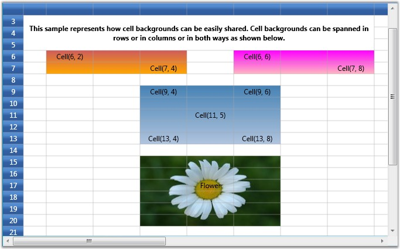

::: {style="DISPLAY: none"}
{#d2h_url_template}{#d2h_package_url style="WIDTH: 0px; DISPLAY: none; HEIGHT: 0px"}
:::

::: {.d2h_secondary_topic style="PADDING-BOTTOM: 10pt; MARGIN: 0pt; PADDING-LEFT: 0pt; PADDING-RIGHT: 0pt; PADDING-TOP: 0pt"}
#### Banner Cells {#banner-cells style="tab-stops: 0pt"}

[]{style="FONT-FAMILY: 'Trebuchet MS','sans-serif'; COLOR: #15428b; FONT-SIZE: 9pt"} 

You can create custom range of cells inside a Grid, which is termed as banner cells. Let us see how to create Banner Cells

[]{style="FONT-FAMILY: 'Trebuchet MS','sans-serif'; COLOR: #15428b; FONT-SIZE: 9pt"} 

Cell Spanned Backgrounds

[]{style="FONT-FAMILY: 'Trebuchet MS','sans-serif'; COLOR: #15428b; FONT-SIZE: 9pt"} 

Essential Grid lets you span the given background across multiple cells either row-wise, column-wise or both. The information about all the cell spans for a given grid is maintained by the **GridModel.CellSpanBackgrounds**. Each entry represents an object of **CellSpanBackgroundInfo** class that defines a cell span. This class exposes properties such as background, border, and more to customize the cell span.

[]{style="FONT-FAMILY: 'Trebuchet MS','sans-serif'; COLOR: #15428b; FONT-SIZE: 9pt"} 

You can also trigger **QueryCellSpanBackgrounds** event to create and customize cell spans.

[]{style="FONT-FAMILY: 'Trebuchet MS','sans-serif'; COLOR: #15428b; FONT-SIZE: 9pt"} 

Creating Cell Spans

[]{style="FONT-FAMILY: 'Trebuchet MS','sans-serif'; COLOR: #15428b; FONT-SIZE: 9pt"} 

This example creates three cell spans with gradient backgrounds and a fourth cell span with an image background created through the QueryCellSpanBackgrounds event.

[]{style="FONT-FAMILY: 'Trebuchet MS','sans-serif'; COLOR: #15428b; FONT-SIZE: 9pt"} 

+------------------------------------------------------------------------------------------------------------------------------------------------------------------------------------------------------------+
| **[\[C#\]]{style="FONT-FAMILY: 'Courier New'; COLOR: black"}**                                                                                                                                             |
|                                                                                                                                                                                                            |
| []{style="FONT-FAMILY: 'Courier New'; COLOR: blue"}                                                                                                                                                        |
|                                                                                                                                                                                                            |
| [CellSpanBackgroundInfo cellspan1 = [new]{style="COLOR: blue"} CellSpanBackgroundInfo(6, 2, 7, 4);]{style="FONT-FAMILY: 'Courier New'"}                                                                    |
|                                                                                                                                                                                                            |
| [cellspan1.Background = [new]{style="COLOR: blue"} LinearGradientBrush(Colors.IndianRed, Colors.Orange, 90);]{style="FONT-FAMILY: 'Courier New'"}                                                          |
|                                                                                                                                                                                                            |
| [grid.Model.CellSpanBackgrounds.Add(cellspan1);]{style="FONT-FAMILY: 'Courier New'"}                                                                                                                       |
|                                                                                                                                                                                                            |
| []{style="FONT-FAMILY: 'Courier New'"}                                                                                                                                                                     |
|                                                                                                                                                                                                            |
| [CellSpanBackgroundInfo cellspan2 = [new]{style="COLOR: blue"} CellSpanBackgroundInfo(6, 6, 7, 8);]{style="FONT-FAMILY: 'Courier New'"}                                                                    |
|                                                                                                                                                                                                            |
| [cellspan2.Background = [new]{style="COLOR: blue"} LinearGradientBrush(Colors.Magenta, Colors.LightPink, 90);]{style="FONT-FAMILY: 'Courier New'"}                                                         |
|                                                                                                                                                                                                            |
| [grid.Model.CellSpanBackgrounds.Add(cellspan2);]{style="FONT-FAMILY: 'Courier New'"}                                                                                                                       |
|                                                                                                                                                                                                            |
| []{style="FONT-FAMILY: 'Courier New'"}                                                                                                                                                                     |
|                                                                                                                                                                                                            |
| [CellSpanBackgroundInfo cellspan3 = [new]{style="COLOR: blue"} CellSpanBackgroundInfo(9, 4, 13, 6);]{style="FONT-FAMILY: 'Courier New'"}                                                                   |
|                                                                                                                                                                                                            |
| [cellspan3.Background = [new]{style="COLOR: blue"} LinearGradientBrush(Colors.SteelBlue, Colors.LightSteelBlue, 90);]{style="FONT-FAMILY: 'Courier New'"}                                                  |
|                                                                                                                                                                                                            |
| [grid.Model.CellSpanBackgrounds.Add(cellspan3);]{style="FONT-FAMILY: 'Courier New'"}                                                                                                                       |
|                                                                                                                                                                                                            |
| []{style="FONT-FAMILY: 'Courier New'"}                                                                                                                                                                     |
|                                                                                                                                                                                                            |
| [grid.QueryCellSpanBackgrounds += [new]{style="COLOR: blue"} GridQueryCellSpanBackgroundsEventHandler (grid_QueryCellSpanBackgrounds);]{style="FONT-FAMILY: 'Courier New'"}                                |
|                                                                                                                                                                                                            |
| []{style="FONT-FAMILY: 'Courier New'"}                                                                                                                                                                     |
|                                                                                                                                                                                                            |
| []{style="FONT-FAMILY: 'Courier New'"}                                                                                                                                                                     |
|                                                                                                                                                                                                            |
| [void]{style="FONT-FAMILY: 'Courier New'; COLOR: blue"}[ grid_QueryCellSpanBackgrounds([object]{style="COLOR: blue"} sender, GridQueryCellSpanBackgroundsEventArgs e)]{style="FONT-FAMILY: 'Courier New'"} |
|                                                                                                                                                                                                            |
| [{]{style="FONT-FAMILY: 'Courier New'"}                                                                                                                                                                    |
|                                                                                                                                                                                                            |
| [    [if]{style="COLOR: blue"} (e.CellRowColumnIndex.ColumnIndex == 4 && e.CellRowColumnIndex.RowIndex == 15)]{style="FONT-FAMILY: 'Courier New'"}                                                         |
|                                                                                                                                                                                                            |
| [    {]{style="FONT-FAMILY: 'Courier New'"}                                                                                                                                                                |
|                                                                                                                                                                                                            |
| [        CellSpanBackgroundInfo item = [new]{style="COLOR: blue"} CellSpanBackgroundInfo(e.CellRowColumnIndex.RowIndex, e.CellRowColumnIndex.ColumnIndex, 20, 6);]{style="FONT-FAMILY: 'Courier New'"}     |
|                                                                                                                                                                                                            |
| [        item.Background = [new]{style="COLOR: blue"} ImageBrush(GetImage([@\"common\\Images\\Grid\\BannerCells\\back2.jpg\"]{style="COLOR: #a31515"}));]{style="FONT-FAMILY: 'Courier New'"}              |
|                                                                                                                                                                                                            |
| [        e.Range = [new]{style="COLOR: blue"} List\<CellSpanBackgroundInfo\>();]{style="FONT-FAMILY: 'Courier New'"}                                                                                       |
|                                                                                                                                                                                                            |
| [        e.Range.Add(item);]{style="FONT-FAMILY: 'Courier New'"}                                                                                                                                           |
|                                                                                                                                                                                                            |
| [        e.Handled = [true]{style="COLOR: blue"};]{style="FONT-FAMILY: 'Courier New'"}                                                                                                                     |
|                                                                                                                                                                                                            |
| [    }]{style="FONT-FAMILY: 'Courier New'"}                                                                                                                                                                |
|                                                                                                                                                                                                            |
| [}]{style="FONT-FAMILY: 'Courier New'"}                                                                                                                                                                    |
+------------------------------------------------------------------------------------------------------------------------------------------------------------------------------------------------------------+

[]{style="FONT-FAMILY: 'Trebuchet MS','sans-serif'; COLOR: #15428b; FONT-SIZE: 9pt"} 

Output

**[]{style="FONT-FAMILY: 'Trebuchet MS','sans-serif'; COLOR: #15428b; FONT-SIZE: 9pt"}** 

The following output is generated using the code above.

[]{style="FONT-FAMILY: 'Trebuchet MS','sans-serif'; COLOR: #15428b; FONT-SIZE: 9pt"} 

{border="0"}

[]{style="FONT-FAMILY: 'Trebuchet MS','sans-serif'; COLOR: #15428b; FONT-SIZE: 9pt"} 

Figure 46: Cell Span

***[]{style="FONT-FAMILY: 'Trebuchet MS','sans-serif'; COLOR: #15428b; FONT-SIZE: 9pt"}*** 

See Also

[]{style="FONT-FAMILY: 'Trebuchet MS','sans-serif'; COLOR: #15428b; FONT-SIZE: 9pt"} 

[QueryCellSpanBackgrounds event]{style="COLOR: windowtext; TEXT-DECORATION: none; text-underline: none"}

[]{#p187} 

[]{#related-topics}
:::
