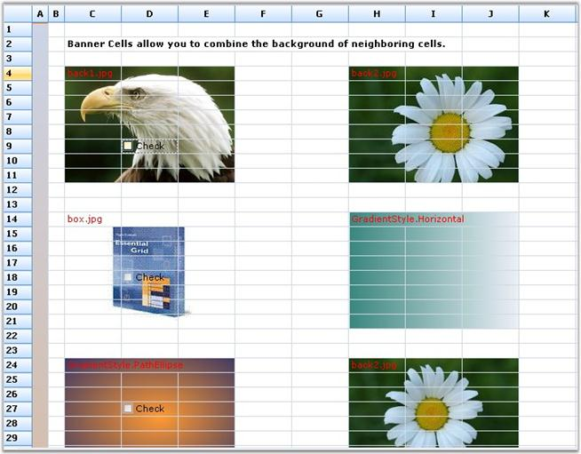

::: {style="DISPLAY: none"}
{#d2h_url_template}{#d2h_package_url style="WIDTH: 0px; DISPLAY: none; HEIGHT: 0px"}
:::

::: {.d2h_secondary_topic style="PADDING-BOTTOM: 10pt; MARGIN: 0pt; PADDING-LEFT: 0pt; PADDING-RIGHT: 0pt; PADDING-TOP: 0pt"}
#### Banner Cells {#banner-cells style="tab-stops: 0pt"}

[]{style="FONT-FAMILY: 'Trebuchet MS','sans-serif'; COLOR: #15428b; FONT-SIZE: 9pt"} 

Banner cells are multiple cells spanning a single background image. An image to be displayed in the cell can be loaded on disk, by changing the **BackgroundImage** property for a cell in the **Property Grid** and applying a Banner for the cell area, displaying the image. For a cell background color, **Gradient** style can be set. Custom cell backgrounds can be drawn by handling the **DrawCellBackground** event. The Banner cells can also be defined through a recurring pattern, by handling **QueryBanneredRange** event.

 

The following screen shot shows an example of how multiple cells span a single background image to form banner cells.

[]{style="FONT-FAMILY: 'Trebuchet MS','sans-serif'; COLOR: #15428b; FONT-SIZE: 9pt"} 

{border="0"}

[]{style="FONT-FAMILY: 'Trebuchet MS','sans-serif'; COLOR: #15428b; FONT-SIZE: 9pt"} 

*[Figure ]{style="FONT-SIZE: 9pt"}[187]{style="FONT-SIZE: 9pt"}[: Banner Cells]{style="FONT-SIZE: 9pt"}*

[]{style="FONT-FAMILY: 'Trebuchet MS','sans-serif'; COLOR: #15428b; FONT-SIZE: 9pt"} 

Displaying Image using Banner Cells

[]{style="FONT-FAMILY: 'Trebuchet MS','sans-serif'; COLOR: #15428b; FONT-SIZE: 9pt"} 

The following code examples illustrate how to display images by using banner cells:

[]{style="FONT-FAMILY: 'Trebuchet MS','sans-serif'; COLOR: #15428b; FONT-SIZE: 9pt"} 

1.   Using C#

[]{style="FONT-FAMILY: 'Trebuchet MS','sans-serif'; COLOR: #15428b; FONT-SIZE: 9pt"} 

+------------------------------------------------------------------------------------------------------------------------------------------------------+
| **[\[C#\]]{style="FONT-FAMILY: 'Courier New'; COLOR: black"}**                                                                                       |
|                                                                                                                                                      |
| []{style="FONT-FAMILY: 'Courier New'; COLOR: black"}                                                                                                 |
|                                                                                                                                                      |
| [GridStyleInfo]{style="FONT-FAMILY: 'Courier New'; COLOR: #2b91af"}[ style;]{style="FONT-FAMILY: 'Courier New'"}                                     |
|                                                                                                                                                      |
| [style = grid\[4, 3\];]{style="FONT-FAMILY: 'Courier New'"}                                                                                          |
|                                                                                                                                                      |
| [grid.BanneredRanges.Add([GridRangeInfo]{style="COLOR: #2b91af"}.FromTlhw(4, 3, 8, 3));]{style="FONT-FAMILY: 'Courier New'"}                         |
|                                                                                                                                                      |
| [style.BackgroundImage = GetImage([@\"common\\Images\\Grid\\BannerCells\\back1.jpg\"]{style="COLOR: #a31515"});]{style="FONT-FAMILY: 'Courier New'"} |
|                                                                                                                                                      |
| [style.Text = [\"back1.jpg\"]{style="COLOR: #a31515"};]{style="FONT-FAMILY: 'Courier New'"}                                                          |
|                                                                                                                                                      |
| [style.TextColor = [Color]{style="COLOR: #2b91af"}.Red;]{style="FONT-FAMILY: 'Courier New'"}                                                         |
|                                                                                                                                                      |
| [style.BackgroundImageMode = [GridBackgroundImageMode]{style="COLOR: #2b91af"}.StretchImage;]{style="FONT-FAMILY: 'Courier New'"}                    |
+------------------------------------------------------------------------------------------------------------------------------------------------------+

[]{style="FONT-FAMILY: 'Trebuchet MS','sans-serif'; COLOR: #15428b; FONT-SIZE: 9pt"} 

2.   Using VB.NET

[]{style="FONT-FAMILY: 'Trebuchet MS','sans-serif'; COLOR: #15428b; FONT-SIZE: 9pt"} 

+----------------------------------------------------------------------------------------------------------------------------------------------------+
| **[\[VB.NET\]]{style="FONT-FAMILY: 'Courier New'; COLOR: black"}**                                                                                 |
|                                                                                                                                                    |
| **[]{style="FONT-FAMILY: 'Courier New'; COLOR: black"}**                                                                                           |
|                                                                                                                                                    |
| [Dim]{style="FONT-FAMILY: 'Courier New'; COLOR: blue"}[ style [As]{style="COLOR: blue"} GridStyleInfo]{style="FONT-FAMILY: 'Courier New'"}         |
|                                                                                                                                                    |
| [style = grid(4, 3)]{style="FONT-FAMILY: 'Courier New'"}                                                                                           |
|                                                                                                                                                    |
| [grid.BanneredRanges.Add(GridRangeInfo.FromTlhw(4, 3, 8, 3))]{style="FONT-FAMILY: 'Courier New'"}                                                  |
|                                                                                                                                                    |
| [style.BackgroundImage = GetImage([\"common\\Images\\Grid\\BannerCells\\back1.jpg\"]{style="COLOR: #a31515"})]{style="FONT-FAMILY: 'Courier New'"} |
|                                                                                                                                                    |
| [style.Text = [\"back1.jpg\"]{style="COLOR: #a31515"}]{style="FONT-FAMILY: 'Courier New'"}                                                         |
|                                                                                                                                                    |
| [style.TextColor = Color.Red]{style="FONT-FAMILY: 'Courier New'"}                                                                                  |
|                                                                                                                                                    |
| [style.BackgroundImageMode = GridBackgroundImageMode.StretchImage]{style="FONT-FAMILY: 'Courier New'"}                                             |
+----------------------------------------------------------------------------------------------------------------------------------------------------+

 

[]{#p344} 

 

[]{#related-topics}
:::
