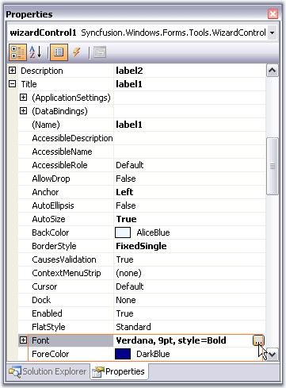
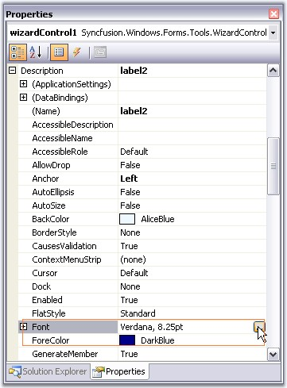

::: {style="DISPLAY: none"}
{#d2h_url_template}{#d2h_package_url style="WIDTH: 0px; DISPLAY: none; HEIGHT: 0px"}
:::

:::::::::: {.d2h_secondary_topic style="PADDING-BOTTOM: 10pt; MARGIN: 0pt; PADDING-LEFT: 0pt; PADDING-RIGHT: 0pt; PADDING-TOP: 0pt"}
##### Banner Settings {#banner-settings style="MARGIN-LEFT: 18pt; tab-stops: 18.0pt"}

[]{style="COLOR: #15428b"} 

The controls inside the Banner Control include Banner Panel, Title, description and a picture box. The section will walk you through the properties which customizes these controls.

 

**Banner Panel**

 

A Banner Panel is a simple gradient panel which holds a Title label, a Description label and a Picture box controls.

[]{style="COLOR: #15428b"} 

::: {align="center"}
  ------------- -----------------------------------------------------------------------
  Property      Description
  Banner        Gets or sets the picture box for the wizard using the Image property.
  Description   Sets the label that can describe the current page.
  Title         Sets the title of the current page.
  ------------- -----------------------------------------------------------------------
:::

[]{style="COLOR: #15428b"} 

::: {style="BORDER-BOTTOM: windowtext 1pt solid; BORDER-LEFT: medium none; PADDING-BOTTOM: 1pt; MARGIN: 9pt 0pt 9pt 18pt; PADDING-LEFT: 0pt; PADDING-RIGHT: 0pt; BORDER-TOP: windowtext 1pt solid; BORDER-RIGHT: medium none; PADDING-TOP: 1pt"}
{border="0"} Note: The Title and Description settings can be set for individual Wizard Pages using WizardPage.Title and WizardPage.Description properties respectively. See [[Wizard Page Settings]{.UGHyperlink}](../../../../../../../../Documents%20and%20Settings/sylviap/Desktop/Tools%20-%20Part%202.docx#_Wizard_Page_Settings).
:::

[]{style="COLOR: #15428b"} 

+----------------------------------------------------------------------------------------------------------------------------------------------------------------------------------------------------------------------------------------------------------------------------------------------------------------------------------------------------------------------------+
| **[\[C#\]]{style="FONT-FAMILY: 'Courier New'; COLOR: black"}**                                                                                                                                                                                                                                                                                                             |
|                                                                                                                                                                                                                                                                                                                                                                            |
| []{style="COLOR: black"}                                                                                                                                                                                                                                                                                                                                                   |
|                                                                                                                                                                                                                                                                                                                                                                            |
| [this]{style="FONT-FAMILY: 'Courier New'; COLOR: blue"}[.wizardControl1.Banner = [this]{style="COLOR: blue"}.pictureBox2;]{style="FONT-FAMILY: 'Courier New'"}                                                                                                                                                                                                             |
|                                                                                                                                                                                                                                                                                                                                                                            |
| [this]{style="FONT-FAMILY: 'Courier New'; COLOR: blue"}[.pictureBox2.Image = ((System.Drawing.[Image]{style="COLOR: teal"})(resources.GetObject([\"pictureBox2.Image\"]{style="COLOR: maroon"})));]{style="FONT-FAMILY: 'Courier New'"}                                                                                                                                    |
|                                                                                                                                                                                                                                                                                                                                                                            |
| [this]{style="FONT-FAMILY: 'Courier New'; COLOR: blue"}[.label1.Text = [\"Page Title\"]{style="COLOR: maroon"};]{style="FONT-FAMILY: 'Courier New'"}                                                                                                                                                                                                                       |
|                                                                                                                                                                                                                                                                                                                                                                            |
| [this]{style="FONT-FAMILY: 'Courier New'; COLOR: blue"}[.label2.Text = [\"This is]{style="COLOR: maroon"}]{style="FONT-FAMILY: 'Courier New'"}[ the ]{style="FONT-FAMILY: 'Courier New'; COLOR: maroon"}[description of the Wizard Page\"]{style="FONT-FAMILY: 'Courier New'; COLOR: maroon"}[;]{style="FONT-FAMILY: 'Courier New'"}[]{style="FONT-FAMILY: 'Courier New'"} |
|                                                                                                                                                                                                                                                                                                                                                                            |
| [this]{style="FONT-FAMILY: 'Courier New'; COLOR: blue"}[.gradientPanel1.Controls.Add([this]{style="COLOR: blue"}.label1);]{style="FONT-FAMILY: 'Courier New'"}                                                                                                                                                                                                             |
|                                                                                                                                                                                                                                                                                                                                                                            |
| [this]{style="FONT-FAMILY: 'Courier New'; COLOR: blue"}[.gradientPanel1.Controls.Add([this]{style="COLOR: blue"}.label2);]{style="FONT-FAMILY: 'Courier New'"}                                                                                                                                                                                                             |
+----------------------------------------------------------------------------------------------------------------------------------------------------------------------------------------------------------------------------------------------------------------------------------------------------------------------------------------------------------------------------+

[]{style="COLOR: #15428b"} 

+--------------------------------------------------------------------------------------------------------------------------------------------------------------------------------------------------------------------------------------------------------------------------------------------------------------------------------------------------------------------------+
| **[\[VB.NET\]]{style="FONT-FAMILY: 'Courier New'; COLOR: black"}**                                                                                                                                                                                                                                                                                                       |
|                                                                                                                                                                                                                                                                                                                                                                          |
| []{style="COLOR: #15428b"}                                                                                                                                                                                                                                                                                                                                               |
|                                                                                                                                                                                                                                                                                                                                                                          |
| [Me]{style="FONT-FAMILY: 'Courier New'; COLOR: blue"}[.wizardControl1.Banner = [Me]{style="COLOR: blue"}.pictureBox2 ]{style="FONT-FAMILY: 'Courier New'"}                                                                                                                                                                                                               |
|                                                                                                                                                                                                                                                                                                                                                                          |
| [Me]{style="FONT-FAMILY: 'Courier New'; COLOR: blue"}[.pictureBox2.Image = [DirectCast]{style="COLOR: blue"}((resources.GetObject([\"pictureBox2.Image\"]{style="COLOR: maroon"})), System.Drawing.Image) ]{style="FONT-FAMILY: 'Courier New'"}                                                                                                                          |
|                                                                                                                                                                                                                                                                                                                                                                          |
| [Me]{style="FONT-FAMILY: 'Courier New'; COLOR: blue"}[.label1.Text = [\"Page Title\"]{style="COLOR: maroon"} ]{style="FONT-FAMILY: 'Courier New'"}                                                                                                                                                                                                                       |
|                                                                                                                                                                                                                                                                                                                                                                          |
| [Me]{style="FONT-FAMILY: 'Courier New'; COLOR: blue"}[.label2.Text = [\"This is]{style="COLOR: maroon"}]{style="FONT-FAMILY: 'Courier New'"}[ the ]{style="FONT-FAMILY: 'Courier New'; COLOR: maroon"}[description of the Wizard Page\"]{style="FONT-FAMILY: 'Courier New'; COLOR: maroon"}[ ]{style="FONT-FAMILY: 'Courier New'"}[]{style="FONT-FAMILY: 'Courier New'"} |
|                                                                                                                                                                                                                                                                                                                                                                          |
| [Me]{style="FONT-FAMILY: 'Courier New'; COLOR: blue"}[.gradientPanel1.Controls.Add([Me]{style="COLOR: blue"}.label1) ]{style="FONT-FAMILY: 'Courier New'"}                                                                                                                                                                                                               |
|                                                                                                                                                                                                                                                                                                                                                                          |
| [Me]{style="FONT-FAMILY: 'Courier New'; COLOR: blue"}[.gradientPanel1.Controls.Add([Me]{style="COLOR: blue"}.label2)]{style="FONT-FAMILY: 'Courier New'"}[]{style="FONT-FAMILY: 'Courier New'"}                                                                                                                                                                          |
+--------------------------------------------------------------------------------------------------------------------------------------------------------------------------------------------------------------------------------------------------------------------------------------------------------------------------------------------------------------------------+

[]{style="COLOR: #15428b"} 

{border="0"}

[]{style="COLOR: #15428b"} 

Figure 1212: Page Title, Page Description and Picture Box Image set for the Banner Panel

[]{style="COLOR: #15428b"} 

::: {style="BORDER-BOTTOM: windowtext 1pt solid; BORDER-LEFT: medium none; PADDING-BOTTOM: 1pt; MARGIN: 9pt 0pt 9pt 18pt; PADDING-LEFT: 0pt; PADDING-RIGHT: 0pt; BORDER-TOP: windowtext 1pt solid; BORDER-RIGHT: medium none; PADDING-TOP: 1pt"}
[]{style="COLOR: #15428b"} 

{border="0"} Note: The appearance of a Banner panel can be customized using the properties of the gradient panel. See [[[Border styles]{style="COLOR: windowtext; FONT-SIZE: 9pt; TEXT-DECORATION: none; text-underline: none"}]{.UGHyperlink}](../../../../../../../../Documents%20and%20Settings/sylviap/Desktop/Tools%20-%20Part%202.docx#_Border_Styles) for border settings of a Banner Panel.
:::

[]{#p1046} 

Layout of the Banner Controls

 

The below properties controls the layout of the respective banner controls.

[]{style="COLOR: #15428b"} 

::: {align="center"}
  ----------------------- ---------------------------------------------------------------------------------------------------------------------------------------------------------------------------------
  Property                Description
  AutoLayoutBanner        When set to true, the picture box will be automatically laid out at a specific position, in the banner control. Setting false will not layout the picture box automatically.
  AutoLayoutDescription   When set to true, the description text will be automatically laid out at a specific position, in the Description control. Setting false will not layout the text automatically.
  AutoLayoutTitle         When set to true, the title will be automatically laid out at a specific position, in the banner control. Setting false will not layout the title automatically.
  ----------------------- ---------------------------------------------------------------------------------------------------------------------------------------------------------------------------------
:::

[]{style="COLOR: #15428b"} 

+---------------------------------------------------------------------------------------------------------------------------------------------------------------------------------------------------+
| **[\[C#\]]{style="FONT-FAMILY: 'Courier New'; COLOR: black"}**                                                                                                                                    |
|                                                                                                                                                                                                   |
| []{style="COLOR: #15428b"}                                                                                                                                                                        |
|                                                                                                                                                                                                   |
| [this]{style="FONT-FAMILY: 'Courier New'; COLOR: blue"}[.wizardControl1.AutoLayoutBanner = [true]{style="COLOR: blue"};]{style="FONT-FAMILY: 'Courier New'"}                                      |
|                                                                                                                                                                                                   |
| [this]{style="FONT-FAMILY: 'Courier New'; COLOR: blue"}[.wizardControl1.AutoLayoutDescription = [true]{style="COLOR: blue"};]{style="FONT-FAMILY: 'Courier New'"}                                 |
|                                                                                                                                                                                                   |
| [this]{style="FONT-FAMILY: 'Courier New'; COLOR: blue"}[.wizardControl1.AutoLayoutTitle = [true]{style="COLOR: blue"};]{style="FONT-FAMILY: 'Courier New'"}[]{style="FONT-FAMILY: 'Courier New'"} |
+---------------------------------------------------------------------------------------------------------------------------------------------------------------------------------------------------+

[]{style="COLOR: #15428b"} 

+-------------------------------------------------------------------------------------------------------------------------------------------------------------------------------------------------------------+
| **[\[VB.NET\]]{style="FONT-FAMILY: 'Courier New'; COLOR: black"}**                                                                                                                                          |
|                                                                                                                                                                                                             |
| []{style="COLOR: #15428b"}                                                                                                                                                                                  |
|                                                                                                                                                                                                             |
| [Me]{style="FONT-FAMILY: 'Courier New'; COLOR: blue"}[.wizardControl1.AutoLayoutBanner = [True]{style="COLOR: blue"}]{style="FONT-FAMILY: 'Courier New'"}                                                   |
|                                                                                                                                                                                                             |
| [Me]{style="FONT-FAMILY: 'Courier New'; COLOR: blue"}[.wizardControl1.AutoLayoutDescription = [True]{style="COLOR: blue"}]{style="FONT-FAMILY: 'Courier New'"}                                              |
|                                                                                                                                                                                                             |
| [Me]{style="FONT-FAMILY: 'Courier New'; COLOR: blue"}[.wizardControl1.AutoLayoutTitle = [True]{style="COLOR: blue"}]{style="FONT-FAMILY: 'Courier New'"}[]{style="FONT-FAMILY: 'Courier New'; COLOR: blue"} |
+-------------------------------------------------------------------------------------------------------------------------------------------------------------------------------------------------------------+

[]{style="COLOR: #15428b"} 

See Also

[]{style="COLOR: #15428b"} 

[[Border styles]{.UGHyperlink}](../../../../../../../../Documents%20and%20Settings/sylviap/Desktop/Tools%20-%20Part%202.docx#_Border_Styles)[ for Banner Panel, ]{style="COLOR: #15428b"}[[Title and Description Settings]{.UGHyperlink}](../../../../../../../../Documents%20and%20Settings/sylviap/Desktop/Tools%20-%20Part%202.docx#_Title_and_Description)[, BannerPanel Background settings in ]{style="COLOR: #15428b"}[[Background Settings]{.UGHyperlink}](../../../../../../../../Documents%20and%20Settings/sylviap/Desktop/Tools%20-%20Part%202.docx#_Background_Settings_1)[]{.UGHyperlink}

 

 

 

 

###### []{#_Title_and_Description}3.13.1.4.1.1    Title and Description Settings {#title-and-description-settings style="MARGIN-LEFT: 18pt; tab-stops: 18.0pt"}

 

**Title Text**

 

The font style and the fore color for the Title text can be edited through **Label.Font** and **Label.Font** property.

[]{style="COLOR: #15428b"} 

::: {align="center"}
  ----------- ---------------------------------------------------------------
  Property    Description
  Font        Sets the font style for the Page Title in the Wizard Control.
  ForeColor   Sets the forecolor for the Page Title in the Wizard Control.
  ----------- ---------------------------------------------------------------
:::

[]{style="COLOR: #15428b"} 

{border="0"}

[]{style="COLOR: #15428b"} 

Figure 1213: Accessing Font and ForeColor Properties for Page Title Through Designer[]{#p1047}

[]{style="COLOR: #15428b"} 

+------------------------------------------------------------------------------------------------------------------------------------------------------------------------------------------------------------------------------------------------------------------------------------+
| **[\[C#\]]{style="FONT-FAMILY: 'Courier New'; COLOR: black"}**                                                                                                                                                                                                                     |
|                                                                                                                                                                                                                                                                                    |
| []{style="FONT-FAMILY: 'Courier New'; COLOR: green"}                                                                                                                                                                                                                               |
|                                                                                                                                                                                                                                                                                    |
| [//Setting Font Style for the Label]{style="FONT-FAMILY: 'Courier New'; COLOR: green"}                                                                                                                                                                                             |
|                                                                                                                                                                                                                                                                                    |
| [this]{style="FONT-FAMILY: 'Courier New'; COLOR: blue"}[.label1.Font = [new]{style="COLOR: blue"} System.Drawing.[Font]{style="COLOR: teal"}([\"Verdana\"]{style="COLOR: maroon"}, 9F, System.Drawing.[FontStyle]{style="COLOR: teal"}.Bold);]{style="FONT-FAMILY: 'Courier New'"} |
|                                                                                                                                                                                                                                                                                    |
| [this]{style="FONT-FAMILY: 'Courier New'; COLOR: blue"}[.label1.ForeColor = System.Drawing.[Color]{style="COLOR: teal"}.DarkBlue;]{style="FONT-FAMILY: 'Courier New'"}[]{style="FONT-FAMILY: 'Courier New'"}                                                                       |
+------------------------------------------------------------------------------------------------------------------------------------------------------------------------------------------------------------------------------------------------------------------------------------+

[]{#p1048}[]{style="COLOR: #15428b"} 

+---------------------------------------------------------------------------------------------------------------------------------------------------------------------------------------------------------------------------------------------------------------------------------+
| **[\[VB.NET\]]{style="FONT-FAMILY: 'Courier New'; COLOR: black"}**                                                                                                                                                                                                              |
|                                                                                                                                                                                                                                                                                 |
| **[]{style="FONT-FAMILY: 'Courier New'; COLOR: black"}**                                                                                                                                                                                                                        |
|                                                                                                                                                                                                                                                                                 |
| [\'Setting Font Style for the Label]{style="FONT-FAMILY: 'Courier New'; COLOR: green"}                                                                                                                                                                                          |
|                                                                                                                                                                                                                                                                                 |
| [Me]{style="FONT-FAMILY: 'Courier New'; COLOR: blue"}[.label1.Font = [New]{style="COLOR: blue"} System.Drawing.[Font]{style="COLOR: teal"}([\"Verdana\"]{style="COLOR: maroon"}, 9F, System.Drawing.[FontStyle]{style="COLOR: teal"}.Bold)]{style="FONT-FAMILY: 'Courier New'"} |
|                                                                                                                                                                                                                                                                                 |
| [this]{style="FONT-FAMILY: 'Courier New'; COLOR: blue"}[.label1.ForeColor = System.Drawing.[Color]{style="COLOR: teal"}.DarkBlue;]{style="FONT-FAMILY: 'Courier New'"}[]{style="FONT-FAMILY: 'Courier New'"}                                                                    |
+---------------------------------------------------------------------------------------------------------------------------------------------------------------------------------------------------------------------------------------------------------------------------------+

[]{style="COLOR: #15428b"} 

{border="0"}

[]{style="COLOR: #15428b"} 

Figure 1214: PageTitle Text with FontStyle = \"Verdana, 9, Bold\"; ForeColor = \"DarkBlue\"

**[]{style="COLOR: #15428b"}** 

Description Text

 

The appearance of the description text for a wizard control can be edited using the description label properties.

[]{style="COLOR: #15428b"} 

::: {align="center"}
  ----------- ---------------------------------------------------------------------
  Property    Description
  Font        Sets the font style for the Page description in the Wizard Control.
  ForeColor   Sets the forecolor for the Page description in the Wizard Control.
  ----------- ---------------------------------------------------------------------
:::

[]{style="COLOR: #15428b"} 

{border="0"}

[]{style="COLOR: #15428b"} 

Figure 1215: Accessing Font and ForeColor Properties for Page Description Through Designer

**[]{style="COLOR: #15428b"}** 

+----------------------------------------------------------------------------------------------------------------------------------------------------------------------------------------------------------------------------------------------------------------------------------------------------------------------------------------------------------------------------+
| **[\[]{style="FONT-FAMILY: 'Courier New'; COLOR: black"}[C#\]]{style="FONT-FAMILY: 'Courier New'; COLOR: black"}[]{style="FONT-FAMILY: 'Courier New'; COLOR: black"}**                                                                                                                                                                                                     |
|                                                                                                                                                                                                                                                                                                                                                                            |
| []{style="FONT-FAMILY: 'Courier New'; COLOR: green"}                                                                                                                                                                                                                                                                                                                       |
|                                                                                                                                                                                                                                                                                                                                                                            |
| [//Setting Font Style for the Label]{style="FONT-FAMILY: 'Courier New'; COLOR: green"}                                                                                                                                                                                                                                                                                     |
|                                                                                                                                                                                                                                                                                                                                                                            |
| [this]{style="FONT-FAMILY: 'Courier New'; COLOR: blue"}[.label1.Font = ]{style="FONT-FAMILY: 'Courier New'"}[new]{style="FONT-FAMILY: 'Courier New'; COLOR: blue"}[ ]{style="FONT-FAMILY: 'Courier New'"}[System.Drawing.[Font]{style="COLOR: teal"}([\"Verdana\"]{style="COLOR: maroon"}, 8F);]{style="FONT-FAMILY: 'Courier New'"}[]{style="FONT-FAMILY: 'Courier New'"} |
|                                                                                                                                                                                                                                                                                                                                                                            |
| [this]{style="FONT-FAMILY: 'Courier New'; COLOR: blue"}[.label1.ForeColor = System.Drawing.[Color]{style="COLOR: teal"}.DarkBlue;]{style="FONT-FAMILY: 'Courier New'"}[]{style="FONT-FAMILY: 'Courier New'"}                                                                                                                                                               |
+----------------------------------------------------------------------------------------------------------------------------------------------------------------------------------------------------------------------------------------------------------------------------------------------------------------------------------------------------------------------------+

[]{style="COLOR: #15428b"} 

+---------------------------------------------------------------------------------------------------------------------------------------------------------------------------------------------------------------------------+
| **[\[]{style="FONT-FAMILY: 'Courier New'; COLOR: black"}[VB.NET\]]{style="FONT-FAMILY: 'Courier New'; COLOR: black"}[]{style="FONT-FAMILY: 'Courier New'; COLOR: black"}**                                                |
|                                                                                                                                                                                                                           |
| **[]{style="FONT-FAMILY: 'Courier New'; COLOR: black"}**                                                                                                                                                                  |
|                                                                                                                                                                                                                           |
| [\'Setting Font Style for the Label]{style="FONT-FAMILY: 'Courier New'; COLOR: green"}                                                                                                                                    |
|                                                                                                                                                                                                                           |
| [Me]{style="FONT-FAMILY: 'Courier New'; COLOR: blue"}[.label1.Font = [New]{style="COLOR: blue"} System.Drawing.[Font]{style="COLOR: teal"}([\"Verdana\"]{style="COLOR: maroon"}, 8F)]{style="FONT-FAMILY: 'Courier New'"} |
|                                                                                                                                                                                                                           |
| [this]{style="FONT-FAMILY: 'Courier New'; COLOR: blue"}[.label1.ForeColor = System.Drawing.[Color]{style="COLOR: teal"}.DarkBlue]{style="FONT-FAMILY: 'Courier New'"}                                                     |
+---------------------------------------------------------------------------------------------------------------------------------------------------------------------------------------------------------------------------+

[]{style="COLOR: #15428b"} 

{border="0"}

[]{style="COLOR: #15428b"} 

Figure 1216: Page Description Text with FontStyle = \"Verdana, 8\"; ForeColor = \"DarkBlue\"

**[]{style="COLOR: #15428b"}** 

::: {style="BORDER-BOTTOM: windowtext 1pt solid; BORDER-LEFT: medium none; PADDING-BOTTOM: 1pt; MARGIN: 9pt 0pt 9pt 18pt; PADDING-LEFT: 0pt; PADDING-RIGHT: 0pt; BORDER-TOP: windowtext 1pt solid; BORDER-RIGHT: medium none; PADDING-TOP: 1pt"}
{border="0"} Note: A WizardControl can have only one page title label and one page description label. We can change only the text of these two labels for individual pages using WizardPage.Title and WizardPage.Description properties and not their appearance. Hence Font and ForeColor settings will be similar in all the page.
:::

 

 

[]{#related-topics}
::::::::::
