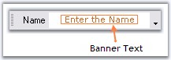
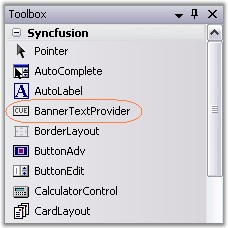
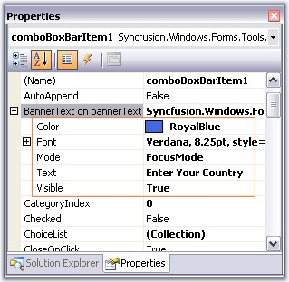
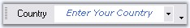

::: {style="DISPLAY: none"}
{#d2h_url_template}{#d2h_package_url style="WIDTH: 0px; DISPLAY: none; HEIGHT: 0px"}
:::

::::: {#nsbanner .d2h_main_nsbanner style="BORDER-BOTTOM: #999999 1px solid; POSITION: relative; PADDING-BOTTOM: 0px; BACKGROUND-COLOR: transparent; PADDING-LEFT: 0px; PADDING-RIGHT: 0px; DISPLAY: none; BORDER-TOP: #999999 1px solid; PADDING-TOP: 0px; LEFT: 0px"}
:::: {#TitleRow .d2h_main_titlerow style="PADDING-BOTTOM: 4px; BACKGROUND-COLOR: transparent; PADDING-LEFT: 22px; WIDTH: 100%; PADDING-RIGHT: 10px; DISPLAY: none; PADDING-TOP: 4px"}
::: {#ienav .d2h_main_ienav style="DISPLAY: none"}
{#D2HPrevious .D2HPreviousEnabled}  {#D2HNext .D2HNextEnabled}
:::
::::
:::::

::::: {#nstext .d2h_main_nstext style="PADDING-BOTTOM: 10px; BACKGROUND-COLOR: transparent; PADDING-LEFT: 22px; PADDING-RIGHT: 10px; HEIGHT: 100%; OVERFLOW: auto; PADDING-TOP: 5px" hasuserbackground="true" valign="bottom"}
::: {#d2h_breadcrumbs .d2h_breadcrumbs}
[Essential Studio User Guide Documentation](ms-xhelp:///?Id=12457748-09e3-4d74-a240-8e049cedf030){.d2h_breadcrumbsNormal}[ \> ]{.d2h_breadcrumbsLinkSeparator}[User Interface Edition](ms-xhelp:///?Id=c29296b7-531c-413b-a0ec-488ca1f7f669){.d2h_breadcrumbsNormal}[ \> ]{.d2h_breadcrumbsLinkSeparator}[Essential Windows](ms-xhelp:///?Id=e60759d8-47a4-4570-9d7a-16a68d63f2ea){.d2h_breadcrumbsNormal}[ \> ]{.d2h_breadcrumbsLinkSeparator}[Essential Tools]{.d2h_breadcrumbsContentsOnly}[ \> ]{.d2h_breadcrumbsLinkSeparator}[Tools Controls](ms-xhelp:///?Id=13c3c4f4-9d16-4b69-93f2-7e98eec67452){.d2h_breadcrumbsNormal}
:::

## [BannerTextProvider Component]{#BannerTextProviderComponent} {#bannertextprovider-component style="MARGIN-LEFT: 18pt; tab-stops: 18.0pt"}

[]{style="COLOR: #15428b"} 

Syncfusion introduces BannerTextProvider class which provides the ability to show banner text in the textbox.

[]{style="COLOR: #15428b"} 

{border="0"}

[]{style="COLOR: #15428b"} 

***[]{style="COLOR: #15428b"}*** 

Figure 1471: Banner Text in a TextBoxBarItem

**[]{style="COLOR: #15428b"}** 

[·      ]{style="FONT-FAMILY: Symbol"}BannerTextProvider component is available in the Toolbox under Syncfusion tab.

[]{style="COLOR: #15428b"} 

{border="0"}

[]{style="COLOR: #15428b"} 

Figure 1472: BannerTextProvider in Toolbox

[]{style="COLOR: #15428b"} 

[·      ]{style="FONT-FAMILY: Symbol"}Drag the component onto the form. The control in the form, for ex, ComboBoxBarItem will get an extender provider property as in the image below.

[]{style="COLOR: #15428b"} 

{border="0"}

***[]{style="COLOR: #15428b"}*** 

***[]{style="COLOR: #15428b"}*** 

Figure 1473: BannerText Provider Properties in ComboBoxBarItem PropertyGrid

[]{style="COLOR: #15428b"} 

Customizing the Banner Text

[]{style="COLOR: #15428b"} 

Extender properties which lets you customize the Banner text are as follows.

[]{style="COLOR: #15428b"} 

::: {align="center"}
+-----------------------------------+------------------------------------------------------------------------------------------------------------------------------------------------------------------+
| Property                          | Description                                                                                                                                                      |
+-----------------------------------+------------------------------------------------------------------------------------------------------------------------------------------------------------------+
| Visible                           | Indicates whether the banner text should be visible or not.                                                                                                      |
+-----------------------------------+------------------------------------------------------------------------------------------------------------------------------------------------------------------+
| Text                              | Sets the banner text.                                                                                                                                            |
+-----------------------------------+------------------------------------------------------------------------------------------------------------------------------------------------------------------+
| Color                             | Sets the banner text color.                                                                                                                                      |
+-----------------------------------+------------------------------------------------------------------------------------------------------------------------------------------------------------------+
| Font                              | Sets the font style for the banner text.                                                                                                                         |
+-----------------------------------+------------------------------------------------------------------------------------------------------------------------------------------------------------------+
| Mode                              | Specifies the rendering mode of the banner text. The modes are,                                                                                                  |
|                                   |                                                                                                                                                                  |
|                                   |                                                                                                                                                                  |
|                                   |                                                                                                                                                                  |
|                                   | [·      ]{style="FONT-FAMILY: Symbol"}*FocusMode* - The banner text disappears when the control gets focus.                                                      |
|                                   |                                                                                                                                                                  |
|                                   | [·      ]{style="FONT-FAMILY: Symbol"}*EditMode* - The banner text will only disappears when the control is in Edit Mode or the associated textbox is not empty. |
+-----------------------------------+------------------------------------------------------------------------------------------------------------------------------------------------------------------+
:::

[]{style="COLOR: #15428b"} 

+------------------------------------------------------------------------------------------------------------------------------------------------------------------------------------------------------------------------------------------------------------------------------------------------------------------------------------------------------------------------------------------------------------------------------------------------------------------------------------------------------------------------------------------------------------------------------------------------------------------------------------------------------------------------------------------------------------+
| **[\[C#\]]{style="FONT-FAMILY: 'Courier New'; COLOR: black"}**                                                                                                                                                                                                                                                                                                                                                                                                                                                                                                                                                                                                                                             |
|                                                                                                                                                                                                                                                                                                                                                                                                                                                                                                                                                                                                                                                                                                            |
| [   ]{style="FONT-FAMILY: 'Courier New'"}                                                                                                                                                                                                                                                                                                                                                                                                                                                                                                                                                                                                                                                                  |
|                                                                                                                                                                                                                                                                                                                                                                                                                                                                                                                                                                                                                                                                                                            |
| [this]{style="FONT-FAMILY: 'Courier New'; COLOR: blue"}[.bannerTextProvider1.SetBannerText([this]{style="COLOR: blue"}.comboBoxBarItem1, [new]{style="COLOR: blue"} Syncfusion.Windows.Forms.[BannerTextInfo]{style="COLOR: teal"}([\"Enter Your Country\"]{style="COLOR: maroon"}, [true]{style="COLOR: blue"}, [new]{style="COLOR: blue"} System.Drawing.[Font]{style="COLOR: teal"}([\"Verdana\"]{style="COLOR: maroon"}, 8.25F, System.Drawing.[FontStyle]{style="COLOR: teal"}.Italic), System.Drawing.[Color]{style="COLOR: teal"}.RoyalBlue, Syncfusion.Windows.Forms.[BannerTextMode]{style="COLOR: teal"}.FocusMode));]{style="FONT-FAMILY: 'Courier New'"}[]{style="FONT-FAMILY: 'Courier New'"} |
+------------------------------------------------------------------------------------------------------------------------------------------------------------------------------------------------------------------------------------------------------------------------------------------------------------------------------------------------------------------------------------------------------------------------------------------------------------------------------------------------------------------------------------------------------------------------------------------------------------------------------------------------------------------------------------------------------------+

[]{style="COLOR: #15428b"} 

+-------------------------------------------------------------------------------------------------------------------------------------------------------------------------------------------------------------------------------------------------------------------------------------------------------------------------------------------------------------------------------------------------------------------------------------------------------------------------------------------------------------------------------------------------------------------------------------+
| **[\[VB.NET\]]{style="FONT-FAMILY: 'Courier New'; COLOR: black"}**                                                                                                                                                                                                                                                                                                                                                                                                                                                                                                                  |
|                                                                                                                                                                                                                                                                                                                                                                                                                                                                                                                                                                                     |
| []{style="FONT-FAMILY: 'Courier New'"}                                                                                                                                                                                                                                                                                                                                                                                                                                                                                                                                              |
|                                                                                                                                                                                                                                                                                                                                                                                                                                                                                                                                                                                     |
| [Me]{style="FONT-FAMILY: 'Courier New'; COLOR: blue"}[.bannerTextProvider1.SetBannerText([Me]{style="COLOR: blue"}.comboBoxBarItem1, [New]{style="COLOR: blue"} Syncfusion.Windows.Forms.BannerTextInfo([\"Enter Your Country\"]{style="COLOR: maroon"}, [True]{style="COLOR: blue"}, [New]{style="COLOR: blue"} System.Drawing.Font([\"Verdana\"]{style="COLOR: maroon"}, 8.25F, System.Drawing.FontStyle.Italic), System.Drawing.Color.RoyalBlue, Syncfusion.Windows.Forms.BannerTextMode.FocusMode)) ]{style="FONT-FAMILY: 'Courier New'"}[]{style="FONT-FAMILY: 'Courier New'"} |
+-------------------------------------------------------------------------------------------------------------------------------------------------------------------------------------------------------------------------------------------------------------------------------------------------------------------------------------------------------------------------------------------------------------------------------------------------------------------------------------------------------------------------------------------------------------------------------------+

[]{style="COLOR: #15428b"} 

{border="0"}

[]{style="COLOR: #15428b"} 

***[]{style="COLOR: #15428b"}*** 

Figure 1474: Text = \"Enter Your Country\"; Font = \"Verdana, 8, Italic\"; Color = \"Royal Blue\";

**[]{style="COLOR: #15428b"}** 

**[{border="0"}]{style="COLOR: #15428b"}*[Note:]{style="COLOR: #15428b"}**[ ]{style="COLOR: black; FONT-SIZE: 8pt"}***[BannerText feature can be made available for the below controls only.]{style="COLOR: #15428b"}

[]{style="COLOR: #15428b"} 

[·      ]{style="FONT-FAMILY: Symbol; COLOR: #15428b"}[[TextBoxBarItem]{.UGHyperlink}](../../../../../../../../Documents%20and%20Settings/sindhujamj/Desktop/Tools%20%20-%20Part%201.docx#TextBoxBarItem)[ (]{style="COLOR: #15428b"}XPMenus), []{style="COLOR: #15428b"}

[·      ]{style="FONT-FAMILY: Symbol; COLOR: #15428b"}[[ComboBoxBarItem]{.UGHyperlink}](../../../../../../../../Documents%20and%20Settings/sindhujamj/Desktop/Tools%20%20-%20Part%201.docx#ComboBoxBarItem)[ (]{style="COLOR: #15428b"}XPMenus), []{style="COLOR: #15428b"}

[·      ]{style="FONT-FAMILY: Symbol"}[[TextBox]{.UGHyperlink}](../../../../../../../../Documents%20and%20Settings/sylviap/Desktop/Tools%20-%20Part%202.docx#_TextBox)[ (]{style="COLOR: #15428b"}ToolStripEx),

[·      ]{style="FONT-FAMILY: Symbol; COLOR: #15428b"}[[ComboBox]{.UGHyperlink}](../../../../../../../../Documents%20and%20Settings/sylviap/Desktop/Tools%20-%20Part%202.docx#_ComboBox)[ (]{style="COLOR: #15428b"}ToolStripEx), []{style="COLOR: #15428b"}

[·      ]{style="FONT-FAMILY: Symbol; COLOR: #15428b"}[[ComboBoxEx]{.UGHyperlink}](../../../../../../../../Documents%20and%20Settings/sylviap/Desktop/Tools%20-%20Part%202.docx#_ComboBoxEx)[ (]{style="COLOR: #15428b"}ToolStripEx)[]{style="COLOR: #15428b"}

[·      ]{style="FONT-FAMILY: Symbol; COLOR: #15428b"}[[TextBoxExt]{.UGHyperlink}](../../../../../../../../Documents%20and%20Settings/sindhujamj/Desktop/Tools%20%20-%20Part%201.docx#TextBoxExt)[ (]{style="COLOR: #15428b"}Editor Control), []{style="COLOR: #15428b"}

[·      ]{style="FONT-FAMILY: Symbol; COLOR: #15428b"}[[CurrencyTextBox]{.UGHyperlink}](../../../../../../../../Documents%20and%20Settings/sindhujamj/Desktop/Tools%20%20-%20Part%201.docx#CurrencyTextBox)[ ]{.UGHyperlink}[(]{style="COLOR: #15428b"}Editor Control)[]{style="COLOR: #15428b"}

[·      ]{style="FONT-FAMILY: Symbol; COLOR: #15428b"}[[ComboBoxAdv]{.UGHyperlink}](../../../../../../../../Documents%20and%20Settings/sindhujamj/Desktop/Tools%20%20-%20Part%201.docx#ComboBoxAdv)[ ]{.UGHyperlink}[(]{style="COLOR: #15428b"}Editor Control), []{style="COLOR: #15428b"}

[·      ]{style="FONT-FAMILY: Symbol; COLOR: #15428b"}[[ComboDropDown]{.UGHyperlink}](../../../../../../../../Documents%20and%20Settings/sindhujamj/Desktop/Tools%20%20-%20Part%201.docx#ComboDropDown)[ (]{style="COLOR: #15428b"}Editor Control), []{style="COLOR: #15428b"}

[·      ]{style="FONT-FAMILY: Symbol; COLOR: #15428b"}[[ComboBoxAutoComplete]{.UGHyperlink}](../../../../../../../../Documents%20and%20Settings/sindhujamj/Desktop/Tools%20%20-%20Part%201.docx#ComboBoxAutoComplete)[ (]{style="COLOR: #15428b"}Editor Control) and[]{style="COLOR: #15428b"}

[·      ]{style="FONT-FAMILY: Symbol; COLOR: #15428b"}[[Integer TextBox]{.UGHyperlink}](../../../../../../../../Documents%20and%20Settings/sindhujamj/Desktop/Tools%20%20-%20Part%201.docx#IntegerTextBox)[ ]{.UGHyperlink}[(]{style="COLOR: #15428b"}Editor Control)[]{style="COLOR: #15428b"}

[·      ]{style="FONT-FAMILY: Symbol; COLOR: #15428b"}[[Double TextBox]{.UGHyperlink}](../../../../../../../../Documents%20and%20Settings/sindhujamj/Desktop/Tools%20%20-%20Part%201.docx#DoubleTextBox)[ (]{style="COLOR: #15428b"}Editor Control)[]{style="COLOR: #15428b"}

[·      ]{style="FONT-FAMILY: Symbol"}[[Percent TextBox]{.UGHyperlink}](../../../../../../../../Documents%20and%20Settings/sindhujamj/Desktop/Tools%20%20-%20Part%201.docx#PercentTextBox)[ ]{.UGHyperlink}[(]{style="COLOR: #15428b"}Editor Control)

[·      ]{style="FONT-FAMILY: Symbol"}Other Microsoft Editor Controls

 

 

More:

[ ]{#related-topics}

[{border="0" align="absMiddle"}How to change the text for already assigned banner text of a control?](ms-xhelp:///?Id=e39ab3ed-7fa4-4016-9d98-3cd4cd48f52e){style="TEXT-DECORATION: none"}
:::::
