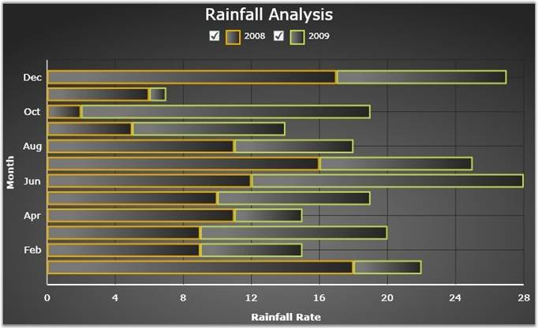

::: {style="DISPLAY: none"}
{#d2h_url_template}{#d2h_package_url style="WIDTH: 0px; DISPLAY: none; HEIGHT: 0px"}
:::

::: {.d2h_secondary_topic style="PADDING-BOTTOM: 10pt; MARGIN: 0pt; PADDING-LEFT: 0pt; PADDING-RIGHT: 0pt; PADDING-TOP: 0pt"}
#### Bar Chart {#bar-chart style="tab-stops: 0pt"}

[]{style="COLOR: #15428b"} 

A Bar chart or bar graph is a chart with rectangular bars with lengths proportional to the values that they represent. Bar charts are used for comparing two or more values. It is a visual display used to compare the amount or frequency of occurrence, of different characteristics of data. It is used to compare groups of data.

[]{style="COLOR: #15428b"} 

+-------------------------------------------------------------------------------------------------------------------------------------------------------------------------------------------------------------------------------------------------------------------------------------------------------------------------------------------------------------------------------------------------------------------------------------------------------------------------------------------------------------------------------------------------------------------------------------------------------------------------------------------------------------------------------------------------------------------------------------------------------------------------------------------+
| [\[XAML\]]{style="FONT-FAMILY: 'Courier New'"}                                                                                                                                                                                                                                                                                                                                                                                                                                                                                                                                                                                                                                                                                                                                            |
|                                                                                                                                                                                                                                                                                                                                                                                                                                                                                                                                                                                                                                                                                                                                                                                           |
| []{style="FONT-FAMILY: 'Courier New'; COLOR: blue"}                                                                                                                                                                                                                                                                                                                                                                                                                                                                                                                                                                                                                                                                                                                                       |
|                                                                                                                                                                                                                                                                                                                                                                                                                                                                                                                                                                                                                                                                                                                                                                                           |
| [\<]{style="FONT-FAMILY: 'Courier New'; COLOR: blue"}[syncfusion]{style="FONT-FAMILY: 'Courier New'; COLOR: #a31515"}[:]{style="FONT-FAMILY: 'Courier New'; COLOR: blue"}[ChartSeries]{style="FONT-FAMILY: 'Courier New'; COLOR: #a31515"}[ Type]{style="FONT-FAMILY: 'Courier New'; COLOR: red"}[=\"Bar\"]{style="FONT-FAMILY: 'Courier New'; COLOR: blue"}[ Label]{style="FONT-FAMILY: 'Courier New'; COLOR: red"}[=\"2008\"]{style="FONT-FAMILY: 'Courier New'; COLOR: blue"}[ Interior]{style="FONT-FAMILY: 'Courier New'; COLOR: red"}[=\"{]{style="FONT-FAMILY: 'Courier New'; COLOR: blue"}[StaticResource]{style="FONT-FAMILY: 'Courier New'; COLOR: #a31515"}[ Series1]{style="FONT-FAMILY: 'Courier New'; COLOR: red"}[}\"/\>]{style="FONT-FAMILY: 'Courier New'; COLOR: blue"} |
|                                                                                                                                                                                                                                                                                                                                                                                                                                                                                                                                                                                                                                                                                                                                                                                           |
| [\<]{style="FONT-FAMILY: 'Courier New'; COLOR: blue"}[syncfusion]{style="FONT-FAMILY: 'Courier New'; COLOR: #a31515"}[:]{style="FONT-FAMILY: 'Courier New'; COLOR: blue"}[ChartSeries]{style="FONT-FAMILY: 'Courier New'; COLOR: #a31515"}[ Type]{style="FONT-FAMILY: 'Courier New'; COLOR: red"}[=\"Bar\"]{style="FONT-FAMILY: 'Courier New'; COLOR: blue"}[ Label]{style="FONT-FAMILY: 'Courier New'; COLOR: red"}[=\"2009\"]{style="FONT-FAMILY: 'Courier New'; COLOR: blue"}[ Interior]{style="FONT-FAMILY: 'Courier New'; COLOR: red"}[=\"{]{style="FONT-FAMILY: 'Courier New'; COLOR: blue"}[StaticResource]{style="FONT-FAMILY: 'Courier New'; COLOR: #a31515"}[ Series2]{style="FONT-FAMILY: 'Courier New'; COLOR: red"}[}\"/\>]{style="FONT-FAMILY: 'Courier New'; COLOR: blue"} |
+-------------------------------------------------------------------------------------------------------------------------------------------------------------------------------------------------------------------------------------------------------------------------------------------------------------------------------------------------------------------------------------------------------------------------------------------------------------------------------------------------------------------------------------------------------------------------------------------------------------------------------------------------------------------------------------------------------------------------------------------------------------------------------------------+

[]{style="COLOR: #15428b"} 

+---------------------------------------------------------------------------------------------------------------------------------------------------------------------------------------------------------------------------------------------------------------------------------------------------------------------------------------------------------------------+
| [\[C#\]]{style="FONT-FAMILY: 'Courier New'"}                                                                                                                                                                                                                                                                                                                        |
|                                                                                                                                                                                                                                                                                                                                                                     |
| []{style="FONT-FAMILY: 'Courier New'; COLOR: blue"}                                                                                                                                                                                                                                                                                                                 |
|                                                                                                                                                                                                                                                                                                                                                                     |
| [//Create Instance for Series]{style="FONT-FAMILY: 'Courier New'; COLOR: green"}                                                                                                                                                                                                                                                                                    |
|                                                                                                                                                                                                                                                                                                                                                                     |
| [ChartSeries]{style="FONT-FAMILY: 'Courier New'; COLOR: #2b91af"}[ series1 = ]{style="FONT-FAMILY: 'Courier New'; COLOR: black"}[new]{style="FONT-FAMILY: 'Courier New'; COLOR: blue"}[ ]{style="FONT-FAMILY: 'Courier New'; COLOR: black"}[ChartSeries]{style="FONT-FAMILY: 'Courier New'; COLOR: #2b91af"}[();]{style="FONT-FAMILY: 'Courier New'; COLOR: black"} |
|                                                                                                                                                                                                                                                                                                                                                                     |
| [ChartSeries]{style="FONT-FAMILY: 'Courier New'; COLOR: #2b91af"}[ series2 = ]{style="FONT-FAMILY: 'Courier New'; COLOR: black"}[new]{style="FONT-FAMILY: 'Courier New'; COLOR: blue"}[ ]{style="FONT-FAMILY: 'Courier New'; COLOR: black"}[ChartSeries]{style="FONT-FAMILY: 'Courier New'; COLOR: #2b91af"}[();]{style="FONT-FAMILY: 'Courier New'; COLOR: black"} |
|                                                                                                                                                                                                                                                                                                                                                                     |
| []{style="FONT-FAMILY: 'Courier New'"}                                                                                                                                                                                                                                                                                                                              |
|                                                                                                                                                                                                                                                                                                                                                                     |
| [//Set the Chart type for series]{style="FONT-FAMILY: 'Courier New'; COLOR: green"}                                                                                                                                                                                                                                                                                 |
|                                                                                                                                                                                                                                                                                                                                                                     |
| [series1.Type = ]{style="FONT-FAMILY: 'Courier New'; COLOR: black"}[ChartTypes]{style="FONT-FAMILY: 'Courier New'; COLOR: #2b91af"}[.Bar;]{style="FONT-FAMILY: 'Courier New'; COLOR: black"}                                                                                                                                                                        |
|                                                                                                                                                                                                                                                                                                                                                                     |
| [series2.Type = ]{style="FONT-FAMILY: 'Courier New'; COLOR: black"}[ChartTypes]{style="FONT-FAMILY: 'Courier New'; COLOR: #2b91af"}[.Bar;]{style="FONT-FAMILY: 'Courier New'; COLOR: black"}                                                                                                                                                                        |
+---------------------------------------------------------------------------------------------------------------------------------------------------------------------------------------------------------------------------------------------------------------------------------------------------------------------------------------------------------------------+

[]{style="COLOR: #15428b"} 

Run the code. The following output is displayed.

[]{style="COLOR: #15428b"} 

{border="0"}

Figure 21: Chart Displaying Bar Series \[ChartType=\"Bar\"\]

[]{#related-topics}
:::
