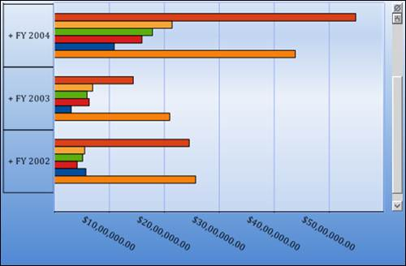
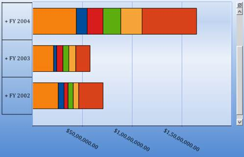
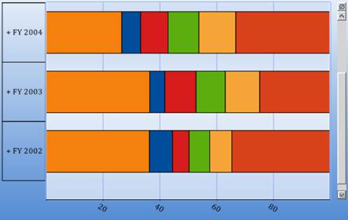

::: {style="DISPLAY: none"}
{#d2h_url_template}{#d2h_package_url style="WIDTH: 0px; DISPLAY: none; HEIGHT: 0px"}
:::

::::: {#nsbanner .d2h_main_nsbanner style="BORDER-BOTTOM: #999999 1px solid; POSITION: relative; PADDING-BOTTOM: 0px; BACKGROUND-COLOR: transparent; PADDING-LEFT: 0px; PADDING-RIGHT: 0px; DISPLAY: none; BORDER-TOP: #999999 1px solid; PADDING-TOP: 0px; LEFT: 0px"}
:::: {#TitleRow .d2h_main_titlerow style="PADDING-BOTTOM: 4px; BACKGROUND-COLOR: transparent; PADDING-LEFT: 22px; WIDTH: 100%; PADDING-RIGHT: 10px; DISPLAY: none; PADDING-TOP: 4px"}
::: {#ienav .d2h_main_ienav style="DISPLAY: none"}
{#D2HPrevious .D2HPreviousEnabled}  {#D2HNext .D2HNextEnabled}
:::
::::
:::::

::::: {#nstext .d2h_main_nstext style="PADDING-BOTTOM: 10px; BACKGROUND-COLOR: transparent; PADDING-LEFT: 22px; PADDING-RIGHT: 10px; HEIGHT: 100%; OVERFLOW: auto; PADDING-TOP: 5px" hasuserbackground="true" valign="bottom"}
::: {#d2h_breadcrumbs .d2h_breadcrumbs}
[Essential Studio User Guide Documentation](ms-xhelp:///?Id=12457748-09e3-4d74-a240-8e049cedf030){.d2h_breadcrumbsNormal}[ \> ]{.d2h_breadcrumbsLinkSeparator}[Business Intelligence Edition](ms-xhelp:///?Id=fdf33dd8-62b2-47b9-ad7b-fc50e590bca5){.d2h_breadcrumbsNormal}[ \> ]{.d2h_breadcrumbsLinkSeparator}[Essential BI ASP.NET](ms-xhelp:///?Id=99c6694e-59c3-4c59-abb5-ce9ce9a948bc){.d2h_breadcrumbsNormal}[ \> ]{.d2h_breadcrumbsLinkSeparator}[Essential BI Chart]{.d2h_breadcrumbsContentsOnly}[ \> ]{.d2h_breadcrumbsLinkSeparator}[Concepts and Features](ms-xhelp:///?Id=be4e11fe-e0a1-44d7-aa3a-05cf8b78bdb8){.d2h_breadcrumbsNormal}[ \> ]{.d2h_breadcrumbsLinkSeparator}[Chart Types](ms-xhelp:///?Id=11a8b8a5-faa3-4a18-ac73-7d73435f1963){.d2h_breadcrumbsNormal}
:::

### Bar Chart and its Types {#bar-chart-and-its-types style="tab-stops: 0pt"}

 

BAR CHART:

The Bar Chart is the simplest and most versatile of statistical diagrams. It displays horizontal bars for each point in the series and points from adjacent series are drawn as bars next to each other. Bar charts can be used to compare values across categories, for displaying the variations in the value of an item over time or for comparing the values of several items at a single point in time.

 

+-----------------------------------------------------------------------------------------------------------------------------------------------------------------------------------------------------------------+
| **[\[C#\]]{style="FONT-FAMILY: 'Courier New'"}**                                                                                                                                                                |
|                                                                                                                                                                                                                 |
| []{style="FONT-FAMILY: 'Courier New'"}                                                                                                                                                                          |
|                                                                                                                                                                                                                 |
| [this]{style="FONT-FAMILY: 'Courier New'; COLOR: blue"}[.olapChart1.ChartSeriesType = [ChartSeriesType]{style="COLOR: #2b91af"}.Bar;]{style="FONT-FAMILY: 'Courier New'"}[]{style="FONT-FAMILY: 'Courier New'"} |
+-----------------------------------------------------------------------------------------------------------------------------------------------------------------------------------------------------------------+

 

+----------------------------------------------------------------------------------------------------------------------------------------------------------------------------------------------------------------------------------------------------------------------------------------------------------------------+
| **[\[VB\]]{style="FONT-FAMILY: 'Courier New'"}**                                                                                                                                                                                                                                                                     |
|                                                                                                                                                                                                                                                                                                                      |
| []{style="FONT-FAMILY: 'Courier New'"}                                                                                                                                                                                                                                                                               |
|                                                                                                                                                                                                                                                                                                                      |
| [Me]{style="FONT-FAMILY: 'Courier New'; COLOR: blue"}[.olapChart1.ChartSeriesType = ]{style="FONT-FAMILY: 'Courier New'"}[ChartSeriesType]{style="FONT-FAMILY: 'Courier New'; COLOR: #2b91af"}[.]{style="FONT-FAMILY: 'Courier New'"}[Bar]{style="FONT-FAMILY: 'Courier New'"}[]{style="FONT-FAMILY: 'Courier New'"} |
+----------------------------------------------------------------------------------------------------------------------------------------------------------------------------------------------------------------------------------------------------------------------------------------------------------------------+

 

{border="0"}.

 

Figure 24: Bar Chart

 

STACKING BAR CHART:

Stacking Bar chart is a regular bar chart with the x values stacked on top of each other in the specified series order.

 

+-------------------------------------------------------------------------------------------------------------------------------------------------------------------------------------------------------------------------+
| **[\[C#\]]{style="FONT-FAMILY: 'Courier New'"}**                                                                                                                                                                        |
|                                                                                                                                                                                                                         |
| []{style="FONT-FAMILY: 'Courier New'"}                                                                                                                                                                                  |
|                                                                                                                                                                                                                         |
| [this]{style="FONT-FAMILY: 'Courier New'; COLOR: blue"}[.olapChart1.ChartSeriesType = [ChartSeriesType]{style="COLOR: #2b91af"}.StackingBar;]{style="FONT-FAMILY: 'Courier New'"}[]{style="FONT-FAMILY: 'Courier New'"} |
+-------------------------------------------------------------------------------------------------------------------------------------------------------------------------------------------------------------------------+

 

+------------------------------------------------------------------------------------------------------------------------------------------------------------------------------------------------------------------------------------------------------------------------------------------------------------------------------+
| **[\[VB\]]{style="FONT-FAMILY: 'Courier New'"}**                                                                                                                                                                                                                                                                             |
|                                                                                                                                                                                                                                                                                                                              |
| []{style="FONT-FAMILY: 'Courier New'"}                                                                                                                                                                                                                                                                                       |
|                                                                                                                                                                                                                                                                                                                              |
| [Me]{style="FONT-FAMILY: 'Courier New'; COLOR: blue"}[.olapChart1.ChartSeriesType = ]{style="FONT-FAMILY: 'Courier New'"}[ChartSeriesType]{style="FONT-FAMILY: 'Courier New'; COLOR: #2b91af"}[.]{style="FONT-FAMILY: 'Courier New'"}[StackingBar]{style="FONT-FAMILY: 'Courier New'"}[]{style="FONT-FAMILY: 'Courier New'"} |
+------------------------------------------------------------------------------------------------------------------------------------------------------------------------------------------------------------------------------------------------------------------------------------------------------------------------------+

 

{border="0"}  

 

Figure 25: Stacking Bar Chart

 

STACKING BAR 100 CHARTS:

The Stacked Bar 100 Chart type displays multiple series of data as stacked bars ensuring that the cumulative proportion of each stacked element always totals to 100 percent. The x-axis will therefore always be rendered with the range 0 - 100.

 

+----------------------------------------------------------------------------------------------------------------------------------------------------------------------------------------------------------------------------+
| **[\[C#\]]{style="FONT-FAMILY: 'Courier New'"}**                                                                                                                                                                           |
|                                                                                                                                                                                                                            |
| []{style="FONT-FAMILY: 'Courier New'"}                                                                                                                                                                                     |
|                                                                                                                                                                                                                            |
| [this]{style="FONT-FAMILY: 'Courier New'; COLOR: blue"}[.olapChart1.ChartSeriesType = [ChartSeriesType]{style="COLOR: #2b91af"}.StackingBar100;]{style="FONT-FAMILY: 'Courier New'"}[]{style="FONT-FAMILY: 'Courier New'"} |
+----------------------------------------------------------------------------------------------------------------------------------------------------------------------------------------------------------------------------+

 

+---------------------------------------------------------------------------------------------------------------------------------------------------------------------------------------------------------------------------------------------------------------------------------------------------------------------------------+
| **[\[VB\]]{style="FONT-FAMILY: 'Courier New'"}**                                                                                                                                                                                                                                                                                |
|                                                                                                                                                                                                                                                                                                                                 |
| []{style="FONT-FAMILY: 'Courier New'"}                                                                                                                                                                                                                                                                                          |
|                                                                                                                                                                                                                                                                                                                                 |
| [Me]{style="FONT-FAMILY: 'Courier New'; COLOR: blue"}[.olapChart1.ChartSeriesType = ]{style="FONT-FAMILY: 'Courier New'"}[ChartSeriesType]{style="FONT-FAMILY: 'Courier New'; COLOR: #2b91af"}[.]{style="FONT-FAMILY: 'Courier New'"}[StackingBar100]{style="FONT-FAMILY: 'Courier New'"}[]{style="FONT-FAMILY: 'Courier New'"} |
+---------------------------------------------------------------------------------------------------------------------------------------------------------------------------------------------------------------------------------------------------------------------------------------------------------------------------------+

**[]{style="FONT-SIZE: 12pt"}** 

{border="0"}

 

Figure 26: Stacking Bar 100 Chart

 

 

Table 6: [ChartSeriesType]{style="COLOR: black"}

 

::: {align="center"}
+-----------------+--------------------------------------------------------------------------------------------------------------+-------------+-----------------+---------------------------------------------------+
| Property        | Descriptions                                                                                                 | Type        | Data            | Reference Link                                    |
|                 |                                                                                                              |             |                 |                                                   |
|                 |                                                                                                              |             | type            |                                                   |
+-----------------+--------------------------------------------------------------------------------------------------------------+-------------+-----------------+---------------------------------------------------+
| ChartSeriesType | Different types of charts such as line, area, bar, column and pie chart are implemented using this property. | Server side | ChartSeriesType | [-]{style="COLOR: black"}[]{style="COLOR: black"} |
+-----------------+--------------------------------------------------------------------------------------------------------------+-------------+-----------------+---------------------------------------------------+
:::

 

Sample Link

A sample demo is available at the following location:

 

..\\Syncfusion\\EssentialStudio\\\<Version Number\>\\BI\\Web\\OlapChart.Web\\Samples\\3.5\\Chart Types\\Bar Chart\\

 

[]{#related-topics}
:::::
