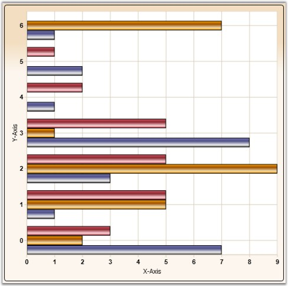
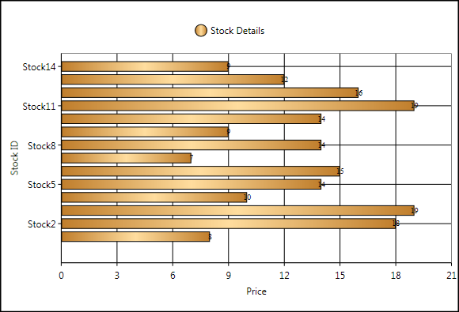
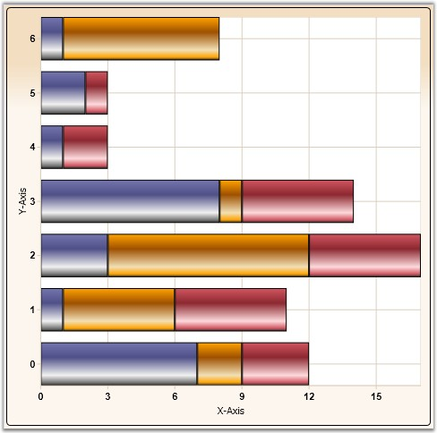
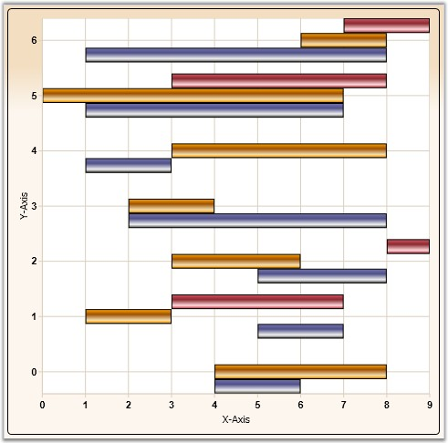
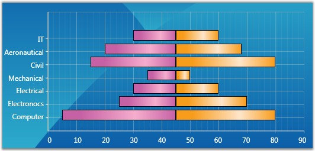
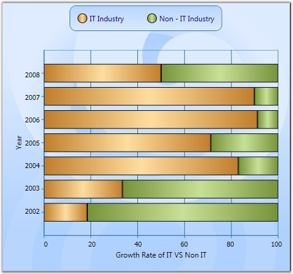

::: {style="DISPLAY: none"}
{#d2h_url_template}{#d2h_package_url style="WIDTH: 0px; DISPLAY: none; HEIGHT: 0px"}
:::

:::::::::::::::: {.d2h_secondary_topic style="PADDING-BOTTOM: 10pt; MARGIN: 0pt; PADDING-LEFT: 0pt; PADDING-RIGHT: 0pt; PADDING-TOP: 0pt"}
##### Bar Charts {#bar-charts style="tab-stops: 0pt"}

###### 4.1.1.4.2.1 Bar Chart {#bar-chart style="tab-stops: 0pt"}

Bar Chart is the simplest and most versatile of statistical diagrams. It displays horizontal bars for each point in the series and points from adjacent series are drawn as bars next to each other. It is also available with a 3-D visual effect.

 

Bar Charts can be used to compare values across categories, for showing the variations in the value of an item over time or for showing the values of several items at a single point in time.

 

Another good reason to use bar charts is when you realize that the number of a data series fits better in a horizontal format. If you have long gaps between different values and you also have many items to compare, the bar chart type is the best one to use. 

 

The following image shows a multi series Bar Chart.

[]{style="FONT-FAMILY: 'Trebuchet MS','sans-serif'; COLOR: #15428b; FONT-SIZE: 9pt"} 

{border="0"}

Figure 120: Bar Chart

[]{style="FONT-FAMILY: 'Trebuchet MS','sans-serif'; COLOR: #15428b; FONT-SIZE: 9pt"} 

Data Requirements

The following are the details about Bar Chart:

[]{style="FONT-FAMILY: 'Trebuchet MS','sans-serif'; COLOR: #15428b; FONT-SIZE: 9pt"} 

Table 33: Data Requirement

::: {align="center"}
+------------------------------+-------------+
| Details                                    |
+------------------------------+-------------+
| Number of y values per point | one         |
+------------------------------+-------------+
| Number of points             | one or more |
+------------------------------+-------------+
| Number of series             | one or more |
+------------------------------+-------------+
:::

[]{style="FONT-FAMILY: 'Trebuchet MS','sans-serif'; COLOR: #15428b; FONT-SIZE: 9pt"} 

Bar Chart Settings

[]{style="FONT-FAMILY: 'Trebuchet MS','sans-serif'; COLOR: #15428b; FONT-SIZE: 9pt"} 

Table 34: Bar Setting

::: {align="center"}
+-------------------+-----------------+-----------------+------------------------------------------------------------+
| Name              | Type            | Container       | Description                                                |
+-------------------+-----------------+-----------------+------------------------------------------------------------+
| ChartType.Spacing | double          | ChartArea       | Attached property that specifies the space between columns |
|                   |                 |                 |                                                            |
|                   |                 |                 | Possible values lie between 0 and 1. Default value is 0.2. |
+-------------------+-----------------+-----------------+------------------------------------------------------------+
:::

[]{style="FONT-FAMILY: 'Trebuchet MS','sans-serif'; COLOR: #15428b; FONT-SIZE: 9pt"} 

Template

While setting template the following parameters can be used.

[]{style="FONT-FAMILY: 'Trebuchet MS','sans-serif'; COLOR: #15428b; FONT-SIZE: 9pt"} 

Table 35: Template Parameter

::: {align="center"}
  ---------- ------------- ---------------------------
  Name       Type          Description
  X          double        x column coordinate
  Y          double        y column coordinate
  Width      double        column width
  Height     double        column height
  Interior   Brush         column color
  Series     ChartSeries   reference to series-owner
  ---------- ------------- ---------------------------
:::

[]{style="FONT-FAMILY: 'Trebuchet MS','sans-serif'; COLOR: #15428b; FONT-SIZE: 9pt"} 

A sample which demonstrates Bar Chart Types is available in the following sample installation path.

[]{style="FONT-FAMILY: 'Trebuchet MS','sans-serif'; COLOR: #15428b; FONT-SIZE: 9pt"} 

***..My Documents\\Syncfusion\\EssentialStudio\\\<Version Number\>\\WPF\\Chart.WPF\\Samples\\3.5\\WindowsSamples\\Chart Gallery\\Bar Chart Demo***

[]{style="FONT-FAMILY: 'Trebuchet MS','sans-serif'; COLOR: #15428b; FONT-SIZE: 9pt"} 

See Also

[[Chart Types]{.UGHyperlink}](ms-xhelp:///?Id=4fc74b66-07ff-4d5b-81e2-b57393d53fc3)[]{.UGHyperlink}

[]{#p79} 

###### 4.1.1.4.2.2 FastBar ChartType       {#fastbar-charttype style="tab-stops: 0pt"}

FastBar Chart is similar to Bar chart as it uses horizontal bars to display different values of one or more items. [It is inherited from FastColumn ChartType with rotated Series, to achieve better performance over Bar ChartType.]{style="COLOR: black"} 

It is used for comparing frequencies, counts, total and average of data in different categories. It is ideal for showing the variations in the value of an item over time.

 

The following points give the advantages of FastBar over Bar charts:

 

[·      ]{style="FONT-FAMILY: Symbol"}They load faster than the Bar charts.

[·      ]{style="FONT-FAMILY: Symbol"}They ensure high performance for displaying data.

[·      ]{style="FONT-FAMILY: Symbol"}They can be used as real time charts to render a huge number of data points.

 

Use Case Scenarios

FastBar ChartType can be used in Stock Market where large amounts of data need to be rendered. It allows users to add large numbers of DataPoints thereby delivering a better performance.

[]{style="COLOR: #c00000"} 

Adding FastBar ChartType to an Application

To add FastBar ChartType to the application:

1.   Select **FastBar** from the enum of type **ChartTypes**.

2.   Assign it to the **Type** property in the **ChartSeries**. This can be added using xaml and also using C# code as given in the following code snippets.

**** 

Code Table

**** 

+-------------------------------------------------------------------------------------------------------------------------------------------------------------------------------------------------------------------------------------------------------------------------------------------------------------------------------------------------------------------------------------------------------------------------------------------------------------------------------------------------+
| **[\[xaml\]]{style="FONT-FAMILY: 'Courier New'"}**[ ]{style="FONT-FAMILY: 'Courier New'; COLOR: #a31515"}                                                                                                                                                                                                                                                                                                                                                                                       |
|                                                                                                                                                                                                                                                                                                                                                                                                                                                                                                 |
| [          ]{style="FONT-FAMILY: 'Courier New'; COLOR: #a31515"}[\<]{style="FONT-FAMILY: 'Courier New'; COLOR: blue"}[syncfusion]{style="FONT-FAMILY: 'Courier New'; COLOR: #a31515"}[:]{style="FONT-FAMILY: 'Courier New'; COLOR: blue"}[ChartSeries]{style="FONT-FAMILY: 'Courier New'; COLOR: #a31515"}[ Type]{style="FONT-FAMILY: 'Courier New'; COLOR: red"}[=\"FastBar\"/\>]{style="FONT-FAMILY: 'Courier New'; COLOR: blue"}[      ]{style="FONT-FAMILY: 'Courier New'; COLOR: #a31515"} |
+-------------------------------------------------------------------------------------------------------------------------------------------------------------------------------------------------------------------------------------------------------------------------------------------------------------------------------------------------------------------------------------------------------------------------------------------------------------------------------------------------+

 

+----------------------------------------------------------------------------------------------------------------------------------------------------------------------------------------------------------------------------------+
| **[\[C#\]]{style="FONT-FAMILY: 'Courier New'"}**                                                                                                                                                                                 |
|                                                                                                                                                                                                                                  |
| [   ]{style="FONT-FAMILY: 'Courier New'; COLOR: blue"}[        ]{style="FONT-FAMILY: 'Courier New'; COLOR: #a31515"}[Area1.Series\[0\].Type = [ChartTypes]{style="COLOR: #2b91af"}.FastBar;]{style="FONT-FAMILY: 'Courier New'"} |
+----------------------------------------------------------------------------------------------------------------------------------------------------------------------------------------------------------------------------------+

 

{border="0"}

Figure 121: Adding FastBar ChartType to the Application

 

Sample Link

To run the UI WPF sample:

 

1.  Open Essential Studio Dashboard by selecting **Start** -\> **Program** -\> **Syncfusion**-\> **Essential Studio \<\<Version Number\>\>** -\> **Dashboard**.

2.  Select **Run Locally Installed Samples**, from the **WPF** drop-down list on the **User Interface** pane.

3.  Select **Chart** in the sample browser.

4.  Select **ChartPerformance**-\>**FastChartTypesDemo** on the **Essential Chart** pane and click the **Run Sample** button.

 

To open the sample project:

 

1.   Go to the following sample location in your system: 

***"\<sample installation location\>\\Syncfusion\\EssentialStudio\\Version Number \\WPF\\Chart.WPF\\Samples\\3.5\\WindowsSamples\\ChartPerformance\\FastChartTypesDemo"***

2.   This location contains two sub folders **CS** and **VB**.  You can open the sample projects from the respective folders based on your application development language.

 

###### 4.1.1.4.2.3 Stacking Bar Chart {#stacking-bar-chart style="tab-stops: 0pt"}

Stacking Bar Charts are similar to regular bar charts except that the Y values stack on top of each other in the specified series order. This helps visualize the relationship of parts to the whole.

 

The following image shows a sample Stacking Bar Chart.

 

{border="0"}

Figure 122: Stacking Bar Chart

**[]{style="FONT-FAMILY: 'Trebuchet MS','sans-serif'; COLOR: #15428b"}** 

Data Requirements

The following are the details about Stacking Bar Chart:

**[]{style="POSITION: relative; COLOR: #4a5c8c; FONT-SIZE: 9pt; TOP: 4.5pt"}** 

Table 36: Data Requirement

::: {align="center"}
+------------------------------+-------------+
| Details                                    |
+------------------------------+-------------+
| Number of y values per point | one         |
+------------------------------+-------------+
| Number of points             | one or more |
+------------------------------+-------------+
| Number of series             | one or more |
+------------------------------+-------------+
:::

[]{style="FONT-FAMILY: 'Trebuchet MS','sans-serif'; COLOR: #15428b; FONT-SIZE: 9pt"} 

Stacking Bar Chart Properties

[]{style="FONT-FAMILY: 'Trebuchet MS','sans-serif'; COLOR: #15428b; FONT-SIZE: 9pt"} 

Table 37: Stacking Bar Chart

::: {align="center"}
+-------------------+-----------------+-----------------+------------------------------------------------------------+
| Name              | Type            | Container       | Description                                                |
+-------------------+-----------------+-----------------+------------------------------------------------------------+
| ChartType.Spacing | double          | ChartArea       | Attached property that specifies the space between columns |
|                   |                 |                 |                                                            |
|                   |                 |                 | Possible values lie between 0 and 1. Default value is 0.2. |
+-------------------+-----------------+-----------------+------------------------------------------------------------+
:::

[]{style="FONT-FAMILY: 'Trebuchet MS','sans-serif'; COLOR: #15428b; FONT-SIZE: 9pt"} 

Template

While setting template the following parameters can be used:

[]{style="FONT-FAMILY: 'Trebuchet MS','sans-serif'; COLOR: #15428b; FONT-SIZE: 9pt"} 

Table 38: Template Parameter

::: {align="center"}
  ---------- ------------- ---------------------------------
  Name       Type          Description
  X          double        x column coordinate
  Y          double        y column coordinate
  Width      double        column width
  Height     double        column height
  Interior   Brush         column color
  IsUpper    bool          true -- if this is upper column
  IsLower    bool          true -- if this is lower column
  Series     ChartSeries   reference to series-owner
  ---------- ------------- ---------------------------------
:::

[]{style="FONT-FAMILY: 'Trebuchet MS','sans-serif'; COLOR: #15428b; FONT-SIZE: 9pt"} 

A sample which demonstrates Bar Chart Types is available in the following sample installation path.

[]{style="FONT-FAMILY: 'Trebuchet MS','sans-serif'; COLOR: #15428b; FONT-SIZE: 9pt"} 

***..My Documents\\Syncfusion\\EssentialStudio\\\<Version Number\>\\WPF\\Chart.WPF\\Samples\\3.5\\WindowsSamples\\Chart Gallery\\Bar Chart Demo***

**** 

See Also

[[Chart Types]{.UGHyperlink}](ms-xhelp:///?Id=b472b0c1-a043-4ef7-8186-3c0b92b19b96)[]{.UGHyperlink}

[]{#p80} 

###### 4.1.1.4.2.4 Gantt Chart {#gantt-chart style="tab-stops: 0pt"}

Frequently used in project management, a Gantt chart provides a graphical illustration of a schedule to help plan, coordinate, and track specific tasks in a project.

[]{style="FONT-FAMILY: 'Trebuchet MS','sans-serif'; COLOR: #15428b; FONT-SIZE: 9pt"} 

{border="0"}

Figure 123: Gantt Chart

[]{style="FONT-FAMILY: 'Trebuchet MS','sans-serif'; COLOR: #15428b; FONT-SIZE: 9pt"} 

Data Requirements

The following are the details about Gantt Chart:

[]{style="FONT-FAMILY: 'Trebuchet MS','sans-serif'; COLOR: #15428b; FONT-SIZE: 9pt"} 

Table 39: Data Requirement

::: {align="center"}
+------------------------------+-------------+
| Details                                    |
+------------------------------+-------------+
| Number of y values per point | two         |
+------------------------------+-------------+
| Number of points             | one or more |
+------------------------------+-------------+
| Number of series             | one or more |
+------------------------------+-------------+
:::

[]{style="COLOR: red; FONT-SIZE: 8pt"} 

Gantt Chart Settings

[]{style="FONT-FAMILY: 'Trebuchet MS','sans-serif'; COLOR: #15428b; FONT-SIZE: 9pt"} 

Table 40: Gantt Chart Setting

::: {align="center"}
+-------------------+-----------------+-----------------+------------------------------------------------------------+
| Name              | Type            | Container       | Description                                                |
+-------------------+-----------------+-----------------+------------------------------------------------------------+
| ChartType.Spacing | double          | ChartArea       | attached property that specifies the space between columns |
|                   |                 |                 |                                                            |
|                   |                 |                 | Possible values lie between 0 an 1. Default value is 0.2.  |
+-------------------+-----------------+-----------------+------------------------------------------------------------+
:::

[]{style="FONT-FAMILY: 'Trebuchet MS','sans-serif'; COLOR: #15428b; FONT-SIZE: 9pt"} 

Template

While setting template the following parameters can be used.

[]{style="FONT-FAMILY: 'Trebuchet MS','sans-serif'; COLOR: #15428b; FONT-SIZE: 9pt"} 

Table 41: Template Parameter

::: {align="center"}
  ---------- ------------- ---------------------------
  Name       Type          Description
  X          double        x column coordinate
  Y          double        y column coordinate
  Width      double        column width
  Height     double        column height
  Interior   Brush         column color
  Series     ChartSeries   reference to series-owner
  ---------- ------------- ---------------------------
:::

[]{style="FONT-FAMILY: 'Trebuchet MS','sans-serif'; COLOR: #15428b; FONT-SIZE: 9pt"} 

A sample which demonstrates Gantt Chart Type is available in the following sample installation path.

[]{style="FONT-FAMILY: 'Trebuchet MS','sans-serif'; COLOR: #15428b; FONT-SIZE: 9pt"} 

***..My Documents\\Syncfusion\\EssentialStudio\\\<Version Number\>\\WPF\\Chart.WPF\\Samples\\3.5\\WindowsSamples\\Chart Gallery\\Gantt Chart Demo***

 

See Also

[[Chart Types]{.UGHyperlink}](ms-xhelp:///?Id=4bd3b3da-f784-44a7-be8f-082f35b29dee)[]{.UGHyperlink}

[]{#p81} 

###### 4.1.1.4.2.5 Tornado Chart {#tornado-chart style="tab-stops: 0pt"}

The Tornado chart is a bar chart which shows the variability of an output to several different inputs. Variability is displayed using relative lengths of bars across a range. It is mainly used in sensitivity analysis. It shows how different random factors can influence the prognostic outcome.

[]{style="FONT-FAMILY: 'Trebuchet MS','sans-serif'; COLOR: #15428b; FONT-SIZE: 9pt"} 

{border="0"}

Figure 124: Tornado Chart

[]{style="FONT-FAMILY: 'Trebuchet MS','sans-serif'; COLOR: #15428b; FONT-SIZE: 9pt"} 

Data Requirements

The following are the details about Tornado Chart:

 

Table 42: Data Requirement

::: {align="center"}
+------------------------------+-------------+
| Details                                    |
+------------------------------+-------------+
| Number of y values per point | two         |
+------------------------------+-------------+
| Number of points             | one or more |
+------------------------------+-------------+
| Number of series             | one or more |
+------------------------------+-------------+
:::

[]{style="FONT-FAMILY: 'Trebuchet MS','sans-serif'; COLOR: #15428b; FONT-SIZE: 9pt"} 

Tornado Settings

[]{style="FONT-FAMILY: 'Trebuchet MS','sans-serif'; COLOR: #15428b; FONT-SIZE: 9pt"} 

Table 43: Tornado Setting

::: {align="center"}
+-------------------+-----------------+-----------------+------------------------------------------------------------+
| Name              | Type            | Container       | Description                                                |
+-------------------+-----------------+-----------------+------------------------------------------------------------+
| ChartType.Spacing | double          | ChartArea       | attached property that specifies the space between columns |
|                   |                 |                 |                                                            |
|                   |                 |                 | Possible values lie between 0 and 1. Default value is 0.2. |
+-------------------+-----------------+-----------------+------------------------------------------------------------+
:::

[]{style="FONT-FAMILY: 'Trebuchet MS','sans-serif'; COLOR: #15428b; FONT-SIZE: 9pt"} 

Template

While setting template the following parameters can be used:

[]{style="FONT-FAMILY: 'Trebuchet MS','sans-serif'; COLOR: #15428b; FONT-SIZE: 9pt"} 

Table 44: Template Parameter

::: {align="center"}
  ---------- ------------- ---------------------------
  Name       Type          Description
  X          double        x column coordinate
  Y          double        y column coordinate
  Width      double        column width
  Height     double        column height
  Interior   Brush         column color
  Series     ChartSeries   reference to series-owner
  ---------- ------------- ---------------------------
:::

[]{style="FONT-FAMILY: 'Trebuchet MS','sans-serif'; COLOR: #15428b; FONT-SIZE: 9pt"} 

A sample which demonstrates Tornado Chart Type is available in the following sample installation path.

[]{style="FONT-FAMILY: 'Trebuchet MS','sans-serif'; COLOR: #15428b; FONT-SIZE: 9pt"} 

***..My Documents\\Syncfusion\\EssentialStudio\\\<Version Number\>\\WPF\\Chart.WPF\\Samples\\3.5\\WindowsSamples\\Chart Gallery\\Tornado Chart Demo***

**** 

See Also

[[Chart Types]{.UGHyperlink}](ms-xhelp:///?Id=9eef4133-7da3-4c17-a048-f5288af76744)[]{.UGHyperlink}

[]{#p82} 

###### 4.1.1.4.2.6 Stacked Bar 100 Chart {#stacked-bar-100-chart style="tab-stops: 0pt"}

In the 100 percent Stacked Bar Chart, the cumulative proportion of each stacked element always totals 100 percent. This type of chart is great to visualize the relative contribution of each series values to the whole.

 

The following image shows a sample Stacking Bar 100 Chart.

[]{style="FONT-FAMILY: 'Trebuchet MS','sans-serif'; COLOR: #15428b; FONT-SIZE: 9pt"} 

{border="0"}

Figure 125: Stacking Bar 100 Chart

[]{style="FONT-FAMILY: 'Trebuchet MS','sans-serif'; COLOR: #15428b; FONT-SIZE: 9pt"} 

Data Requirements

The following are the details about Stacking Bar 100 Chart:

[]{style="FONT-FAMILY: 'Trebuchet MS','sans-serif'; COLOR: #15428b; FONT-SIZE: 9pt"} 

Table 45: Data Requirement

::: {align="center"}
+------------------------------+-------------+
| Details                                    |
+------------------------------+-------------+
| Number of y values per point | one         |
+------------------------------+-------------+
| Number of points             | one or more |
+------------------------------+-------------+
| Number of series             | one or more |
+------------------------------+-------------+
:::

[]{style="FONT-FAMILY: 'Trebuchet MS','sans-serif'; COLOR: #15428b; FONT-SIZE: 9pt"} 

A sample which demonstrates Bar Chart Types is available in the following sample installation path.

[]{style="FONT-FAMILY: 'Trebuchet MS','sans-serif'; COLOR: #15428b; FONT-SIZE: 9pt"} 

***..My Documents\\Syncfusion\\EssentialStudio\\\<Version Number\>\\WPF\\Chart.WPF\\Samples\\3.5\\WindowsSamples\\Chart Gallery\\Bar Chart Demo***

**** 

See Also

[[Chart Types]{.UGHyperlink}](ms-xhelp:///?Id=01480571-7a07-474a-aba3-115b42b69990)[]{.UGHyperlink}

[]{style="FONT-FAMILY: 'Trebuchet MS','sans-serif'; COLOR: #15428b; FONT-SIZE: 9pt"} 

[]{#related-topics}
::::::::::::::::
