::: {style="DISPLAY: none"}
{#d2h_url_template}{#d2h_package_url style="WIDTH: 0px; DISPLAY: none; HEIGHT: 0px"}
:::

:::::::::::::::::::::::::::: {.d2h_secondary_topic style="PADDING-BOTTOM: 10pt; MARGIN: 0pt; PADDING-LEFT: 0pt; PADDING-RIGHT: 0pt; PADDING-TOP: 0pt"}
##### Bar Items      {#bar-items style="tab-stops: 0pt"}

[]{style="COLOR: #15428b"} 

This section will discuss various types of bar items, their properties and customization using the properties.

**[]{style="COLOR: #15428b"}** 

###### []{#p858}[]{#_Customize_Dialog}3.5.4.1.2.1 Customize Dialog {#customize-dialog style="tab-stops: 0pt"}

Bar items can be added to a BarManager using Customize dialog through Designer. See [Adding Bar Items to a BarManager]{style="COLOR: blue; TEXT-DECORATION: none; text-underline: none"} to know how to add bar items.

**[]{style="COLOR: #15428b"}** 

Customize Dialog

[]{style="COLOR: #15428b"} 

The **Customize** Dialog can be accessed at design time and also at runtime. It lets the end users to add and customize menus, toolbars and layout items during design time. This can be invoked at design time, by right-clicking the mainFrameBarManager and selecting the Customize option in the designer.

[]{style="COLOR: #15428b"} 

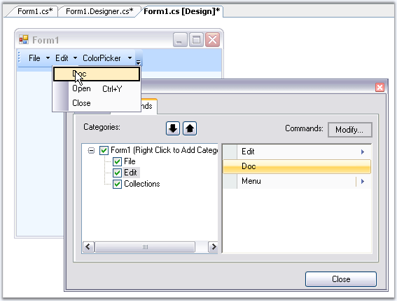{border="0"}

[]{#p859} 

Figure 732: Customize dialog at Design Time

 

At run time, Customize dialog can be accessed by right-clicking on the Bar and clicking the Customize option. This dialog lets you control the layout of items in a toolbar.

[]{style="COLOR: #15428b"} 

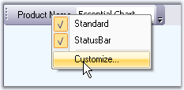{border="0"}

[]{style="COLOR: #15428b"} 

Figure 733: Accessing Customize Dialog at runtime by right-clicking the Bar

[]{style="COLOR: #15428b"} 

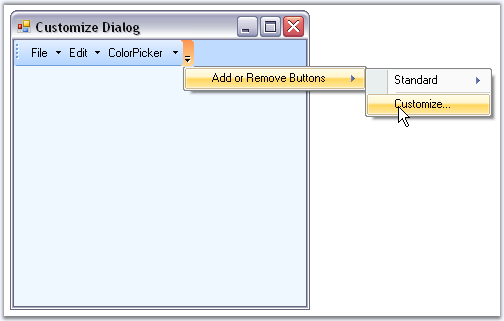{border="0"}

 

Figure 734: Accessing the Customization Dialog at Run Time by using Menu Arrow Button

(BarStyle=IsMainMenu Unchecked)

**[]{style="COLOR: #15428b"}** 

::: {style="BORDER-BOTTOM: windowtext 1pt solid; BORDER-LEFT: medium none; PADDING-BOTTOM: 1pt; MARGIN-TOP: 9pt; PADDING-LEFT: 0pt; PADDING-RIGHT: 0pt; MARGIN-BOTTOM: 9pt; BORDER-TOP: windowtext 1pt solid; BORDER-RIGHT: medium none; PADDING-TOP: 1pt"}
 Note: To avoid displaying the bar items in Customize dialog at run time, set BarManager.ShowItemsInCustomizationDialog property to false.
:::

[]{style="COLOR: #15428b"} 

[]{style="COLOR: #15428b"} 

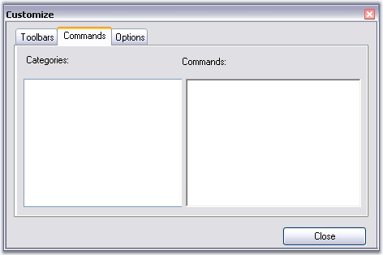{border="0"}

Figure 735: BarItems not displayed at Run Time

**[]{style="COLOR: #15428b"}** 

::: {style="BORDER-BOTTOM: windowtext 1pt solid; BORDER-LEFT: medium none; PADDING-BOTTOM: 1pt; MARGIN-TOP: 9pt; PADDING-LEFT: 0pt; PADDING-RIGHT: 0pt; MARGIN-BOTTOM: 9pt; BORDER-TOP: windowtext 1pt solid; BORDER-RIGHT: medium none; PADDING-TOP: 1pt"}
 Note: If you want to disable Customizing option for the users at run time, set BarManager.EnableCustomizing property to false. This will not provide option to open the Customize dialog at run time.
:::

[]{style="COLOR: #15428b"} 

See Also

[]{style="COLOR: #15428b"} 

[[Bar Styles]{.UGHyperlink}](../../../../../../../../Documents%20and%20Settings/sindhujamj/Desktop/Bar%20Styles.html)[,]{.UGHyperlink}[ ]{.UGHyperlink}[[Customize Dialog Appearance]{.UGHyperlink}](../../../../../../../../Documents%20and%20Settings/sindhujamj/Desktop/CustomizeDialogAppearance.html)[]{.UGHyperlink}

 

 

###### []{#_Types_of_Bar}[3.5.4.1.2.2      ]{style="FONT-SIZE: 9pt"}Types of Bar Items[]{style="FONT-SIZE: 9pt"} {#types-of-bar-items style="tab-stops: 0pt"}

[]{style="COLOR: #15428b"} 

The following Bar items are discussed in this section.

[]{style="COLOR: #15428b"} 

[]{#p860}[]{#_BarItem}3.5.4.1.2.2.1      BarItem

[]{style="COLOR: #15428b"} 

A BarItem is a simple child bar item which can be dragged and dropped to a ParentBarItem. By selecting the Type as BarItem and giving the name, in the Add New BarItem dialog, we can create a new BarItem.

[]{style="COLOR: #15428b"} 

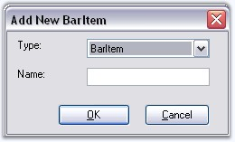{border="0"}

[]{style="COLOR: #15428b"} 

Figure 736: Adding BarItem in the designer using Customize Dialog Box

[]{style="COLOR: #15428b"} 

Behavior Properties

[]{style="COLOR: #15428b"} 

Some properties are as follows.

[]{style="COLOR: #15428b"} 

::: {align="center"}
+-----------------------------------+---------------------------------------------------------------------------------------------------------------------------------------------------------+
| ParentBarItem Property            | Description                                                                                                                                             |
+-----------------------------------+---------------------------------------------------------------------------------------------------------------------------------------------------------+
| Checked                           | Draws the bar item with a checked appearance.                                                                                                           |
+-----------------------------------+---------------------------------------------------------------------------------------------------------------------------------------------------------+
| Enabled                           | Enables or disables the bar item. Default value is true.                                                                                                |
+-----------------------------------+---------------------------------------------------------------------------------------------------------------------------------------------------------+
| IsRecentlyUsedItem                | Indicates whether this item will appear in its parent\'s partial menus list. Partial Menus is discussed in [ParentBarItem]{style="COLOR: black"} topic. |
+-----------------------------------+---------------------------------------------------------------------------------------------------------------------------------------------------------+
| Visible                           | Sets the visibility of the bar item.                                                                                                                    |
+-----------------------------------+---------------------------------------------------------------------------------------------------------------------------------------------------------+
| MergeOrder                        | Relative Position of the bar item when it is merged with another.                                                                                       |
+-----------------------------------+---------------------------------------------------------------------------------------------------------------------------------------------------------+
| MergeType                         | Sets behavior of the bar item when its bar is merged with another. The options are,                                                                     |
|                                   |                                                                                                                                                         |
|                                   |                                                                                                                                                         |
|                                   |                                                                                                                                                         |
|                                   | Add - Adds to the existing menu items. (Default)                                                                                                        |
|                                   |                                                                                                                                                         |
|                                   | Replace - Replaces an existing menu items at the same position in a merged menu.                                                                        |
|                                   |                                                                                                                                                         |
|                                   | MergeItems - Merged with an existing menu items at the same position in a merged menu.                                                                  |
|                                   |                                                                                                                                                         |
|                                   | Remove - Menu item will not be included in the merged menu. See ParentBarItem for merging the bar items.                                                |
+-----------------------------------+---------------------------------------------------------------------------------------------------------------------------------------------------------+
| Customizable                      | Specifies whether the bar item is involved in the customization.                                                                                        |
+-----------------------------------+---------------------------------------------------------------------------------------------------------------------------------------------------------+
| Padding                           | Gets or sets padding for items.                                                                                                                         |
+-----------------------------------+---------------------------------------------------------------------------------------------------------------------------------------------------------+
| PaddingForThemesX                 | Specifies padding for theme control X.                                                                                                                  |
+-----------------------------------+---------------------------------------------------------------------------------------------------------------------------------------------------------+
| PaddingForThemesY                 | Specifies padding for theme control Y.                                                                                                                  |
+-----------------------------------+---------------------------------------------------------------------------------------------------------------------------------------------------------+
| ShowMnemonicUnderlinesAlways      | It indicates whether to show underlines with mnemonic always.                                                                                           |
+-----------------------------------+---------------------------------------------------------------------------------------------------------------------------------------------------------+
:::

**[]{style="COLOR: #15428b"}** 

**[]{style="COLOR: #15428b"}** 

**[]{style="COLOR: #15428b"}** 

Other Common properties

**[]{style="COLOR: #15428b"}** 

[For setting images see ]{style="COLOR: #15428b"}Image Settings[; ]{style="COLOR: #15428b"}[]{style="COLOR: #15428b"}

[For Editing the text and setting text alignments, See ]{style="COLOR: #15428b"}BarItem Text[; ]{style="COLOR: #15428b"}[]{style="COLOR: #15428b"}

[For setting shortcuts for the bar items, see ]{style="COLOR: #15428b"}Keyboard shortcuts[ and ]{style="COLOR: #15428b"}

[For changing the Paint Style, ]{style="COLOR: #15428b"}[see ]{style="COLOR: #15428b"}PaintStyle[ topic. ]{style="COLOR: #15428b"}

[Appearance of the Text can be customized. See ]{style="COLOR: #15428b"}Foreground Settings[ for details.]{style="COLOR: #15428b"}

[]{style="COLOR: #15428b"} 

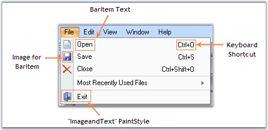{border="0"}

[]{style="COLOR: #15428b"} 

Figure 737: Illustrates BarItem in a ParentBarItem dropdown with Image and Keyboard shortcut and PaintStyle Settings

 

See Also

[]{style="COLOR: #15428b"} 

Customization Options[,]{style="COLOR: #15428b"}[ UpdateUIOnAppIdle property in ]{style="COLOR: #15428b"}UI Command Update Patterns[ topic]{style="COLOR: #15428b"}

[]{#p861}[]{#_ParentBarItem}3.5.4.1.2.2.2      ParentBarItem

[]{style="COLOR: #15428b"} 

A **ParentBarItem** represents a submenu (drop-down menu) which can display one or more child BarItems on drop-down. A ParentBarItem can be placed inside a toolbar and it can contain another ParentBarItem as its child bar item. ParentBarItem comes with properties to control its appearance and behavior.

[]{style="COLOR: #15428b"} 

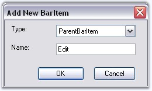{border="0"}

[]{style="COLOR: #15428b"} 

Figure 738: Adding ParentBarItem by selecting Type as ParentBarItem through Designer using Customize Dialog Box

[]{style="COLOR: #15428b"} 

Behavior Settings

[]{style="COLOR: #15428b"} 

The following propertieslet you control the behavior of the ParentBarItem.

[]{style="COLOR: #15428b"} 

::: {align="center"}
+-----------------------------------+------------------------------------------------------------------------------------------------------------------------+
| ParentBarItem Property            | Description                                                                                                            |
+-----------------------------------+------------------------------------------------------------------------------------------------------------------------+
| Checked                           | Draws the bar item with a checked appearance.                                                                          |
+-----------------------------------+------------------------------------------------------------------------------------------------------------------------+
| Enabled                           | Enables or disables the bar item. Default value is true.                                                               |
+-----------------------------------+------------------------------------------------------------------------------------------------------------------------+
| IsRecentlyUsedItem                | Indicates whether this item will appear in its parent\'s partial menus list.                                           |
+-----------------------------------+------------------------------------------------------------------------------------------------------------------------+
| Visible                           | Sets the visibility of the bar item.                                                                                   |
+-----------------------------------+------------------------------------------------------------------------------------------------------------------------+
| MergeOrder                        | Relative Position of the bar item when it is merged with another.                                                      |
+-----------------------------------+------------------------------------------------------------------------------------------------------------------------+
| MergeType                         | Sets behavior of the bar item when its bar is merged with another. The options are,                                    |
|                                   |                                                                                                                        |
|                                   |                                                                                                                        |
|                                   |                                                                                                                        |
|                                   | Add - Adds to the existing menu items. (Default)                                                                       |
|                                   |                                                                                                                        |
|                                   | Replace - Replaces an existing menu items at the same position in a merged menu.                                       |
|                                   |                                                                                                                        |
|                                   | MergeItems - Merged with an existing menu items at the same position in a merged menu.                                 |
|                                   |                                                                                                                        |
|                                   | Remove - Menu item will not be included in the merged menu.                                                            |
+-----------------------------------+------------------------------------------------------------------------------------------------------------------------+
| Customizable                      | Specifies whether the bar item is involved in the customization.                                                       |
+-----------------------------------+------------------------------------------------------------------------------------------------------------------------+
| ParentStyle                       | Specifies the ParentStyle on which the menu will be drawn. The options are,                                            |
|                                   |                                                                                                                        |
|                                   |                                                                                                                        |
|                                   |                                                                                                                        |
|                                   | Default (Default),                                                                                                     |
|                                   |                                                                                                                        |
|                                   | DropDown.                                                                                                              |
+-----------------------------------+------------------------------------------------------------------------------------------------------------------------+
| Padding                           | Gets or sets padding for items.                                                                                        |
+-----------------------------------+------------------------------------------------------------------------------------------------------------------------+
| ScrollingSpeed                    | Specifies the scrollingspeed for the displayed child menu items.                                                       |
+-----------------------------------+------------------------------------------------------------------------------------------------------------------------+
| ScrollOnMouseMove                 | Specifies scroll items in menu when mouse moves over scroll buttons.                                                   |
+-----------------------------------+------------------------------------------------------------------------------------------------------------------------+
| UsePartialMenus                   | Specifies whether ParentBarItem will first show a list of  recently used items and an Expand button when dropped down. |
+-----------------------------------+------------------------------------------------------------------------------------------------------------------------+
| ShowMnemonicUnderlinesAlways      | It indicates whether to show underlines with mnemonic always.                                                          |
+-----------------------------------+------------------------------------------------------------------------------------------------------------------------+
:::

**[]{style="COLOR: #15428b"}** 

Merging

**[]{style="COLOR: #15428b"}** 

XPMenus FrameWork lets you merge menu items of different ParentBarItems using **MergeItems** method.

**[]{style="COLOR: #15428b"}** 

::: {align="center"}
+-----------------------------------+---------------------------------------------------------------------------------------------------------------------------------------------------------------------------------------------------------------------------------------------------------------------------------------------------------------+
| ParentBarItem Method              | Description                                                                                                                                                                                                                                                                                                   |
+-----------------------------------+---------------------------------------------------------------------------------------------------------------------------------------------------------------------------------------------------------------------------------------------------------------------------------------------------------------+
| MergeItems                        | Merges BarItems of one ParentBarItem with another ParentBarItem. Two ParentBarItems can be merged into one, based on the [MergeOrder]{style="FONT-SIZE: 8pt"} and[ ]{style="COLOR: black"}[MergeType]{style="FONT-SIZE: 8pt"}[ ]{style="COLOR: black"}properties of its children (/ menu item). Parameter is, |
|                                   |                                                                                                                                                                                                                                                                                                               |
|                                   |                                                                                                                                                                                                                                                                                                               |
|                                   |                                                                                                                                                                                                                                                                                                               |
|                                   | parentItemSrc - The ParentBarItem which is merged with this ParentBarItem.                                                                                                                                                                                                                                    |
+-----------------------------------+---------------------------------------------------------------------------------------------------------------------------------------------------------------------------------------------------------------------------------------------------------------------------------------------------------------+
:::

**[]{style="COLOR: #15428b"}** 

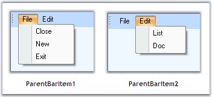{border="0"}

**[]{style="COLOR: #15428b"}** 

Figure 739: ParentBarItems displaying Child Bar Items / Menu Items before Merging

**[]{style="COLOR: #15428b"}** 

+-----------------------------------------------------------------------------------------------------------------------------------------------------------------+
| **[\[C#\]]{style="FONT-FAMILY: 'Courier New'; COLOR: black"}**                                                                                                  |
|                                                                                                                                                                 |
| []{style="FONT-FAMILY: 'Courier New'; COLOR: black"}                                                                                                            |
|                                                                                                                                                                 |
| [//Setting merge order and merge type of bar item5 (List) of ParentBarItem2]{style="FONT-FAMILY: 'Courier New'; COLOR: green"}                                  |
|                                                                                                                                                                 |
| [this]{style="FONT-FAMILY: 'Courier New'; COLOR: blue"}[.barItem5.MergeOrder = 0;]{style="FONT-FAMILY: 'Courier New'"}                                          |
|                                                                                                                                                                 |
| [this]{style="FONT-FAMILY: 'Courier New'; COLOR: blue"}[.barItem5.MergeType = [MenuMerge]{style="COLOR: teal"}.MergeItems;]{style="FONT-FAMILY: 'Courier New'"} |
|                                                                                                                                                                 |
| [//Merging parentbaritem2 menu items to parentbaritem1]{style="FONT-FAMILY: 'Courier New'; COLOR: green"}                                                       |
|                                                                                                                                                                 |
| [this]{style="FONT-FAMILY: 'Courier New'; COLOR: blue"}[.parentBarItem1.MergeItems(parentBarItem3);]{style="FONT-FAMILY: 'Courier New'"}                        |
+-----------------------------------------------------------------------------------------------------------------------------------------------------------------+

[]{style="COLOR: #15428b"} 

+--------------------------------------------------------------------------------------------------------------------------------------------------------------+
| **[\[VB.NET\]]{style="FONT-FAMILY: 'Courier New'; COLOR: black"}**                                                                                           |
|                                                                                                                                                              |
| []{style="FONT-FAMILY: 'Courier New'; COLOR: black"}                                                                                                         |
|                                                                                                                                                              |
| [\'Setting merge order and merge type of bar item5 (List) of ParentBarItem2]{style="FONT-FAMILY: 'Courier New'; COLOR: green"}                               |
|                                                                                                                                                              |
| [Me]{style="FONT-FAMILY: 'Courier New'; COLOR: blue"}[.barItem5.MergeOrder = 0]{style="FONT-FAMILY: 'Courier New'"}                                          |
|                                                                                                                                                              |
| [Me]{style="FONT-FAMILY: 'Courier New'; COLOR: blue"}[.barItem5.MergeType = [MenuMerge]{style="COLOR: teal"}.MergeItems]{style="FONT-FAMILY: 'Courier New'"} |
|                                                                                                                                                              |
| [\'Merging parentbaritem2 menu items to parentbaritem1]{style="FONT-FAMILY: 'Courier New'; COLOR: green"}                                                    |
|                                                                                                                                                              |
| [Me]{style="FONT-FAMILY: 'Courier New'; COLOR: blue"}[.parentBarItem1.MergeItems(parentBarItem3)]{style="FONT-FAMILY: 'Courier New'"}                        |
+--------------------------------------------------------------------------------------------------------------------------------------------------------------+

**[]{style="COLOR: #15428b"}** 

**[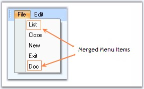{border="0"}]{style="COLOR: #15428b"}[]{style="COLOR: #15428b"}**

**[]{style="COLOR: #15428b"}** 

Figure 740: MenuItems of ParentBarItem2 merged to ParentBarItem1; MergeOrder of BarItem5(List)=0

**[]{style="COLOR: #15428b"}** 

Parent Style

[]{style="COLOR: #15428b"} 

The following figures display the parent styles.

**[]{style="COLOR: #15428b"}** 

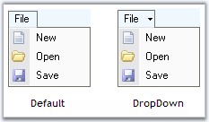{border="0"}

**[]{style="COLOR: #15428b"}** 

Figure 741: Default and Dropdown ParentStyle with IsMainMenu Unchecked

**[]{style="COLOR: #15428b"}** 

Partial Menus

**[]{style="COLOR: #15428b"}** 

The ParentBarItem can hide some of its menu items and display them on clicking an expand button at the bottom of the menu list, by using the **UsePartialMenus** and **IsRecentlyUsedItem** properties. With this feature we can display only the recently used items and can hide the rest. We can do this in **ParentBarItem.BeforePopup** event.

[]{style="COLOR: #15428b"} 

::: {align="center"}
  ------------------------------ --------------------------------------------------------------------------------------
  BarManager Property            Description
  ExpandPartialMenusAfterDelay   Enables automatic expansion of the partial menus into full menus after a delay.
  UsePartialMenus                Enables or disables partial menus mode in submenus.
  PartialMenusResetDelay         Specifies the delay in days after an item\'s recently used setting will be replaced.
  ------------------------------ --------------------------------------------------------------------------------------
:::

[]{style="COLOR: #15428b"} 

::: {style="BORDER-BOTTOM: windowtext 1pt solid; BORDER-LEFT: medium none; PADDING-BOTTOM: 1pt; MARGIN-TOP: 9pt; PADDING-LEFT: 0pt; PADDING-RIGHT: 0pt; MARGIN-BOTTOM: 9pt; BORDER-TOP: windowtext 1pt solid; BORDER-RIGHT: medium none; PADDING-TOP: 1pt"}
{border="0"} Note:[ ]{style="COLOR: black; FONT-SIZE: 8pt"}To know all the properties of BarManager, click [here]{style="COLOR: black"}.
:::

[]{style="COLOR: #15428b"} 

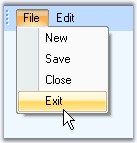{border="0"}

[]{style="COLOR: #15428b"} 

Figure 742: ParentBarItem with Menu List

**[]{style="COLOR: #15428b"}** 

Applying Partial Menus

**[]{style="COLOR: #15428b"}** 

::: {align="center"}
+-----------------------------------+-------------------------------------------------------+
| ParentBarItem Event               | Description                                           |
+-----------------------------------+-------------------------------------------------------+
| BeforePopUp                       | Handled before the popup menu is shown. Parameter is, |
|                                   |                                                       |
|                                   |                                                       |
|                                   |                                                       |
|                                   | cancel - lets you cancel the menu display.            |
+-----------------------------------+-------------------------------------------------------+
:::

**[]{style="COLOR: #15428b"}** 

+---------------------------------------------------------------------------------------------------------------------------------------------------------------------------------------------------------------------------------------------------------------+
| **[\[C#\]]{style="FONT-FAMILY: 'Courier New'; COLOR: black"}**                                                                                                                                                                                                |
|                                                                                                                                                                                                                                                               |
| []{style="FONT-FAMILY: 'Courier New'; COLOR: black"}                                                                                                                                                                                                          |
|                                                                                                                                                                                                                                                               |
| [this]{style="FONT-FAMILY: 'Courier New'; COLOR: blue"}[.parentBarItem1.UsePartialMenus = [true]{style="COLOR: blue"};]{style="FONT-FAMILY: 'Courier New'"}                                                                                                   |
|                                                                                                                                                                                                                                                               |
| [private]{style="FONT-FAMILY: 'Courier New'; COLOR: blue"}[ [void]{style="COLOR: blue"} parentBarItem1_BeforePopup([object]{style="COLOR: blue"} sender, System.ComponentModel.[CancelEventArgs]{style="COLOR: teal"} e)]{style="FONT-FAMILY: 'Courier New'"} |
|                                                                                                                                                                                                                                                               |
| [{]{style="FONT-FAMILY: 'Courier New'"}                                                                                                                                                                                                                       |
|                                                                                                                                                                                                                                                               |
| [    [// Hide New and Close BarItems in the partial menu]{style="COLOR: green"}]{style="FONT-FAMILY: 'Courier New'"}                                                                                                                                          |
|                                                                                                                                                                                                                                                               |
| [    [this]{style="COLOR: blue"}.barItem1.IsRecentlyUsedItem = [false]{style="COLOR: blue"};]{style="FONT-FAMILY: 'Courier New'"}                                                                                                                             |
|                                                                                                                                                                                                                                                               |
| [    [this]{style="COLOR: blue"}.barItem3.IsRecentlyUsedItem = [false]{style="COLOR: blue"};]{style="FONT-FAMILY: 'Courier New'"}                                                                                                                             |
|                                                                                                                                                                                                                                                               |
| [}]{style="FONT-FAMILY: 'Courier New'"}                                                                                                                                                                                                                       |
+---------------------------------------------------------------------------------------------------------------------------------------------------------------------------------------------------------------------------------------------------------------+

[]{style="COLOR: #15428b"} 

+-----------------------------------------------------------------------------------------------------------------------------------------------------------------------------------------------------------------------------------------------------------------------------------------------------------------------------------------------------+
| **[\[VB.NET\]]{style="FONT-FAMILY: 'Courier New'; COLOR: black"}**                                                                                                                                                                                                                                                                                  |
|                                                                                                                                                                                                                                                                                                                                                     |
| []{style="FONT-FAMILY: 'Courier New'; COLOR: black"}                                                                                                                                                                                                                                                                                                |
|                                                                                                                                                                                                                                                                                                                                                     |
| [Me]{style="FONT-FAMILY: 'Courier New'; COLOR: blue"}[.parentBarItem1.UsePartialMenus = [True]{style="COLOR: blue"}]{style="FONT-FAMILY: 'Courier New'"}                                                                                                                                                                                            |
|                                                                                                                                                                                                                                                                                                                                                     |
| [Private]{style="FONT-FAMILY: 'Courier New'; COLOR: blue"}[ [Sub]{style="COLOR: blue"} parentBarItem1_BeforePopup([ByVal]{style="COLOR: blue"} sender [As]{style="COLOR: blue"} [Object]{style="COLOR: blue"}, [ByVal]{style="COLOR: blue"} e [As]{style="COLOR: blue"} System.ComponentModel.CancelEventArgs)]{style="FONT-FAMILY: 'Courier New'"} |
|                                                                                                                                                                                                                                                                                                                                                     |
| [    [\' Hide Open and Close BarItems in the partial menu ]{style="COLOR: green"}]{style="FONT-FAMILY: 'Courier New'"}                                                                                                                                                                                                                              |
|                                                                                                                                                                                                                                                                                                                                                     |
| [    [Me]{style="COLOR: blue"}.barItem1.IsRecentlyUsedItem = [False]{style="COLOR: blue"}]{style="FONT-FAMILY: 'Courier New'"}                                                                                                                                                                                                                      |
|                                                                                                                                                                                                                                                                                                                                                     |
| [    [Me]{style="COLOR: blue"}.barItem3.IsRecentlyUsedItem = [False]{style="COLOR: blue"}]{style="FONT-FAMILY: 'Courier New'"}                                                                                                                                                                                                                      |
|                                                                                                                                                                                                                                                                                                                                                     |
| [End]{style="FONT-FAMILY: 'Courier New'; COLOR: blue"}[ [Sub]{style="COLOR: blue"}]{style="FONT-FAMILY: 'Courier New'"}                                                                                                                                                                                                                             |
+-----------------------------------------------------------------------------------------------------------------------------------------------------------------------------------------------------------------------------------------------------------------------------------------------------------------------------------------------------+

[]{style="COLOR: #15428b"} 

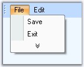{border="0"}

**[]{style="COLOR: #15428b"}** 

Figure 743: Expand Button Displayed; BarItem1 (New) and BarItem3 (Close) are Hidden

**[]{style="COLOR: #15428b"}** 

Other Common properties

**[]{style="COLOR: #4a5c8c"}** 

[For setting images see ]{style="COLOR: #15428b"}Image Settings[ ]{style="COLOR: #15428b"}[]{style="COLOR: #15428b"}

[For Editing the text and setting text alignments, ]{style="COLOR: #15428b"}[see ]{style="COLOR: #15428b"}BarItem Text[ ]{style="COLOR: #15428b"}[]{style="COLOR: #15428b"}

[For setting shortcuts for the bar items, see ]{style="COLOR: #15428b"}Keyboard shortcuts[ and ]{style="COLOR: #15428b"}

[For changing the Paint Style, ]{style="COLOR: #15428b"}[see ]{style="COLOR: #15428b"}PaintStyle[ topic. ]{style="COLOR: #15428b"}

[Appearance of the Text can be customized. See ]{style="COLOR: #15428b"}Foreground Settings[ for details.]{style="COLOR: #15428b"}

**[]{style="COLOR: #15428b"}** 

See Also

**[]{style="COLOR: #15428b"}** 

[UI Command Update Patterns]{.UGHyperlink}[,]{.UGHyperlink}

[MainFrameBarManager Properties,]{.UGHyperlink}[]{.UGHyperlink}

[[Customize Dialog]{.UGHyperlink}]()[]{.UGHyperlink}

[[]{style="TEXT-DECORATION: none"}]{.UGHyperlink} 

[]{#p862}3.5.4.1.2.2.3      DropDownBarItem

[]{style="COLOR: #15428b"} 

A DropDownBarItem is a BarItem that gets drawn with an arrow button to its right, which when clicked, will pop-up a window (note: not a menu) represented by a PopupControlContainer. This is identical to the Undo menu item in VS .NET code editor.

[]{style="COLOR: red; FONT-SIZE: 8pt"} 

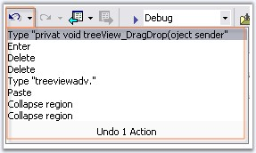{border="0"}

***[]{style="COLOR: #15428b"}*** 

Figure 744: DropDownBarItem

 

The type should be selected as DropDownBarItem in the Add New BarItem dialog.

[]{style="COLOR: #15428b"} 

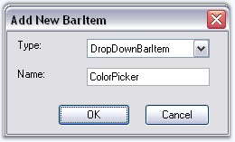{border="0"}

[]{style="COLOR: #15428b"} 

Figure 745: Adding DropDownBarItem in the designer by using Customize Dialog Box

**[]{style="COLOR: #15428b"}** 

Displaying the Popup Menu

**[]{style="COLOR: #4a5c8c"}** 

We need to associate a PopupControlContainer for showing the popup. Drag-and-drop a PopupControlContainer component and associate it with the DropDownBarItem using **PopupControlContainer** property of DropDownBarItem.

[]{style="COLOR: #15428b"} 

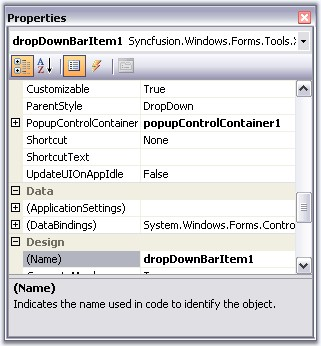{border="0"}

[]{style="COLOR: #15428b"} 

Figure 746: Associating PopupControlContainer component with DropDownBarItem

[]{style="COLOR: #15428b"} 

+--------------------------------------------------------------------------------------------------------------------------------------------------------------------------------------------+
| **[\[C#\]]{style="FONT-FAMILY: 'Courier New'; COLOR: black"}**                                                                                                                             |
|                                                                                                                                                                                            |
| []{style="FONT-FAMILY: 'Courier New'; COLOR: black"}                                                                                                                                       |
|                                                                                                                                                                                            |
| [this]{style="FONT-FAMILY: 'Courier New'; COLOR: blue"}[.dropDownBarItem1.PopupControlContainer = [this]{style="COLOR: blue"}.popupControlContainer1;]{style="FONT-FAMILY: 'Courier New'"} |
+--------------------------------------------------------------------------------------------------------------------------------------------------------------------------------------------+

[]{style="COLOR: #15428b"} 

+---------------------------------------------------------------------------------------------------------------------------------------------------------------------------------------+
| **[\[VB.NET\]]{style="FONT-FAMILY: 'Courier New'; COLOR: black"}**                                                                                                                    |
|                                                                                                                                                                                       |
| []{style="FONT-FAMILY: 'Courier New'; COLOR: black"}                                                                                                                                  |
|                                                                                                                                                                                       |
| [Me]{style="FONT-FAMILY: 'Courier New'; COLOR: blue"}[.dropDownBarItem1.PopupControlContainer = [Me]{style="COLOR: blue"}.popupControlContainer1]{style="FONT-FAMILY: 'Courier New'"} |
+---------------------------------------------------------------------------------------------------------------------------------------------------------------------------------------+

[]{style="COLOR: #15428b"} 

We can add controls like ColorPickerUI control to this container and customize the popup for the DropDownBarItem.

[]{style="COLOR: #15428b"} 

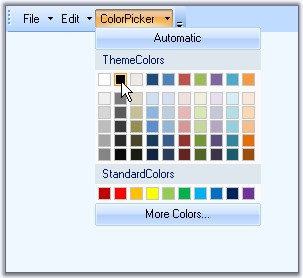{border="0"}

[]{style="COLOR: #15428b"} 

Figure 747: DropDownBarItem displaying ColorPickerUI in its Popup

**[]{style="COLOR: #15428b"}** 

**[]{style="COLOR: #15428b"}** 

**[]{style="COLOR: #15428b"}** 

Behavior Settings

**[]{style="COLOR: #15428b"}** 

DropDownBarItem supports all the behavior properties of the BarItem.

**[]{style="COLOR: #15428b"}** 

Other Common properties

**[]{style="COLOR: #15428b"}** 

For setting images see[ ]{style="COLOR: #15428b"}Image Settings[; ]{style="COLOR: #15428b"}[]{style="COLOR: #15428b"}

For Editing the text and setting text alignments, See BarItem Text;

For setting shortcuts for the bar items, see[ ]{style="COLOR: #15428b"}Keyboard shortcuts[ and ]{style="COLOR: #15428b"}

For changing the Paint Style, see[ ]{style="COLOR: #15428b"}PaintStyle[ topic. ]{style="COLOR: #15428b"}

Appearance of the Text can be customized. See[ ]{style="COLOR: #15428b"}Foreground Settings[ for details.]{style="COLOR: #15428b"}

**[]{style="COLOR: #15428b"}** 

See Also

[]{style="COLOR: #15428b"} 

UpdateUIOnAppIdle property in UI Command Update Patterns topic,

[Customize Dialog]()[]{style="COLOR: black"}

[]{#p863}3.5.4.1.2.2.4      ComboBoxBarItem

 

A[ ]{style="FONT-FAMILY: 'Verdana','sans-serif'; COLOR: black"}**ComboBoxBarItem**[ ]{style="FONT-FAMILY: 'Verdana','sans-serif'; COLOR: black"}is a BarItem that provides combobox-like behavior with an optional editable mode. This is identical to the **VS.NET Find combo box**[ ]{style="FONT-FAMILY: 'Verdana','sans-serif'; COLOR: black"}in the code editor.

[]{style="COLOR: #15428b"} 

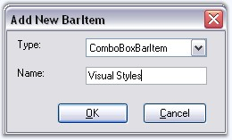{border="0"}

**[]{style="COLOR: #15428b"}** 

Figure 748: Adding ComboBoxBarItem in the designer using Customize Dialog Box

    

Adding Items for ComboBoxBarItem dropdown

**[]{style="COLOR: #15428b"}** 

A list of items can be specified in **ComboBoxBarItem.ChoiceList** property. ComboBoxBarItem can also be associated with another control like FontListControl using the **ListBox** property. You can also specify the width for this BarItem.

 

The following properties deal with settings contents for the ComboBoxBarItem.

**[]{style="COLOR: #4a5c8c"}** 

::: {align="center"}
  -------------------------- --------------------------------------------------------------------------------------------------------------------------------------------------------
  ComboBoxBarItem Property   Description
  AutoAppend                 Specifies whether to automatically append the items entered by the user in the TextBox into the dropdown list.
  MaxDropDownItems           Specifies the maximum number of items to be shown in the drop down portion of ComboBoxBarItem.
  MinDropDownWidth           Sets the width of the drop down.
  MinWidth                   Sets the minimum width when this ComboBoxBarItem is placed in a menu or toolbar.
  TextBoxValue               Sets the value in the TextBox.
  PersistTextBoxValue        Specifies whether the TextBox value should be persisted after the application is shutdown.
  Listbox                    Specifies custom listbox in the dropdown. You can drag and drop a FontListControl for ex, and associate it to the ComboBoxBarItem using this property.
  ChoiceList                 Specifies the list for the bar item.
  -------------------------- --------------------------------------------------------------------------------------------------------------------------------------------------------
:::

[]{style="COLOR: #15428b"} 

+--------------------------------------------------------------------------------------------------------------------------------------------------------------------+
| **[\[C#\]]{style="FONT-FAMILY: 'Courier New'; COLOR: black"}**                                                                                                     |
|                                                                                                                                                                    |
| []{style="FONT-FAMILY: 'Courier New'; COLOR: black"}                                                                                                               |
|                                                                                                                                                                    |
| [this]{style="FONT-FAMILY: 'Courier New'; COLOR: blue"}[.comboBoxBarItem1.AutoAppend=[true]{style="COLOR: blue"};]{style="FONT-FAMILY: 'Courier New'"}             |
|                                                                                                                                                                    |
| [this]{style="FONT-FAMILY: 'Courier New'; COLOR: blue"}[.comboBoxBarItem1.MaxDropDownItems=3;]{style="FONT-FAMILY: 'Courier New'"}                                 |
|                                                                                                                                                                    |
| [this]{style="FONT-FAMILY: 'Courier New'; COLOR: blue"}[.comboBoxBarItem1.MinDropDownWidth=1;]{style="FONT-FAMILY: 'Courier New'"}                                 |
|                                                                                                                                                                    |
| [this]{style="FONT-FAMILY: 'Courier New'; COLOR: blue"}[.comboBoxBarItem1.MinWidth=100;]{style="FONT-FAMILY: 'Courier New'"}                                       |
|                                                                                                                                                                    |
| [this]{style="FONT-FAMILY: 'Courier New'; COLOR: blue"}[.comboBoxBarItem1.TextBoxValue=\"Debug\";]{style="FONT-FAMILY: 'Courier New'"}                             |
|                                                                                                                                                                    |
| [this]{style="FONT-FAMILY: 'Courier New'; COLOR: blue"}[.comboBoxBarItem1.PersistTextBoxValue=[true]{style="COLOR: blue"};]{style="FONT-FAMILY: 'Courier New'"}    |
|                                                                                                                                                                    |
| [this]{style="FONT-FAMILY: 'Courier New'; COLOR: blue"}[.comboBoxBarItem1.ListBox = [this]{style="COLOR: blue"}.fontListBox1;]{style="FONT-FAMILY: 'Courier New'"} |
+--------------------------------------------------------------------------------------------------------------------------------------------------------------------+

[]{style="COLOR: #15428b"} 

+---------------------------------------------------------------------------------------------------------------------------------------------------------------+
| **[\[VB.NET\]]{style="FONT-FAMILY: 'Courier New'; COLOR: black"}**                                                                                            |
|                                                                                                                                                               |
| []{style="FONT-FAMILY: 'Courier New'; COLOR: black"}                                                                                                          |
|                                                                                                                                                               |
| [Me]{style="FONT-FAMILY: 'Courier New'; COLOR: blue"}[.comboBoxBarItem1.AutoAppend=[True]{style="COLOR: blue"}]{style="FONT-FAMILY: 'Courier New'"}           |
|                                                                                                                                                               |
| [Me]{style="FONT-FAMILY: 'Courier New'; COLOR: blue"}[.comboBoxBarItem1.MaxDropDownItems=3]{style="FONT-FAMILY: 'Courier New'"}                               |
|                                                                                                                                                               |
| [Me]{style="FONT-FAMILY: 'Courier New'; COLOR: blue"}[.comboBoxBarItem1.MinDropDownWidth=1]{style="FONT-FAMILY: 'Courier New'"}                               |
|                                                                                                                                                               |
| [Me]{style="FONT-FAMILY: 'Courier New'; COLOR: blue"}[.comboBoxBarItem1.MinWidth=100]{style="FONT-FAMILY: 'Courier New'"}                                     |
|                                                                                                                                                               |
| [Me]{style="FONT-FAMILY: 'Courier New'; COLOR: blue"}[.comboBoxBarItem1.TextBoxValue=[\"Debug\"]{style="COLOR: maroon"}]{style="FONT-FAMILY: 'Courier New'"}  |
|                                                                                                                                                               |
| [Me]{style="FONT-FAMILY: 'Courier New'; COLOR: blue"}[.comboBoxBarItem1.PersistTextBoxValue=[True]{style="COLOR: blue"}]{style="FONT-FAMILY: 'Courier New'"}  |
|                                                                                                                                                               |
| [Me]{style="FONT-FAMILY: 'Courier New'; COLOR: blue"}[.comboBoxBarItem1.ListBox = [Me]{style="COLOR: blue"}.fontListBox1]{style="FONT-FAMILY: 'Courier New'"} |
+---------------------------------------------------------------------------------------------------------------------------------------------------------------+

[]{style="COLOR: #15428b"} 

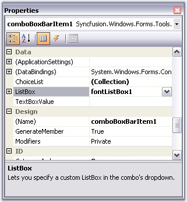{border="0"}

[]{style="COLOR: #15428b"} 

Figure 749: Associating FontListControl with the ComboBoxBarItem

[]{style="COLOR: #15428b"} 

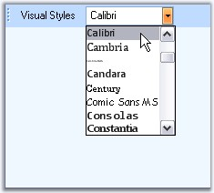{border="0"}

[]{style="COLOR: #15428b"} 

Figure 750: ComboBoxBarItem with FontListBox

**[]{style="COLOR: #15428b"}** 

::: {style="BORDER-BOTTOM: windowtext 1pt solid; BORDER-LEFT: medium none; PADDING-BOTTOM: 1pt; MARGIN-TOP: 9pt; PADDING-LEFT: 0pt; PADDING-RIGHT: 0pt; MARGIN-BOTTOM: 9pt; BORDER-TOP: windowtext 1pt solid; BORDER-RIGHT: medium none; PADDING-TOP: 1pt"}
{border="0"} Note: Editable property should be set to true for displaying the FontListControl in this case and PaintStyle should be ImageAndText for displaying the ComboBoxBarItem text.
:::

[]{style="COLOR: #15428b"} 

Behavior Settings

[]{style="COLOR: #15428b"} 

ComboBoxBarItem supports all the behavior properties of [BarItem]().

**[]{style="COLOR: #15428b"}** 

Other Common properties

**[]{style="COLOR: #4a5c8c"}** 

[For setting images see ]{style="COLOR: #15428b"}Image Settings[; ]{style="COLOR: #15428b"}[]{style="COLOR: #15428b"}

[For Editing the text and setting text alignments, See ]{style="COLOR: #15428b"}BarItem Text[; ]{style="COLOR: #15428b"}[]{style="COLOR: #15428b"}

[For setting shortcuts for the bar items, see ]{style="COLOR: #15428b"}Keyboard shortcuts[ and ]{style="COLOR: #15428b"}

[Appearance of the Text can be customized. See ]{style="COLOR: #15428b"}Foreground Settings[ for details.]{style="COLOR: #15428b"}

[We can set banner text for the ComboBoxBarItem. Refer ]{style="COLOR: #15428b"}[BannerTextProvider Component](../../../../../../../../Documents%20and%20Settings/sindhujamj/Desktop/D2H/ui/windows/tools/Documents/Tools%20-%20Part%202.docx#BannerTextProviderComponent)[ topic for more details.]{style="COLOR: #15428b"}

[]{style="COLOR: #15428b"} 

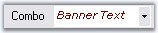{border="0"}

Figure 751: Banner Text set for ComboBoxBarItem

***[]{style="COLOR: #15428b"}*** 

PersistAutoAppendList inclusion.

**[]{style="COLOR: #15428b"}** 

PersistAutoAppendList property is added to ComboBoxBarItem. 

When this property is set to false and AutoAppend is set to true, the item added to the ComboBoxBarItem will be added to the dropdown but it will not be saved.

[]{style="COLOR: #15428b"} 

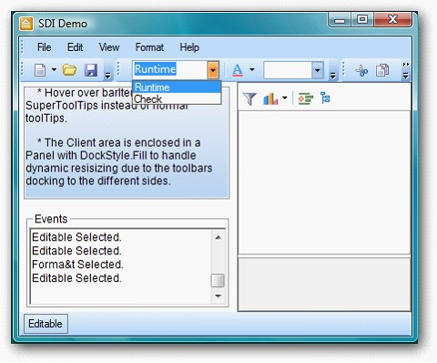{border="0"}

Figure 752: ComboBoxBarItem Dropdown

[]{style="FONT-FAMILY: 'Times New Roman','serif'"} 

The following code illustrates how to include **PersistAutoAppendList**.

::: {style="BORDER-BOTTOM: windowtext 1pt solid; BORDER-LEFT: medium none; PADDING-BOTTOM: 1pt; MARGIN-TOP: 9pt; PADDING-LEFT: 0pt; PADDING-RIGHT: 0pt; MARGIN-BOTTOM: 9pt; BORDER-TOP: windowtext 1pt solid; BORDER-RIGHT: medium none; PADDING-TOP: 1pt"}
          {border="0"}Note: This can be used when the AutoAppend is set to true.
:::

[]{style="COLOR: #15428b"} 

+----------------------------------------------------------------------------------------------------------+
| **[\[C# .Net\]]{style="FONT-FAMILY: 'Calibri','sans-serif'"}**                                           |
|                                                                                                          |
| [API:  this.comboBoxBarItem1.PersistAutoAppendList =false;]{style="FONT-FAMILY: 'Calibri','sans-serif'"} |
+----------------------------------------------------------------------------------------------------------+

[]{style="FONT-FAMILY: 'Times New Roman','serif'"} 

+---------------------------------------------------------------------------------------------------+
| **[\[VB .Net\]]{style="FONT-FAMILY: 'Calibri','sans-serif'"}**                                    |
|                                                                                                   |
| [ Me.comboBoxBarItem1.PersistAutoAppendList = false]{style="FONT-FAMILY: 'Calibri','sans-serif'"} |
+---------------------------------------------------------------------------------------------------+

[]{style="FONT-FAMILY: 'Times New Roman','serif'"} 

See Also

[]{style="COLOR: #15428b"} 

[   UpdateUIOnAppIdle property in ]{.UGHyperlink}[UI Command Update Patterns]{.UGHyperlink}[ topic ]{.UGHyperlink}

[How to handle KeyDown event in ComboBoxBarItem?]{.UGHyperlink}[ ]{.UGHyperlink}

[How to prevent the ComboBoxBarItem\'s dropdown from being closed after clicking a ChoiceList Item?]{.UGHyperlink}[]{.UGHyperlink}

[[Customize Dialog]{.UGHyperlink}]()[]{.UGHyperlink}

[]{style="COLOR: black"} 

[]{#p864}[]{#_ListBarItem}3.5.4.1.2.2.5      ListBarItem

[]{style="COLOR: #15428b"} 

A[ ]{style="FONT-FAMILY: 'Verdana','sans-serif'; COLOR: black"}**ListBarItem**[ ]{style="FONT-FAMILY: 'Verdana','sans-serif'; COLOR: black"}is a BarItem which, when added to a ParentBarItem will expand itself into an ordered list of BarItems represented by the string list in its[ ]{style="FONT-FAMILY: 'Verdana','sans-serif'; COLOR: black"}**ChildCaptions** property.

[]{style="COLOR: #15428b"} 

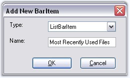{border="0"}

**[]{style="COLOR: #15428b"}** 

Figure 753: Adding ListBarItem in the designer using Customize Dialog Box

**[]{style="COLOR: #15428b"}** 

Adding Items for the ListBarItems

**[]{style="COLOR: #15428b"}** 

A list of items can be specified in **ListBarItem.ChildCaptions** property and this ListBarItem should be added to a ParentBarItem. The list can be numbered by enabling **UseNumberedList** property.

[]{style="COLOR: #15428b"} 

::: {align="center"}
  ---------------------- ------------------------------------------------------------------
  ListBarItem Property                        Description
  ChildCaptions          Specifies the list of items to be displayed in the ListBarItem.
  UseNumberedList        It specifies whether or not to use numbers in the expanded list.
  Customizable           Specifies whether the bar item is involved in the customization.
  ---------------------- ------------------------------------------------------------------
:::

[]{style="COLOR: #15428b"} 

::: {style="BORDER-BOTTOM: windowtext 1pt solid; BORDER-LEFT: medium none; PADDING-BOTTOM: 1pt; MARGIN-TOP: 9pt; PADDING-LEFT: 0pt; PADDING-RIGHT: 0pt; MARGIN-BOTTOM: 9pt; BORDER-TOP: windowtext 1pt solid; BORDER-RIGHT: medium none; PADDING-TOP: 1pt"}
{border="0"} Note: The BarItem should not be in User Customization mode / Customizable property should be set to false, to effect these settings.
:::

[]{style="COLOR: #15428b"} 

+---------------------------------------------------------------------------------------------------------------------------------------------------------------------------------------------------------------------------------------------------------------------------------------------------------------------------+
| **[\[C#\]]{style="FONT-FAMILY: 'Courier New'; COLOR: black"}**                                                                                                                                                                                                                                                            |
|                                                                                                                                                                                                                                                                                                                           |
| []{style="FONT-FAMILY: 'Courier New'; COLOR: black"}                                                                                                                                                                                                                                                                      |
|                                                                                                                                                                                                                                                                                                                           |
| [this]{style="FONT-FAMILY: 'Courier New'; COLOR: blue"}[.listBarItem1.Customizable = [false]{style="COLOR: blue"};]{style="FONT-FAMILY: 'Courier New'"}                                                                                                                                                                   |
|                                                                                                                                                                                                                                                                                                                           |
| [this]{style="FONT-FAMILY: 'Courier New'; COLOR: blue"}[.listBarItem1.ChildCaptions.AddRange([new]{style="COLOR: blue"} [string]{style="COLOR: blue"}\[\] {[\"Document1\"]{style="COLOR: maroon"}, [\"Document2\"]{style="COLOR: maroon"}, [\"Document3\"]{style="COLOR: maroon"}});]{style="FONT-FAMILY: 'Courier New'"} |
|                                                                                                                                                                                                                                                                                                                           |
| [this]{style="FONT-FAMILY: 'Courier New'; COLOR: blue"}[.listBarItem1.UseNumberedList = [true]{style="COLOR: blue"};]{style="FONT-FAMILY: 'Courier New'"}                                                                                                                                                                 |
+---------------------------------------------------------------------------------------------------------------------------------------------------------------------------------------------------------------------------------------------------------------------------------------------------------------------------+

[]{style="COLOR: #15428b"} 

+-----------------------------------------------------------------------------------------------------------------------------------------------------------------------------------------------------------------------------------------------------------------------------------------------------------------------+
| **[\[VB.NET\]]{style="FONT-FAMILY: 'Courier New'; COLOR: black"}**                                                                                                                                                                                                                                                    |
|                                                                                                                                                                                                                                                                                                                       |
| []{style="FONT-FAMILY: 'Courier New'; COLOR: black"}                                                                                                                                                                                                                                                                  |
|                                                                                                                                                                                                                                                                                                                       |
| [Me]{style="FONT-FAMILY: 'Courier New'; COLOR: blue"}[.listBarItem1.Customizable = [False]{style="COLOR: blue"} ]{style="FONT-FAMILY: 'Courier New'"}                                                                                                                                                                 |
|                                                                                                                                                                                                                                                                                                                       |
| [Me]{style="FONT-FAMILY: 'Courier New'; COLOR: blue"}[.listBarItem1.ChildCaptions.AddRange([New]{style="COLOR: blue"} [String]{style="COLOR: blue"}() {[\"Document1\"]{style="COLOR: maroon"}, [\"Document2\"]{style="COLOR: maroon"}, [\"Document3\"]{style="COLOR: maroon"}}) ]{style="FONT-FAMILY: 'Courier New'"} |
|                                                                                                                                                                                                                                                                                                                       |
| [Me]{style="FONT-FAMILY: 'Courier New'; COLOR: blue"}[.listBarItem1.UseNumberedList = [True]{style="COLOR: blue"} ]{style="FONT-FAMILY: 'Courier New'"}                                                                                                                                                               |
+-----------------------------------------------------------------------------------------------------------------------------------------------------------------------------------------------------------------------------------------------------------------------------------------------------------------------+

**[]{style="COLOR: #15428b"}** 

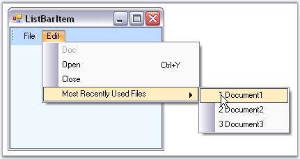{border="0"}

**[]{style="COLOR: #15428b"}** 

Figure 754: Numbered List

**[]{style="COLOR: #15428b"}** 

Behavior Settings

**[]{style="COLOR: #15428b"}** 

ListBarItem supports all the behavior properties of BarItem.

[]{style="COLOR: #15428b"} 

Other Common properties

[]{style="COLOR: #15428b"} 

[For setting images see ]{style="COLOR: #15428b"}Image Settings[; ]{style="COLOR: #15428b"}[]{style="COLOR: #15428b"}

[For Editing the text and setting text alignments, ]{style="COLOR: #15428b"}[see ]{style="COLOR: #15428b"}BarItem Text[; ]{style="COLOR: #15428b"}[]{style="COLOR: #15428b"}

[For setting shortcuts for the bar items, see ]{style="COLOR: #15428b"}Keyboard shortcuts[ and ]{style="COLOR: #15428b"}

[For changing the Paint Style, ]{style="COLOR: #15428b"}[see ]{style="COLOR: #15428b"}PaintStyle[ topic. ]{style="COLOR: #15428b"}

[Appearance of the Text can be customized. See ]{style="COLOR: #15428b"}Foreground Settings[ for details.]{style="COLOR: #15428b"}

[]{style="COLOR: #15428b"} 

See Also

[]{style="COLOR: #15428b"} 

UpdateUIOnAppIdle property in UI Command Update Patterns topic,

[Customize Dialog]()[]{style="COLOR: black"}

[]{#_MDIListBarItem}3.5.4.1.2.2.6      MDIListBarItem

[]{#p865}[]{style="COLOR: #15428b"} 

An **MDIListBarItem** is a ListBarItem that will expand itself to show a list of MDIChild windows in the form, when placed in a ParentBarItem.

[]{style="COLOR: #15428b"} 

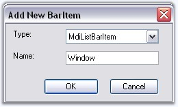{border="0"}

 

Figure 755: Adding MDIListBarItem in the designer using Customize Dialog Box

**[]{style="COLOR: #15428b"}** 

Specify the MDI List Size in **MDIListSize** property.

**[]{style="COLOR: #15428b"}** 

::: {align="center"}
  ---------------------- ------------------------------------------------------------------
  ListBarItem Property   Description
  MDIListSize            Specifies number of child links to be specified.
  UseNumberedList        It specifies whether or not to use numbers in the expanded list.
  ---------------------- ------------------------------------------------------------------
:::

[]{style="COLOR: #15428b"} 

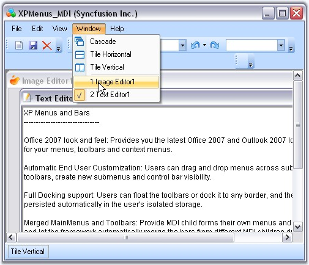{border="0"}

**[]{style="COLOR: #15428b"}** 

Figure 756: MDIListBar item displaying the MDI Children in the Form

**[]{style="COLOR: #15428b"}** 

A sample demonstrating this feature is available in the below sample installation location.

 

..My Documents\\Syncfusion\\EssentialStudio\\***Version Number***\\Windows\\Tools.Windows\\Samples\\2.0\\Menus Package\\XPMenusMDI

**[]{style="COLOR: #15428b"}** 

Behavior Settings

**[]{style="COLOR: #15428b"}** 

DropDownBarItem supports all the behavior properties of BarItem.

[]{style="COLOR: #15428b"} 

Other Common properties

 

[For setting images see ]{style="COLOR: #15428b"}Image Settings[; ]{style="COLOR: #15428b"}[]{style="COLOR: #15428b"}

[For Editing the text and setting text alignments, See ]{style="COLOR: #15428b"}BarItem Text[; ]{style="COLOR: #15428b"}[]{style="COLOR: #15428b"}

[For setting shortcuts for the bar items, see ]{style="COLOR: #15428b"}Keyboard shortcuts[ and ]{style="COLOR: #15428b"}

[For changing the Paint Style, ]{style="COLOR: #15428b"}[see ]{style="COLOR: #15428b"}PaintStyle[ topic. ]{style="COLOR: #15428b"}

[Appearance of the Text can be customized. See ]{style="COLOR: #15428b"}Foreground Settings[ for details.]{style="COLOR: #15428b"}

[]{style="COLOR: #15428b"} 

See Also

[]{style="COLOR: #15428b"} 

UpdateUIOnAppIdle property in UI Command Update Patterns topic,

[[Customize Dialog]{.UGHyperlink}]()[]{.UGHyperlink}

[]{style="COLOR: black"} 

[]{#p866}3.5.4.1.2.2.7      StaticBarItem

[]{style="COLOR: #15428b"} 

A **StaticBarItem** is a BarItem that provides users a label-like behavior to show plain text in the toolbars and menus.

 

The user cannot click or interact with this type of BarItem. It is typically used in the status bar-type toolbar.

[]{style="COLOR: #15428b"} 

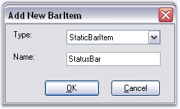{border="0"}

[]{style="COLOR: #15428b"} 

Figure 757: Adding StaticBarItem Through designer using Customize Dialog Box

[]{style="COLOR: #15428b"} 

The text displayed in the status bar can be changed based on the bar items selected. Insert the following code snippet in the \'Selected\' event handler of any bar items whose status is to be known.

[]{style="COLOR: #15428b"} 

+-----------------------------------------------------------------------------------------------------------------------------------------------------------------------------------------------------------------------------+
| **[\[C#\]]{style="FONT-FAMILY: 'Courier New'; COLOR: black"}**                                                                                                                                                              |
|                                                                                                                                                                                                                             |
| []{style="FONT-FAMILY: 'Courier New'; COLOR: black"}                                                                                                                                                                        |
|                                                                                                                                                                                                                             |
| [private]{style="FONT-FAMILY: 'Courier New'; COLOR: blue"}[ [void]{style="COLOR: blue"} Item_Selected([object]{style="COLOR: blue"} sender, System.[EventArgs]{style="COLOR: teal"} e)]{style="FONT-FAMILY: 'Courier New'"} |
|                                                                                                                                                                                                                             |
| [{]{style="FONT-FAMILY: 'Courier New'"}                                                                                                                                                                                     |
|                                                                                                                                                                                                                             |
| [BarItem]{style="FONT-FAMILY: 'Courier New'; COLOR: teal"}[ item = sender [as]{style="COLOR: blue"} [BarItem]{style="COLOR: teal"};]{style="FONT-FAMILY: 'Courier New'"}                                                    |
|                                                                                                                                                                                                                             |
| [this]{style="FONT-FAMILY: 'Courier New'; COLOR: blue"}[.staticBarItem1.Text = item.Text;]{style="FONT-FAMILY: 'Courier New'"}                                                                                              |
|                                                                                                                                                                                                                             |
| [}]{style="FONT-FAMILY: 'Courier New'"}                                                                                                                                                                                     |
+-----------------------------------------------------------------------------------------------------------------------------------------------------------------------------------------------------------------------------+

[]{style="COLOR: #15428b"} 

+-------------------------------------------------------------------------------------------------------------------------------------------------------------------------------------------------------------------------------------------------------------------------------------------------------------------+
| **[\[VB.NET\]]{style="FONT-FAMILY: 'Courier New'; COLOR: black"}**                                                                                                                                                                                                                                                |
|                                                                                                                                                                                                                                                                                                                   |
| []{style="FONT-FAMILY: 'Courier New'; COLOR: black"}                                                                                                                                                                                                                                                              |
|                                                                                                                                                                                                                                                                                                                   |
| [Private]{style="FONT-FAMILY: 'Courier New'; COLOR: blue"}[ [Sub]{style="COLOR: blue"} Item_Selected([ByVal]{style="COLOR: blue"} sender [As]{style="COLOR: blue"} [Object]{style="COLOR: blue"}, [ByVal]{style="COLOR: blue"} e [As]{style="COLOR: blue"} System.EventArgs)]{style="FONT-FAMILY: 'Courier New'"} |
|                                                                                                                                                                                                                                                                                                                   |
| [    [Dim]{style="COLOR: blue"} item [As]{style="COLOR: blue"} BarItem = [CType]{style="COLOR: blue"}(IIf([TypeOf]{style="COLOR: blue"} sender [Is]{style="COLOR: blue"} BarItem, sender, [Nothing]{style="COLOR: blue"}), BarItem)]{style="FONT-FAMILY: 'Courier New'"}                                          |
|                                                                                                                                                                                                                                                                                                                   |
| [    [Me]{style="COLOR: blue"}.staticBarItem1.Text = item.Text]{style="FONT-FAMILY: 'Courier New'"}                                                                                                                                                                                                               |
|                                                                                                                                                                                                                                                                                                                   |
| [End]{style="FONT-FAMILY: 'Courier New'; COLOR: blue"}[ [Sub]{style="COLOR: blue"}]{style="FONT-FAMILY: 'Courier New'"}                                                                                                                                                                                           |
+-------------------------------------------------------------------------------------------------------------------------------------------------------------------------------------------------------------------------------------------------------------------------------------------------------------------+

[]{style="COLOR: #15428b"} 

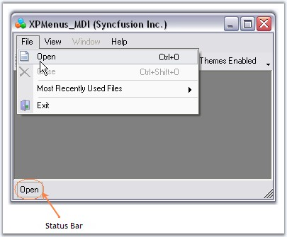{border="0"}

[]{style="COLOR: #15428b"} 

Figure 758: StatusBar displaying the bar item that is Selected

[]{style="COLOR: #15428b"} 

Behavior Settings

[]{style="COLOR: #15428b"} 

::: {align="center"}
+-----------------------------------+---------------------------------------------------------------------------------------------------------------------------------------------------------+
| ParentBarItem Property            | Description                                                                                                                                             |
+-----------------------------------+---------------------------------------------------------------------------------------------------------------------------------------------------------+
| FlatBorderColor                   | Sets border color for the StaticBarItem.                                                                                                                |
+-----------------------------------+---------------------------------------------------------------------------------------------------------------------------------------------------------+
| IsRecentlyUsedItem                | Indicates whether this item will appear in its parent\'s partial menus list. Partial Menus is discussed in [ParentBarItem]{style="COLOR: black"} topic. |
+-----------------------------------+---------------------------------------------------------------------------------------------------------------------------------------------------------+
| Visible                           | Sets the visibility of the bar item.                                                                                                                    |
+-----------------------------------+---------------------------------------------------------------------------------------------------------------------------------------------------------+
| MergeOrder                        | Relative Position of the bar item when it is merged with another.                                                                                       |
+-----------------------------------+---------------------------------------------------------------------------------------------------------------------------------------------------------+
| MergeType                         | Sets behavior of the bar item when its bar is merged with another. The options are,                                                                     |
|                                   |                                                                                                                                                         |
|                                   |                                                                                                                                                         |
|                                   |                                                                                                                                                         |
|                                   | *Add* - Adds to the existing menu items. (Default)                                                                                                      |
|                                   |                                                                                                                                                         |
|                                   | *Replace* - Replaces an existing menu items at the same position in a merged menu.                                                                      |
|                                   |                                                                                                                                                         |
|                                   | *MergeItems* - Merged with an existing menu items at the same position in a merged menu.                                                                |
|                                   |                                                                                                                                                         |
|                                   | *Remove* - Menu item will not be included in the merged menu.                                                                                           |
+-----------------------------------+---------------------------------------------------------------------------------------------------------------------------------------------------------+
| Customizable                      | Specifies whether the bar item is involved in the customization.                                                                                        |
+-----------------------------------+---------------------------------------------------------------------------------------------------------------------------------------------------------+
| Padding                           | Gets or sets padding for items.                                                                                                                         |
+-----------------------------------+---------------------------------------------------------------------------------------------------------------------------------------------------------+
| ShowMnemonicUnderlinesAlways      | It indicates whether to show underlines with mnemonic always.                                                                                           |
+-----------------------------------+---------------------------------------------------------------------------------------------------------------------------------------------------------+
:::

[]{style="COLOR: #15428b"} 

Other Common properties

**[]{style="COLOR: #4a5c8c"}** 

[For setting images see ]{style="COLOR: #15428b"}Image Settings[; ]{style="COLOR: #15428b"}[]{style="COLOR: #15428b"}

[For Editing the text and setting text alignments, See ]{style="COLOR: #15428b"}BarItem Text[; ]{style="COLOR: #15428b"}[]{style="COLOR: #15428b"}

[For changing the Paint Style, ]{style="COLOR: #15428b"}[see ]{style="COLOR: #15428b"}PaintStyle[ topic. ]{style="COLOR: #15428b"}

[Appearance of the Text can be customized. See ]{style="COLOR: #15428b"}Foreground Settings[ for details.]{style="COLOR: #15428b"}

[]{style="COLOR: #15428b"} 

See Also

[]{style="COLOR: #15428b"} 

UpdateUIOnAppIdle property in UI Command Update Patterns topic,

[[Customize Dialog]{.UGHyperlink}]()[]{.UGHyperlink}

[]{#p867}[]{#_ToolBarListBarItem}3.5.4.1.2.2.8      ToolBarListBarItem

[]{style="COLOR: #15428b"} 

A **ToolbarListBarItem** is a ListBarItem that expands during runtime to automatically show the list of toolbars currently used in the application. The user can click on this list to show / hide the toolbars. A ToolBarListBarItem can be added to a ParentBarItem by a simple drag-and-drop similar to other bar items.

[]{style="COLOR: #15428b"} 

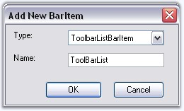{border="0"}

**[]{style="COLOR: #15428b"}** 

Figure 759: Adding ToolbarListBarItem through the designer by using Customize Dialog Box

**[]{style="COLOR: #15428b"}** 

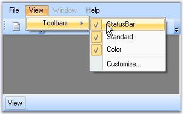{border="0"}

***[]{style="COLOR: #15428b"}*** 

Figure 760: ToolbarListBarItems Displayed

[]{style="COLOR: #15428b"} 

Behavior Settings

**[]{style="COLOR: #15428b"}** 

DropDownBarItem supports all the behavior properties of BarItem.

**[]{style="COLOR: #15428b"}** 

Other Common properties

**[]{style="COLOR: #4a5c8c"}** 

For setting images see [Image Settings]{style="COLOR: windowtext; TEXT-DECORATION: none; text-underline: none"};

For Editing the text and setting text alignments, see [BarItem Text]{style="COLOR: windowtext; TEXT-DECORATION: none; text-underline: none"};

For setting shortcuts for the bar items, see [Keyboard shortcuts]{style="COLOR: windowtext; TEXT-DECORATION: none; text-underline: none"} and

For changing the Paint Style, see [PaintStyle]{style="COLOR: windowtext; TEXT-DECORATION: none; text-underline: none"} topic.

Appearance of the Text can be customized. See [Foreground Settings]{style="COLOR: windowtext; TEXT-DECORATION: none; text-underline: none"} for details.

[]{style="COLOR: #15428b"} 

See Also

[]{style="COLOR: #15428b"} 

[UI Command Update Patterns]{.UGHyperlink}[,]{.UGHyperlink}

[[Customize Dialog]{.UGHyperlink}]()[]{.UGHyperlink}

[]{style="COLOR: black"} 

3.5.4.1.2.2.9      TextBoxBarItem

[]{#p868}[]{style="COLOR: #15428b"} 

A TextBoxBarItem behaves like a normal windows textbox. It lets the end users to enter text in the text area at run time. You can also specify the text in **TextBoxValue** property. A TextBoxBarItem can be added to a ParentBarItem by a simple drag and drop similar to other bar items. Width of the TextBoxBarItem can be controlled using **MinWidth** property.

[]{style="COLOR: #15428b"} 

::: {style="BORDER-BOTTOM: windowtext 1pt solid; BORDER-LEFT: medium none; PADDING-BOTTOM: 1pt; MARGIN-TOP: 9pt; PADDING-LEFT: 0pt; PADDING-RIGHT: 0pt; MARGIN-BOTTOM: 9pt; BORDER-TOP: windowtext 1pt solid; BORDER-RIGHT: medium none; PADDING-TOP: 1pt"}
{border="0"} Note: Paint Style should be \"ImageAndText\" for the TextBoxBarItem to display TextBoxBarItem.Text.
:::

[]{style="COLOR: #15428b"} 

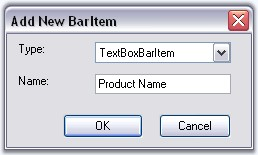{border="0"}

[]{style="COLOR: #15428b"} 

Figure 761: Adding TextBoxBarItems

[]{style="COLOR: #15428b"} 

+-------------------------------------------------------------------------------------------------------------------------------------------------------------------------------------------------------------------+
| **[\[C#\]]{style="FONT-FAMILY: 'Courier New'; COLOR: black"}**                                                                                                                                                    |
|                                                                                                                                                                                                                   |
| []{style="FONT-FAMILY: 'Courier New'; COLOR: black"}                                                                                                                                                              |
|                                                                                                                                                                                                                   |
| [this]{style="FONT-FAMILY: 'Courier New'; COLOR: blue"}[.textBoxBarItem1.MinWidth = 100;]{style="FONT-FAMILY: 'Courier New'"}                                                                                     |
|                                                                                                                                                                                                                   |
| [this]{style="FONT-FAMILY: 'Courier New'; COLOR: blue"}[.textBoxBarItem1.PaintStyle = Syncfusion.Windows.Forms.Tools.XPMenus.[PaintStyle]{style="COLOR: teal"}.ImageAndText;]{style="FONT-FAMILY: 'Courier New'"} |
|                                                                                                                                                                                                                   |
| [this]{style="FONT-FAMILY: 'Courier New'; COLOR: blue"}[.textBoxBarItem1.Text = [\"Product Name\"]{style="COLOR: maroon"};]{style="FONT-FAMILY: 'Courier New'"}                                                   |
|                                                                                                                                                                                                                   |
| [this]{style="FONT-FAMILY: 'Courier New'; COLOR: blue"}[.textBoxBarItem1.TextBoxValue = [\"Essential Chart\"]{style="COLOR: maroon"};]{style="FONT-FAMILY: 'Courier New'"}                                        |
+-------------------------------------------------------------------------------------------------------------------------------------------------------------------------------------------------------------------+

[]{style="COLOR: #15428b"} 

+-----------------------------------------------------------------------------------------------------------------------------------------------------------------------------------------------------------------+
| **[\[VB.NET\]]{style="FONT-FAMILY: 'Courier New'; COLOR: black"}**                                                                                                                                              |
|                                                                                                                                                                                                                 |
| []{style="FONT-FAMILY: 'Courier New'; COLOR: black"}                                                                                                                                                            |
|                                                                                                                                                                                                                 |
| [Me]{style="FONT-FAMILY: 'Courier New'; COLOR: blue"}[.textBoxBarItem1.MinWidth = 100;]{style="FONT-FAMILY: 'Courier New'"}                                                                                     |
|                                                                                                                                                                                                                 |
| [Me]{style="FONT-FAMILY: 'Courier New'; COLOR: blue"}[.textBoxBarItem1.PaintStyle = Syncfusion.Windows.Forms.Tools.XPMenus.[PaintStyle]{style="COLOR: teal"}.ImageAndText;]{style="FONT-FAMILY: 'Courier New'"} |
|                                                                                                                                                                                                                 |
| [Me]{style="FONT-FAMILY: 'Courier New'; COLOR: blue"}[.textBoxBarItem1.Text = [\"Product Name\"]{style="COLOR: maroon"};]{style="FONT-FAMILY: 'Courier New'"}                                                   |
|                                                                                                                                                                                                                 |
| [Me]{style="FONT-FAMILY: 'Courier New'; COLOR: blue"}[.textBoxBarItem1.TextBoxValue = [\"Essential Chart\"]{style="COLOR: maroon"};]{style="FONT-FAMILY: 'Courier New'"}                                        |
+-----------------------------------------------------------------------------------------------------------------------------------------------------------------------------------------------------------------+

[]{style="COLOR: #15428b"} 

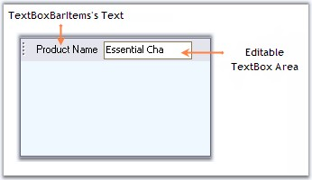{border="0"}

***[]{style="COLOR: #15428b"}*** 

Figure 762: TextBoxBarItem

[]{style="COLOR: #15428b"} 

Behavior Settings

**[]{style="COLOR: #15428b"}** 

DropDownBarItem supports all the behavior properties of BarItem.

[]{style="COLOR: #15428b"} 

Other Common properties

**[]{style="COLOR: #15428b"}** 

[For setting images see ]{style="COLOR: #15428b"}Image Settings[; ]{style="COLOR: #15428b"}[]{style="COLOR: #15428b"}

[For Editing the text and setting text alignments, See ]{style="COLOR: #15428b"}BarItem Text[; ]{style="COLOR: #15428b"}[]{style="COLOR: #15428b"}

[For setting shortcuts for the bar items, see ]{style="COLOR: #15428b"}Keyboard shortcuts[ and ]{style="COLOR: #15428b"}

[For changing the Paint Style, ]{style="COLOR: #15428b"}[see ]{style="COLOR: #15428b"}PaintStyle[ topic. ]{style="COLOR: #15428b"}

[Appearance of the Text can be customized. See ]{style="COLOR: #15428b"}Foreground Settings[ for details.]{style="COLOR: #15428b"}

[We can set banner text for the TextBoxBarItem. Refer ]{style="COLOR: #15428b"}[BannerTextProvider Component](../../../../../../../../Documents%20and%20Settings/sindhujamj/Desktop/D2H/ui/windows/tools/Documents/Tools%20-%20Part%202.docx#BannerTextProviderComponent)[ topic for more details.]{style="COLOR: #15428b"}

[]{style="COLOR: #15428b"} 

See Also

[]{style="COLOR: #15428b"} 

UpdateUIOnAppIdle property in UI Command Update Patterns topic,

[Customize Dialog]()[]{style="COLOR: black"}

###### []{#p869}[]{#_Customization_Options}3.5.4.1.2.3 Customization Options {#customization-options style="tab-stops: 0pt"}

 

[]{#p870}This section discusses the behavior settings common to all types of BarItem.

[]{style="COLOR: #15428b"} 

[]{style="COLOR: #15428b"} 

See Also

[]{style="COLOR: #15428b"} 

[[Types of Bar Items]{.UGHyperlink}]()[]{.UGHyperlink}

[]{#_Paint_Style}3.5.4.1.2.3.1      Paint Style

[]{style="COLOR: #15428b"} 

The MenuItem can be displayed as a TextOnly, ImageOnly or Image and Text using **PaintStyle** property.

[]{style="COLOR: #15428b"} 

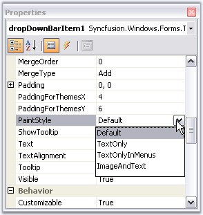{border="0"}

[]{style="COLOR: #15428b"} 

Figure 763: PaintStyle property Options

[]{style="COLOR: #15428b"} 

::: {align="center"}
+-----------------------------------+------------------------------------------------------------------------------------------------------------------------------------------------------------------------------+
| BarItem Property                  | Description                                                                                                                                                                  |
+-----------------------------------+------------------------------------------------------------------------------------------------------------------------------------------------------------------------------+
| PaintStyle                        | Indicates the painting style of the bar item.                                                                                                                                |
|                                   |                                                                                                                                                                              |
|                                   |                                                                                                                                                                              |
|                                   |                                                                                                                                                                              |
|                                   | *Default* - Displays the style of it parents. In case of MainMenu, only text will be drawn, in other toolbars only image and in Dropdown menu, image and text will be drawn. |
|                                   |                                                                                                                                                                              |
|                                   | *TextOnly* - Displays only Text.                                                                                                                                             |
|                                   |                                                                                                                                                                              |
|                                   | *TextOnlyInMenus* - Image will be ignored when the BarItem is in a drop down menu.                                                                                           |
|                                   |                                                                                                                                                                              |
|                                   | *ImageAndText* - Both Image and Text will be drawn.                                                                                                                          |
+-----------------------------------+------------------------------------------------------------------------------------------------------------------------------------------------------------------------------+
:::

**[]{style="COLOR: #15428b"}** 

+---------------------------------------------------------------------------------------------------------------------------------------------------------------------+
| **[\[C#\]]{style="FONT-FAMILY: 'Courier New'; COLOR: black"}**                                                                                                      |
|                                                                                                                                                                     |
| [   ]{style="FONT-FAMILY: 'Courier New'"}                                                                                                                           |
|                                                                                                                                                                     |
| [this]{style="FONT-FAMILY: 'Courier New'; COLOR: blue"}[.barItem4.PaintStyle = [PaintStyle]{style="COLOR: teal"}.ImageAndText;]{style="FONT-FAMILY: 'Courier New'"} |
+---------------------------------------------------------------------------------------------------------------------------------------------------------------------+

[]{style="COLOR: #15428b"} 

+-------------------------------------------------------------------------------------------------------------------------------------------+
| **[\[VB.NET\]]{style="FONT-FAMILY: 'Courier New'; COLOR: black"}**                                                                        |
|                                                                                                                                           |
| []{style="FONT-FAMILY: 'Courier New'"}                                                                                                    |
|                                                                                                                                           |
| [Me]{style="FONT-FAMILY: 'Courier New'; COLOR: blue"}[.barItem4.PaintStyle = PaintStyle.ImageAndText]{style="FONT-FAMILY: 'Courier New'"} |
+-------------------------------------------------------------------------------------------------------------------------------------------+

[]{style="COLOR: #15428b"} 

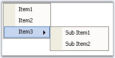{border="0"}

[]{style="COLOR: #15428b"} 

Figure 764: PaintStyle = \"Text\"

[]{style="COLOR: #15428b"} 

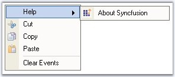{border="0"}

**[]{style="COLOR: #15428b"}** 

Figure 765: PaintStyle = \"ImageAndText\"

**[]{style="COLOR: #15428b"}** 

See Also

[]{style="COLOR: #15428b"} 

[[Types of Bar Items]{.UGHyperlink}]()[]{.UGHyperlink}

[]{#p871}[]{#_Keyboard_Shortcut}3.5.4.1.2.3.2      Keyboard Shortcut

[]{style="COLOR: #15428b"} 

Keyboard support can be assigned for each BarItem using **BarItem.Shortcut** property of the particular bar item. A customized text can be specified in the place of shortcut key using **ShortcutText** property.

[]{style="COLOR: #15428b"} 

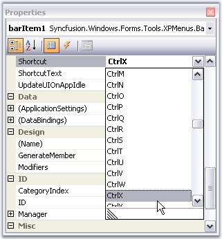{border="0"}

**[]{style="COLOR: #15428b"}** 

Figure 766: Property Grid Displaying ShortCut with options and ShortcutText

 

+----------------------------------------------------------------------------------------------------------------------------------------------------------------------+
| **[\[C#\]]{style="FONT-FAMILY: 'Courier New'; COLOR: black"}**                                                                                                       |
|                                                                                                                                                                      |
| **[]{style="FONT-FAMILY: 'Courier New'; COLOR: black"}**                                                                                                             |
|                                                                                                                                                                      |
| [this]{style="FONT-FAMILY: 'Courier New'; COLOR: blue"}[.barItem4.Shortcut=System.Windows.Forms.Shortcut.CtrlX;]{style="FONT-FAMILY: 'Courier New'"}                 |
|                                                                                                                                                                      |
| [this]{style="FONT-FAMILY: 'Courier New'; COLOR: blue"}[.dropDownBarItem2.ShortcutText = [\"Cut\"]{style="COLOR: maroon"};     ]{style="FONT-FAMILY: 'Courier New'"} |
+----------------------------------------------------------------------------------------------------------------------------------------------------------------------+

[]{style="COLOR: #15428b"} 

+-----------------------------------------------------------------------------------------------------------------------------------------------------------------+
| **[\[VB.NET\]]{style="FONT-FAMILY: 'Courier New'; COLOR: black"}**                                                                                              |
|                                                                                                                                                                 |
| **[]{style="FONT-FAMILY: 'Courier New'; COLOR: black"}**                                                                                                        |
|                                                                                                                                                                 |
| [Me]{style="FONT-FAMILY: 'Courier New'; COLOR: blue"}[.barItem4.Shortcut=System.Windows.Forms.Shortcut.CtrlX]{style="FONT-FAMILY: 'Courier New'"}               |
|                                                                                                                                                                 |
| [this]{style="FONT-FAMILY: 'Courier New'; COLOR: blue"}[.dropDownBarItem2.ShortcutText = [\"Cut\"]{style="COLOR: maroon"};]{style="FONT-FAMILY: 'Courier New'"} |
+-----------------------------------------------------------------------------------------------------------------------------------------------------------------+

[]{style="COLOR: #15428b"} 

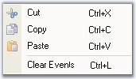{border="0"}

[]{style="COLOR: #15428b"} 

Figure 767: BarItem with Keyboard Shortcut

**[]{style="COLOR: #15428b"}** 

See Also

[]{style="COLOR: #15428b"} 

[[Types of Bar Items]{.UGHyperlink}]()[]{.UGHyperlink}

[]{style="COLOR: black"} 

[]{#p872}3.5.4.1.2.3.3      Image Settings

[]{style="COLOR: #15428b"} 

The properties which let you set images for the menu items are as follows.

[]{style="COLOR: #15428b"} 

::: {align="center"}
  ------------------ ------------------------------------------
  BarItem Property   Description
  Image              Default image displayed in the bar item.
  ImageIndex         Image index of the image.
  ImageList          Indicates the ImageList.
  ------------------ ------------------------------------------
:::

[]{style="COLOR: #15428b"} 

By selecting the imagelist using **Imagelist** property and choosing the index of the image through **ImageIndex** property, we can display images. The images can also be directly set by using the **Image** property.

[]{style="COLOR: #15428b"} 

+--------------------------------------------------------------------------------------------------------------------------------------------------------------------------------------------------------------------------------------------------------------+
| **[\[C#\]]{style="FONT-FAMILY: 'Courier New'; COLOR: black"}**                                                                                                                                                                                               |
|                                                                                                                                                                                                                                                              |
| **[]{style="FONT-FAMILY: 'Courier New'; COLOR: black"}**                                                                                                                                                                                                     |
|                                                                                                                                                                                                                                                              |
| [this]{style="FONT-FAMILY: 'Courier New'; COLOR: blue"}[.barItem2.Image = ((Syncfusion.Windows.Forms.Tools.XPMenus.[ImageExt]{style="COLOR: teal"})(resources.GetObject([\"barItem2.Image\"]{style="COLOR: maroon"})));]{style="FONT-FAMILY: 'Courier New'"} |
|                                                                                                                                                                                                                                                              |
| []{style="FONT-FAMILY: 'Courier New'"}                                                                                                                                                                                                                       |
|                                                                                                                                                                                                                                                              |
| [this]{style="FONT-FAMILY: 'Courier New'; COLOR: blue"}[.barItem2.ImageList = [this]{style="COLOR: blue"}.imageList1;]{style="FONT-FAMILY: 'Courier New'"}                                                                                                   |
|                                                                                                                                                                                                                                                              |
| [this]{style="FONT-FAMILY: 'Courier New'; COLOR: blue"}[.barItem2.ImageIndex = 2;]{style="FONT-FAMILY: 'Courier New'"}                                                                                                                                       |
+--------------------------------------------------------------------------------------------------------------------------------------------------------------------------------------------------------------------------------------------------------------+

[]{style="COLOR: #15428b"} 

+---------------------------------------------------------------------------------------------------------------------------------------------------------------------------------------------------------------------------------------------------------------------+
| **[\[VB.NET\]]{style="FONT-FAMILY: 'Courier New'; COLOR: black"}**                                                                                                                                                                                                  |
|                                                                                                                                                                                                                                                                     |
| **[]{style="FONT-FAMILY: 'Courier New'; COLOR: black"}**                                                                                                                                                                                                            |
|                                                                                                                                                                                                                                                                     |
| [Me]{style="FONT-FAMILY: 'Courier New'; COLOR: blue"}[.barItem2.Image = [DirectCast]{style="COLOR: blue"}((resources.GetObject([\"barItem2.Image\"]{style="COLOR: maroon"})), Syncfusion.Windows.Forms.Tools.XPMenus.ImageExt)]{style="FONT-FAMILY: 'Courier New'"} |
|                                                                                                                                                                                                                                                                     |
| []{style="FONT-FAMILY: 'Courier New'"}                                                                                                                                                                                                                              |
|                                                                                                                                                                                                                                                                     |
| [this]{style="FONT-FAMILY: 'Courier New'; COLOR: blue"}[.barItem2.ImageList = [this]{style="COLOR: blue"}.imageList1;]{style="FONT-FAMILY: 'Courier New'"}                                                                                                          |
|                                                                                                                                                                                                                                                                     |
| [this]{style="FONT-FAMILY: 'Courier New'; COLOR: blue"}[.barItem2.ImageIndex = 2;]{style="FONT-FAMILY: 'Courier New'"}                                                                                                                                              |
+---------------------------------------------------------------------------------------------------------------------------------------------------------------------------------------------------------------------------------------------------------------------+

[]{style="COLOR: #15428b"} 

Images for Highlighted and Disabled Menu Items

[]{style="COLOR: #15428b"} 

A BarItem can be enabled or disabled **Enabled** property. Images for disabled (Enabled - False) or enabled (Enabled - True) bar items can be specified in **DisabledImage** or **HighlightedImage** properties.

**[]{style="COLOR: #15428b"}** 

**DisabledImageList, DisabledImageIndex** or **HighlightedImageList, HighlightedImageIndex** properties can also be used instead.

[]{style="COLOR: #15428b"} 

::: {align="center"}
  --------------------------- -------------------------------------------------------------------------------
  BarItem Property            Description
  DisabledImage               Sets image for disabled bar item, when Enabled = false.
  DisabledImageList           ImageList for the disabled bar items.
  DisabledImageIndex          ImageIndex for the disabled bar item.
  DisabledLargeImageList      ImageList for the disabled bar item when BarManager is in LargeIcons mode.
  HighlightedImage            Sets image for highlighted bar item, the bar item is enabled.
  HighlightedImageList        ImageList for the highlighted bar item.
  HighlightedImageIndex       ImageIndex for the highlighted bar item.
  HighlightedLargeImageList   ImageList for the highlighted bar item when BarManager is in LargeIcons mode.
  --------------------------- -------------------------------------------------------------------------------
:::

[]{style="COLOR: #15428b"} 

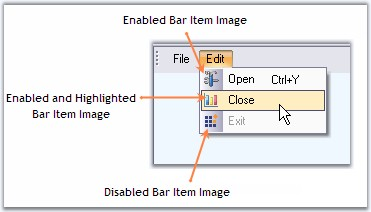{border="0"}

[]{style="COLOR: #15428b"} 

Figure 768: Enabled, Highlighted and Disabled BarItems with Images

**[]{style="COLOR: #15428b"}** 

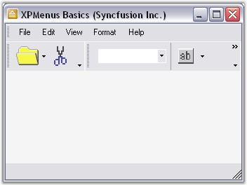{border="0"}

[]{style="COLOR: #15428b"} 

Figure 769: Menus with Large Icons

*[]{style="COLOR: #15428b"}* 

Setting images for bar items when it is pressed

[]{style="COLOR: #15428b"} 

You can set the image for the bar item when it is pressed. You need to associate the corresponding ImageList to the **PressedImageList** property of bar item and you can set the image index using **PressedImageIndex** property. Similarly you can associate ImageListAdv with **PressedImageListAdv** property.

[]{style="COLOR: #15428b"} 

::: {style="BORDER-BOTTOM: windowtext 1pt solid; BORDER-LEFT: medium none; PADDING-BOTTOM: 1pt; MARGIN-TOP: 9pt; PADDING-LEFT: 0pt; PADDING-RIGHT: 0pt; MARGIN-BOTTOM: 9pt; BORDER-TOP: windowtext 1pt solid; BORDER-RIGHT: medium none; PADDING-TOP: 1pt"}
{border="0"} Note: It is required to set image to Baritem before it is pressed.
:::

[]{style="COLOR: #15428b"} 

+-------------------------------------------------------------------------------------------------------------------------------------------------------------------------+
| **[\[C#\]]{style="FONT-FAMILY: 'Courier New'; COLOR: black"}**                                                                                                          |
|                                                                                                                                                                         |
| **[]{style="FONT-FAMILY: 'Courier New'; COLOR: black"}**                                                                                                                |
|                                                                                                                                                                         |
| [this]{style="FONT-FAMILY: 'Courier New'; COLOR: blue"}[.barItem1.Image = image;]{style="FONT-FAMILY: 'Courier New'"}                                                   |
|                                                                                                                                                                         |
| []{style="FONT-FAMILY: 'Courier New'"}                                                                                                                                  |
|                                                                                                                                                                         |
| [this]{style="FONT-FAMILY: 'Courier New'; COLOR: blue"}[.barItem1.PressedImageIndex = 0;]{style="FONT-FAMILY: 'Courier New'"}                                           |
|                                                                                                                                                                         |
| []{style="FONT-FAMILY: 'Courier New'"}                                                                                                                                  |
|                                                                                                                                                                         |
| [this]{style="FONT-FAMILY: 'Courier New'; COLOR: blue"}[.barItem1.PressedImageListAdv = [this]{style="COLOR: blue"}.imageListAdv1;]{style="FONT-FAMILY: 'Courier New'"} |
+-------------------------------------------------------------------------------------------------------------------------------------------------------------------------+

[]{style="COLOR: #15428b"} 

+--------------------------------------------------------------------------------------------------------------------------------------------------------------------+
| **[\[VB.NET\]]{style="FONT-FAMILY: 'Courier New'; COLOR: black"}**                                                                                                 |
|                                                                                                                                                                    |
| **[]{style="FONT-FAMILY: 'Courier New'; COLOR: black"}**                                                                                                           |
|                                                                                                                                                                    |
| [Me]{style="FONT-FAMILY: 'Courier New'; COLOR: blue"}[.barItem1.Image = image]{style="FONT-FAMILY: 'Courier New'"}                                                 |
|                                                                                                                                                                    |
| []{style="FONT-FAMILY: 'Courier New'"}                                                                                                                             |
|                                                                                                                                                                    |
| [Me]{style="FONT-FAMILY: 'Courier New'; COLOR: blue"}[.barItem1.PressedImageIndex = 0]{style="FONT-FAMILY: 'Courier New'"}                                         |
|                                                                                                                                                                    |
| []{style="FONT-FAMILY: 'Courier New'"}                                                                                                                             |
|                                                                                                                                                                    |
| [Me]{style="FONT-FAMILY: 'Courier New'; COLOR: blue"}[.barItem1.PressedImageListAdv = [Me]{style="COLOR: blue"}.imageListAdv1]{style="FONT-FAMILY: 'Courier New'"} |
+--------------------------------------------------------------------------------------------------------------------------------------------------------------------+

[]{style="COLOR: #15428b"} 

See Also

[]{style="COLOR: #15428b"} 

[[Types of Bar Items]{.UGHyperlink}]()[]{.UGHyperlink}

[[]{style="TEXT-DECORATION: none"}]{.UGHyperlink} 

[]{#p873}[]{#_BarItem_Text}3.5.4.1.2.3.4      BarItem Text

[]{style="COLOR: #15428b"} 

Text for a bar item can be edited through **Text** property. Alignment of text can be specified in **TextAlignment** property.

[]{style="COLOR: #15428b"} 

::: {align="center"}
+-----------------------------------+---------------------------------------+
| ParentBarItem Property            | Description                           |
+-----------------------------------+---------------------------------------+
| Text                              | Sets text for the Bar item.           |
+-----------------------------------+---------------------------------------+
| TextAlignment                     | Sets the text alignment. Options are, |
|                                   |                                       |
|                                   |                                       |
|                                   |                                       |
|                                   | *Near, (Default)*                     |
|                                   |                                       |
|                                   | *Far,*                                |
|                                   |                                       |
|                                   | *Center*                              |
+-----------------------------------+---------------------------------------+
:::

**[]{style="COLOR: #15428b"}** 

+------------------------------------------------------------------------------------------------------------------------------------------------------------------------------------------------------------+
| **[\[C#\]]{style="FONT-FAMILY: 'Courier New'; COLOR: black"}**                                                                                                                                             |
|                                                                                                                                                                                                            |
| **[]{style="FONT-FAMILY: 'Courier New'; COLOR: black"}**                                                                                                                                                   |
|                                                                                                                                                                                                            |
| [this]{style="FONT-FAMILY: 'Courier New'; COLOR: blue"}[.barItem2.Text = [\"Center\"]{style="COLOR: maroon"};]{style="FONT-FAMILY: 'Courier New'"}                                                         |
|                                                                                                                                                                                                            |
| [this]{style="FONT-FAMILY: 'Courier New'; COLOR: blue"}[.barItem2.TextAlignment = Syncfusion.Windows.Forms.Tools.XPMenus.[TextAlignment]{style="COLOR: teal"}.Center;]{style="FONT-FAMILY: 'Courier New'"} |
+------------------------------------------------------------------------------------------------------------------------------------------------------------------------------------------------------------+

[]{style="COLOR: #15428b"} 

+----------------------------------------------------------------------------------------------------------------------------------------------------------------------------------------------------------+
| **[\[VB.NET\]]{style="FONT-FAMILY: 'Courier New'; COLOR: black"}**                                                                                                                                       |
|                                                                                                                                                                                                          |
| **[]{style="FONT-FAMILY: 'Courier New'; COLOR: black"}**                                                                                                                                                 |
|                                                                                                                                                                                                          |
| [Me]{style="FONT-FAMILY: 'Courier New'; COLOR: blue"}[.barItem2.Text = [\"Center\"]{style="COLOR: maroon"}]{style="FONT-FAMILY: 'Courier New'"}                                                          |
|                                                                                                                                                                                                          |
| [Me]{style="FONT-FAMILY: 'Courier New'; COLOR: blue"}[.barItem2.TextAlignment = Syncfusion.Windows.Forms.Tools.XPMenus.[TextAlignment]{style="COLOR: black"}.Center]{style="FONT-FAMILY: 'Courier New'"} |
+----------------------------------------------------------------------------------------------------------------------------------------------------------------------------------------------------------+

[]{style="COLOR: #15428b"} 

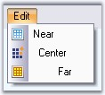{border="0"}

 

Figure 770: Text & Text Alignment Property

**[]{style="COLOR: #15428b"}** 

::: {style="BORDER-BOTTOM: windowtext 1pt solid; BORDER-LEFT: medium none; PADDING-BOTTOM: 1pt; MARGIN-TOP: 9pt; PADDING-LEFT: 0pt; PADDING-RIGHT: 0pt; MARGIN-BOTTOM: 9pt; BORDER-TOP: windowtext 1pt solid; BORDER-RIGHT: medium none; PADDING-TOP: 1pt"}
{border="0"} Note: We can also change the text color for the Baritems using MenuColors.SelTextColor property.
:::

**[]{style="COLOR: #15428b"}** 

See Also

[]{style="COLOR: #15428b"} 

[[Types of Bar Items]{.UGHyperlink}]()[]{.UGHyperlink}

[]{style="COLOR: black"} 

3.5.4.1.2.3.5      Foreground Settings

[]{#p874}[]{style="COLOR: #15428b"} 

Foreground of the bar item text can be controlled using the below properties.

**[]{style="COLOR: #15428b"}** 

::: {align="center"}
  ------------------------- ---------------------------------------
  BarItem Property          Description
  CustomActiveTextColor     Sets the text color in active mode.
  CustomDisabledTextColor   Sets the text color in disabled mode.
  CustomNormalTextColor     Sets the text color in normal mode.
  CustomTextFont            Sets the text font.
  ------------------------- ---------------------------------------
:::

**[]{style="COLOR: #15428b"}** 

+-----------------------------------------------------------------------------------------------------------------------------------------------------------------------------------------------------------------------------------------------------------------------------------------------------+
| **[\[C#\]]{style="FONT-FAMILY: 'Courier New'; COLOR: black"}**                                                                                                                                                                                                                                      |
|                                                                                                                                                                                                                                                                                                     |
| **[]{style="FONT-FAMILY: 'Courier New'; COLOR: black"}**                                                                                                                                                                                                                                            |
|                                                                                                                                                                                                                                                                                                     |
| [this]{style="FONT-FAMILY: 'Courier New'; COLOR: blue"}[.barItem4.CustomActiveTextColor = System.Drawing.[Color]{style="COLOR: teal"}.OrangeRed;]{style="FONT-FAMILY: 'Courier New'"}                                                                                                               |
|                                                                                                                                                                                                                                                                                                     |
| [this]{style="FONT-FAMILY: 'Courier New'; COLOR: blue"}[.barItem5.CustomDisabledTextColor = System.Drawing.[Color]{style="COLOR: teal"}.DeepSkyBlue;]{style="FONT-FAMILY: 'Courier New'"}                                                                                                           |
|                                                                                                                                                                                                                                                                                                     |
| [this]{style="FONT-FAMILY: 'Courier New'; COLOR: blue"}[.barItem6.CustomNormalTextColor = System.Drawing.[Color]{style="COLOR: teal"}.Magenta;]{style="FONT-FAMILY: 'Courier New'"}                                                                                                                 |
|                                                                                                                                                                                                                                                                                                     |
| [this]{style="FONT-FAMILY: 'Courier New'; COLOR: blue"}[.barItem4.CustomTextFont = [new]{style="COLOR: blue"} System.Drawing.[Font]{style="COLOR: teal"}([\"Verdana\"]{style="COLOR: maroon"}, 8.25F, System.Drawing.[FontStyle]{style="COLOR: teal"}.Bold);]{style="FONT-FAMILY: 'Courier New'"}   |
|                                                                                                                                                                                                                                                                                                     |
| [this]{style="FONT-FAMILY: 'Courier New'; COLOR: blue"}[.barItem5.CustomTextFont = [new]{style="COLOR: blue"} System.Drawing.[Font]{style="COLOR: teal"}([\"Verdana\"]{style="COLOR: maroon"}, 8.25F, System.Drawing.[FontStyle]{style="COLOR: teal"}.Italic);]{style="FONT-FAMILY: 'Courier New'"} |
+-----------------------------------------------------------------------------------------------------------------------------------------------------------------------------------------------------------------------------------------------------------------------------------------------------+

[]{style="COLOR: #15428b"} 

+--------------------------------------------------------------------------------------------------------------------------------------------------------------------------------------------------------------------------------------------------------------------------------------------------+
| **[\[VB.NET\]]{style="FONT-FAMILY: 'Courier New'; COLOR: black"}**                                                                                                                                                                                                                               |
|                                                                                                                                                                                                                                                                                                  |
| **[]{style="FONT-FAMILY: 'Courier New'; COLOR: black"}**                                                                                                                                                                                                                                         |
|                                                                                                                                                                                                                                                                                                  |
| [Me]{style="FONT-FAMILY: 'Courier New'; COLOR: blue"}[.barItem4.CustomActiveTextColor = System.Drawing.[Color]{style="COLOR: teal"}.OrangeRed]{style="FONT-FAMILY: 'Courier New'"}                                                                                                               |
|                                                                                                                                                                                                                                                                                                  |
| [Me]{style="FONT-FAMILY: 'Courier New'; COLOR: blue"}[.barItem5.CustomDisabledTextColor = System.Drawing.[Color]{style="COLOR: teal"}.DeepSkyBlue]{style="FONT-FAMILY: 'Courier New'"}                                                                                                           |
|                                                                                                                                                                                                                                                                                                  |
| [Me]{style="FONT-FAMILY: 'Courier New'; COLOR: blue"}[.barItem6.CustomNormalTextColor = System.Drawing.[Color]{style="COLOR: teal"}.Magenta]{style="FONT-FAMILY: 'Courier New'"}                                                                                                                 |
|                                                                                                                                                                                                                                                                                                  |
| [Me]{style="FONT-FAMILY: 'Courier New'; COLOR: blue"}[.barItem4.CustomTextFont = [New]{style="COLOR: blue"} System.Drawing.[Font]{style="COLOR: teal"}([\"Verdana\"]{style="COLOR: maroon"}, 8.25F, System.Drawing.[FontStyle]{style="COLOR: teal"}.Bold)]{style="FONT-FAMILY: 'Courier New'"}   |
|                                                                                                                                                                                                                                                                                                  |
| [Me]{style="FONT-FAMILY: 'Courier New'; COLOR: blue"}[.barItem5.CustomTextFont = [New]{style="COLOR: blue"} System.Drawing.[Font]{style="COLOR: teal"}([\"Verdana\"]{style="COLOR: maroon"}, 8.25F, System.Drawing.[FontStyle]{style="COLOR: teal"}.Italic)]{style="FONT-FAMILY: 'Courier New'"} |
+--------------------------------------------------------------------------------------------------------------------------------------------------------------------------------------------------------------------------------------------------------------------------------------------------+

**[]{style="COLOR: #15428b"}** 

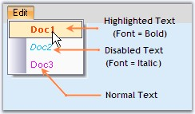{border="0"}

[]{style="COLOR: #15428b"} 

Figure 771: Doc1(Highlighted, Bold, Red color); Doc2(Disabled, Italic, DeepSkyBlue); Doc3(Enabled, Magenta color)

**[]{style="COLOR: #15428b"}** 

See Also

[]{style="COLOR: #15428b"} 

[[Types of Bar Items]{.UGHyperlink}]()[]{.UGHyperlink}

[]{style="COLOR: black"} 

[]{#p875}3.5.4.1.2.3.6      ToolTip

[]{style="COLOR: #15428b"} 

ToolTip for the BarItems can be enabled using **BarItem.ShowTooltips** property, which can be edited using **BarItem.Tooltip** property.

[]{style="COLOR: #15428b"} 

+---------------------------------------------------------------------------------------------------------------------------------------------------------------------+
| **[\[C#\]]{style="FONT-FAMILY: 'Courier New'; COLOR: black"}**                                                                                                      |
|                                                                                                                                                                     |
| **[]{style="FONT-FAMILY: 'Courier New'; COLOR: black"}**                                                                                                            |
|                                                                                                                                                                     |
| [this]{style="FONT-FAMILY: 'Courier New'; COLOR: blue"}[.dropDownBarItem2.ShowTooltip = [true]{style="COLOR: blue"};]{style="FONT-FAMILY: 'Courier New'"}           |
|                                                                                                                                                                     |
| [this]{style="FONT-FAMILY: 'Courier New'; COLOR: blue"}[.dropDownBarItem2.Tooltip = [\"Pick a color\"]{style="COLOR: maroon"};]{style="FONT-FAMILY: 'Courier New'"} |
+---------------------------------------------------------------------------------------------------------------------------------------------------------------------+

[]{style="COLOR: #15428b"} 

+------------------------------------------------------------------------------------------------------------------------------------------------------------------+
| **[\[VB.NET\]]{style="FONT-FAMILY: 'Courier New'; COLOR: black"}**                                                                                               |
|                                                                                                                                                                  |
| **[]{style="FONT-FAMILY: 'Courier New'; COLOR: black"}**                                                                                                         |
|                                                                                                                                                                  |
| [Me]{style="FONT-FAMILY: 'Courier New'; COLOR: blue"}[.dropDownBarItem2.ShowTooltip = [True]{style="COLOR: blue"}]{style="FONT-FAMILY: 'Courier New'"}           |
|                                                                                                                                                                  |
| [Me]{style="FONT-FAMILY: 'Courier New'; COLOR: blue"}[.dropDownBarItem2.Tooltip = [\"Pick a color\"]{style="COLOR: maroon"}]{style="FONT-FAMILY: 'Courier New'"} |
+------------------------------------------------------------------------------------------------------------------------------------------------------------------+

**[]{style="COLOR: #15428b"}** 

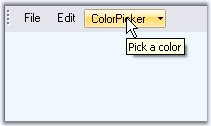{border="0"}

**[]{style="COLOR: #15428b"}** 

Figure 772: Tooltip displayed for a DropDownBarItem

**[]{style="COLOR: #15428b"}** 

::: {style="BORDER-BOTTOM: windowtext 1pt solid; BORDER-LEFT: medium none; PADDING-BOTTOM: 1pt; MARGIN-TOP: 9pt; PADDING-LEFT: 0pt; PADDING-RIGHT: 0pt; MARGIN-BOTTOM: 9pt; BORDER-TOP: windowtext 1pt solid; BORDER-RIGHT: medium none; PADDING-TOP: 1pt"}
{border="0"} Note:[ ]{style="COLOR: black; FONT-SIZE: 8pt"}We can control the display of tooltips for the bar items, only when the form is active, using the below BarManager property.
:::

**[]{style="COLOR: #15428b"}** 

::: {align="center"}
  -------------------------------- ------------------------------------------------------------------------------------------
  BarManager Property              Description
  BarItemActiveFormCheckOverride   Specifies whether bar items should check for active form before displaying the tooltips.
  -------------------------------- ------------------------------------------------------------------------------------------
:::

[]{style="COLOR: #15428b"} 

+----------------------------------------------------------------------------------------------------------------------------------------------------------------------------------+
| **[\[C#\]]{style="FONT-FAMILY: 'Courier New'; COLOR: black"}**                                                                                                                   |
|                                                                                                                                                                                  |
| **[]{style="FONT-FAMILY: 'Courier New'; COLOR: black"}**                                                                                                                         |
|                                                                                                                                                                                  |
| [this]{style="FONT-FAMILY: 'Courier New'; COLOR: blue"}[.mainFrameBarManager1.BarItemActiveFormCheckOverride = [true]{style="COLOR: blue"};]{style="FONT-FAMILY: 'Courier New'"} |
+----------------------------------------------------------------------------------------------------------------------------------------------------------------------------------+

[]{style="COLOR: #15428b"} 

+-------------------------------------------------------------------------------------------------------------------------------------------------------------------------------+
| **[\[VB.NET\]]{style="FONT-FAMILY: 'Courier New'; COLOR: black"}**                                                                                                            |
|                                                                                                                                                                               |
| **[]{style="FONT-FAMILY: 'Courier New'; COLOR: black"}**                                                                                                                      |
|                                                                                                                                                                               |
| [Me]{style="FONT-FAMILY: 'Courier New'; COLOR: blue"}[.mainFrameBarManager1.BarItemActiveFormCheckOverride = [True]{style="COLOR: blue"}]{style="FONT-FAMILY: 'Courier New'"} |
+-------------------------------------------------------------------------------------------------------------------------------------------------------------------------------+

[]{#related-topics}
::::::::::::::::::::::::::::
