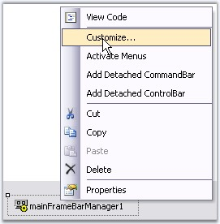
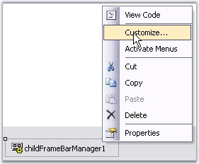

::: {style="DISPLAY: none"}
{#d2h_url_template}{#d2h_package_url style="WIDTH: 0px; DISPLAY: none; HEIGHT: 0px"}
:::

::::::::::::::: {.d2h_secondary_topic style="PADDING-BOTTOM: 10pt; MARGIN: 0pt; PADDING-LEFT: 0pt; PADDING-RIGHT: 0pt; PADDING-TOP: 0pt"}
##### BarManagers {#barmanagers style="tab-stops: 0pt"}

[]{style="COLOR: #15428b"} 

There are two kinds of BarManagers.

[]{style="COLOR: #15428b"} 

[·      ]{style="FONT-FAMILY: Symbol"}MainFrameBarManager

[·      ]{style="FONT-FAMILY: Symbol"}ChildFrameBarManager

[]{style="COLOR: #15428b"} 

The MainFrameBarManager is associated with a **MDI container form** in the MDI scenario or with the top-level form in a single document scenario.

 

The ChildFrameBarManager should be associated with a **MDIChild** in the MDI scenario.

 

These two classes are derived from the BarManager and hence will be referred as such when discussing features common to both these classes.

 

::: {style="BORDER-BOTTOM: windowtext 1pt solid; BORDER-LEFT: medium none; PADDING-BOTTOM: 1pt; MARGIN-TOP: 9pt; PADDING-LEFT: 0pt; PADDING-RIGHT: 0pt; MARGIN-BOTTOM: 9pt; BORDER-TOP: windowtext 1pt solid; BORDER-RIGHT: medium none; PADDING-TOP: 1pt"}
{border="0"} Note: At run-time, a ChildFrameBarManager does not show the menus and toolbars inside a child form. It is merely a place holder for the menus and toolbars during design-time, which will be merged into the main form\'s menus during run-time.
:::

[]{style="COLOR: #15428b"} 

BarManagers come with full design-time support and lets users add menus and toolbars and fill them with items, all without writing a single line of code. The Customize dialog facilitates customization of the menus. It is available to the developer during design-time and to the end user during runtime.

[]{style="COLOR: #15428b"} 

{border="0"}

 

Figure 773: MainFrameBarManager at Design Time

**[]{style="COLOR: #15428b"}** 

{border="0"}

**[]{style="COLOR: #15428b"}** 

Figure 774: ChildFrameBarManager at Design Time

**[]{style="COLOR: #15428b"}** 

See Also

**[]{style="COLOR: #15428b"}** 

[MainFrameBarManager Properties]{.UGHyperlink}[,]{.UGHyperlink}

[ChildFrameBarManager Properties]{.UGHyperlink}[, ]{.UGHyperlink}[MDI Child Forms]{.UGHyperlink}[]{.UGHyperlink}

[Detached CommandBar]{.UGHyperlink}[, ]{.UGHyperlink}[Detached ControlBars]{.UGHyperlink}[]{.UGHyperlink}

###### []{#p877}[]{#_MainFrameBarManager_Property}3.5.4.1.3.1 MainFrameBarManager Property {#mainframebarmanager-property style="tab-stops: 0pt"}

[]{style="COLOR: #15428b"} 

Image Settings

[]{style="COLOR: #15428b"} 

::: {align="center"}
  ------------------------- ------------------------------------------------------------------------------------------
  BarManager Property       Description
  DisabledImageList         The ImageList to which the BarItems refer to, when disabled.
  DisabledLargeImageList    The ImageList to which the BarItems refer to, when disabled and uses LargeIcons mode.
  HighlightImageList        The ImageList to which the BarItems refer to, when highlighted.
  HighlightLargeImageList   The ImageList to which the BarItems refer to, when highlighted and uses LargeIcons mode.
  ImageList                 ImageList that bar items refer to when in small icons mode.
  LargeIcons                Enables or disables LargeIcons mode for items in the toolbar.
  LargeImageList            The ImageList to which the BarItems refer to, when in LargeIcons mode.
  ------------------------- ------------------------------------------------------------------------------------------
:::

 

Foreground and Style Settings

**[]{style="COLOR: #15428b"}** 

::: {align="center"}
  --------------------- ---------------------------------------------------------------
  BarManager Property   Description
  Font                  Sets font style for the bar items.
  Style                 Sets the common visual style for the toolbars and main menus.
  Themes Enabled        Specify whether to apply themes.
  --------------------- ---------------------------------------------------------------
:::

**[]{style="COLOR: #15428b"}** 

Data Settings

**[]{style="COLOR: #15428b"}** 

::: {align="center"}
  --------------------- -------------------------------------------------------------------------------
  BarManager Property   Description
  Bars                  Invokes the Customize dialog - Toolbar tab indicating the collection of Bars.
  Categories            Lists the categories defined in this bar manager.
  --------------------- -------------------------------------------------------------------------------
:::

**[]{style="COLOR: #15428b"}** 

Misc Properties

**[]{style="COLOR: #15428b"}** 

::: {align="center"}
  ------------------------ --------------------------------------------------------------------------------------------
  BarManager Property      Description
  ActivateFormFromBar      Indicates if activating menu should activate parent form also.
  PopupCloseTimer          Indicates the delay in milliseconds before the displayed dropdown on toolbar, gets closed.
  ShowHighlightRectangle   Indicates whether to highlight bar items when moving mouse over it.
  ------------------------ --------------------------------------------------------------------------------------------
:::

**[]{style="COLOR: #15428b"}** 

Shadow Settings

**[]{style="COLOR: #15428b"}** 

::: {align="center"}
  --------------------- ---------------------------------------------------------
  BarManager Property   Description
  ShowDropShadow        Indicates whether to show shadow for BarItem\'s images.
  ShowShadow            Indicates whether to show shadows for popups.
  --------------------- ---------------------------------------------------------
:::

[]{style="COLOR: #15428b"} 

::: {style="BORDER-BOTTOM: windowtext 1pt solid; BORDER-LEFT: medium none; PADDING-BOTTOM: 1pt; MARGIN-TOP: 9pt; PADDING-LEFT: 0pt; PADDING-RIGHT: 0pt; MARGIN-BOTTOM: 9pt; BORDER-TOP: windowtext 1pt solid; BORDER-RIGHT: medium none; PADDING-TOP: 1pt"}
{border="0"} Note: The properties related to the partial menus concept is discussed in ParentBarItem.
:::

[]{style="COLOR: #15428b"} 

Tooltip Settings

[]{style="COLOR: #15428b"} 

::: {style="BORDER-BOTTOM: windowtext 1pt solid; BORDER-LEFT: medium none; PADDING-BOTTOM: 1pt; MARGIN-TOP: 9pt; PADDING-LEFT: 0pt; PADDING-RIGHT: 0pt; MARGIN-BOTTOM: 9pt; BORDER-TOP: windowtext 1pt solid; BORDER-RIGHT: medium none; PADDING-TOP: 1pt"}
{border="0"} Note: We can control the display of tooltips for the bar items, only when the form is active, using the below BarManager.BarItemActiveFormCheckOverride property.
:::

[]{style="COLOR: #15428b"} 

See Also

[]{style="COLOR: #15428b"} 

[Toolbar State Persistence]{.UGHyperlink}[,]{.UGHyperlink}

[ParentBarItem]{.UGHyperlink}[,]{.UGHyperlink}

[Tooltip]{.UGHyperlink}[]{.UGHyperlink}

###### []{#_ChildFrameBarManager_Properties}3.5.4.1.3.2 ChildFrameBarManager Properties {#childframebarmanager-properties style="tab-stops: 0pt"}

[]{#p878} 

Image Settings

[]{style="COLOR: #15428b"} 

::: {align="center"}
  ------------------------- ------------------------------------------------------------------------------------------
  BarManager Property       Description
  DisabledImageList         The ImageList to which the BarItems refer to, when disabled.
  DisabledLargeImageList    The ImageList to which the BarItems refer to, when disabled and uses LargeIcons mode.
  HighlightImageList        The ImageList to which the BarItems refer to, when highlighted.
  HighlightLargeImageList   The ImageList to which the BarItems refer to, when highlighted and uses LargeIcons mode.
  ImageList                 ImageList that bar items refer to when in small icons mode.
  LargeImageList            The ImageList to which the BarItems refer to, when in LargeIcons mode.
  ------------------------- ------------------------------------------------------------------------------------------
:::

**[]{style="COLOR: #15428b"}** 

Style Settings

**[]{style="COLOR: #15428b"}** 

::: {align="center"}
  --------------------- ---------------------------------------------------------------
  BarManager Property   Description
  Style                 Sets the common visual style for the toolbars and main menus.
  --------------------- ---------------------------------------------------------------
:::

**[]{style="COLOR: #15428b"}** 

Data Settings

**[]{style="COLOR: #15428b"}** 

::: {align="center"}
  --------------------- -------------------------------------------------------------------------------
  BarManager Property   Description
  Bars                  Invokes the Customize dialog - Toolbar tab indicating the collection of Bars.
  Categories            Lists the categories defined in this bar manager.
  --------------------- -------------------------------------------------------------------------------
:::

**[]{style="COLOR: #15428b"}** 

Shadow and Highlight Rectangle Settings

**[]{style="COLOR: #15428b"}** 

::: {align="center"}
  ------------------------ ---------------------------------------------------------------------
  BarManager Property      Description
  ShowDropShadow           Indicates whether to show shadow for BarItem\'s images.
  ShowHighlightRectangle   Indicates whether to highlight bar items when moving mouse over it.
  ShowShadow               Indicates whether to show shadows for popups.
  ------------------------ ---------------------------------------------------------------------
:::

[]{#related-topics}
:::::::::::::::
