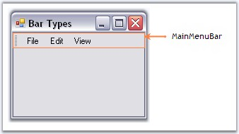
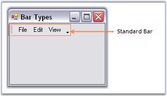
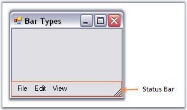
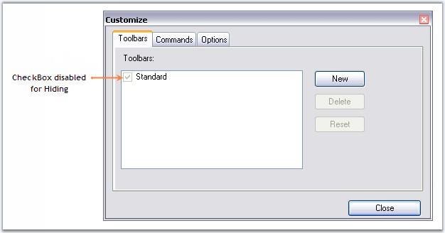
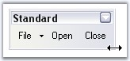
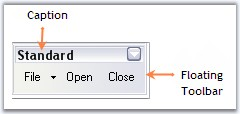

::: {style="DISPLAY: none"}
{#d2h_url_template}{#d2h_package_url style="WIDTH: 0px; DISPLAY: none; HEIGHT: 0px"}
:::

:::::: {.d2h_secondary_topic style="PADDING-BOTTOM: 10pt; MARGIN: 0pt; PADDING-LEFT: 0pt; PADDING-RIGHT: 0pt; PADDING-TOP: 0pt"}
##### Bar Types {#bar-types style="tab-stops: 0pt"}

[]{style="COLOR: #15428b"} 

XPMenus Framework defines the below three types of bars based on the BarStyle property.

[]{style="COLOR: #15428b"} 

MainMenuBar

[]{style="COLOR: #15428b"} 

This is a horizontal menu that appears on top of a window. By default, each option in a menu bar is associated with a pull-down menu.

 

For MainMenuBars, BarStyles IsMainMenuBar option will have to be checked. There can be only one menu bar at the top of the screen. The MainMenuBar is always visible and it fills the entire dock area row on which it appears.

[]{style="COLOR: #15428b"} 

{border="0"}

**[]{style="COLOR: #15428b"}** 

Figure 726: MainMenu Bar

[]{style="COLOR: #15428b"} 

Standard Bar

[]{style="COLOR: #15428b"} 

This is a horizontal menu that appears on top of a window with BarStyle \'IsMainMenu\' option Unchecked. It does not fill the entire dock area row on which it appears. Other toolbars can also be docked on the same row. It gives \'Customize toolbar\' options.

**[]{style="COLOR: #15428b"}** 

{border="0"}

[]{style="COLOR: #15428b"} 

Figure 727: Standard Bar

[]{style="COLOR: #15428b"} 

Status Bar

[]{style="COLOR: #15428b"} 

This is a horizontal menu that appears on the bottom of a window and has the BarStyle \'IsStatusBar\' checked. Any number of static bar items can be added to it.

[]{style="COLOR: #15428b"} 

{border="0"}

**[]{style="COLOR: #15428b"}** 

Figure 728: Status Bar

 

See Also

[]{style="COLOR: #15428b"} 

[Bar Items]{.UGHyperlink}[, ]{.UGHyperlink}[BarManagers]{.UGHyperlink}[, ]{.UGHyperlink}[Bar Styles]{.UGHyperlink}[]{.UGHyperlink}

 

###### []{#p856}[]{#_Toolbar_Properties}3.5.4.1.1.1 Toolbar Properties {#toolbar-properties style="tab-stops: 0pt"}

[]{style="COLOR: #15428b"} 

The properties of a toolbar are as follows.

[]{style="COLOR: #15428b"} 

::: {align="center"}
+------------------------------------------------------------------------------+-----------------------------------------------------------------------------------------------------------------------------------------------------------------------------------+
| Bar Property                                                                 | Description                                                                                                                                                                       |
+------------------------------------------------------------------------------+-----------------------------------------------------------------------------------------------------------------------------------------------------------------------------------+
| Items                                                                        | Collection of bar items representing the menu items in the toolbar. This invokes the customize dialog at design time.                                                             |
+------------------------------------------------------------------------------+-----------------------------------------------------------------------------------------------------------------------------------------------------------------------------------+
| AllowCustomizing                                                             | Indicates whether dragging and dropping of bar items into the bar is allowed or not, at run time.                                                                                 |
+------------------------------------------------------------------------------+-----------------------------------------------------------------------------------------------------------------------------------------------------------------------------------+
| AllowItemsReorderOnShrunk                                                    | When the toolbar shrunk to show more bar items, the bar items will be automatically reordered, when AllowItemsReorderOnShrunk property is set to true. The default value is true. |
+------------------------------------------------------------------------------+-----------------------------------------------------------------------------------------------------------------------------------------------------------------------------------+
| [Bar Styles]{style="FONT-SIZE: 8pt"}[]{style="COLOR: black; FONT-SIZE: 8pt"} | Specifies the BarStyle.                                                                                                                                                           |
+------------------------------------------------------------------------------+-----------------------------------------------------------------------------------------------------------------------------------------------------------------------------------+
| AllowHiding                                                                  | Specifies if the toolbar can be hidden by the user at run time. By default this property is true.                                                                                 |
|                                                                              |                                                                                                                                                                                   |
|                                                                              | When this is set to false, user will not be able to hide the toolbar at run time, as the checkbox will be disabled at run time.                                                   |
+------------------------------------------------------------------------------+-----------------------------------------------------------------------------------------------------------------------------------------------------------------------------------+
:::

[]{style="COLOR: #15428b"} 

{border="0"}

[]{style="COLOR: #15428b"} 

Figure 729: Bar.AllowHiding = \"False\"

**[]{style="COLOR: #15428b"}** 

Default Docking

[]{style="COLOR: #15428b"} 

The XPMenus bar can be docked on any of the four sides of the host form, both at design time and run time, without a single property setting. This is an in-built feature in the XPMenus.

[]{style="COLOR: #15428b"} 

Floating Bar Properties

[]{style="COLOR: #15428b"} 

::: {align="center"}
  --------------- ----------------------------------------------------------------------------------
  Bar Property    Description
  AllowResizing   Specifies whether to allow resizing of the toolbar when the toolbar is floating.
  --------------- ----------------------------------------------------------------------------------
:::

**[]{style="COLOR: #15428b"}** 

{border="0"}

 

Figure 730: AllowResizing Enabled for the Floating Toolbar

[]{style="COLOR: #15428b"} 

::: {align="center"}
  -------------- --------------------------------------------------------------
  Bar Property   Description
  BarName        Name of the toolbar.
  Caption        Caption for the toolbar which is displayed in floating mode.
  -------------- --------------------------------------------------------------
:::

**[]{style="COLOR: #15428b"}** 

{border="0"}

[]{style="COLOR: #15428b"} 

Figure 731: Floating Bar with Caption

***[]{style="COLOR: #15428b"}*** 

See Also

[]{style="COLOR: #15428b"} 

[How To Reset Bar To The Designer State?]{.UGHyperlink}[]{.UGHyperlink}

[How to show or hide close and dropdown buttons of a floating bar in XPMenus?]{.UGHyperlink}[]{.UGHyperlink}

[]{#related-topics}
::::::
