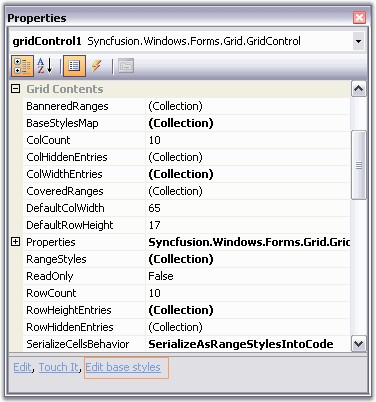
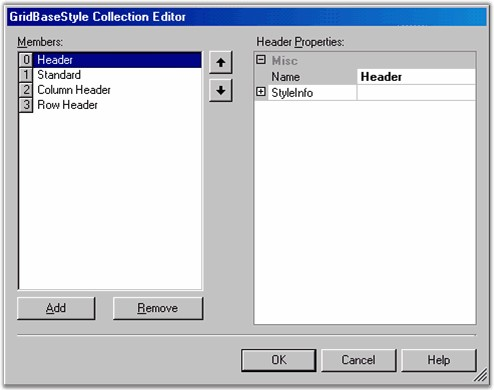

::: {style="DISPLAY: none"}
{#d2h_url_template}{#d2h_package_url style="WIDTH: 0px; DISPLAY: none; HEIGHT: 0px"}
:::

::: {.d2h_secondary_topic style="PADDING-BOTTOM: 10pt; MARGIN: 0pt; PADDING-LEFT: 0pt; PADDING-RIGHT: 0pt; PADDING-TOP: 0pt"}
##### BaseStyles {#basestyles style="tab-stops: 0pt"}

[]{style="FONT-FAMILY: 'Trebuchet MS','sans-serif'; COLOR: #15428b; FONT-SIZE: 9pt"} 

Grid control supports another parent-type style, **BaseStyles**, which is used to customize a cell\'s appearance. BaseStyles are **GridStyleInfo** objects which can be associated with an arbitrary collection of cells. In a Word Processing software, there is the common task of defining a particular style (such as style Header1 representing a bold, 20-point Helvetica font), and then using it repeatedly in your document whenever you need a \'Header1\' type. BaseStyles play the same role within Grid control. You can define a BaseStyle named Header1 as having certain properties, and then you can place these properties onto any cell just by applying this BaseStyle Header1 to the cell. More importantly, if you want to change Header1 (for example, changing its **BackColor** property from white to red), you can make the change one time by just changing the Header1 BaseStyle, and not having to relabel every other cell assigned to this BaseStyle.

[]{style="FONT-FAMILY: 'Trebuchet MS','sans-serif'; COLOR: #15428b; FONT-SIZE: 9pt"} 

Since BaseStyles are considered as parent styles, where do they fit within the precedence hierarchy that we have discussed above? BaseStyles are applied between the tablestyle and the standardstyle. Thus, they are the \'weakest\' style other than the fully populated standardstyle. BaseStyles are stored in the **GridControl.BaseStylesMap** class. In addition to the standardstyle, other BaseStyles used by all Essential Grids include Row Header, Header and Column Header. You can define and apply your own BaseStyles as well.

[]{style="FONT-FAMILY: 'Trebuchet MS','sans-serif'; COLOR: #15428b; FONT-SIZE: 9pt"} 

To work with BaseStyles from within the Visual Studio designer, you need to use the **Edit base styles** verb that appears at the bottom of the Grid control\'s property grid.

[]{style="FONT-FAMILY: 'Trebuchet MS','sans-serif'; COLOR: #15428b; FONT-SIZE: 9pt"} 

{border="0"}

**[]{style="FONT-FAMILY: 'Trebuchet MS','sans-serif'; COLOR: #15428b; FONT-SIZE: 9pt"}** 

*[Figure ]{style="FONT-SIZE: 9pt"}[98]{style="FONT-SIZE: 9pt"}[: PropertyGrid with Edit BaseStyles Option]{style="FONT-SIZE: 9pt"}*

[]{style="FONT-FAMILY: 'Trebuchet MS','sans-serif'; COLOR: #15428b; FONT-SIZE: 9pt"} 

When you click the Edit base styles verb, the **GridBaseStyle Collection Editor** dialog box is displayed. You can use the GridBaseStyle Collection Editor to edit the existing BaseStyles or add new ones.

[]{style="FONT-FAMILY: 'Trebuchet MS','sans-serif'; COLOR: #15428b; FONT-SIZE: 9pt"} 

{border="0"}

 

*[Figure ]{style="FONT-SIZE: 9pt"}[99]{style="FONT-SIZE: 9pt"}[: GridBaseStyle Collection Editor]{style="FONT-SIZE: 9pt"}*

[]{style="FONT-FAMILY: 'Trebuchet MS','sans-serif'; COLOR: #15428b; FONT-SIZE: 9pt"} 

The following code example illustrates how to create a BaseStyle. When you define a BaseStyle you can apply it to any cell (or row or column) by just setting the **GridStyleInfo.BaseStyle** for that cell to the name used to define the BaseStyle.

[]{style="FONT-FAMILY: 'Trebuchet MS','sans-serif'; COLOR: #15428b; FONT-SIZE: 9pt"} 

+-----------------------------------------------------------------------------------------------------------------------------------------------------------------------------------------------------------------------------------------------------------------------------------------------------------+
| **[\[C#\]]{style="FONT-FAMILY: 'Courier New'; COLOR: black"}**                                                                                                                                                                                                                                            |
|                                                                                                                                                                                                                                                                                                           |
| []{style="FONT-FAMILY: 'Courier New'; COLOR: black; FONT-SIZE: 9pt"}                                                                                                                                                                                                                                      |
|                                                                                                                                                                                                                                                                                                           |
| [// Add a new base style.]{style="FONT-FAMILY: 'Courier New'; COLOR: green; FONT-SIZE: 9pt"}                                                                                                                                                                                                              |
|                                                                                                                                                                                                                                                                                                           |
| [GridBaseStyle]{style="FONT-FAMILY: 'Courier New'; COLOR: #2b91af; FONT-SIZE: 9pt"}[ gridBaseStyle1 = [new]{style="COLOR: blue"} [GridBaseStyle]{style="COLOR: #2b91af"}([\"BackColorTest\"]{style="COLOR: #a31515"}, [false]{style="COLOR: blue"});]{style="FONT-FAMILY: 'Courier New'; FONT-SIZE: 9pt"} |
|                                                                                                                                                                                                                                                                                                           |
| [gridBaseStyle1.StyleInfo.BackColor = [Color]{style="COLOR: #2b91af"}.SkyBlue;]{style="FONT-FAMILY: 'Courier New'; FONT-SIZE: 9pt"}                                                                                                                                                                       |
|                                                                                                                                                                                                                                                                                                           |
| [gridBaseStyle1.StyleInfo.TextColor = [Color]{style="COLOR: #2b91af"}.RosyBrown;]{style="FONT-FAMILY: 'Courier New'; FONT-SIZE: 9pt"}                                                                                                                                                                     |
|                                                                                                                                                                                                                                                                                                           |
| [gridControl1.BaseStylesMap.AddRange([new]{style="COLOR: blue"} [GridBaseStyle]{style="COLOR: #2b91af"}\[\]{gridBaseStyle1});]{style="FONT-FAMILY: 'Courier New'; FONT-SIZE: 9pt"}                                                                                                                        |
|                                                                                                                                                                                                                                                                                                           |
| [\...]{style="FONT-FAMILY: 'Courier New'; FONT-SIZE: 9pt"}                                                                                                                                                                                                                                                |
|                                                                                                                                                                                                                                                                                                           |
| []{style="FONT-FAMILY: 'Courier New'; FONT-SIZE: 9pt"}                                                                                                                                                                                                                                                    |
|                                                                                                                                                                                                                                                                                                           |
| [// Apply this base style to a couple of cells.]{style="FONT-FAMILY: 'Courier New'; COLOR: green; FONT-SIZE: 9pt"}                                                                                                                                                                                        |
|                                                                                                                                                                                                                                                                                                           |
| [gridControl1\[1,2\].BaseStyle = [\"BackColorTest\"]{style="COLOR: #a31515"};]{style="FONT-FAMILY: 'Courier New'; FONT-SIZE: 9pt"}                                                                                                                                                                        |
|                                                                                                                                                                                                                                                                                                           |
| [gridControl1\[4,2\].BaseStyle = [\"BackColorTest\"]{style="COLOR: #a31515"};]{style="FONT-FAMILY: 'Courier New'; FONT-SIZE: 9pt"}                                                                                                                                                                        |
+-----------------------------------------------------------------------------------------------------------------------------------------------------------------------------------------------------------------------------------------------------------------------------------------------------------+

[]{style="FONT-FAMILY: 'Trebuchet MS','sans-serif'; COLOR: #15428b; FONT-SIZE: 9pt"} 

+-----------------------------------------------------------------------------------------------------------------------------------------------------------------------------------------------------------------------------------------------------------------------------------------------------------+
| **[\[VB.NET\]]{style="FONT-FAMILY: 'Courier New'; COLOR: black"}**                                                                                                                                                                                                                                        |
|                                                                                                                                                                                                                                                                                                           |
| []{style="FONT-FAMILY: 'Courier New'; COLOR: black; FONT-SIZE: 9pt"}                                                                                                                                                                                                                                      |
|                                                                                                                                                                                                                                                                                                           |
| [ [\' Add a new base style.]{style="COLOR: green"}]{style="FONT-FAMILY: 'Courier New'; FONT-SIZE: 9pt"}                                                                                                                                                                                                   |
|                                                                                                                                                                                                                                                                                                           |
| [Dim]{style="FONT-FAMILY: 'Courier New'; COLOR: blue; FONT-SIZE: 9pt"}[ gridBaseStyle1 [As]{style="COLOR: blue"} GridBaseStyle = [New]{style="COLOR: blue"} GridBaseStyle([\"BackColorTest\"]{style="COLOR: #a31515"}, [False]{style="COLOR: blue"})]{style="FONT-FAMILY: 'Courier New'; FONT-SIZE: 9pt"} |
|                                                                                                                                                                                                                                                                                                           |
| [gridBaseStyle1.StyleInfo.BackColor = Color.SkyBlue]{style="FONT-FAMILY: 'Courier New'; FONT-SIZE: 9pt"}                                                                                                                                                                                                  |
|                                                                                                                                                                                                                                                                                                           |
| [gridBaseStyle1.StyleInfo.TextColor = Color.RosyBrown]{style="FONT-FAMILY: 'Courier New'; FONT-SIZE: 9pt"}                                                                                                                                                                                                |
|                                                                                                                                                                                                                                                                                                           |
| [gridControl1.BaseStylesMap.AddRange([New]{style="COLOR: blue"} GridBaseStyle() {gridBaseStyle1})]{style="FONT-FAMILY: 'Courier New'; FONT-SIZE: 9pt"}                                                                                                                                                    |
|                                                                                                                                                                                                                                                                                                           |
| [\...]{style="FONT-FAMILY: 'Courier New'; FONT-SIZE: 9pt"}                                                                                                                                                                                                                                                |
|                                                                                                                                                                                                                                                                                                           |
| []{style="FONT-FAMILY: 'Courier New'; FONT-SIZE: 9pt"}                                                                                                                                                                                                                                                    |
|                                                                                                                                                                                                                                                                                                           |
| [\' Apply this base style to a couple of cells.]{style="FONT-FAMILY: 'Courier New'; COLOR: green; FONT-SIZE: 9pt"}                                                                                                                                                                                        |
|                                                                                                                                                                                                                                                                                                           |
| [gridControl1(1, 2).BaseStyle = [\"BackColorTest\"]{style="COLOR: #a31515"}]{style="FONT-FAMILY: 'Courier New'; FONT-SIZE: 9pt"}                                                                                                                                                                          |
|                                                                                                                                                                                                                                                                                                           |
| [gridControl1(4, 2).BaseStyle = [\"BackColorTest\"]{style="COLOR: #a31515"}]{style="FONT-FAMILY: 'Courier New'; FONT-SIZE: 9pt"}                                                                                                                                                                          |
+-----------------------------------------------------------------------------------------------------------------------------------------------------------------------------------------------------------------------------------------------------------------------------------------------------------+

 

[]{#p75} 

 

[]{#related-topics}
:::
