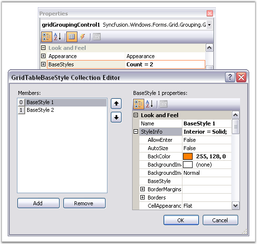
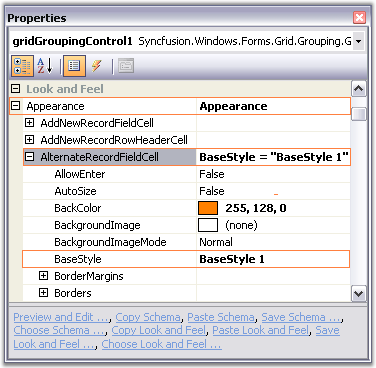
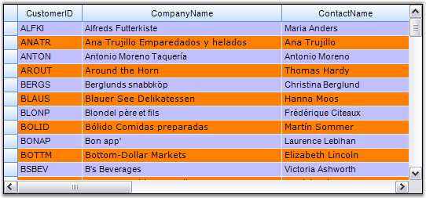

::: {style="DISPLAY: none"}
{#d2h_url_template}{#d2h_package_url style="WIDTH: 0px; DISPLAY: none; HEIGHT: 0px"}
:::

::: {.d2h_secondary_topic style="PADDING-BOTTOM: 10pt; MARGIN: 0pt; PADDING-LEFT: 0pt; PADDING-RIGHT: 0pt; PADDING-TOP: 0pt"}
##### BaseStyles {#basestyles style="tab-stops: 0pt"}

 

In addition to the parent styles discussed in the previous topics, Essential Grid supports one other parent-type style which, can contribute to a cell\'s appearance, they are BaseStyles of GridStyleInfo objects which, can be associated with an arbitrary collection of cells.

 

BaseStyles provide the way to create StyleTemplates that can be applied to the cells. It allows you to apply styles with ease and in faster manner. For example, in a word processing software, there is the common task of defining a particular style (such as style Header1 representing a bold, 20-point Helvetica font) and then using it repeatedly in your document whenever you need a \'Header1\' type.

 

BaseStyles play the same role within Essential Grid. You can define a BaseStyle named Header1 as having certain properties and then you can place these properties onto any cell just by applying this BaseStyle Header1 to the cell. More importantly is that if later on you want to change what Header1 means (for example, changing its BackColor property from white to red), you can make the change one time by just changing the Header1 BaseStyle and not having to relabel every other cell assigned to this BaseStyle.

 

BaseStyles are stored in the GridGroupingControl.TableModel.BaseStylesMap class. In addition to the standardstyle, other BaseStyles used by all Essential Grids include Row Header, Header and Column Header. You can define and apply your own BaseStyles as well.

 

Users can add base styles to the engine and inherit the style settings through GridStyleInfo.BaseStyle property. You can create any number of style templates through BaseStyles.

 

Applying BaseStyles

[]{style="FONT-FAMILY: 'Segoe UI','sans-serif'; COLOR: #4a5c8c; FONT-SIZE: 9pt"} 

1.   To add style templates at design time, you need to access the BaseStyles property in the property editor. This will open the GridTableStyle Collection Editor that lists the StyleInfo properties that can be associated to a grid cell. Here is a property editor that shows the creation of two style templates named BaseStyle1 and BaseStyle2.

 

{border="0"}

 

*[Figure ]{style="FONT-SIZE: 9pt"}[327]{style="FONT-SIZE: 9pt"}[: GridTableBaseStyle Collection Editor]{style="FONT-SIZE: 9pt"}*

 

2.   Your next step is to set the base styles created above, to the grid cells as required. Suppose if you want to set BaseStyle1 for alternate record field cells and BaseStyle2 for the remaining cells, then this can be specified by setting Appearance.AlternateRecordFieldCell.BaseStyle property to BaseStyle1 and Appearance.AnyCell.BaseStyle property to BaseStyle2 as shown in the image below.

 

 

{border="0"}

 

*[Figure ]{style="FONT-SIZE: 9pt"}[328]{style="FONT-SIZE: 9pt"}[: Setting the Base Styles to the respective Grid Cells]{style="FONT-SIZE: 9pt"}*

 

3.   Here is a sample screenshot.

 

 

{border="0"}

*[Figure ]{style="FONT-SIZE: 9pt"}[329]{style="FONT-SIZE: 9pt"}[: Base Styles applied to the Grid Grouping Control]{style="FONT-SIZE: 9pt"}*

 

Programmatically

[]{style="COLOR: #4a5c8c; FONT-SIZE: 9pt"} 

Base styles can also be set through code. The following code example illustrates how to create and apply the above styles to the grouping grid.

 

+---------------------------------------------------------------------------------------------------------------------------------------------------------------------------------------------------------------------------------------------+
| **[\[C#\]]{style="FONT-FAMILY: 'Courier New'; COLOR: black"}**                                                                                                                                                                              |
|                                                                                                                                                                                                                                             |
| []{style="FONT-FAMILY: 'Courier New'"}                                                                                                                                                                                                      |
|                                                                                                                                                                                                                                             |
| [GridTableBaseStyle]{style="FONT-FAMILY: 'Courier New'; COLOR: #2b91af"}[ style1 = [new]{style="COLOR: blue"} [GridTableBaseStyle]{style="COLOR: #2b91af"}([\"BaseStyle 1\"]{style="COLOR: #a31515"});]{style="FONT-FAMILY: 'Courier New'"} |
|                                                                                                                                                                                                                                             |
| [style1.Name = [\"BaseStyle 1\"]{style="COLOR: #a31515"};]{style="FONT-FAMILY: 'Courier New'"}                                                                                                                                              |
|                                                                                                                                                                                                                                             |
| [style1.StyleInfo.Font.Facename = [\"Verdana\"]{style="COLOR: #a31515"};]{style="FONT-FAMILY: 'Courier New'"}                                                                                                                               |
|                                                                                                                                                                                                                                             |
| [style1.StyleInfo.Interior = [new]{style="COLOR: blue"} BrushInfo([Color]{style="COLOR: #2b91af"}.FromArgb(255, 128, 0));]{style="FONT-FAMILY: 'Courier New'"}                                                                              |
|                                                                                                                                                                                                                                             |
| []{style="FONT-FAMILY: 'Courier New'"}                                                                                                                                                                                                      |
|                                                                                                                                                                                                                                             |
| [GridTableBaseStyle]{style="FONT-FAMILY: 'Courier New'; COLOR: #2b91af"}[ style2 = [new]{style="COLOR: blue"} [GridTableBaseStyle]{style="COLOR: #2b91af"}([\"BaseStyle 2\"]{style="COLOR: #a31515"});]{style="FONT-FAMILY: 'Courier New'"} |
|                                                                                                                                                                                                                                             |
| [style2.Name = [\"BaseStyle 2\"]{style="COLOR: #a31515"};]{style="FONT-FAMILY: 'Courier New'"}                                                                                                                                              |
|                                                                                                                                                                                                                                             |
| [style2.StyleInfo.Font.Facename = [\"Arial\"]{style="COLOR: #a31515"};]{style="FONT-FAMILY: 'Courier New'"}                                                                                                                                 |
|                                                                                                                                                                                                                                             |
| [style2.StyleInfo.Interior = [new]{style="COLOR: blue"} BrushInfo([Color]{style="COLOR: #2b91af"}.FromArgb(192, 192, 255));]{style="FONT-FAMILY: 'Courier New'"}                                                                            |
|                                                                                                                                                                                                                                             |
| []{style="FONT-FAMILY: 'Courier New'"}                                                                                                                                                                                                      |
|                                                                                                                                                                                                                                             |
| [gridGroupingControl1.BaseStyles.AddRange([new]{style="COLOR: blue"} [GridTableBaseStyle]{style="COLOR: #2b91af"}\[\] { style1, style2 });]{style="FONT-FAMILY: 'Courier New'"}                                                             |
|                                                                                                                                                                                                                                             |
| []{style="FONT-FAMILY: 'Courier New'"}                                                                                                                                                                                                      |
|                                                                                                                                                                                                                                             |
| [gridGroupingControl1.Appearance.AlternateRecordFieldCell.BaseStyle = [\"BaseStyle 1\"]{style="COLOR: #a31515"};]{style="FONT-FAMILY: 'Courier New'"}                                                                                       |
|                                                                                                                                                                                                                                             |
| [gridGroupingControl1.Appearance.AnyCell.BaseStyle = [\"BaseStyle 2\"]{style="COLOR: #a31515"};]{style="FONT-FAMILY: 'Courier New'"}                                                                                                        |
+---------------------------------------------------------------------------------------------------------------------------------------------------------------------------------------------------------------------------------------------+

 

+---------------------------------------------------------------------------------------------------------------------------------------------------------------------------------------------------------------------------------------------+
| **[\[VB.NET\]]{style="FONT-FAMILY: 'Courier New'; COLOR: black"}**                                                                                                                                                                          |
|                                                                                                                                                                                                                                             |
| []{style="FONT-FAMILY: 'Courier New'"}                                                                                                                                                                                                      |
|                                                                                                                                                                                                                                             |
| [Dim]{style="FONT-FAMILY: 'Courier New'; COLOR: blue"}[ style1 [As]{style="COLOR: blue"} GridTableBaseStyle = [New]{style="COLOR: blue"} GridTableBaseStyle([\"BaseStyle 1\"]{style="COLOR: #a31515"})]{style="FONT-FAMILY: 'Courier New'"} |
|                                                                                                                                                                                                                                             |
| [style1.Name = [\"BaseStyle 1\"]{style="COLOR: #a31515"}]{style="FONT-FAMILY: 'Courier New'"}                                                                                                                                               |
|                                                                                                                                                                                                                                             |
| [style1.StyleInfo.Font.Facename = [\"Verdana\"]{style="COLOR: #a31515"}]{style="FONT-FAMILY: 'Courier New'"}                                                                                                                                |
|                                                                                                                                                                                                                                             |
| [style1.StyleInfo.Interior = [New]{style="COLOR: blue"} BrushInfo(Color.FromArgb(255, 128, 0))]{style="FONT-FAMILY: 'Courier New'"}                                                                                                         |
|                                                                                                                                                                                                                                             |
| []{style="FONT-FAMILY: 'Courier New'"}                                                                                                                                                                                                      |
|                                                                                                                                                                                                                                             |
| [Dim]{style="FONT-FAMILY: 'Courier New'; COLOR: blue"}[ style2 [As]{style="COLOR: blue"} GridTableBaseStyle = [New]{style="COLOR: blue"} GridTableBaseStyle([\"BaseStyle 2\"]{style="COLOR: #a31515"})]{style="FONT-FAMILY: 'Courier New'"} |
|                                                                                                                                                                                                                                             |
| [style2.Name = [\"BaseStyle 2\"]{style="COLOR: #a31515"}]{style="FONT-FAMILY: 'Courier New'"}                                                                                                                                               |
|                                                                                                                                                                                                                                             |
| [style2.StyleInfo.Font.Facename = [\"Arial\"]{style="COLOR: #a31515"}]{style="FONT-FAMILY: 'Courier New'"}                                                                                                                                  |
|                                                                                                                                                                                                                                             |
| [style2.StyleInfo.Interior = [New]{style="COLOR: blue"} BrushInfo(Color.FromArgb(192, 192, 255))]{style="FONT-FAMILY: 'Courier New'"}                                                                                                       |
|                                                                                                                                                                                                                                             |
| []{style="FONT-FAMILY: 'Courier New'"}                                                                                                                                                                                                      |
|                                                                                                                                                                                                                                             |
| [gridGroupingControl1.BaseStyles.AddRange([New]{style="COLOR: blue"} GridTableBaseStyle() { style1, style2 });]{style="FONT-FAMILY: 'Courier New'"}                                                                                         |
|                                                                                                                                                                                                                                             |
| []{style="FONT-FAMILY: 'Courier New'"}                                                                                                                                                                                                      |
|                                                                                                                                                                                                                                             |
| [gridGroupingControl1.Appearance.AlternateRecordFieldCell.BaseStyle = [\"BaseStyle 1\"]{style="COLOR: #a31515"};]{style="FONT-FAMILY: 'Courier New'"}                                                                                       |
|                                                                                                                                                                                                                                             |
| [gridGroupingControl1.Appearance.AnyCell.BaseStyle = [\"BaseStyle 2\"]{style="COLOR: #a31515"};]{style="FONT-FAMILY: 'Courier New'"}                                                                                                        |
+---------------------------------------------------------------------------------------------------------------------------------------------------------------------------------------------------------------------------------------------+

 

 

[]{#p454} 

 

[]{#related-topics}
:::
