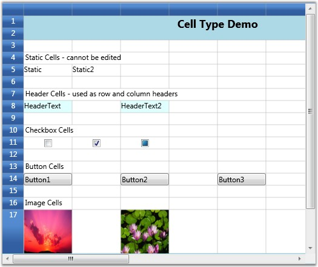

::: {style="DISPLAY: none"}
{#d2h_url_template}{#d2h_package_url style="WIDTH: 0px; DISPLAY: none; HEIGHT: 0px"}
:::

::::: {.d2h_secondary_topic style="PADDING-BOTTOM: 10pt; MARGIN: 0pt; PADDING-LEFT: 0pt; PADDING-RIGHT: 0pt; PADDING-TOP: 0pt"}
##### Basic Cell Types {#basic-cell-types style="tab-stops: 0pt"}

[]{#p19}This section elaborates you on how to employ basic controls like Check Box, Radio Button and more in a grid cell. The list of cell types and their usages are described below. The table also lists the format string for the individual cell types.

 

Table 5: Cell Type[]{style="COLOR: #15428b"}

::: {align="center"}
  ----------- ------------------ -------------------------------------------------------------------------
  Cell Type   Cell Type String   Usage
  Header      "Header"           Used as row and column headers
  Static      "Static"           Cannot be edited
  Check Box   "CheckBox"         Used for toggling options
  Button      "Button"           Provides Click event, which can be triggered to perform required action
  Image       "ImageCell"        Used to display pictures
  ----------- ------------------ -------------------------------------------------------------------------
:::

[]{style="COLOR: #15428b"} 

To set up desired cell type, the Style.CellType property must be assigned with the corresponding format string. For instance, if you want to display a Check box control in the cell (2, 2), then you have to use the code below.

 

Displaying a Check Box Control in a cell

[]{style="COLOR: #15428b"} 

+-----------------------------------------------------------------------------------------------------------------------------------------------+
| [\[C#\]]{style="FONT-FAMILY: 'Courier New'; COLOR: black"}                                                                                    |
|                                                                                                                                               |
| []{style="FONT-FAMILY: 'Courier New'; COLOR: black"}                                                                                          |
|                                                                                                                                               |
| [GridStyleInfo]{style="FONT-FAMILY: 'Courier New'; COLOR: #2b91af"}[ style = gridControl1.Model\[2, 2\];]{style="FONT-FAMILY: 'Courier New'"} |
|                                                                                                                                               |
| [style.CellType = [\"CheckBox\"]{style="COLOR: #a31515"};]{style="FONT-FAMILY: 'Courier New'"}                                                |
+-----------------------------------------------------------------------------------------------------------------------------------------------+

[]{style="COLOR: #15428b"} 

Likewise, you can also add other controls from the table above. A sample output is displayed below.

 

{border="0"}

Figure 15: Basic Cell Types

A check box is created in the grid.

::: {style="BORDER-BOTTOM: windowtext 1pt solid; BORDER-LEFT: medium none; PADDING-BOTTOM: 1pt; MARGIN-TOP: 9pt; PADDING-LEFT: 0pt; PADDING-RIGHT: 0pt; MARGIN-BOTTOM: 9pt; BORDER-TOP: windowtext 1pt solid; BORDER-RIGHT: medium none; PADDING-TOP: 1pt"}
{border="0"}Note: For complete code, please refer to the following browser sample:
:::

[]{style="COLOR: #15428b"} 

***\...\\My Documents\\Syncfusion\\EssentialStudio\\\<Version Number\>\\WPF\\Grid.WPF\\Samples\\3.5\\WindowsSamples\\Cell Types\\Basic Cell Type Demo***

[]{#related-topics}
:::::
