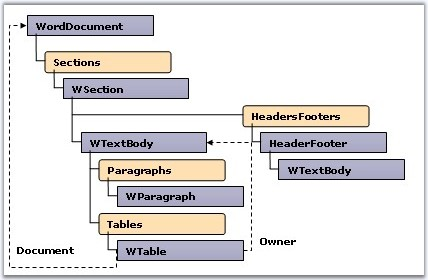
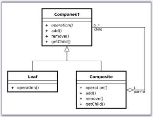
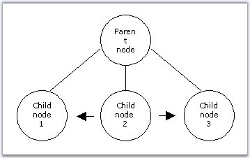

::: {style="DISPLAY: none"}
{#d2h_url_template}{#d2h_package_url style="WIDTH: 0px; DISPLAY: none; HEIGHT: 0px"}
:::

::::: {#nsbanner .d2h_main_nsbanner style="BORDER-BOTTOM: #999999 1px solid; POSITION: relative; PADDING-BOTTOM: 0px; BACKGROUND-COLOR: transparent; PADDING-LEFT: 0px; PADDING-RIGHT: 0px; DISPLAY: none; BORDER-TOP: #999999 1px solid; PADDING-TOP: 0px; LEFT: 0px"}
:::: {#TitleRow .d2h_main_titlerow style="PADDING-BOTTOM: 4px; BACKGROUND-COLOR: transparent; PADDING-LEFT: 22px; WIDTH: 100%; PADDING-RIGHT: 10px; DISPLAY: none; PADDING-TOP: 4px"}
::: {#ienav .d2h_main_ienav style="DISPLAY: none"}
{#D2HPrevious .D2HPreviousEnabled}  {#D2HNext .D2HNextEnabled}
:::
::::
:::::

::::::: {#nstext .d2h_main_nstext style="PADDING-BOTTOM: 10px; BACKGROUND-COLOR: transparent; PADDING-LEFT: 22px; PADDING-RIGHT: 10px; HEIGHT: 100%; OVERFLOW: auto; PADDING-TOP: 5px" hasuserbackground="true" valign="bottom"}
::: {#d2h_breadcrumbs .d2h_breadcrumbs}
[Essential Studio User Guide Documentation](ms-xhelp:///?Id=12457748-09e3-4d74-a240-8e049cedf030){.d2h_breadcrumbsNormal}[ \> ]{.d2h_breadcrumbsLinkSeparator}[Reporting Edition](ms-xhelp:///?Id=027aa5b6-6676-4f93-ad23-c20e8c45792e){.d2h_breadcrumbsNormal}[ \> ]{.d2h_breadcrumbsLinkSeparator}[Essential DocIO](ms-xhelp:///?Id=b88d77b3-4c51-460f-a761-d2ef6d5b0ca6){.d2h_breadcrumbsNormal}[ \> ]{.d2h_breadcrumbsLinkSeparator}[Concepts and Features](ms-xhelp:///?Id=c1881696-52ce-4414-9f3d-97433d8e9775){.d2h_breadcrumbsNormal}
:::

## Basic Concepts {#basic-concepts style="tab-stops: 0pt"}

 

Object model of Microsoft Word document is dendritic. WordDocument is the root of such a tree. Base, simplified hierarchy of document content can be shown as follows.

 

{border="0"}

Figure 22: Object Model of Word Document

 

WordDocument and the rest of the nodes in such a tree (which are containers for content: text or graphics), are inherited from the abstract class, Entity. This class has the **EntityType** property, which defines the type of the node. Such an approach gives an opportunity to generalize the work with the nodes of the WordDocument tree.

 

Every element of a tree has a reference to the document it refers. Elements also have the **Owner** property, which shows whether the current element is attached to the document. If an element is not attached to the document, it won\'t be available in the resultant document after saving the document.

 

Composite Design Patterns

 

Overview

 

Object model of Word document in DocIO uses the idea of \"Composite Design\" pattern. The following screen shot illustrates the classic structure of the Composite Design pattern.

 

{border="0"}

Figure 23: Composite Design Pattern

**** 

IEntity

 

**IEntity** interface represents the \"Component\" block in DocIO. IEntity interface supports all the elements which have content. Composite block is represented by the **ICompositeEntity** interface. Composite block has child nodes. Classes which implement only the IEntity (which don\'t have child nodes) are \"leafs\" for DocIO.

 

IEntity interface has some specific properties.

 

[·      ]{style="FONT-FAMILY: Symbol"}**IsComposite**: defines whether the current element is composite (elements which have child nodes are composite).

[·      ]{style="FONT-FAMILY: Symbol"}**NextSibling**: returns the next sibling. For example, in the following screen shot, the **NextSibling** property for Child node 2 will return Child node 3 element.

[·      ]{style="FONT-FAMILY: Symbol"}**PreviousSibling**: returns the previous sibling. For example, in the following screen shot, the **PreviousSibling** property for Child node 2 will return Child node 1 element.

 

{border="0"}

Figure 24: IEntity Interface

 

IEntity Public Properties

 

::: {align="center"}
  ----------------- ---------------------------------------------------------------
  **Name**          **Description**
  Document          Gets document of this entity.
  EntityType        Gets the type of the entity.
  IsComposite       Gets a value indicating whether this instance is composite.  
  NextSibling       Gets the next sibling.
  Owner             Gets owner of this entity.
  PreviousSibling   Gets the previous sibling.  
  ----------------- ---------------------------------------------------------------
:::

 

IEntity Public Methods

 

::: {align="center"}
  ---------- --------------------------------------
  **Name**   **Description**
  Clone      Creates a duplicate of the entity.  
  ---------- --------------------------------------
:::

 

ICompositeEntity

 

**ICompositeEntity** interface represents an element which has \"children\". A child element is an element that supports the ICompositeEntity (and also has children) or a \"leaf\" (element without children).

 

ICompositeEntity Public Property

 

::: {align="center"}
  --------------- ----------------------------
  **Name**        **Description**
  ChildEntities   Gets the child entities.  
  --------------- ----------------------------
:::

[]{#p26}[]{#_Word_Document}[]{#p34}[]{#_Section} 

 

[]{#related-topics}
:::::::
