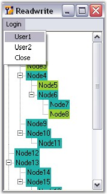
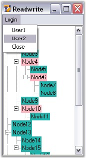

::: {style="DISPLAY: none"}
{#d2h_url_template}{#d2h_package_url style="WIDTH: 0px; DISPLAY: none; HEIGHT: 0px"}
:::

:::: {.d2h_secondary_topic style="PADDING-BOTTOM: 10pt; MARGIN: 0pt; PADDING-LEFT: 0pt; PADDING-RIGHT: 0pt; PADDING-TOP: 0pt"}
##### BeforeEdit Event {#beforeedit-event style="MARGIN-LEFT: 18pt; tab-stops: 18.0pt"}

[]{style="COLOR: #15428b"} 

This event is raised before the node goes into edit mode. Below are examples which handles the BeforeEdit event.

[]{style="COLOR: #15428b"} 

Event Data

**[]{style="COLOR: #15428b"}** 

The TreeNodeAdvBeforeEditEventHandler receives an argument of type TreeNodeAdvBeforeEditEventArgs containing data related to this event. The following  TreeNodeAdvBeforeEditEventArgs\' members provide information specific to this event.

[]{style="COLOR: #15428b"} 

::: {align="center"}
  --------- -----------------------------------------------------------------------
  Members   Description
  Node      This returns a TreeNodeAdv.
  TextBox   Returns the textbox that is used to edit the node.
  Cancel    Gets or Sets a value indicating whether the event should be canceled.
  --------- -----------------------------------------------------------------------
:::

[]{style="COLOR: #15428b"} 

Method to set UnEditable Nodes

[]{style="COLOR: #15428b"} 

Methods to make a node completely uneditable even when the,

[]{style="COLOR: #15428b"} 

1.  Node is visible.

[]{style="COLOR: #15428b"} 

2.   Node is clickable.

[]{style="COLOR: #15428b"} 

**BeforeEdit** event can be used for this purpose. In this example, the Parent Nodes are made uneditable.**TreeNodeAdvBeforeEditEventArgs.Node** indicates the target node for editing.

 

The desired condition is checked on that node and based on the result, the **TreeNodeAdvBeforeEditEventArgs.Cancel** property is set appropriately.

[]{style="COLOR: #15428b"} 

+------------------------------------------------------------------------------------------------------------------------------------------------------------------------------------------------------------------------------------------------------------------------------------------------------------------------------------+
| **[\[C#\]]{style="FONT-FAMILY: 'Courier New'; COLOR: black"}**                                                                                                                                                                                                                                                                     |
|                                                                                                                                                                                                                                                                                                                                    |
| **[]{style="FONT-FAMILY: 'Courier New'; COLOR: black"}**                                                                                                                                                                                                                                                                           |
|                                                                                                                                                                                                                                                                                                                                    |
| [private void]{style="FONT-FAMILY: 'Courier New'; COLOR: blue"}[ treeViewAdv1_BeforeEdit(]{style="FONT-FAMILY: 'Courier New'; COLOR: black"}[object]{style="FONT-FAMILY: 'Courier New'; COLOR: blue"}[ sender, Syncfusion.Windows.Forms.Tools.TreeNodeAdvBeforeEditEventArgs e)]{style="FONT-FAMILY: 'Courier New'; COLOR: black"} |
|                                                                                                                                                                                                                                                                                                                                    |
| [{]{style="FONT-FAMILY: 'Courier New'; COLOR: black"}                                                                                                                                                                                                                                                                              |
|                                                                                                                                                                                                                                                                                                                                    |
| [// Check if they are parent nodes.]{style="FONT-FAMILY: 'Courier New'; COLOR: green"}                                                                                                                                                                                                                                             |
|                                                                                                                                                                                                                                                                                                                                    |
| [if ]{style="FONT-FAMILY: 'Courier New'; COLOR: blue"}[((e.Node.Text == \"Node0\") \|\| (e.Node.Text == \"Node5\")) ]{style="FONT-FAMILY: 'Courier New'; COLOR: black"}                                                                                                                                                            |
|                                                                                                                                                                                                                                                                                                                                    |
| [{]{style="FONT-FAMILY: 'Courier New'; COLOR: black"}                                                                                                                                                                                                                                                                              |
|                                                                                                                                                                                                                                                                                                                                    |
| [e.Cancel = ]{style="FONT-FAMILY: 'Courier New'; COLOR: black"}[true]{style="FONT-FAMILY: 'Courier New'; COLOR: blue"}[;]{style="FONT-FAMILY: 'Courier New'; COLOR: black"}                                                                                                                                                        |
|                                                                                                                                                                                                                                                                                                                                    |
| [}]{style="FONT-FAMILY: 'Courier New'; COLOR: black"}                                                                                                                                                                                                                                                                              |
|                                                                                                                                                                                                                                                                                                                                    |
| [}]{style="FONT-FAMILY: 'Courier New'; COLOR: black"}[]{style="FONT-FAMILY: 'Courier New'; COLOR: black"}                                                                                                                                                                                                                          |
+------------------------------------------------------------------------------------------------------------------------------------------------------------------------------------------------------------------------------------------------------------------------------------------------------------------------------------+

[]{#p1000}[]{style="COLOR: #15428b"} 

+--------------------------------------------------------------------------------------------------------------------------------------------------------------------------------------------------------------------------------------------------------------------------------------------------------------------------------------------------------------------------------------------------------------------------------------------------------------------------------------------------------------------------------------------------------------------------------------------------------------------------------------------------------------------------+
| **[\[VB.NET\]]{style="FONT-FAMILY: 'Courier New'; COLOR: black"}**                                                                                                                                                                                                                                                                                                                                                                                                                                                                                                                                                                                                       |
|                                                                                                                                                                                                                                                                                                                                                                                                                                                                                                                                                                                                                                                                          |
| [Private Sub]{style="FONT-FAMILY: 'Courier New'; COLOR: blue"}[ treeViewAdv1_BeforeEdit(]{style="FONT-FAMILY: 'Courier New'; COLOR: black"}[ByVal]{style="FONT-FAMILY: 'Courier New'; COLOR: blue"}[ sender ]{style="FONT-FAMILY: 'Courier New'; COLOR: black"}[As Object]{style="FONT-FAMILY: 'Courier New'; COLOR: blue"}[, ]{style="FONT-FAMILY: 'Courier New'; COLOR: black"}[ByVal]{style="FONT-FAMILY: 'Courier New'; COLOR: blue"}[ e ]{style="FONT-FAMILY: 'Courier New'; COLOR: black"}[As]{style="FONT-FAMILY: 'Courier New'; COLOR: blue"}[ Syncfusion.Windows.Forms.Tools.TreeNodeAdvBeforeEditEventArgs)]{style="FONT-FAMILY: 'Courier New'; COLOR: black"} |
|                                                                                                                                                                                                                                                                                                                                                                                                                                                                                                                                                                                                                                                                          |
| []{style="FONT-FAMILY: 'Courier New'; COLOR: green"}                                                                                                                                                                                                                                                                                                                                                                                                                                                                                                                                                                                                                     |
|                                                                                                                                                                                                                                                                                                                                                                                                                                                                                                                                                                                                                                                                          |
| [\' Check if they are parent nodes.]{style="FONT-FAMILY: 'Courier New'; COLOR: green"}                                                                                                                                                                                                                                                                                                                                                                                                                                                                                                                                                                                   |
|                                                                                                                                                                                                                                                                                                                                                                                                                                                                                                                                                                                                                                                                          |
| [If]{style="FONT-FAMILY: 'Courier New'; COLOR: blue"}[ (e.Node.Text = \"Node0\") ]{style="FONT-FAMILY: 'Courier New'; COLOR: black"}[OrElse]{style="FONT-FAMILY: 'Courier New'; COLOR: blue"}[ (e.Node.Text = \"Node5\") ]{style="FONT-FAMILY: 'Courier New'; COLOR: black"}[Then]{style="FONT-FAMILY: 'Courier New'; COLOR: blue"}                                                                                                                                                                                                                                                                                                                                      |
|                                                                                                                                                                                                                                                                                                                                                                                                                                                                                                                                                                                                                                                                          |
| [e.Cancel = ]{style="FONT-FAMILY: 'Courier New'; COLOR: black"}[True]{style="FONT-FAMILY: 'Courier New'; COLOR: blue"}                                                                                                                                                                                                                                                                                                                                                                                                                                                                                                                                                   |
|                                                                                                                                                                                                                                                                                                                                                                                                                                                                                                                                                                                                                                                                          |
| [End If]{style="FONT-FAMILY: 'Courier New'; COLOR: blue"}                                                                                                                                                                                                                                                                                                                                                                                                                                                                                                                                                                                                                |
|                                                                                                                                                                                                                                                                                                                                                                                                                                                                                                                                                                                                                                                                          |
| [End Sub]{style="FONT-FAMILY: 'Courier New'; COLOR: blue"}[]{style="FONT-FAMILY: 'Courier New'; COLOR: blue"}                                                                                                                                                                                                                                                                                                                                                                                                                                                                                                                                                            |
+--------------------------------------------------------------------------------------------------------------------------------------------------------------------------------------------------------------------------------------------------------------------------------------------------------------------------------------------------------------------------------------------------------------------------------------------------------------------------------------------------------------------------------------------------------------------------------------------------------------------------------------------------------------------------+

[]{style="COLOR: #15428b"} 

Cancel Read / Write property for particular user nodes

[]{style="COLOR: #15428b"} 

By cancelling the **BeforeEdit** event for particular nodes of particular users, the **Read/Write** property can be canceled.

[]{style="COLOR: #15428b"} 

+------------------------------------------------------------------------------------------------------------------------------------------------------------------------------------------------------------------------------------------------------------------------------------------------------------------------------------+
| **[\[C#\]]{style="FONT-FAMILY: 'Courier New'; COLOR: black"}**                                                                                                                                                                                                                                                                     |
|                                                                                                                                                                                                                                                                                                                                    |
| **[]{style="FONT-FAMILY: 'Courier New'; COLOR: black"}**                                                                                                                                                                                                                                                                           |
|                                                                                                                                                                                                                                                                                                                                    |
| [private void]{style="FONT-FAMILY: 'Courier New'; COLOR: blue"}[ treeViewAdv1_BeforeEdit(]{style="FONT-FAMILY: 'Courier New'; COLOR: black"}[object]{style="FONT-FAMILY: 'Courier New'; COLOR: blue"}[ sender, Syncfusion.Windows.Forms.Tools.TreeNodeAdvBeforeEditEventArgs e)]{style="FONT-FAMILY: 'Courier New'; COLOR: black"} |
|                                                                                                                                                                                                                                                                                                                                    |
| [{]{style="FONT-FAMILY: 'Courier New'; COLOR: black"}                                                                                                                                                                                                                                                                              |
|                                                                                                                                                                                                                                                                                                                                    |
| [// By cancelling the BeforeEdit event for particular nodes helps to cancel the Read/Write property of that nodes. ]{style="FONT-FAMILY: 'Courier New'; COLOR: green"}                                                                                                                                                             |
|                                                                                                                                                                                                                                                                                                                                    |
| [if]{style="FONT-FAMILY: 'Courier New'; COLOR: blue"}[(username==\"user1\")]{style="FONT-FAMILY: 'Courier New'; COLOR: black"}                                                                                                                                                                                                     |
|                                                                                                                                                                                                                                                                                                                                    |
| [{]{style="FONT-FAMILY: 'Courier New'; COLOR: black"}                                                                                                                                                                                                                                                                              |
|                                                                                                                                                                                                                                                                                                                                    |
| [if]{style="FONT-FAMILY: 'Courier New'; COLOR: blue"}[ ((e.Node.Text == \"Node0\") \|\| (e.Node.Text == \"Node5\")\|\|(e.Node.Text == \"Node3\")\|\|(e.Node.Text == \"Node8\")) ]{style="FONT-FAMILY: 'Courier New'; COLOR: black"}                                                                                                |
|                                                                                                                                                                                                                                                                                                                                    |
| [{]{style="FONT-FAMILY: 'Courier New'; COLOR: black"}                                                                                                                                                                                                                                                                              |
|                                                                                                                                                                                                                                                                                                                                    |
| [      e.Cancel = ]{style="FONT-FAMILY: 'Courier New'; COLOR: black"}[true]{style="FONT-FAMILY: 'Courier New'; COLOR: blue"}[;]{style="FONT-FAMILY: 'Courier New'; COLOR: black"}                                                                                                                                                  |
|                                                                                                                                                                                                                                                                                                                                    |
| [  }]{style="FONT-FAMILY: 'Courier New'; COLOR: black"}                                                                                                                                                                                                                                                                            |
|                                                                                                                                                                                                                                                                                                                                    |
| [  }]{style="FONT-FAMILY: 'Courier New'; COLOR: black"}                                                                                                                                                                                                                                                                            |
|                                                                                                                                                                                                                                                                                                                                    |
| [else if]{style="FONT-FAMILY: 'Courier New'; COLOR: blue"}[(username==\"user2\")]{style="FONT-FAMILY: 'Courier New'; COLOR: black"}                                                                                                                                                                                                |
|                                                                                                                                                                                                                                                                                                                                    |
| [if]{style="FONT-FAMILY: 'Courier New'; COLOR: blue"}[ ((e.Node.Text == \"Node2\") \|\| (e.Node.Text == \"Node4\")\|\|(e.Node.Text == \"Node6\")\|\|(e.Node.Text == \"Node10\")) ]{style="FONT-FAMILY: 'Courier New'; COLOR: black"}                                                                                               |
|                                                                                                                                                                                                                                                                                                                                    |
| [{]{style="FONT-FAMILY: 'Courier New'; COLOR: black"}                                                                                                                                                                                                                                                                              |
|                                                                                                                                                                                                                                                                                                                                    |
| [e.Cancel = ]{style="FONT-FAMILY: 'Courier New'; COLOR: black"}[true]{style="FONT-FAMILY: 'Courier New'; COLOR: blue"}[;]{style="FONT-FAMILY: 'Courier New'; COLOR: black"}                                                                                                                                                        |
|                                                                                                                                                                                                                                                                                                                                    |
| [}]{style="FONT-FAMILY: 'Courier New'; COLOR: black"}                                                                                                                                                                                                                                                                              |
|                                                                                                                                                                                                                                                                                                                                    |
| [}]{style="FONT-FAMILY: 'Courier New'; COLOR: black"}[]{style="FONT-FAMILY: 'Courier New'; COLOR: black"}                                                                                                                                                                                                                          |
+------------------------------------------------------------------------------------------------------------------------------------------------------------------------------------------------------------------------------------------------------------------------------------------------------------------------------------+

[]{style="COLOR: #15428b"} 

+--------------------------------------------------------------------------------------------------------------------------------------------------------------------------------------------------------------------------------------------------------------------------------------------------------------------------------------------------------------------------------------------------------------------------------------------------------------------------------------------------------------------------------------------------------------------------------------------------------------------------------------------------------------------------+
| **[\[VB.NET\]]{style="FONT-FAMILY: 'Courier New'; COLOR: black"}**                                                                                                                                                                                                                                                                                                                                                                                                                                                                                                                                                                                                       |
|                                                                                                                                                                                                                                                                                                                                                                                                                                                                                                                                                                                                                                                                          |
| **[]{style="FONT-FAMILY: 'Courier New'; COLOR: black"}**                                                                                                                                                                                                                                                                                                                                                                                                                                                                                                                                                                                                                 |
|                                                                                                                                                                                                                                                                                                                                                                                                                                                                                                                                                                                                                                                                          |
| [Private Sub]{style="FONT-FAMILY: 'Courier New'; COLOR: blue"}[ treeViewAdv1_BeforeEdit(]{style="FONT-FAMILY: 'Courier New'; COLOR: black"}[ByVal]{style="FONT-FAMILY: 'Courier New'; COLOR: blue"}[ sender ]{style="FONT-FAMILY: 'Courier New'; COLOR: black"}[As Object]{style="FONT-FAMILY: 'Courier New'; COLOR: blue"}[, ]{style="FONT-FAMILY: 'Courier New'; COLOR: black"}[ByVal]{style="FONT-FAMILY: 'Courier New'; COLOR: blue"}[ e ]{style="FONT-FAMILY: 'Courier New'; COLOR: black"}[As]{style="FONT-FAMILY: 'Courier New'; COLOR: blue"}[ Syncfusion.Windows.Forms.Tools.TreeNodeAdvBeforeEditEventArgs)]{style="FONT-FAMILY: 'Courier New'; COLOR: black"} |
|                                                                                                                                                                                                                                                                                                                                                                                                                                                                                                                                                                                                                                                                          |
| []{style="FONT-FAMILY: 'Courier New'; COLOR: black"}                                                                                                                                                                                                                                                                                                                                                                                                                                                                                                                                                                                                                     |
|                                                                                                                                                                                                                                                                                                                                                                                                                                                                                                                                                                                                                                                                          |
| [     \' By cancelling the BeforeEdit event for particular nodes helps to cancel the Read/Write property of that nodes. ]{style="FONT-FAMILY: 'Courier New'; COLOR: green"}                                                                                                                                                                                                                                                                                                                                                                                                                                                                                              |
|                                                                                                                                                                                                                                                                                                                                                                                                                                                                                                                                                                                                                                                                          |
| [If]{style="FONT-FAMILY: 'Courier New'; COLOR: blue"}[ username=\"user1\" ]{style="FONT-FAMILY: 'Courier New'; COLOR: black"}[Then]{style="FONT-FAMILY: 'Courier New'; COLOR: blue"}                                                                                                                                                                                                                                                                                                                                                                                                                                                                                     |
|                                                                                                                                                                                                                                                                                                                                                                                                                                                                                                                                                                                                                                                                          |
| [If]{style="FONT-FAMILY: 'Courier New'; COLOR: blue"}[ (e.Node.Text = \"Node0\") ]{style="FONT-FAMILY: 'Courier New'; COLOR: black"}[OrElse]{style="FONT-FAMILY: 'Courier New'; COLOR: blue"}[ (e.Node.Text = \"Node5\") ]{style="FONT-FAMILY: 'Courier New'; COLOR: black"}[OrElse]{style="FONT-FAMILY: 'Courier New'; COLOR: blue"}[ (e.Node.Text = \"Node3\") ]{style="FONT-FAMILY: 'Courier New'; COLOR: black"}[OrElse]{style="FONT-FAMILY: 'Courier New'; COLOR: blue"}[ (e.Node.Text = \"Node8\") ]{style="FONT-FAMILY: 'Courier New'; COLOR: black"}[Then]{style="FONT-FAMILY: 'Courier New'; COLOR: blue"}                                                      |
|                                                                                                                                                                                                                                                                                                                                                                                                                                                                                                                                                                                                                                                                          |
| [e.Cancel = ]{style="FONT-FAMILY: 'Courier New'; COLOR: black"}[True]{style="FONT-FAMILY: 'Courier New'; COLOR: blue"}                                                                                                                                                                                                                                                                                                                                                                                                                                                                                                                                                   |
|                                                                                                                                                                                                                                                                                                                                                                                                                                                                                                                                                                                                                                                                          |
| [End If]{style="FONT-FAMILY: 'Courier New'; COLOR: blue"}                                                                                                                                                                                                                                                                                                                                                                                                                                                                                                                                                                                                                |
|                                                                                                                                                                                                                                                                                                                                                                                                                                                                                                                                                                                                                                                                          |
| [Else If]{style="FONT-FAMILY: 'Courier New'; COLOR: blue"}[ username=\"user2\" ]{style="FONT-FAMILY: 'Courier New'; COLOR: black"}[Then]{style="FONT-FAMILY: 'Courier New'; COLOR: blue"}                                                                                                                                                                                                                                                                                                                                                                                                                                                                                |
|                                                                                                                                                                                                                                                                                                                                                                                                                                                                                                                                                                                                                                                                          |
| [If]{style="FONT-FAMILY: 'Courier New'; COLOR: blue"}[ (e.Node.Text = \"Node2\") ]{style="FONT-FAMILY: 'Courier New'; COLOR: black"}[OrElse]{style="FONT-FAMILY: 'Courier New'; COLOR: blue"}[ (e.Node.Text = \"Node4\") ]{style="FONT-FAMILY: 'Courier New'; COLOR: black"}[OrElse]{style="FONT-FAMILY: 'Courier New'; COLOR: blue"}[ (e.Node.Text = \"Node6\") ]{style="FONT-FAMILY: 'Courier New'; COLOR: black"}[OrElse]{style="FONT-FAMILY: 'Courier New'; COLOR: blue"}[ (e.Node.Text = \"Node10\") ]{style="FONT-FAMILY: 'Courier New'; COLOR: black"}[Then]{style="FONT-FAMILY: 'Courier New'; COLOR: blue"}                                                     |
|                                                                                                                                                                                                                                                                                                                                                                                                                                                                                                                                                                                                                                                                          |
| [e.Cancel = True]{style="FONT-FAMILY: 'Courier New'; COLOR: black"}                                                                                                                                                                                                                                                                                                                                                                                                                                                                                                                                                                                                      |
|                                                                                                                                                                                                                                                                                                                                                                                                                                                                                                                                                                                                                                                                          |
| [End If]{style="FONT-FAMILY: 'Courier New'; COLOR: blue"}                                                                                                                                                                                                                                                                                                                                                                                                                                                                                                                                                                                                                |
|                                                                                                                                                                                                                                                                                                                                                                                                                                                                                                                                                                                                                                                                          |
| [End If]{style="FONT-FAMILY: 'Courier New'; COLOR: blue"}                                                                                                                                                                                                                                                                                                                                                                                                                                                                                                                                                                                                                |
|                                                                                                                                                                                                                                                                                                                                                                                                                                                                                                                                                                                                                                                                          |
| [End Sub]{style="FONT-FAMILY: 'Courier New'; COLOR: blue"}[]{style="FONT-FAMILY: 'Courier New'; COLOR: blue"}                                                                                                                                                                                                                                                                                                                                                                                                                                                                                                                                                            |
+--------------------------------------------------------------------------------------------------------------------------------------------------------------------------------------------------------------------------------------------------------------------------------------------------------------------------------------------------------------------------------------------------------------------------------------------------------------------------------------------------------------------------------------------------------------------------------------------------------------------------------------------------------------------------+

[]{style="COLOR: #15428b"} 

The following figure shows the color change for some of the nodes of the user that indicates the canceled Read/Write property for that node.

[]{style="COLOR: #15428b"} 

{border="0"}

**[]{style="COLOR: #15428b"}** 

Figure 1169: TreeView of User1 With Read / Write property Canceled

[]{style="COLOR: #15428b"} 

{border="0"}

**[]{style="COLOR: #15428b"}** 

Figure 1170: TreeView of User2 With Read / Write property Canceled

 

 

 

 

[]{#related-topics}
::::
