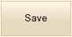
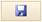
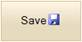
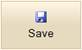
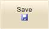

::: {style="DISPLAY: none"}
{#d2h_url_template}{#d2h_package_url style="WIDTH: 0px; DISPLAY: none; HEIGHT: 0px"}
:::

::: {.d2h_secondary_topic style="PADDING-BOTTOM: 10pt; MARGIN: 0pt; PADDING-LEFT: 0pt; PADDING-RIGHT: 0pt; PADDING-TOP: 0pt"}
#### Behaviors {#behaviors style="tab-stops: 0pt"}

The Button supports various behaviors such as content type and image positioning.

**ContentType** - The text and the image of a button can be customized using the **ContentType** property (TextOnly, ImageOnly, TextAndImage).

**ImagePosition** - The image of a button can be customized using the **ImagePosition** property (Left, Right, Top, and Bottom).

 

Use Case Scenarios

The Button control allows for easy customization of the content to be displayed on the button.

 

Adding Behavior[ ]{style="COLOR: red"}to an Application

The following steps guide you in defining the behavior of the Button control.

Behaviors can be customized through two ways in button.

1.   Using Builder

2.   Using Properties Model

 

Using Builder

 

1.   In View, invoke the normal Button helper with the button id as the first argument followed by the button **Text** and **ImageUrl** and **ContentType** methods.

 

 

+--------------------------------------------------------------------------------------------------------------------------------------------------------------------------+
| **[View\[aspx\]]{style="FONT-FAMILY: 'Courier New'"}**                                                                                                                   |
|                                                                                                                                                                          |
| [        [\<%]{style="BACKGROUND: yellow"}[=]{style="COLOR: blue"}Html.Syncfusion().Button([\"btnNormal\"]{style="COLOR: #a31515"})]{style="FONT-FAMILY: 'Courier New'"} |
|                                                                                                                                                                          |
| [        .Text([\"Save\"]{style="COLOR: #a31515"})]{style="FONT-FAMILY: 'Courier New'"}                                                                                  |
|                                                                                                                                                                          |
| [        .ImageUrl([\"Content/icon_save.png\"]{style="COLOR: #a31515"})]{style="FONT-FAMILY: 'Courier New'"}                                                             |
|                                                                                                                                                                          |
| [        .ContentType([ContentTypes]{style="COLOR: #2b91af"}.TextAndImage)]{style="FONT-FAMILY: 'Courier New'"}                                                          |
|                                                                                                                                                                          |
| [        .ImagePosition([ImagePositions]{style="COLOR: #2b91af"}.Right)    ]{style="FONT-FAMILY: 'Courier New'"}                                                         |
|                                                                                                                                                                          |
| [        [%\>]{style="BACKGROUND: yellow"}]{style="FONT-FAMILY: 'Courier New'"}                                                                                          |
+--------------------------------------------------------------------------------------------------------------------------------------------------------------------------+

 

 

+--------------------------------------------------------------------------------------------------------------------------------------------------------------------------+
| **[View\[cshtml\]]{style="FONT-FAMILY: 'Courier New'"}**                                                                                                                 |
|                                                                                                                                                                          |
| [        [\@{]{style="BACKGROUND: yellow"}[ ]{style="COLOR: blue"}Html.Syncfusion().Button([\"btnNormal\"]{style="COLOR: #a31515"})]{style="FONT-FAMILY: 'Courier New'"} |
|                                                                                                                                                                          |
| [        .Text([\"Save\"]{style="COLOR: #a31515"})]{style="FONT-FAMILY: 'Courier New'"}                                                                                  |
|                                                                                                                                                                          |
| [        .ImageUrl([\"Content/icon_save.png\"]{style="COLOR: #a31515"})]{style="FONT-FAMILY: 'Courier New'"}                                                             |
|                                                                                                                                                                          |
| [        .ContentType([ContentTypes]{style="COLOR: #2b91af"}.TextAndImage)]{style="FONT-FAMILY: 'Courier New'"}                                                          |
|                                                                                                                                                                          |
| [        .ImagePosition([ImagePositions]{style="COLOR: #2b91af"}.Right)    ]{style="FONT-FAMILY: 'Courier New'"}                                                         |
|                                                                                                                                                                          |
| [        [%}]{style="BACKGROUND: yellow"}]{style="FONT-FAMILY: 'Courier New'"}                                                                                           |
+--------------------------------------------------------------------------------------------------------------------------------------------------------------------------+

 

 

2.   Run the application.

[]{style="COLOR: black"} 

The output is shown in the following screenshot.

[]{style="COLOR: black"} 

 

{border="0"} {border="0"} {border="0"}

Figure 84: Normal Button with various Content Type

{border="0"} {border="0"}   {border="0"}   {border="0"}

Figure 85: Normal Button with various Image Position

 

Using Properties Model

[]{style="COLOR: black"} 

1.   In Controller, create an object for the **ButtonModel** class and set the **Text**, **ImageUrl,** **ContentType**, and **ImagePosition** properties. Assign this model class to view data.

 

 

+--------------------------------------------------------------------------------------------------------------------------------------------------------------------------+
| **[\[Controller\]]{style="FONT-FAMILY: 'Courier New'"}**                                                                                                                 |
|                                                                                                                                                                          |
| **[]{style="FONT-FAMILY: 'Courier New'"}**                                                                                                                               |
|                                                                                                                                                                          |
| [        [public]{style="COLOR: blue"} [ActionResult]{style="COLOR: #2b91af"} Index()]{style="FONT-FAMILY: 'Courier New'"}                                               |
|                                                                                                                                                                          |
| [        {]{style="FONT-FAMILY: 'Courier New'"}                                                                                                                          |
|                                                                                                                                                                          |
| [            [ButtonModel]{style="COLOR: #2b91af"} buttonModel = [new]{style="COLOR: blue"} [ButtonModel]{style="COLOR: #2b91af"}()]{style="FONT-FAMILY: 'Courier New'"} |
|                                                                                                                                                                          |
| [            {]{style="FONT-FAMILY: 'Courier New'"}                                                                                                                      |
|                                                                                                                                                                          |
| [                Text = [\"Save\"]{style="COLOR: #a31515"},]{style="FONT-FAMILY: 'Courier New'"}                                                                         |
|                                                                                                                                                                          |
| [                ImageUrl = [\"Content/icon_save.png\"]{style="COLOR: #a31515"},]{style="FONT-FAMILY: 'Courier New'"}                                                    |
|                                                                                                                                                                          |
| [                ContentType = [ContentTypes]{style="COLOR: #2b91af"}.TextAndImage,]{style="FONT-FAMILY: 'Courier New'"}                                                 |
|                                                                                                                                                                          |
| [                ImagePosition = [ImagePositions]{style="COLOR: #2b91af"}.Right]{style="FONT-FAMILY: 'Courier New'"}                                                     |
|                                                                                                                                                                          |
| [            };]{style="FONT-FAMILY: 'Courier New'"}                                                                                                                     |
|                                                                                                                                                                          |
| [            ViewData\[[\"ButtonModel\"]{style="COLOR: #a31515"}\] = buttonModel;]{style="FONT-FAMILY: 'Courier New'"}                                                   |
|                                                                                                                                                                          |
| [            [return]{style="COLOR: blue"} View();]{style="FONT-FAMILY: 'Courier New'"}                                                                                  |
|                                                                                                                                                                          |
| [        }]{style="FONT-FAMILY: 'Courier New'"}                                                                                                                          |
+--------------------------------------------------------------------------------------------------------------------------------------------------------------------------+

 

 

[]{style="COLOR: black"} 

 

2.   In View, invoke the normal Button helper with the button id as the first argument followed by the view data of the **ButtonModel** class.

 

[]{style="FONT-FAMILY: 'Myriad Pro','sans-serif'"} 

+---------------------------------------------------------------------------------------------------------------------------------------------------------------------------------------------------------------------------------------------------------------------------------------------------------------------------------------------------------+
| **[View\[ASPX\]]{style="FONT-FAMILY: 'Courier New'"}**                                                                                                                                                                                                                                                                                                  |
|                                                                                                                                                                                                                                                                                                                                                         |
| **[]{style="FONT-FAMILY: 'Courier New'"}**                                                                                                                                                                                                                                                                                                              |
|                                                                                                                                                                                                                                                                                                                                                         |
| [\<%]{style="FONT-FAMILY: 'Courier New'; BACKGROUND: yellow"}[=]{style="FONT-FAMILY: 'Courier New'; COLOR: blue"}[Html.Syncfusion().Button([\"btnNormal\"]{style="COLOR: #a31515"},([ButtonModel]{style="COLOR: #2b91af"})ViewData\[[\"ButtonModel\"]{style="COLOR: #a31515"}\]) [%\>]{style="BACKGROUND: yellow"}]{style="FONT-FAMILY: 'Courier New'"} |
|                                                                                                                                                                                                                                                                                                                                                         |
| []{style="FONT-FAMILY: 'Courier New'; BACKGROUND: yellow"}                                                                                                                                                                                                                                                                                              |
+---------------------------------------------------------------------------------------------------------------------------------------------------------------------------------------------------------------------------------------------------------------------------------------------------------------------------------------------------------+

[]{style="FONT-FAMILY: 'Myriad Pro','sans-serif'"} 

[]{style="FONT-FAMILY: 'Myriad Pro','sans-serif'"} 

+-------------------------------------------------------------------------------------------------------------------------------------------------------------------------------------------------------------------------------------------------------------------------------------------------------------+
| **[View\[cshtml\]]{style="FONT-FAMILY: 'Courier New'"}**                                                                                                                                                                                                                                                    |
|                                                                                                                                                                                                                                                                                                             |
| **[]{style="FONT-FAMILY: 'Courier New'"}**                                                                                                                                                                                                                                                                  |
|                                                                                                                                                                                                                                                                                                             |
| [\@{]{style="FONT-FAMILY: 'Courier New'; BACKGROUND: yellow"}[Html.Syncfusion().Button([\"btnNormal\"]{style="COLOR: #a31515"}, ([ButtonModel]{style="COLOR: #2b91af"})ViewData\[[\"ButtonModel\"]{style="COLOR: #a31515"}\]).Render();[}]{style="BACKGROUND: yellow"}]{style="FONT-FAMILY: 'Courier New'"} |
|                                                                                                                                                                                                                                                                                                             |
| **[]{style="FONT-FAMILY: 'Courier New'"}**                                                                                                                                                                                                                                                                  |
|                                                                                                                                                                                                                                                                                                             |
| []{style="FONT-FAMILY: 'Courier New'; BACKGROUND: yellow"}                                                                                                                                                                                                                                                  |
+-------------------------------------------------------------------------------------------------------------------------------------------------------------------------------------------------------------------------------------------------------------------------------------------------------------+

[]{style="FONT-FAMILY: 'Myriad Pro','sans-serif'"} 

 

[]{style="FONT-FAMILY: 'Myriad Pro','sans-serif'"} 

3.   Run the application.

[]{style="COLOR: black"} 

The output is shown in the following screenshot.

[]{style="COLOR: black"} 

{border="0"} {border="0"} {border="0"}

Figure 86: Normal Button with various Content Type

{border="0"} {border="0"}   {border="0"}   {border="0"}

Figure 87: Normal Button with various Image Position

 

Properties

 

+---------------+-----------------------------------------------------------------------+----------------------+----------------+-----------------------------------------------------+-------------+
| Name          | Description                                                           | Type of the property | Data Type      | Value it accepts                                    | Dependency  |
+---------------+-----------------------------------------------------------------------+----------------------+----------------+-----------------------------------------------------+-------------+
| ContentType   | Specifies the field that provides the content of the button.          | Server side          | ContentTypes   | [ContentTypes]{style="COLOR: #2b91af"}.TextOnly     | NA          |
|               |                                                                       |                      |                |                                                     |             |
|               |                                                                       |                      |                | [ContentTypes]{style="COLOR: #2b91af"}.ImageOnly    |             |
|               |                                                                       |                      |                |                                                     |             |
|               |                                                                       |                      |                | [ContentTypes]{style="COLOR: #2b91af"}.TextAndImage |             |
+---------------+-----------------------------------------------------------------------+----------------------+----------------+-----------------------------------------------------+-------------+
| ImagePosition | Specifies the field that provides the position of the button's image. | Server side          | ImagePositions | [ImagePositions]{style="COLOR: #2b91af"}.Left       | ContentType |
|               |                                                                       |                      |                |                                                     |             |
|               |                                                                       |                      |                | [ImagePositions]{style="COLOR: #2b91af"}.Right      |             |
|               |                                                                       |                      |                |                                                     |             |
|               |                                                                       |                      |                | [ImagePositions]{style="COLOR: #2b91af"}.Top        |             |
|               |                                                                       |                      |                |                                                     |             |
|               |                                                                       |                      |                | [ImagePositions]{style="COLOR: #2b91af"}.Bottom     |             |
+---------------+-----------------------------------------------------------------------+----------------------+----------------+-----------------------------------------------------+-------------+

[]{style="FONT-FAMILY: 'Calibri','sans-serif'; COLOR: black"} 

Sample Link

To view the samples, follow the steps below.

1.   Open the Tools Sample Browser from the dashboard. (Refer to the [Samples and Location]{.UGHyperlink} chapter)

2.   Navigate to **Tools.Mvc -\> Button -\> Core Features Demo**.

 

[]{#related-topics}
:::
